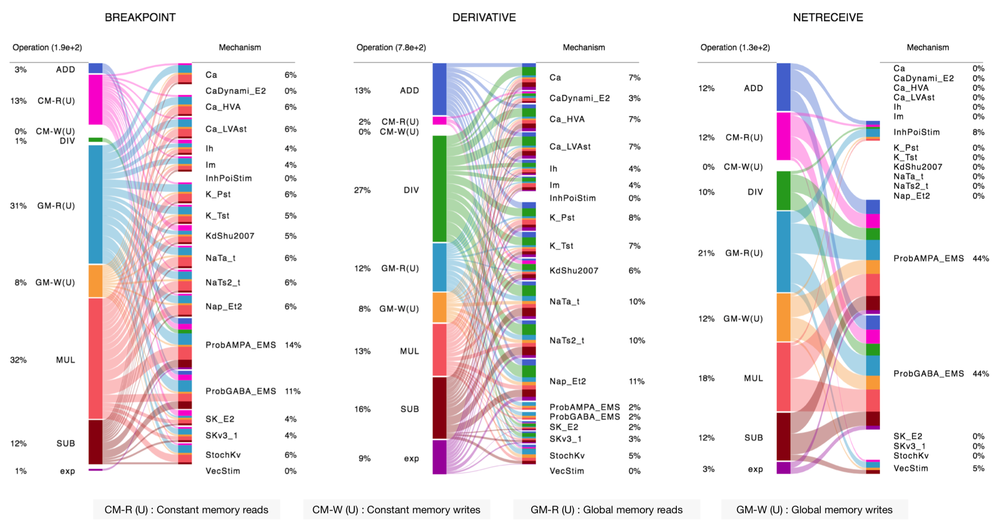

## The NMODL Framework
[](https://travis-ci.org/BlueBrain/nmodl) [](https://dev.azure.com/pramodskumbhar/nmodl/_build/latest?definitionId=2&branchName=master)

The NMODL Framework is a code generation engine for **N**EURON **MOD**eling **L**anguage ([NMODL](https://www.neuron.yale.edu/neuron/static/py_doc/modelspec/programmatic/mechanisms/nmodl.html)). It is designed with modern compiler and code generation techniques to:

* Provide **modular tools** for parsing, analysing and transforming NMODL
* Provide **easy to use**, high level Python API
* Generate **optimised code** for modern compute architectures including CPUs, GPUs
* **Flexibility** to implement new simulator backends
* Support for **full** NMODL specification

### About NMODL

Simulators like [NEURON](https://www.neuron.yale.edu/neuron/) use NMODL as a domain specific language (DSL) to describe a wide range of membrane and  intracellular submodels. Here is an example of exponential synapse specified in NMODL:

```
NEURON {
    POINT_PROCESS ExpSyn
    RANGE tau, e, i
    NONSPECIFIC_CURRENT i
}
UNITS {
    (nA) = (nanoamp)
    (mV) = (millivolt)
    (uS) = (microsiemens)
}
PARAMETER {
    tau = 0.1 (ms) <1e-9,1e9>
    e = 0 (mV)
}
ASSIGNED {
    v (mV)
    i (nA)
}
STATE {
    g (uS)
}
INITIAL {
    g = 0
}
BREAKPOINT {
    SOLVE state METHOD cnexp
    i = g*(v - e)
}
DERIVATIVE state {
    g' = -g/tau
}
NET_RECEIVE(weight (uS)) {
    g = g + weight
}
```

### Installation

See [INSTALL.md](INSTALL.md) for detailed instructions to build the NMODL from source.

### Using the Python API

Once the NMODL Framework is installed, you can use the Python parsing API as:

```python
import nmodl.dsl as nmodl
driver = nmodl.NmodlDriver()
mod_ast = driver.parse_file("expsyn.mod")
```

`parse_file()]` returns Abstract Syntax Tree ([AST](https://en.wikipedia.org/wiki/Abstract_syntax_tree)) representation of input NMODL file. One can look at the AST in JSON form as:

```python
>>> print (nmodl.to_json(mod_ast))
{
  "Program": [
    {
      "NeuronBlock": [
        {
          "StatementBlock": [
            {
              "Suffix": [
                {
                  "Name": [
                    {
                      "String": [
                        {
                          "name": "POINT_PROCESS"
                        }
                    ...
```
You can also use AST visualization API to look at the AST:


The central *Program* node represents the whole MOD file and each of it's children represent the block in the input NMODL file i.e. **expsyn.mod**. Once the AST is built, one can use exisiting visitors to perform various analysis/optimisations or one can write his own custom visitor using Python Visitor API. See [Python API tutorial](docs/notebooks/nmodl-python-tutorial.ipynb) for details.

One can also transform AST back into NMODL form simply as :

```python
>>> print (nmodl.to_nmodl(mod_ast))
NEURON {
    POINT_PROCESS ExpSyn
    RANGE tau, e, i
    NONSPECIFIC_CURRENT i
}

UNITS {
    (nA) = (nanoamp)
    (mV) = (millivolt)
    (uS) = (microsiemens)
}

PARAMETER {
    tau = 0.1 (ms) <1e-09,1000000000>
    e = 0 (mV)
}
...
```

### High Level Analysis and Code Generation

The NMODL Framework provides rich model introspection and analysis capabilities using [various visitors TODO](). Here is an example of theoretical performance characterisation of channels and synapses from rat neocortical column microcircuit [published in 2015](https://www.cell.com/abstract/S0092-8674(15)01191-5):



To understand how you can write your own introspection and analysis tool, see [this tutorial](docs/notebooks/nmodl-python-tutorial.ipynb).

Once analysis and optimization passes are performed, the NMODL Framework can generate optimised code for modern compute architectures including CPUs (Intel, AMD, ARM) and GPUs (NVIDIA, AMD) platforms. For example, [C++ TODO](), [OpenACC TODO](), [OpenMP TODO](), [CUDA TODO]() and [ISPC TODO]() backends are implemented and one can choose backends on command line as:

```
$ nmodl expsyn.mod host --ispc acc --cuda sympy --analytic
```

Here is an example of generated ISPC kernel for [DERIVATIVE](https://www.neuron.yale.edu/neuron/static/py_doc/modelspec/programmatic/mechanisms/nmodl.html#derivative) block :

```c++
export void nrn_state_ExpSyn(uniform ExpSyn_Instance* uniform inst, uniform NrnThread* uniform nt ...) {
    uniform int nodecount = ml->nodecount;
    const int* uniform node_index = ml->nodeindices;
    const double* uniform voltage = nt->_actual_v;

    int uniform start = 0;
    int uniform end = nodecount;

    foreach (id = start ... end) {
        int node_id = node_index[id];
        double v = voltage[node_id];
        inst->g[id] = inst->g[id] * vexp( -nt->_dt / inst->tau[id]);
    }
}
```

To know more about code generation backends, [see here TODO]().

### Documentation

We are working on user documentation, you can find current drafts of :

* User documentation on [Read the Docs TODO]()
* Developer / API documentation with [Doxygen TODO]()


### Support / Contribuition

If you see any issue or need help, feel free to raise a ticket. If you would like to improve this framework, see open issues and [contribution guidelines](CONTRIBUTING.md).

### Citation

If you are referencing NMODL Framework in a publication, please cite the following paper:

* Pramod Kumbhar, Omar Awile, Liam Keegan, Jorge Alonso, James King, Michael Hines and Felix Schürmann. 2019. An optimizing multi-platform source-to-source compiler framework for the NEURON MODeling Language. In Eprint arXiv: TODO.

### Authors

See [contributors](https://github.com/BlueBrain/nmodl/graphs/contributors).

### Funding

This work has been funded by the EPFL Blue Brain Project (funded by the Swiss ETH board), NIH grant number R01NS11613 (Yale University) and partially funded by the European Union's Horizon 2020 Framework Programme for Research and Innovation under Grant Agreement number 785907 (Human Brain Project SGA2).
