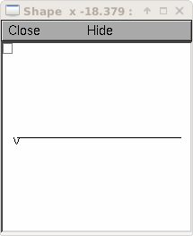
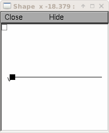
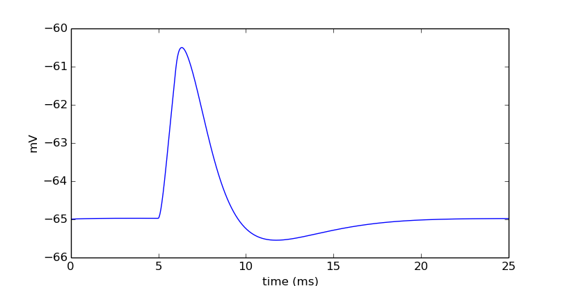
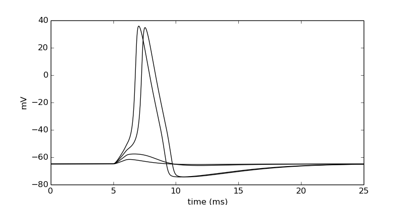
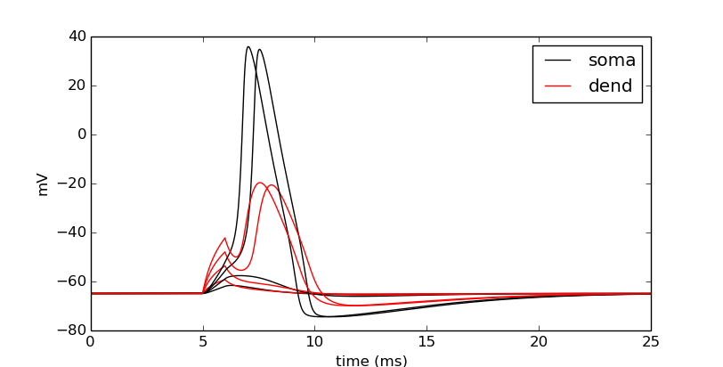
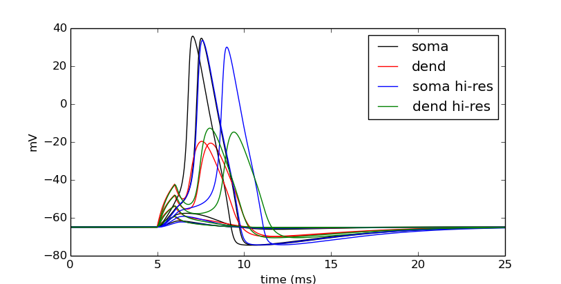

Ball-and-stick: 1 - Basic cell
==============================

This is the first of several pages to build a multicompartment cell and evolve it into a network of cells running on a parallel machine. While design of the model and its underlying code are paramount for maintenance and extending the project, realizing such designs tend to occur as needed. These tutorials therefore take a functional approach by adding in design as the project gets more complex rather than describing a complex design and filling in the pieces.

This page builds a two-compartment cell, a soma and dendrite, which is simply known as a ball-and-stick model. After building the cell we will to attach some instrumentation to it to stimulate and monitor its dynamics.

Cell model design
-----------------

When building a biophysical cell, it is best to segregate the construction into parts. This facilitates clarity and stepwise development. It also makes debugging, extending, and translating to parallel implementations much easier.

The parts of the cell model are:

* Sections - the cell sections.
* Topology - The connectivity of the sections
* Geometry - The 3D location of the sections
* Biophysics - The ionic channels and membrane properties of the sections
* Synapses - Optional list of synapses onto the cell.

Ball-and-stick model
--------------------

We will start with a ball-and-stick model, a soma connected to a dendrite.

Start by importing NEURON.

.. code-block::
    python
    
    from neuron import h, gui

Create our sections
-------------------

.. code-block::
    python
    
    soma = h.Section(name='soma')
    dend = h.Section(name='dend') 

Remember :func:`h.psection <psection>` to retrieve information. Note that when there is more than one section, we need to pass in a section to specify which one we want to see informatin about:

.. code-block::
    python
    
    h.psection(sec=soma)

Topology
--------

Connect the dendrite to the "1" end of the soma.

.. code-block::
    python
    
    dend.connect(soma(1))

Let's check the connection.

.. code-block::
    python
    
    h.psection(sec=dend)

Let's further confirm with NEURON's :func:`topology` function.

.. code-block::
    python
    
    h.topology()

Both of these approaches show that ``dend[0]`` is connected to ``soma[1]``.

Geometry
--------

Let's set the spatial properties of the cell using a "stylized" geometry. Later we will explore setting 3D points explicitly.

.. code-block::
    python
    
    # Surface area of cylinder is 2*pi*r*h (sealed ends are implicit).
    # Here we make a square cylinder in that the diameter
    # is equal to the height, so diam = h. ==> Area = 4*pi*r^2
    # We want a soma of 500 microns squared:
    # r^2 = 500/(4*pi) ==> r = 6.2078, diam = 12.6157
    soma.L = soma.diam = 12.6157 # Makes a soma of 500 microns squared.
    dend.L = 200 # microns
    dend.diam = 1 # microns
    h.define_shape() # Translate into 3D points.
    print "Surface area of soma =", h.area(0.5, sec=soma) 

Now we can see what our cell looks like. From the GUI, we can select
:menuselection:`Graph --> Shape plot` or we can run the following command:

.. code-block::
    python
    
    shape_window = h.PlotShape()

The image might not be what you expect at first:

What happened? It looks like a line because there are only two sections and
NEURON by default does not display diameters. This behavior is useful when we
need to see the structure of small dendrites, but for now let's show the diameters.
We do this by either right-clicking on the graph and selecting 
:menuselection:`Shape Style --> Show Diam` (in lieu of right clicking, we can left-click
on the box in the upper left of the graph) or by running the following command:

.. code-block::
    python
    
    shape_window.exec_menu('Show Diam')

Either way, we now see the "ball-and-stick" morphology, where the soma is a relatively
large ball attached to a long stick-like dendrite:

    
We can rotate the image by right-clicking and selecting :guilabel:`3D Rotate`, but
for this simple of a morphology, there is not anything more to see.
   
.. note::

    Matplotlib and Mayavi can also be used to generate 3D pictures of neurons.
    To use this, use ``h.allsec()`` to iterate over all the sections, read their
    3D points, and use those to define their geometries.

Biophysics
----------

Our cell needs biophysical mechanisms in the membrane.

.. code-block::
    python
    
    for sec in h.allsec():
        sec.Ra = 100    # Axial resistance in Ohm * cm
        sec.cm = 1      # Membrane capacitance in micro Farads / cm^2

    # Insert active Hodgkin-Huxley current in the soma
    soma.insert('hh')
    soma.gnabar_hh = 0.12  # Sodium conductance in S/cm2
    soma.gkbar_hh = 0.036  # Potassium conductance in S/cm2
    soma.gl_hh = 0.0003    # Leak conductance in S/cm2
    soma.el_hh = -54.3     # Reversal potential in mV

    # Insert passive current in the dendrite
    dend.insert('pas')
    dend.g_pas = 0.001  # Passive conductance in S/cm2
    dend.e_pas = -65    # Leak reversal potential mV 
        	

If you want to know the units for a given mechanism's parameter, use :func:`units`.

.. code-block::
    python
    
    print h.units('gnabar_hh') 
        	

Confirm with :func:`psection`.

.. code-block::
    python
    
    for sec in h.allsec():
        h.psection() 

.. note::
    
    We do not need to specify the section with a ``sec=`` keyword argument to :func:`psection` here because when iterating over ``h.allsec()`` the current section becomes NEURON's default section.

Instrumentation
---------------

We have now created our cell. Let's stimulate it and visualize its dynamics.

Stimulation
~~~~~~~~~~~

Let's inject a current pulse into the distal end of the dendrite. We will give it the properties of starting 5 ms after the simulation starts, with a duration of 1 ms, and with an amperage of 0.1 nA.

.. code-block::
    python
    
    stim = h.IClamp(dend(1)) 
        	

Let's see the attributes of stim.

.. code-block::
    python

    dir(stim) 
        	

So let's verify the location.

.. code-block::
    python
    
    seg = stim.get_segment()
    print "segment =", seg.sec.name(), " seg loc =", seg.x, " stim loc =", stim.get_loc() 
        	

Let's set our fields.

.. code-block::
    python
    
    stim.delay = 5
    stim.dur = 1
    stim.amp = 0.1 
        	

Set up the recording vectors, run, and plot.

.. code-block::
    python
    
    v_vec = h.Vector()        # Membrane potential vector
    t_vec = h.Vector()        # Time stamp vector
    v_vec.record(soma(0.5)._ref_v)
    t_vec.record(h._ref_t)
    simdur = 25.0

    h.tstop = simdur
    h.run()

    from matplotlib import pyplot
    pyplot.figure(figsize=(8,4)) # Default figsize is (8,6)
    pyplot.plot(t_vec, v_vec)
    pyplot.xlabel('time (ms)')
    pyplot.ylabel('mV')
    pyplot.show()

It looks like we have a dynamic cell. Let's push it a little. Let's vary the amplitude of the current in a loop.

.. code-block::
    python
    
    import numpy
    pyplot.figure(figsize=(8,4))
    step = 0.075
    num_steps = 4
    for i in numpy.linspace(step, step*num_steps, num_steps):
        stim.amp = i
        h.tstop = simdur
        h.run()
        pyplot.plot(t_vec, v_vec, color='black')

    pyplot.xlabel('time (ms)')
    pyplot.ylabel('mV')
    pyplot.show()

Let's also visualize what is going on in the dendrite. Notice that we do not have to re-assign the time and soma membrane potential recording vectors, but we make a new one in the middle of the dendrite.

.. code-block::
    python
    
    dend_v_vec = h.Vector()        # Membrane potential vector
    dend_v_vec.record(dend(0.5)._ref_v)

    pyplot.figure(figsize=(8,4))
    for i in numpy.linspace(step, step*num_steps, num_steps):
        stim.amp = i
        h.tstop = simdur
        h.run()
        # yes, you need the commas on the left-hand side of the next two lines
        soma_plot, = pyplot.plot(t_vec, v_vec, color='black')
        dend_plot, = pyplot.plot(t_vec, dend_v_vec, color='red')

    # After looping, actually draw the image with show.
    # For legend labels, use the last instances we plotted
    pyplot.legend([soma_plot, dend_plot], ['soma', 'dend'])
    pyplot.xlabel('time (ms)')
    pyplot.ylabel('mV')
    pyplot.show()

Let's push it a bit more. Let's see the effects of :data:`nseg`, the number of segments of the dendrite, on the signal through the dendrite.

To do the comparison, let's start by rerunning without displaying the plot:

.. code-block::
    python

    pyplot.figure(figsize=(8,4))
    for i in numpy.linspace(step, step*num_steps, num_steps):
        stim.amp = i
        h.run()
        # yes, you need the commas on the left-hand side of the next two lines
        soma_plot, = pyplot.plot(t_vec, v_vec, color='black')
        dend_plot, = pyplot.plot(t_vec, dend_v_vec, color='red')

We will now increase the number of segments in the dendrite from 1 (the default) to 101:

.. code-block::
    python
    
    dend.nseg = 101 
        	
and then plot the same simulations, this time displaying everything when we're done:

.. code-block::
    python
    
    for i in numpy.linspace(step, step*num_steps, num_steps):
        stim.amp = i
        h.run()
        soma_hires, = pyplot.plot(t_vec, v_vec, color='blue')
        dend_hires, = pyplot.plot(t_vec, dend_v_vec, color='green')

    # After looping, actually draw the image with show.
    # For legend labels, use the last instances we plotted
    pyplot.legend([soma_plot, dend_plot, soma_hires, dend_hires], ['soma', 'dend', 'soma hi-res', 'dend hi-res'])
    pyplot.xlabel('time (ms)')
    pyplot.ylabel('mV')
    pyplot.show()

We can tell in this case, that having a large number of segments in the dendritic section modifies the output. The blue and green are high resolution output. We would like to determine a minimal number of segments that still give largely accurate results.

Let's modify :data:`nseg` to other values. What values overlay the blue and green lines well? (Remember, since we are showing results at 0.5 in the dendrite, :data:`nseg` should be an odd value). Let's also quantify the error by subtracting the vectors between the high-resolution output with the result with a particular value of nseg.

.. code-block::
    python
    
    pyplot.figure(figsize=(8,4))
    ref_v = []
    ref_dend_v = []

    # Run through the cases of high resolution
    dend.nseg = 101
    for i in numpy.linspace(step, step*num_steps, num_steps):
        stim.amp = i
        h.run()
        soma_hires, = pyplot.plot(t_vec, v_vec, color='blue')
        soma_hires, = pyplot.plot(t_vec, dend_v_vec, color='green')
        
        # Copy the values of these "reference" vectors for use below
        ref_v_vec = numpy.zeros_like(v_vec)
        v_vec.to_python(ref_v_vec)
        ref_v.append(ref_v_vec)
        ref_dend_v_vec = numpy.zeros_like(dend_v_vec)
        dend_v_vec.to_python(ref_dend_v_vec)
        ref_dend_v.append(ref_dend_v_vec)

    # Run through the cases of lower resolution
    dend.nseg = 1 #### Play with this value. Use odd values. ####

    err = 0
    idx = 0
    for i in numpy.arange(step, step*(num_steps+.9), step):
        stim.amp = i
        h.run()
        soma_lowres, = pyplot.plot(t_vec, v_vec, color='black')
        dend_lowres, = pyplot.plot(t_vec, dend_v_vec, color='red')
        
        err += numpy.mean(numpy.abs(numpy.subtract(ref_v[idx], v_vec)))
        err += numpy.mean(numpy.abs(numpy.subtract(ref_dend_v[idx], dend_v_vec)))
        idx += 1
        
    err /= idx
    err /= 2 # Since we have a soma and dend vec

    print "Average error =", err

    pyplot.legend([soma_lowres, dend_lowres, soma_hires, dend_hires], \
            ['soma low-res', 'dend low-res', 'soma hi-res', 'dend hi-res'])
    pyplot.xlabel('time (ms)')
    pyplot.ylabel('mV')
    pyplot.show()
    

The figure is the same as before except for the legend.

By replacing the ``dend.nseg = 1`` value with higher odd numbers and rerunning we can see both graphically and quantitatively how the results depend on :data:`nseg`. With ``dend.nseg = 1``, the error is 2.61016682451; with ``dend.nseg = 11``, the error drops to 0.065745004413.

