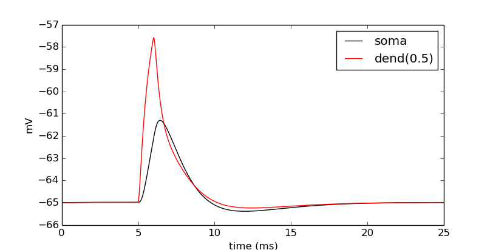
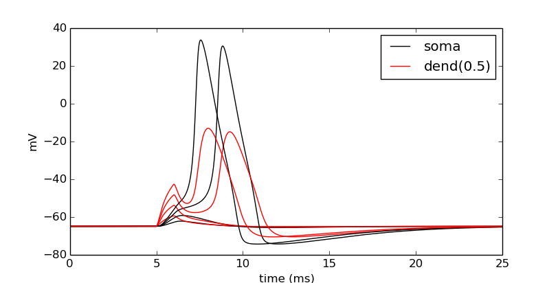

Ball-and-stick: 2 - Cell class
==============================

This page is the second in a series where we build a multicompartment cell and evolve it into a network of cells running on a parallel machine. In this page, we encapsulate much of the functionality of the previous page into Python functions and class objects. When code is encapsulated into a class, it can be represented as an object with particular functionality. As a Python object, it can be replicated many times. That is, multiple instances of the object can exist in the program. Therefore, cells make great examples of objects, especially when multiple cells are used in a network.

Ball and stick class
--------------------

From the previous lesson, we saw that cell objects have the following components:

* Sections - the cell sections.
* Topology - The connectivity of the sections
* Geometry - The 3D location of the sections
* Biophysics - The ionic channels and membrane properties of the sections
* Synapses - Optional list of synapses onto the cell.

With this in mind, let's encapsulate these concepts in the class's methods. Let's first start with imports used in the previous worksheet and import them here.

.. code-block::
    python
    
    import numpy
    from matplotlib import pyplot
    from neuron import h, gui

.. topic:: Recall

    On the previous page, we constructed a single ball and stick cell via:

    .. code-block::
        python
        
        # Create sections
        soma = h.Section(name='soma')
        dend = h.Section(name='dend')

        # Topology
        dend.connect(soma(1))
        # Geometry
        soma.L = soma.diam = 12.6157 # microns
        dend.L = 200                 # microns
        dend.diam = 1                # microns
        h.define_shape() # Translate into 3D points.

        # Biophysics
        for sec in h.allsec():
            sec.Ra = 100    # Axial resistance in Ohm * cm
            sec.cm = 1      # Membrane capacitance in micro Farads / cm^2

        # Insert active Hodgkin-Huxley current in the soma
        soma.insert('hh')
        soma.gnabar_hh = 0.12  # Sodium conductance in S/cm2
        soma.gkbar_hh = 0.036  # Potassium conductance in S/cm2
        soma.gl_hh = 0.0003    # Leak conductance in S/cm2
        soma.el_hh = -54.3     # Reversal potential in mV

        # Insert passive current in the dendrite
        dend.insert('pas')
        dend.g_pas = 0.001  # Passive conductance in S/cm2
        dend.e_pas = -65    # Leak reversal potential mV

We can make arbitrarily many copies of the cell by building it inside of a class.
(In particular, the rest of this page assumes that the code in the recall block
has *not* been run.)
Instead of calling a section ``soma``, we will now call it ``self.soma`` to indicate
to which cell it belongs. Additionally, note the ``build_subsets()`` method and how 'all' is used.
The use of a :class:`SectionList` instead of a Python list allows us to locate the whole neuron no matter how complicated in one line based on the connectivity.
Finally, note that we split the conceptual steps of describing the cell to be simulated into separate
methods to clarify the purpose of each code block.

.. code-block::
    python
    
    class BallAndStick(object):
        """Two-section cell: A soma with active channels and
        a dendrite with passive properties."""
        
        def __init__(self):
            self.create_sections()
            self.build_topology()
            self.build_subsets()
            self.define_geometry()
            self.define_biophysics()
            
        def create_sections(self):
            """Create the sections of the cell."""
            # NOTE: cell=self is required to tell NEURON of this object.
            self.soma = h.Section(name='soma', cell=self)
            self.dend = h.Section(name='dend', cell=self)
            
        def build_topology(self):
            """Connect the sections of the cell to build a tree."""
            self.dend.connect(self.soma(1))
            
        def define_geometry(self):
            """Set the 3D geometry of the cell."""
            self.soma.L = self.soma.diam = 12.6157 # microns
            self.dend.L = 200                      # microns
            self.dend.diam = 1                     # microns
            self.dend.nseg = 5
            h.define_shape() # Translate into 3D points.

        def define_biophysics(self):
            """Assign the membrane properties across the cell."""
            for sec in self.all: # 'all' defined in build_subsets
                sec.Ra = 100    # Axial resistance in Ohm * cm
                sec.cm = 1      # Membrane capacitance in micro Farads / cm^2
            
            # Insert active Hodgkin-Huxley current in the soma
            self.soma.insert('hh')
            self.soma.gnabar_hh = 0.12  # Sodium conductance in S/cm2
            self.soma.gkbar_hh = 0.036  # Potassium conductance in S/cm2
            self.soma.gl_hh = 0.0003    # Leak conductance in S/cm2
            self.soma.el_hh = -54.3     # Reversal potential in mV
            
            # Insert passive current in the dendrite
            self.dend.insert('pas')
            self.dend.g_pas = 0.001  # Passive conductance in S/cm2
            self.dend.e_pas = -65    # Leak reversal potential mV
            
        def build_subsets(self):
            """Build subset lists. For now we define 'all'."""
            self.all = h.SectionList()
            self.all.wholetree(sec=self.soma) 

Let's make an instance of the cell.

.. code-block::
    python
    
    cell = BallAndStick()

Success? Let's look.

.. code-block::
    python
    
    h.psection(sec=cell.dend)

So far so good. Let's now attach a stimulator, run the simulation and see how it looks.

.. code-block::
    python
    
    def attach_current_clamp(cell, delay=5, dur=1, amp=.1, loc=1):
        """Attach a current Clamp to a cell.
        
        :param cell: Cell object to attach the current clamp.
        :param delay: Onset of the injected current.
        :param dur: Duration of the stimulus.
        :param amp: Magnitude of the current.
        :param loc: Location on the dendrite where the stimulus is placed.
        """
        stim = h.IClamp(cell.dend(loc))
        stim.delay = delay
        stim.dur = dur
        stim.amp = amp
        
        return stim
        
    def set_recording_vectors(cell):
        """Set soma, dendrite, and time recording vectors on the cell.
        
        :param cell: Cell to record from.
        :return: the soma, dendrite, and time vectors as a tuple.
        """
        soma_v_vec = h.Vector()   # Membrane potential vector at soma
        dend_v_vec = h.Vector()   # Membrane potential vector at dendrite
        t_vec = h.Vector()        # Time stamp vector
        soma_v_vec.record(cell.soma(0.5)._ref_v)
        dend_v_vec.record(cell.dend(0.5)._ref_v)
        t_vec.record(h._ref_t)
        
        return soma_v_vec, dend_v_vec, t_vec
        
    def simulate(tstop=25):
        """Initialize and run a simulation.
        
        :param tstop: Duration of the simulation.
        """
        h.tstop = tstop
        h.run()
        
    def show_output(soma_v_vec, dend_v_vec, t_vec, new_fig=True):
        """Draw the output.
        
        :param soma_v_vec: Membrane potential vector at the soma.
        :param dend_v_vec: Membrane potential vector at the dendrite.
        :param t_vec: Timestamp vector.
        :param new_fig: Flag to create a new figure (and not draw on top
                of previous results)
        """
        if new_fig:
            pyplot.figure(figsize=(8,4)) # Default figsize is (8,6)
        soma_plot, = pyplot.plot(t_vec, soma_v_vec, color='black')
        dend_plot, = pyplot.plot(t_vec, dend_v_vec, color='red')
        pyplot.legend([soma_plot, dend_plot], ['soma', 'dend(0.5)'])
        pyplot.xlabel('time (ms)')
        pyplot.ylabel('mV')
           	
    stim = attach_current_clamp(cell)
    soma_v_vec, dend_v_vec, t_vec = set_recording_vectors(cell)
    simulate()
    show_output(soma_v_vec, dend_v_vec, t_vec) 
    pyplot.show()

Now let's compare the effects of four different current strengths:

.. code-block::
    python
           	
    step = 0.075
    num_steps = 4
    for i in numpy.linspace(step, step*num_steps, num_steps):
        stim.amp = i
        simulate()
        # When i==step, we are at the first time through.
        show_output(soma_v_vec, dend_v_vec, t_vec, i==step) 
    pyplot.show()

Aside: Docstrings
~~~~~~~~~~~~~~~~~

You may have wondered why our functions begin with a triple-quoted string
describing their purpose. These strings are known as docstrings. Like normal
comments, they make it easier to understand code that you have not looked
at recently. Python's :func:`help` displays these strings when the user
asks for help about the functions. Documentation generators use them to
automatically generate documentation from the source code. The markup used
to indicate parameters and return values in these examples is understood by
the Sphinx documentation generator.

.. seealso::

    `PEP 257 - Docstring Conventions <http://www.python.org/dev/peps/pep-0257/>`_,
    `Sphinx Python Documentation Generator <http://sphinx-doc.org>`_

----

This concludes this part of the tutorial. On the next page, we will make a ring network of ball-and-stick cells.
