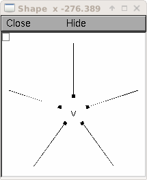
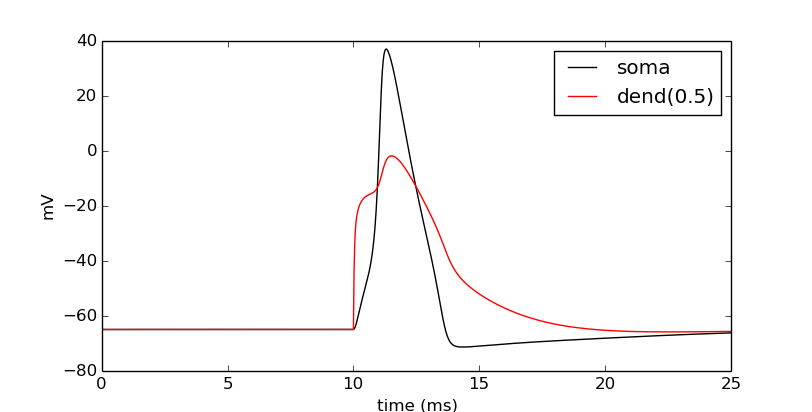
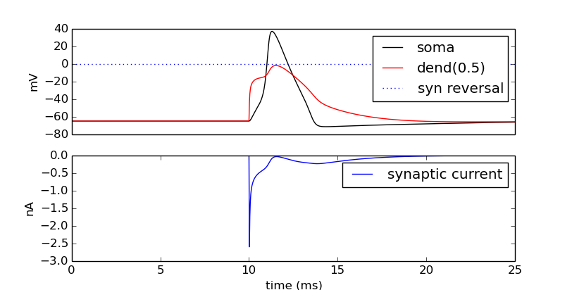
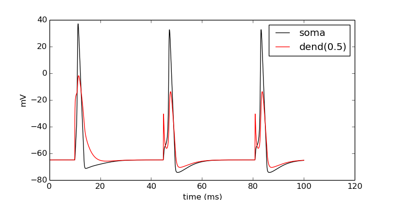
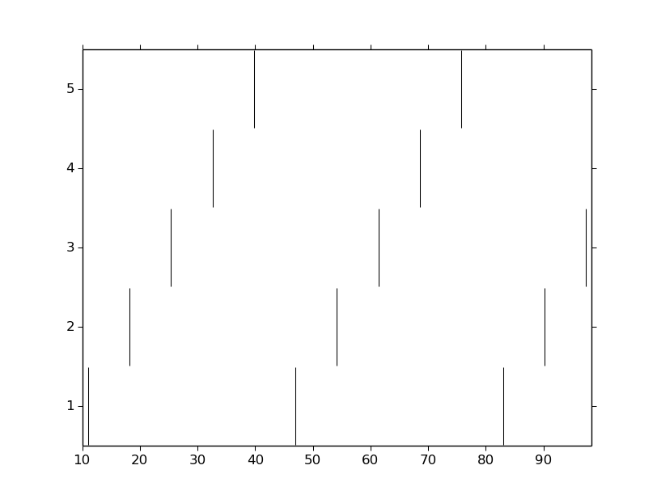

Ball-and-stick: 3 - Basic cell
==============================

.. topic:: Before we begin

    The examples on this page use Thomas McTavish's ``neuronpy`` module, available
    from `<https://pypi.python.org/pypi/neuronpy>`_. On Linux or Mac, this may be
    installed by typing: ``sudo pip install neuronpy``

This page is the third in a series here we build a multicompartment cell and evolve it into a network of cells running on a parallel machine. In this page, we build a ring network of ball-and-stick cells created in the previous page. In this case, we make *N* cells where cell *n* makes an excitatory synapse onto cell *n* + 1 and the last, *N*\ th cell in the network projects to the first cell. We will drive the first cell and visualize the spikes of the network.

Let's begin by creating a file :file:`simrun.py` to contain the simulation control methods from the previous tutorial page. In this file, place the following code:

    .. code-block:: python
    
        from neuron import h
        from matplotlib import pyplot
    
        def set_recording_vectors(cell):
            """Set soma, dendrite, and time recording vectors on the cell.
            
            :param cell: Cell to record from.
            :return: the soma, dendrite, and time vectors as a tuple.
            """
            soma_v_vec = h.Vector()   # Membrane potential vector at soma
            dend_v_vec = h.Vector()   # Membrane potential vector at dendrite
            t_vec = h.Vector()        # Time stamp vector
            soma_v_vec.record(cell.soma(0.5)._ref_v)
            dend_v_vec.record(cell.dend(0.5)._ref_v)
            t_vec.record(h._ref_t)
            
            return soma_v_vec, dend_v_vec, t_vec
            
        def simulate(tstop=25):
            """Initialize and run a simulation.
            
            :param tstop: Duration of the simulation.
            """
            h.tstop = tstop
            h.run()
            
        def show_output(soma_v_vec, dend_v_vec, t_vec, new_fig=True):
            """Draw the output.
            
            :param soma_v_vec: Membrane potential vector at the soma.
            :param dend_v_vec: Membrane potential vector at the dendrite.
            :param t_vec: Timestamp vector.
            :param new_fig: Flag to create a new figure (and not draw on top
                    of previous results)
            """
            if new_fig:
                pyplot.figure(figsize=(8,4)) # Default figsize is (8,6)
            soma_plot = pyplot.plot(t_vec, soma_v_vec, color='black')
            dend_plot = pyplot.plot(t_vec, dend_v_vec, color='red')
            pyplot.legend(soma_plot + dend_plot, ['soma', 'dend(0.5)'])
            pyplot.xlabel('time (ms)')
            pyplot.ylabel('mV')
           	
Now let's begin our session.
The first thing we will do is pull in our necessary imports.

.. code-block:: python

    import numpy
    import simrun
    from neuron import h, gui
    from math import sin, cos, pi
    from matplotlib import pyplot
        	
 
        	
Extend BallAndStick with 3D location functions
----------------------------------------------

We want to make a ring network, so let's layout our cells on the XY plane arranged in a star-like formation -- the somas along an inner circle and the dendrites projecting radially outward. To do this, we must explicitly set the 3D points of each section of each cell instead of relying on NEURON's :func:`define_shape` function as we did in the previous worksheet. In the cell class, we will define a basic cell shape at the origin and implement rotateZ() and set_location() functions that can be called on each cell object to permit different layouts. The BallAndStick class is as before, but with these added methods:

.. code-block:: python

    class BallAndStick(object):
        """Two-section cell: A soma with active channels and
        a dendrite with passive properties."""        
        def __init__(self):
            self.x = self.y = self.z = 0
            self.create_sections()
            self.build_topology()
            self.build_subsets()
            self.define_geometry()
            self.define_biophysics()
        #
        def create_sections(self):
            """Create the sections of the cell."""
            self.soma = h.Section(name='soma', cell=self)
            self.dend = h.Section(name='dend', cell=self)
        #   
        def build_topology(self):
            """Connect the sections of the cell to build a tree."""
            self.dend.connect(self.soma(1))
        #   
        def define_geometry(self):
            """Set the 3D geometry of the cell."""
            self.soma.L = self.soma.diam = 12.6157 # microns
            self.dend.L = 200                      # microns
            self.dend.diam = 1                     # microns
            self.dend.nseg = 5
            self.shape_3D()    #### Was h.define_shape(), now we do it.
        #
        def define_biophysics(self):
            """Assign the membrane properties across the cell."""
            for sec in self.all: # 'all' exists in parent object.
                sec.Ra = 100    # Axial resistance in Ohm * cm
                sec.cm = 1      # Membrane capacitance in micro Farads / cm^2
            # Insert active Hodgkin-Huxley current in the soma
            self.soma.insert('hh')
            self.soma.gnabar_hh = 0.12  # Sodium conductance in S/cm2
            self.soma.gkbar_hh = 0.036  # Potassium conductance in S/cm2
            self.soma.gl_hh = 0.0003    # Leak conductance in S/cm2
            self.soma.el_hh = -54.3     # Reversal potential in mV            
            # Insert passive current in the dendrite
            self.dend.insert('pas')
            self.dend.g_pas = 0.001  # Passive conductance in S/cm2
            self.dend.e_pas = -65    # Leak reversal potential mV
        #
        def build_subsets(self):
            """Build subset lists. For now we define 'all'."""
            self.all = h.SectionList()
            self.all.wholetree(sec=self.soma)
        #    
        #### NEW STUFF ADDED ####
        #
        def shape_3D(self):
            """
            Set the default shape of the cell in 3D coordinates.
            Set soma(0) to the origin (0,0,0) and dend extending along 
            the X-axis.
            """
            len1 = self.soma.L
            h.pt3dclear(sec=self.soma)
            h.pt3dadd(0, 0, 0, self.soma.diam, sec=self.soma)
            h.pt3dadd(len1, 0, 0, self.soma.diam, sec=self.soma)            
            len2 = self.dend.L
            h.pt3dclear(sec=self.dend)
            h.pt3dadd(len1, 0, 0, self.dend.diam, sec=self.dend)
            h.pt3dadd(len1 + len2, 0, 0, self.dend.diam, sec=self.dend)
        #
        def set_position(self, x, y, z):
            """
            Set the base location in 3D and move all other
            parts of the cell relative to that location.
            """
            for sec in self.all:
                # note: iterating like this changes the context for all NEURON
                # functions that depend on a section, so no need to specify sec=
                for i in range(int(h.n3d())):
                    h.pt3dchange(i, 
                            x - self.x + h.x3d(i),
                            y - self.y + h.y3d(i),
                            z - self.z + h.z3d(i), 
                            h.diam3d(i))
            self.x, self.y, self.z = x, y, z
        #
        def rotateZ(self, theta):
            """Rotate the cell about the Z axis."""   
            for sec in self.all:
                for i in range(int(h.n3d(sec=sec))):
                    x = h.x3d(i, sec=sec)
                    y = h.y3d(i, sec=sec)
                    c = cos(theta)
                    s = sin(theta)
                    xprime = x * c - y * s
                    yprime = x * s + y * c
                    h.pt3dchange(i, xprime, yprime, h.z3d(i, sec=sec), h.diam3d(i, sec=sec), sec=sec)
        

Construct and layout our cells
------------------------------

We want to construct an arbitrary number of cells and lay them out in a circle. The following code makes a list of *N* cells. With each cell, it first rotates it about the origin and then places its center at a location along the circle on the XY plane.

.. code-block:: python

    cells = []
    N = 5
    r = 50 # Radius of cell locations from origin (0,0,0) in microns
    for i in range(N):
        cell = BallAndStick()        
        # When cells are created, the soma location is at (0,0,0) and
        # the dendrite extends along the X-axis.
        # First, at the origin, rotate about Z.
        cell.rotateZ(i*2*pi/N)         
        # Then reposition
        x_loc = cos(i * 2 * pi / N) * r
        y_loc = sin(i * 2 * pi / N) * r
        cell.set_position(x_loc, y_loc, 0)
        cells.append(cell)

Now display everything:

.. code-block:: python

    shape_window = h.PlotShape()
    shape_window.exec_menu('Show Diam')
    

Make a NetStim
--------------

Okay, we have our ball-and-stick cells arranged in a ring. Let's now stimulate a cell and see that it is alive. Instead of stimulating with a current electrode as we did before, let's assign a virtual synapse so that we get acquainted with driving the cells through synaptic events.

Event-based communication between objects in NEURON takes place via network connection objects call :class:`NetCons <NetCon>`. Each NetCon has a source and target, where the source is typically a spike threshold detector. When a spike is detected, the NetCon sends a message to a target, usually a synapse on a postsynaptic cell.

A :class:`NetStim` is a spike generator that can be used as the source in a NetCon, behaving as external input onto the synapse of a target cell. The following code makes a NetStim object that generates one spike at time t=9. The NetCon then adds another ms delay to deliver a synaptic event at time t=10 onto the first cell.

The code below makes a stimulator and attaches it to a synapse object (:class:`ExpSyn`) that behaves much like an AMPA synapse -- it conducts current as a decaying exponential function.

.. code-block:: python

    stim = h.NetStim() # Make a new stimulator

    # Attach it to a synapse in the middle of the dendrite
    # of the first cell in the network. (Named 'syn_' to avoid
    # being overwritten with the 'syn' var assigned later.)
    syn_ = h.ExpSyn(cells[0].dend(0.5), name='syn_')

    stim.number = 1
    stim.start = 9
    ncstim = h.NetCon(stim, syn_)
    ncstim.delay = 1
    ncstim.weight[0] = 0.04 # NetCon weight is a vector. 
        	

Let's change the tau to decay by 2 ms.

.. code-block:: python

    syn_.tau = 2 
        	

We can see syn\_'s properties.

.. code-block:: python

    print dir(syn_)
    print 'tau =', syn_.tau
    print 'reversal =', syn_.e 
        	

Let's visualize the results of a simulation.

.. code-block:: python

    soma_v_vec, dend_v_vec, t_vec = simrun.set_recording_vectors(cells[0])
    simrun.simulate()
    simrun.show_output(soma_v_vec, dend_v_vec, t_vec) 
    pyplot.show()

    
How might we view the synaptic conductance during the simulation?

.. code-block:: python

    # Set recording vectors
    syn_i_vec = h.Vector()
    syn_i_vec.record(syn_._ref_i)

    simrun.simulate()

    # Draw
    fig = pyplot.figure(figsize=(8,4))
    ax1 = fig.add_subplot(2,1,1)
    soma_plot = ax1.plot(t_vec, soma_v_vec, color='black')
    dend_plot = ax1.plot(t_vec, dend_v_vec, color='red')
    rev_plot = ax1.plot([t_vec[0], t_vec[-1]], [syn_.e, syn_.e], 
            color='blue', linestyle=':')
    ax1.legend(soma_plot + dend_plot + rev_plot, 
            ['soma', 'dend(0.5)', 'syn reversal'])
    ax1.set_ylabel('mV')
    ax1.set_xticks([]) # Use ax2's tick labels

    ax2 = fig.add_subplot(2,1,2)
    syn_plot = ax2.plot(t_vec, syn_i_vec, color='blue')
    ax2.legend(syn_plot, ['synaptic current'])
    ax2.set_ylabel(h.units('ExpSyn.i'))
    ax2.set_xlabel('time (ms)')
    pyplot.show()
        	

Try setting the recording vectors to one of the other cells. They should be unresponsive to the stimulus.

Connect the cells
-----------------

Okay. We have our ball-and-stick cells arranged in a ring, and we've attached a stimulus onto the first cell. Next, we need to connect an axon from cell n to a synapse at the middle of the dendrite on cell n + 1. For this model, the particular dynamics of the axons do not need to be explicitly modeled. When the soma fires an action potential, we assume the spike propagates down the axon and induces a synaptic event onto the dendrite of the target cell with some delay. We can therefore connect a spike detector in the soma of the presynaptic cell that triggers a synaptic event in the target cell via a :class:`NetCon`.

.. code-block:: python

    nclist = []
    syns = []
    for i in range(N):
        src = cells[i]
        tgt = cells[(i + 1) % N]
        syn = h.ExpSyn(tgt.dend(0.5))
        syns.append(syn)
        nc = h.NetCon(src.soma(0.5)._ref_v, syn, sec=src.soma)
        nc.weight[0] = .05
        nc.delay = 5
        nclist.append(nc) 
        	

Confirm that we get results.

.. code-block:: python

    soma_v_vec, dend_v_vec, t_vec = simrun.set_recording_vectors(cells[0])
    simrun.simulate(tstop=100)
    simrun.show_output(soma_v_vec, dend_v_vec, t_vec) 
    pyplot.show()

Try this again with a different cell instead of ``cells[0]`` (i.e. try ``cells[1]`` through ``cells[N - 1]``).

We can see that the network is now active -- an initial trigger generates a spike in the first cell, which generates a spike in the second cell, etc., looping on and on. One thing that we did not do was record all of the spike times. Let's do that with :meth:`NetCon.record`.

.. code-block:: python

    t_vec = h.Vector()
    id_vec = h.Vector()
    for i in range(len(nclist)):
        nclist[i].record(t_vec, id_vec, i)
        
    simrun.simulate(tstop=100)

Print out the results.

.. code-block:: python

    from itertools import izip
    for t, id in izip(t_vec, id_vec):
        print "cell =", id, t 

Each line represents one spike: cell 0 fires first, then 1, 2, 3, 4, back to 0, etc.

We can also visualize raster plots using the Neuronpy library.

.. code-block:: python

    from neuronpy.graphics import spikeplot
    from neuronpy.util import spiketrain

    spikes = spiketrain.netconvecs_to_listoflists(t_vec, id_vec)
    sp = spikeplot.SpikePlot(savefig=True)
    sp.plot_spikes(spikes) 

(If you got an :class:`ImportError` on the first line of this code block, then you do not have the ``neuronpy``
module installed. See the "before we begin" note at the top of this page).

This page has demonstrated various functionality to arrange, connect, and visualize a network and its output. As nice as it may seem, it needs some design work to make it flexible. The next part of the tutorial further organizes the functionality into more classes to make it more easily extended.

