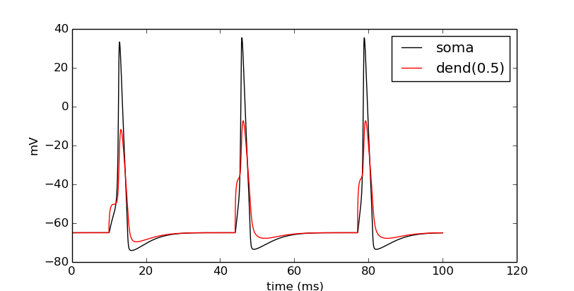
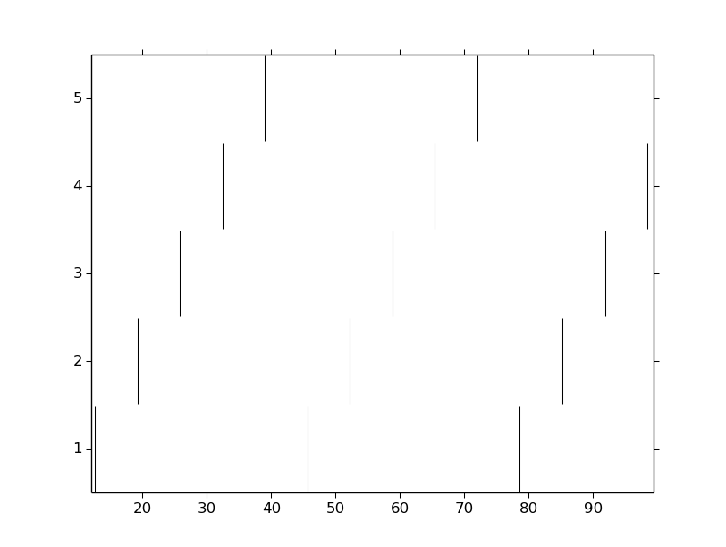
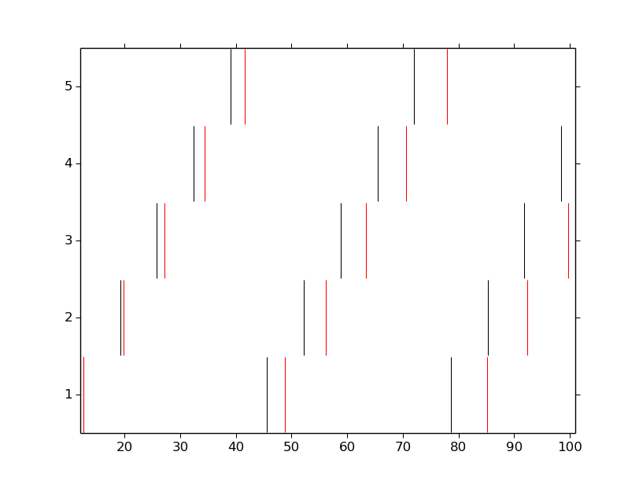

Ball-and-stick: 4 - Ring Network Classes
========================================

This is the fourth part of a tutorial series where we build a multicompartment cell and evolve it into a network of cells running on a parallel machine. In this part, we take the functionality of the ring network we constructed in the previous page and encapsulate it into various classes so that the network is more extensible. We also begin parameterizing the model so that particular values are not hard-coded, but remain variable so that the model is flexible.

The first thing we will do is pull in our necessary imports. ``simrun.py`` was defined in the previous part of this tutorial.

.. code-block:: python

    import numpy
    import simrun
    from neuron import h, gui
    from math import sin, cos, pi
    from matplotlib import pyplot

Create a generic cell class
---------------------------

We have evolved our BallAndStick class into a fairly nice class, but it can still be enhanced. For starters, it would be convenient for the cell to know about and maintain a list of its synapses. Additionally, should we ever need to model more than one cell type, it would be nice to specify a template and generic functionality once for all cell classes. Object-oriented capabilities of Python permit this. The following script block defines a generic Cell class that other cells can inherit from. As a template, it mandates that child classes implement methods called in \_\_init\_\_(). It also permits 3D placement, gives cells an 'all' SectionList, and also uses a list of synapses and a connection routine.

.. code-block:: python

class Cell:
    """Generic cell template."""
    #
    def __init__(self):
        self.x = 0; self.y = 0; self.z = 0
        self.soma = None
        self.synlist = [] #### NEW CONSTRUCT IN THIS WORKSHEET
        self.create_sections()
        self.build_topology()
        self.build_subsets()
        self.define_geometry()
        self.define_biophysics()
        self.create_synapses()
    #    
    def create_sections(self):
        """Create the sections of the cell. Remember to do this
        in the form::
            
            h.Section(name='soma', cell=self)
            
        """
        raise NotImplementedError("create_sections() is not implemented.")
    #    
    def build_topology(self):
        """Connect the sections of the cell to build a tree."""
        raise NotImplementedError("build_topology() is not implemented.")
    #    
    def define_geometry(self):
        """Set the 3D geometry of the cell."""
        raise NotImplementedError("define_geometry() is not implemented.")
    #
    def define_biophysics(self):
        """Assign the membrane properties across the cell."""
        raise NotImplementedError("define_biophysics() is not implemented.")
    #   
    def create_synapses(self):
        """Subclasses should create synapses (such as ExpSyn) at various
        segments and add them to self.synlist."""
        pass # Ignore if child does not implement.
    #   
    def build_subsets(self):
        """Build subset lists. This defines 'all', but subclasses may
        want to define others. If overriden, call super() to include 'all'."""
        self.all = h.SectionList()
        self.all.wholetree(sec=self.soma)
    #   
    def connect2target(self, target, thresh=10):
        """Make a new NetCon with this cell's membrane
        potential at the soma as the source (i.e. the spike detector)
        onto the target passed in (i.e. a synapse on a cell).
        Subclasses may override with other spike detectors."""
        nc = h.NetCon(self.soma(1)._ref_v, target, sec = self.soma)
        nc.threshold = thresh
        return nc
    #
    def is_art(self):
        """Flag to check if we are an integrate-and-fire artificial cell."""
        return False
    #    
    def set_position(self, x, y, z):
        """
        Set the base location in 3D and move all other
        parts of the cell relative to that location.
        """
        for sec in self.all:
            for i in range(sec.n3d()):
                h.pt3dchange(i, 
                        x-self.x+sec.x3d(i), 
                        y-self.y+sec.y3d(i), 
                        z-self.z+sec.z3d(i), 
                        sec.diam3d(i), sec=sec)
        self.x = x; self.y = y; self.z = z
    #
    def rotateZ(self, theta):
        """Rotate the cell about the Z axis."""
        rot_m = numpy.array([[numpy.sin(theta), numpy.cos(theta)], 
                [numpy.cos(theta), -numpy.sin(theta)]])
        for sec in self.all:
            for i in range(sec.n3d()):
                xy = numpy.dot([sec.x3d(i), sec.y3d(i)], rot_m)
                h.pt3dchange(i, float(xy[0]), float(xy[1]), sec.z3d(i), 
                        sec.diam3d(i))

Test this:

.. code-block:: python

    class ChildCell(Cell):
        pass
    
    cell = ChildCell()

By design, an exception is raised letting us know that we need to at least override ``create_sections()`` before proceeding to have a valid subclass object of Cell.

Define BallAndStick as an extension to the base Cell class
----------------------------------------------------------

This Cell object serves as a template and reduces the coding in inherited objects. Look how much leaner we can make BallAndStick.

.. code-block:: python

    class BallAndStick(Cell):  #### Inherits from Cell
        """Two-section cell: A soma with active channels and
        a dendrite with passive properties."""        
        #### __init__ is gone and handled in Cell. 
        #### We can override __init__ completely, or do some of 
        #### our own initialization first, and then let Cell do its 
        #### thing, and then do a bit more ourselves with "super".
        #### 
        #### def __init__(self):
        ####     # Do some stuff
        ####     super(Cell, self).__init__()
        ####     # Do some more stuff                 
        #
    def create_sections(self):
        """Create the sections of the cell."""
        self.soma = h.Section(name='soma', cell=self)
        self.dend = h.Section(name='dend', cell=self)
    #    
    def build_topology(self):
        """Connect the sections of the cell to build a tree."""
        self.dend.connect(self.soma(1))
    #    
    def define_geometry(self):
        """Set the 3D geometry of the cell."""
        self.soma.L = self.soma.diam = 12.6157 # microns
        self.dend.L = 200                      # microns
        self.dend.diam = 1                     # microns
        self.dend.nseg = 5
        self.shape_3D()
    #
    def define_biophysics(self):
        """Assign the membrane properties across the cell."""
        for sec in self.all: # 'all' exists in parent object.
            sec.Ra = 100     # Axial resistance in Ohm * cm
            sec.cm = 1       # Membrane capacitance in micro Farads / cm^2
            #
            # Insert active Hodgkin-Huxley current in the soma
            soma.insert('hh')
            for seg in soma:
                seg.hh.gnabar = 0.12  # Sodium conductance in S/cm2
                seg.hh.gkbar = 0.036  # Potassium conductance in S/cm2
                seg.hh.gl = 0.0003    # Leak conductance in S/cm2
                seg.hh.el = -54.3     # Reversal potential in mV
            #    
            # Insert passive current in the dendrite
            dend.insert('pas')
            for seg in dend:
                seg.pas.g = 0.001  # Passive conductance in S/cm2
                seg.pas.e = -65    # Leak reversal potential mV 
    #
    def shape_3D(self):
        """
        Set the default shape of the cell in 3D coordinates.
        Set soma(0) to the origin (0,0,0) and dend extending along
        the X-axis.
        """
        len1 = self.soma.L
        h.pt3dclear(sec=self.soma)
        h.pt3dadd(0, 0, 0, self.soma.diam, sec=self.soma)
        h.pt3dadd(len1, 0, 0, self.soma.diam, sec=self.soma)
        #
        len2 = self.dend.L
        h.pt3dclear(sec=self.dend)
        h.pt3dadd(len1, 0, 0, self.dend.diam, sec=self.dend)
        h.pt3dadd(len1 + len2, 0, 0, self.dend.diam, sec=self.dend)
    #    
    #### build_subsets, rotateZ, and set_location are now in cell object. ####
    #
    #### NEW STUFF ####
    #
    def create_synapses(self):
        """Add an exponentially decaying synapse in the middle
        of the dendrite. Set its tau to 2ms, and append this
        synapse to the synlist of the cell."""
        syn = h.ExpSyn(self.dend(0.5))
        syn.tau = 2
        self.synlist.append(syn) # synlist is defined in Cell

Make a Ring class
-----------------

Encapsulating code into discrete objects is not only conceptually useful for code management, but as we know with cell objects, it lets us make several instances of the object for use in a network. Thinking ahead, we may very well need several networks -- each network configured differently. This allows scripting of several simulations *en* *masse*, either in a *for* loop that sequentially processes the networks, or it can be used with NEURON's :meth:`subworlds <ParallelContext.subworlds>` architecture in a parallel context.

.. code-block:: python

    class Ring:
        """A network of *N* ball-and-stick cells where cell n makes an 
        excitatory synapse onto cell n + 1 and the last, Nth cell in the 
        network projects to the first cell.
        """        
        def __init__(self, N=5, stim_w=0.004, stim_number=1, 
                syn_w=0.01, syn_delay=5):
            """
            :param N: Number of cells.
            :param stim_w: Weight of the stimulus
            :param stim_number: Number of spikes in the stimulus
            :param syn_w: Synaptic weight
            :param syn_delay: Delay of the synapse
            """
            self._N = N              # Total number of cells in the net
            self.cells = []          # Cells in the net
            self.nclist = []         # NetCon list
            self.stim = None         # Stimulator
            self.stim_w = stim_w     # Weight of stim
            self.stim_number = stim_number  # Number of stim spikes
            self.syn_w = syn_w       # Synaptic weight
            self.syn_delay = syn_delay  # Synaptic delay
            self.t_vec = h.Vector()   # Spike time of all cells
            self.id_vec = h.Vector()  # Ids of spike times            
            self.set_numcells(N)  # Actually build the net.
        #
        def set_numcells(self, N, radius=50):
            """Create, layout, and connect N cells."""
            self._N = N
            self.create_cells(N)
            self.connect_cells()
            self.connect_stim()
        #   
        def create_cells(self, N):
            """Create and layout N cells in the network."""
            self.cells = []
            r = 50 # Radius of cell locations from origin (0,0,0) in microns
            N = self._N
            for i in range(N):
                cell = BallAndStick()
                # When cells are created, the soma location is at (0,0,0) and
                # the dendrite extends along the X-axis.
                # First, at the origin, rotate about Z.
                cell.rotateZ(i * 2 * pi / N)                
                # Then reposition
                x_loc = cos(i * 2 * pi / N) * r
                y_loc = sin(i * 2 * pi / N) * r
                cell.set_position(x_loc, y_loc, 0)                
                self.cells.append(cell)
        #
        def connect_cells(self):
            """Connect cell n to cell n + 1."""
            self.nclist = []
            self.spike_times = []
            N = self._N
            for i in range(N):
                src = self.cells[i]
                tgt_syn = self.cells[(i+1)%N].synlist[0]
                nc = src.connect2target(tgt_syn)
                nc.weight[0] = self.syn_w
                nc.delay = self.syn_delay
                spike_times = h.Vector()
                nc.record(spike_times)
                self.nclist.append(nc)
                self.spike_times.append(spike_times)
        #       
        def connect_stim(self):
            """Connect a spiking generator to the first cell to get
            the network going."""
            self.stim = h.NetStim()
            self.stim.number = self.stim_number
            self.stim.start = 9
            self.ncstim = h.NetCon(self.stim, self.cells[0].synlist[0])
            self.ncstim.delay = 1
            self.ncstim.weight[0] = self.stim_w # NetCon weight is a vector.

Test the network
----------------

Let's make a ring object, render it, and run a simulation.

.. code-block:: python

    ring = Ring()

.. code-block:: python

    shape_window = h.PlotShape()
    shape_window.exec_menu('Show Diam')

.. image:: images/ballstick9.png
    :align: center

.. code-block:: python

    soma_v_vec, dend_v_vec, t_vec = simrun.set_recording_vectors(ring.cells[0])
    simrun.simulate(tstop=100)
    simrun.show_output(soma_v_vec, dend_v_vec, t_vec) 
    pyplot.show()

Let's see a spike plot.

.. code-block:: python

    pyplot.figure()
    spikes = ring.spike_times
    for i, spike_times in enumerate(spikes):
        pyplot.vlines(spike_times, i + 0.5, i + 1.5)
    pyplot.show()

Run a few networks
------------------

Let's run other instances of the net. The code below keeps the variable spikes from our default run, but replaces the net with a new instance with arguments that we pass in, drawing a second set of spikes in red.

.. code-block:: python

    ring = Ring(syn_w=.005) # Try different weights, for example.
    simrun.simulate(tstop=100)
    spikes2 = ring.spike_times
    pyplot.figure()
    for i, spike_times in enumerate(spikes):
        pyplot.vlines(spike_times, i + 0.5, i + 1.5, color='black')
    for i, spike_times in enumerate(spikes2):
        pyplot.vlines(spike_times, i + 0.5, i + 1.5, color='red')
    pyplot.show()

In both simulations, the first spike occurs at 12.625 ms. After that, the red spikes lag the black ones by steadily increasing amounts.

This concludes this part of the tutorial. The next part translates this serial implementation into a parallel model.

Here we specify different labels for the two sets of spikes because if a label was reused (or both were omitted), then the first raster would be replaced with the second.

