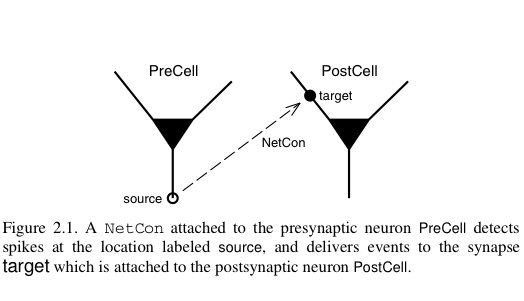
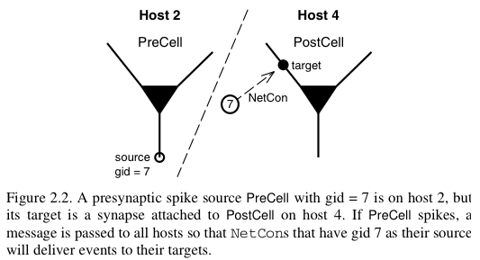

Ball-and-stick: 5 - Parallel Net
================================

This is the final part of the series where we build a multicompartment cell and evolve it into a network of cells running on a parallel machine. On this page, we translate the classes we have previously constructed so that they operate in either a parallel or serial mode. NOTE: We demonstrate some necessary instructions for parallel implementation, but we do not deal with the particulars of MPI or parallel installation under a given hardware architecture.

.. note::

    For this part of the tutorial, you will need an MPI installation, such as `Open MPI <http://www.open-mpi.org>`_ or `MPICH <http://www.mpich.org>`_. The code presented here was tested using MPICH. (On Ubuntu, install MPICH via: ``sudo apt-get install mpich``). Furthermore, your copy of NEURON will need to have been compiled with support for parallel simulations; that is, the ``--with-paranrn`` flagged needed to be passed to the compiler.

Parallel communication in NEURON
--------------------------------

Parallel communication takes place via logical events in network connection objects known as :class:`NetCons <NetCon>`. NetCon sources are threshold detectors. They monitor some variable, say the membrane potential of a cell, and when the variable reaches some threshold, it triggers an event sent to the targets. Targets are frequently synapses on other cells. When they receive the event, they activate.

In a parallel context across several machines, communication between hosts can be computationally inefficient when the frequency of events is high and when the message being sent is large. NEURON uses an efficient priority queueing mechanism to deliver events to targets after the delay specified by the NetCon. The message passed is succinct. It is an integer, the unique global identifier (gid) of the source. The following two figures illustrate these ideas and come from  `Hines M.L. and Carnevale N.T, Translating network models to parallel hardware in NEURON, Journal of Neuroscience Methods 169 (2008) 425–455 <http://www.ncbi.nlm.nih.gov/pmc/articles/PMC2430920/>`_.  Users should also consult the :class:`ParallelContext` reference.

The main step involved in making a parallel implementation is to assign the global identifiers across the various hosts. Care should also be taken to assign cells to the various hosts such that the system is load balanced. For example, in a network with computationally complex and simple cells, several simple cells may be assigned to a host while few complex cells may be assigned to another host.

Test MPI and Parallel NEURON
----------------------------

Parallel NEURON operates through MPI. Ensure that you have MPI and a Python interface to MPI, such as `mpi4py <http://mpi4py.scipy.org/>`_. (In Ubuntu, you can setup this module via: ``sudo apt-get install python-mpi4py``)

Create a file called :file:`testmpi.py`:

.. code-block:: python

    from mpi4py import MPI
    from neuron import h
    pc = h.ParallelContext()
    id = int(pc.id())
    nhost = int(pc.nhost())
    print "I am", id, "of", nhost

Launch Python, and then you can run the script in parallel using :func:`os.system`.

.. code-block:: python
    
    import os
    os.system('mpiexec -n 4 python testmpi.py')

You should see output resembling:

.. code-block:: none

    numprocs=4
    NEURON -- VERSION 7.4 (1368:353c7c3ecd8d) 2015-04-03
    Duke, Yale, and the BlueBrain Project -- Copyright 1984-2015
    See http://www.neuron.yale.edu/neuron/credits

    Additional mechanisms from files
     icaconst.mod
    I am 3 of 4
    I am 0 of 4
    I am 1 of 4
    I am 2 of 4

If instead, you see four processes claiming to be 0 of 1, then your copy of NEURON was not compiled with support for parallel simulation. Reconfigure with the ``--with-paranrn`` flag and recompile.

Import our modules
------------------

Begin by downloading :download:`ballandstick.py` and :download:`cell.py` into your working directory. These are equivalent to the classes we created in the previous part of the tutorial. You'll also need :download:`simrun.py`.

Let's call our imports. When using MPI, we need to use a python interface to it. Here we use mpi4py, which must be imported before NEURON. Additionally, we have placed BallAndStick in a file that we now import. That is, in this example it is the network that we parallelize, not the cell models, so it is the Ring class that we modify.

.. code-block:: python

    import numpy
    from mpi4py import MPI # Must come before importing NEURON
    from neuron import h, gui
    import simrun
    import ballandstick
    from matplotlib import pyplot

If we run this code directly via Python (either by copy-pasting it into a Python prompt or by saving it to a file and executing that file with python), we will see ``numprocs=1`` indicating that MPI is initialized, but the number of processors is 1. This is because we did not call ``mpiexec`` from a shell. This is fine, and actually good. We can develop serially in this Python environment and then execute it later in parallel form.

Parallelize Ring class
----------------------

When parallelized, every host is sent the same program, which makes its own Ring instance. This means that objects inside a particular instance of Ring also reside on a particular host. For example, in the serial implementation, cells was the list of all cell objects in the network. In parallel, cells is the list of cell objects on this host. There is no list of all of the cells in the network.

The following code demarcates new functionality with '####'. Most parallel functionality operates through a :class:`ParallelContext` object. Look at how pc, the ParallelContext object, is used in the modification to Ring. Save this code as :file:`ring.py`.

.. code-block:: python

    from neuron import h
    import ballandstick
    import numpy
    from itertools import izip
    from neuronpy.util import spiketrain

    class Ring:
        """A network of *N* ball-and-stick cells where cell n makes an 
        excitatory synapse onto cell n + 1 and the last, Nth cell in the 
        network projects to the first cell.
        """
        def __init__(self, N=5, stim_w=0.004, stim_spike_num=1, syn_w=0.01, 
                syn_delay=5):
            """
            :param N: Number of cells.
            :param stim_w: Weight of the stimulus
            :param stim_spike_num: Number of spikes generated in the stimulus
            :param syn_w: Synaptic weight
            :param syn_delay: Delay of the synapse
            """
            self._N = N              # Total number of cells in the net
            self.cells = []          # Cells on this host
            self.nclist = []         # NetCon list on this host
            self.gidlist = []        # List of global identifiers on this host
            self.stim = None         # Stimulator
            self.stim_w = stim_w     # Weight of stim
            self.stim_spike_num = stim_spike_num  # Number of stim spikes
            self.syn_w = syn_w       # Synaptic weight
            self.syn_delay = syn_delay  # Synaptic delay
            self.t_vec = h.Vector()   # Spike time of all cells on this host
            self.id_vec = h.Vector()  # Ids of spike times on this host
            
            #### Make a new ParallelContext object
            self.pc = h.ParallelContext()
            
            self.set_numcells(N)  # Actually build the net -- at least the portion
                                  # of cells on this host.
                
        def set_numcells(self, N, radius=50):
            """Create, layout, and connect N cells."""
            self._N = N
            self.set_gids() #### Used when creating and connecting cells
            self.create_cells()
            self.connect_cells()
            self.connect_stim()
            
        def set_gids(self):
            """Set the gidlist on this host."""
            self.gidlist = []
            #### Round-robin counting.
            #### Each host as an id from 0 to pc.nhost() - 1.
            for i in range(int(self.pc.id()), self._N, int(self.pc.nhost())):
                self.gidlist.append(i)
                
        def create_cells(self):
            """Create cell objects on this host and set their location."""
            self.cells = []
            N = self._N
            r = 50 # Radius of cell locations from origin (0,0,0) in microns
            
            for i in self.gidlist:
                cell = ballandstick.BallAndStick()
                # When cells are created, the soma location is at (0,0,0) and
                # the dendrite extends along the X-axis.
                # First, at the origin, rotate about Z.
                cell.rotateZ(i*2*numpy.pi/N)
                
                # Then reposition
                x_loc = float(numpy.sin(i*2*numpy.pi/N))*r
                y_loc = float(numpy.cos(i*2*numpy.pi/N))*r
                cell.set_position(x_loc, y_loc, 0)
                
                self.cells.append(cell)
                
                #### Tell this host it has this gid
                #### gids can be any integer, they just need to be unique.
                #### In this simple case, we set the gid to i.
                self.pc.set_gid2node(i, int(self.pc.id()))
                
                #### Means to tell the ParallelContext that this cell is
                #### a source for all other hosts. NetCon is temporary.
                nc = cell.connect2target(None)
                self.pc.cell(i, nc) # Associate the cell with this host and gid
                
                #### Record spikes of this cell
                self.pc.spike_record(i, self.t_vec, self.id_vec)

    # OLD WAY            
    #    def connect_cells(self):
    #        self.nclist = []
    #        N = self._N
    #        for i in range(N):
    #            src = self.cells[i]
    #            tgt_syn = self.cells[(i+1)%N].synlist[0]
    #            nc = src.connect2target(tgt_syn)
    #            nc.weight[0] = self.syn_w
    #            nc.delay = self.syn_delay
    #            nc.record(self.t_vec, self.id_vec, i)
    #            self.nclist.append(nc)

        def connect_cells(self):
            """Connect cell n to cell n + 1."""
            self.nclist = []
            N = self._N
            for i in self.gidlist:
                src_gid = (i-1+N) % N
                tgt_gid = i
                if self.pc.gid_exists(tgt_gid):
                    target = self.pc.gid2cell(tgt_gid)
                    syn = target.synlist[0]
                    nc = self.pc.gid_connect(src_gid, syn)
                    nc.weight[0] = self.syn_w
                    nc.delay = self.syn_delay
                    self.nclist.append(nc)
                            
        def connect_stim(self):
            """Connect a spike generator on the first cell in the network."""
            #### If the first cell is not on this host, return
            if not self.pc.gid_exists(0):
                return
            self.stim = h.NetStim()
            self.stim.number = self.stim_spike_num
            self.stim.start = 9
            self.ncstim = h.NetCon(self.stim, self.cells[0].synlist[0])
            self.ncstim.delay = 1
            self.ncstim.weight[0] = self.stim_w # NetCon weight is a vector.
            
        def get_spikes(self):
            """Get the spikes as a list of lists."""
            return spiketrain.netconvecs_to_listoflists(self.t_vec, self.id_vec)
            
        def write_spikes(self, file_name='out.spk'):
            """Append the spike output file with spikes on this host. The output
            format is the timestamp followed by a tab then the gid of the source
            followed by a newline.
            
            :param file_name: is the full or relative path to a spike output file.
            
            .. note::
                
                When parallelized, each process will write to the same file so it
                is opened in append mode. The order in which the processes write is
                arbitrary so while the spikes within the process may be ordered by
                time, the output file will be unsorted. A quick way to sort a file
                is with the bash command sort, which can be called after all 
                processes have written the file with the following format::
                    
                    exec_cmd = 'sort -k 1n,1n -k 2n,2n ' + file_name + \
                            ' > ' + 'sorted_' + file_name
                    os.system(exec_cmd)
            """
            for i in range(int(self.pc.nhost())):
                self.pc.barrier() # Sync all processes at this point
                if i == int(self.pc.id()):
                    if i == 0:
                        mode = 'w' # write
                    else:
                        mode = 'a' # append
                    with open(file_name, mode) as spk_file: # Append
                        for (t, id) in izip(self.t_vec, self.id_vec):
                            spk_file.write('%.3f\t%d\n' %(t, id)) # timestamp, id
            self.pc.barrier() 

Test the net
------------

Let's make a net object and run a simulation.

.. code-block:: python

    import ring
    my_ring = ring.Ring() 

.. warning::

    Since NEURON recognizes that we are running a (potentially) parallel simulation, it will not allow us to use
    its graphics (e.g. we cannot use a :class:`PlotShape` to see the morphology). We can, however, use matplotlib's graphics.
       	
We are using a parallel context, but we are still operating with one host. Let's see if the serial implementation still works.

.. code-block::
    python

    soma_v_vec, dend_v_vec, t_vec = simrun.set_recording_vectors(my_ring.cells[0])
    h.tstop = 100
    h.run()
    simrun.show_output(soma_v_vec, dend_v_vec, t_vec)
    pyplot.show()

.. image:: images/ballstick17.png
    :align: center
    
We can write the spikes to disk:

.. code-block:: python

    my_ring.write_spikes('out.spk')

This creates a file :file:`out.spk`, which for each spike lists the spike time and the cell number:

.. code-block:: none

    12.625	0
    19.225	1
    25.825	2
    32.425	3
    39.025	4
    45.625	0
    52.225	1
    58.825	2
    65.425	3
    72.025	4
    78.625	0
    85.225	1
    91.825	2
    98.425	3

       	
Running in parallel requires the following format.

.. code-block:: python

    def prun():
        pc = h.ParallelContext()
        pc.set_maxstep(10)
        h.stdinit()
        h.dt = 0.025 # Fixed dt
        pc.psolve(100)
        pc.runworker()
        pc.done() 
       	
Let's call :func:`prun` and plot the output spikes.

.. code-block:: python

    prun()

    from neuronpy.graphics import spikeplot

    spikes = my_ring.get_spikes()
    sp = spikeplot.SpikePlot()
    sp.plot_spikes(spikes) 

.. image:: images/ballstick18.png
    :align: center

Run parallel simulations
------------------------

The previous run demonstrates a serial run using a ParallelContext object. Let's now actually run some parallel simulations. To do this, we need to execute MPI from the command line and pass it some number of processors. This also means that the script that we want to submit is a file and the output of the run is also some set of files that are read later. The functionality we need is located in the file :download:`parrun.py`. Download it, then execute it with 1 processor (from your system terminal **not** from Python) and make sure it works.

.. code-block:: none
    
    mpiexec -n 1 python parrun.py
       	
You will notice that it made two output files. :file:`out.spk` is a tab-delimited list of spike times and gids. :file:`sorted_out.spk` is equivalent. Now let's try with 3 processors.

.. code-block:: none
    
    mpiexec -n 3 python parrun.py

In this case, we have 3 processors. It is likely that each process writes to :file:`out.spk` out of order. In this case, :file:`out.spk` is sorted by spike times and then gid and the result is placed in :file:`sorted_out.spk`.

This concludes this series on ball-and-stick models.

