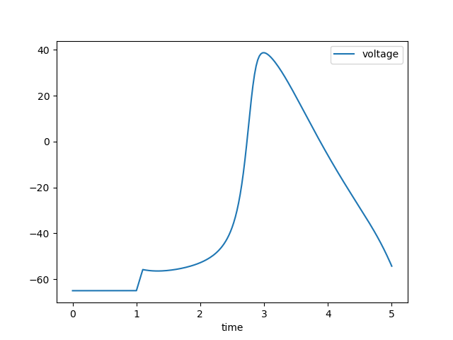

C API
=====

.. contents::
    :local:
    :depth: 2

Initialization
--------------

.. c:function:: int nrn_init(int argc, const char** argv)

    Initialize the NEURON environment. This function must be called before using any other NEURON API functions.
    The initialization sets up the NEURON interpreter and internal data structures.

    :param argc: Argument count (should be at least 1, the name of the program)
    :param argv: Argument vector (length should be one longer than argc and end with ``nullptr``).
    :returns: 0 on success, non-zero on failure.

    **Usage Pattern:**

    This function is called at the beginning of a NEURON session. 
    The arguments are passed to the NEURON simulator as if it was launched with that argv.
    The first argument is typically the program name (e.g., "NEURON").
    Some error messages may include the program name.

    **Example:**
    
    .. code-block:: c++

        static std::array<const char*, 4> argv = {"NEURON", "-nogui", "-nopython", nullptr};

        if (nrn_init(3, argv.data()) != 0) {
            // handle initialization error
        }

.. c:function:: void nrn_stdout_redirect(int (*myprint)(int, char*))

    Redirect NEURON's stdout to a custom print function. This allows capturing NEURON's output
    and redirecting it to alternative destinations (e.g., Jupyter notebook or MATLAB command window).

    :param myprint: Function pointer for custom printing. The function should accept two parameters:
                    stream (1 for stdout, other values for stderr) and the message string.

    **Example:**
    
    .. code-block:: c
    
        int my_print_func(int stream, char* msg) {
            if (stream == 1) {
                printf("[STDOUT] %s", msg);
            } else {
                printf("[STDERR] %s", msg);
            }
            return 0;
        }
        
        nrn_stdout_redirect(my_print_func);

Sections
--------

.. c:function:: Section* nrn_section_new(const char* name)

    Create a new Section with the given name. Sections are the fundamental building blocks
    of NEURON morphologies, representing cable segments of neurons. HOC functions can
    see the Section name but they cannot be referred to directly in HOC like a Section created
    in HOC (i.e., they do not occupy the HOC namespace). The returned Section pointer is used
    in subsequent operations to reference the Section.

    :param name: Name of the new Section (must be unique within the model).
    :returns: Pointer to the newly created Section object.

    **C Usage:**
    
    .. code-block:: c
    
        Section* soma = nrn_section_new("soma");
        Section* dendrite = nrn_section_new("dendrite");

    **Python Equivalent:**
    
    .. code-block:: python
    
        from neuron import n
        soma = n.Section('soma')
        dendrite = n.Section('dendrite')

.. c:function:: void nrn_section_connect(Section* child_sec, double child_x, Section* parent_sec, double parent_x)

    Connect a child Section to a parent Section at specified locations. This defines
    the topological structure of the neuron. Typically, dendrites and axons
    are connected to the soma, and further branches are connected to primary dendrites.
    That is, the 0 end of the child is usually connected to the 1 end of the parent.

    :param child_sec: Pointer to the child Section to be connected.
    :param child_x: Connection point on child Section (must be either 0 or 1, but typically 0).
    :param parent_sec: Pointer to the parent Section.
    :param parent_x: Connection point on parent Section (any value between 0 and 1, but typically 1).

    **C Usage:**
    
    .. code-block:: c
    
        // Connect beginning of dendrite to end of soma
        nrn_section_connect(dendrite, 0.0, soma, 1.0);

    **Python Equivalent:**
    
    .. code-block:: python
    
        # Connect beginning of dendrite to end of soma
        dendrite.connect(soma(1))

.. c:function:: void nrn_section_length_set(Section* sec, double length)

    Set the length of a Section in microns.

    :param sec: Pointer to the Section.
    :param length: Length in microns.

    **C Usage:**
    
    .. code-block:: c
    
        nrn_section_length_set(soma, 20.0);    // Set soma length to 20 μm
        nrn_section_length_set(dendrite, 100.0); // Set dendrite length to 100 μm

    **Python Equivalent:**
    
    .. code-block:: python
    
        soma.L = 20    # Set soma length to 20 μm
        dendrite.L = 100   # Set dendrite length to 100 μm

.. c:function:: double nrn_section_length_get(Section* sec)

    Get the length of a Section in microns.

    :param sec: Pointer to the Section.
    :returns: Length of the Section in microns.

    **C Usage:**
    
    .. code-block:: c
    
        double length = nrn_section_length_get(soma);

    **Python Equivalent:**
    
    .. code-block:: python
    
        length = soma.L  # Get soma length

.. c:function:: double nrn_section_Ra_get(Section* sec)

    Get the axial resistance (Ra) of a Section in ohm⋅cm.
    Ra represents the resistance of the cytoplasm along the length of the Section.
    Lower values indicate better electrical connectivity.

    :param sec: Pointer to the Section.
    :returns: Axial resistance in ohm⋅cm.

    **C Usage:**
    
    .. code-block:: c

        double Ra = nrn_section_Ra_get(soma);
    
    .. note:: 

        Ra and rallbranch are Section level properties; they are not range variables
        and do not vary within a Section.

.. c:function:: void nrn_section_Ra_set(Section* sec, double val)

    Set the axial resistance (Ra) of a Section in ohm⋅cm.

    :param sec: Pointer to the Section.
    :param val: Axial resistance value in ohm⋅cm.

    **C Usage:**
    
    .. code-block:: c
    
        nrn_section_Ra_set(soma, 100.0);  // Set axial resistance to 100 ohm⋅cm

    **Python Equivalent:**
    
    .. code-block:: python
    
        soma.Ra = 100  # Set axial resistance to 100 ohm⋅cm

.. c:function:: double nrn_section_rallbranch_get(const Section* sec)

    Get the Rallbranch value of a Section. This is used in models with branching corrections.

    :param sec: Pointer to the Section.
    :returns: Rallbranch value.

    .. note:: 

        Ra and rallbranch are Section level properties; they are not range variables
        and do not vary within a Section.

.. c:function:: void nrn_section_rallbranch_set(Section* sec, double val)

    Set the Rallbranch value of a Section.

    :param sec: Pointer to the Section.
    :param val: Rallbranch value to set.

.. c:function:: char const* nrn_secname(Section* sec)

    Get the name of a Section.

    :param sec: Pointer to the Section.
    :returns: Null-terminated string containing the Section name.

    **Usage Pattern:**

    Used for debugging, logging, or displaying Section information.
    Inside of a loop, this is sometimes used to identify the Section category
    (e.g., does the Section name start with ``dend``? If so, maybe we have a special
    rule for how to handle dendrites), but that effect could also be obtained by
    using a SectionList.

    Once a Section has been created, its name cannot be changed.

    **C Usage:**
    
    .. code-block:: c
    
        const char* name = nrn_secname(soma);

    **Python Equivalent:**
    
    .. code-block:: python
    
        name = str(soma)

.. c:function:: void nrn_section_push(Section* sec)

    Push a Section onto the Section stack, making it the currently accessed Section.
    Many NEURON operations work on the currently accessed Section.

    :param sec: Pointer to the Section to push.

    **Usage Pattern:**

    Used when you need to perform operations that require a Section to be "currently accessed."
    Always pair with ``nrn_section_pop()`` to restore the previous state.

    A call to a NEURON function from Python with a ``sec=`` effectively pushes the Section,
    runs the function, and then pops the Section.

    **C Usage:**
    
    .. code-block:: c
    
        nrn_section_push(soma);           // Make soma current
        // Perform operations on the soma
        nrn_section_pop();                // Restore previous Section

    .. seealso::
    
        :c:func:`nrn_section_pop`

.. c:function:: void nrn_section_pop(void)

    Pop the top Section from the Section stack, restoring the previously accessed Section.

    **Usage Pattern:**

    Always used after ``nrn_section_push()`` to restore the Section stack state.

    .. seealso::
    
        :c:func:`nrn_section_push`

.. c:function:: void nrn_mechanism_insert(Section* sec, const Symbol* mechanism)

    Insert a density mechanism into a Section. 

    :param sec: Pointer to the target Section.
    :param mechanism: Symbol representing the mechanism to insert.

    **Usage Pattern:**
    Used to add biophysical properties to Sections. 
    Density mechanisms are present at all locations within the Section, but their
    properties (when specified as RANGE) may vary within the Section.
    Built-in mechanisms include 'pas' (passive) and 'hh' (Hodgkin-Huxley). 
    Others are available from many sources, including `ModelDB <https://modeldb.science>`_ 
    and `Channelpedia <https://channelpedia.epfl.ch>`_.

    **C Usage:**
    
    .. code-block:: c
    
        Symbol* pas_symbol = nrn_symbol("pas");
        nrn_mechanism_insert(soma, pas_symbol);  // Insert passive mechanism
        
        Symbol* hh_symbol = nrn_symbol("hh");
        nrn_mechanism_insert(soma, hh_symbol);   // Insert Hodgkin-Huxley mechanism

    **Python Equivalent:**
    
    .. code-block:: python
    
        soma.insert('pas')  # Insert passive mechanism; or alternatively soma.insert(n.pas)
        soma.insert('hh')   # Insert Hodgkin-Huxley mechanism
        
    .. seealso::
    
        :c:func:`nrn_symbol`    

.. c:function:: nrn_Item* nrn_allsec(void)

    Get all Sections in the current model.

    :returns: Pointer to a ``nrn_Item`` containing the list of all Sections.

    **Usage Pattern:**

    Used with :c:func:`nrn_sectionlist_iterator_new` to iterate over all Sections
    in the model, often for applying operations globally or for analysis purposes.
    This is equivalent to using ``n.allsec()`` in Python and shares the same caveats.
    In particular, future versions of the model may introduce new Sections whose
    properties would be different, so consider using specifically chosen SectionLists
    instead of looping over all Sections.

    **C Usage:**
    
    .. code-block:: c
    
        nrn_Item* all_sections = nrn_allsec();
        // Use iterator to process all sections
        SectionListIterator* iter = nrn_sectionlist_iterator_new(all_sections);
        while (!nrn_sectionlist_iterator_done(iter)) {
            Section* sec = nrn_sectionlist_iterator_next(iter);
            // Process Section
        }
        nrn_sectionlist_iterator_free(iter);

    **Python Equivalent:**
    
    .. code-block:: python
    
        for sec in n.allsec():
            # Process Section
            pass

.. c:function:: nrn_Item* nrn_sectionlist_data(const Object* obj)

    Given a NEURON ``SectionList`` object, return a ``nrn_Item*`` that can be used to
    loop over the Sections.

    :param obj: Pointer to a SectionList object.
    :returns: ``nrn_Item*`` suitable for iteration.

    The ``nrn_Item*`` returned can be used for loops in the same way as the ``all_sections`` variable in
    the example in :c:func:`nrn_allsec`.

.. c:function:: Section* nrn_section_parent(Section* sec)

    Return the Section that ``sec`` is connected to, or ``NULL`` if ``sec`` is a
    root.

    This is the direct connectivity, the same Section a HOC ``SectionRef``'s
    ``parent`` yields. It reads the connectivity directly, without creating a
    ``SectionRef`` object.

    :param sec: The Section whose parent is wanted.
    :returns: The parent Section, or ``NULL`` if ``sec`` has no parent (or is
        ``NULL``).

.. c:function:: Section* nrn_section_trueparent(Section* sec)

    Return the *true* parent of ``sec``, or ``NULL`` if there is none.

    The true parent (``SectionRef``'s ``trueparent``) is normally the parent,
    but a Section connected to the ``0`` end of its parent shares that parent's
    true parent, so the relationship climbs until a connection that is not at
    the parent's beginning.

    :param sec: The Section whose true parent is wanted.
    :returns: The true parent Section, or ``NULL`` if there is none (or ``sec``
        is ``NULL``).

.. c:function:: Section* nrn_section_child(Section* sec)

    Return the first child Section connected to ``sec``, or ``NULL`` if it has
    none.

    Walk the remaining children with :c:func:`nrn_section_sibling`. The order
    matches ``SectionRef``'s ``child[i]``.

    :param sec: The parent Section.
    :returns: The first child Section, or ``NULL`` (also if ``sec`` is ``NULL``).

.. c:function:: Section* nrn_section_sibling(Section* sec)

    Return the next Section that shares ``sec``'s parent, or ``NULL`` if ``sec``
    is the last child.

    Paired with :c:func:`nrn_section_child`, this iterates every child of a
    Section:

    .. code-block:: c

        for (Section* c = nrn_section_child(parent); c; c = nrn_section_sibling(c)) {
            printf("%s\n", nrn_secname(c));
        }

    :param sec: A Section.
    :returns: The next sibling Section, or ``NULL`` (also if ``sec`` is
        ``NULL``).

.. c:function:: int nrn_sectionlist_to_array(nrn_Item* sl, Section** buf, int maxlen)

    Snapshot a section list into a caller-provided array in one call.

    This is the batched form of :c:func:`nrn_sectionlist_iterator_new`: it fills
    ``buf`` with the live Sections of ``sl`` in a single crossing of the API
    boundary rather than one crossing per Section, which speeds up building a
    section array (for example an ``allsec`` gather, rebuilt whenever the
    topology changes). Semi-deleted Sections are skipped; the list is not
    modified.

    Up to ``maxlen`` Sections are written, but the return value is always the
    **total** number of live Sections, so a return greater than ``maxlen`` means
    the buffer was too small and the snapshot is truncated. Call once with
    ``buf = NULL`` and ``maxlen = 0`` to get that total first, then size the
    buffer to it. (Detecting whether a *cached* snapshot has since gone stale is
    a separate concern, handled by watching ``structure_change_cnt``, not by
    re-counting.)

    :param sl: A section list from :c:func:`nrn_allsec` or
        :c:func:`nrn_sectionlist_data`.
    :param buf: Array that receives up to ``maxlen`` ``Section*`` entries. May be
        ``NULL`` only if ``maxlen`` is 0 (to count without writing).
    :param maxlen: Capacity of ``buf``.
    :returns: The total number of live Sections in ``sl``, or 0 if ``sl`` is
        ``NULL``.

    **C Usage:**

    .. code-block:: c

        int n = nrn_sectionlist_to_array(nrn_allsec(), NULL, 0);  // count pass
        Section** secs = malloc(n * sizeof(Section*));
        int total = nrn_sectionlist_to_array(nrn_allsec(), secs, n);
        for (int i = 0; i < total; i++) {
            printf("%s\n", nrn_secname(secs[i]));
        }
        free(secs);

.. c:function:: bool nrn_section_is_active(const Section* sec)

    Check if a Section is active (exists and is valid).

    :param sec: Pointer to the Section to check.
    :returns: ``true`` if the Section is active, ``false`` otherwise.

    **Usage Pattern:**

    Used for validation before performing operations on Sections, especially
    when Sections might have been deleted or are from external sources.
    Inactive Sections might arise if the Section has been explicitly deleted
    but is referenced in a SectionList. Each iteration over a SectionList
    checks for inactive Sections and removes them (they are not returned).
    Only after there are no references to a deleted Section will its memory be freed.

.. c:function:: void nrn_section_ref(Section* sec)

    Increase the Section's reference count. Sections with active references will
    not be free'd from memory.

    :param sec: Pointer to the Section to reference.

.. c:function:: void nrn_section_unref(Section* sec)

    Decrease the Section's reference count. Sections with active references will
    not be free'd from memory.

    :param sec: Pointer to the Section to unreference.

.. c:function:: Section* nrn_cas(void)

    Get the currently accessed Section (top of the Section stack).

    :returns: Pointer to the currently accessed Section, or NULL if stack is empty.

    **Usage Pattern:**

    Used to determine which Section is currently active for operations that
    depend on the Section stack state.

    **C Usage:**
    
    .. code-block:: c
    
        Section* current_sec = nrn_cas();  // Get currently accessed Section

    **Python Equivalent:**
    
    .. code-block:: python
    
        current_sec = n.cas()  # Get currently accessed Section

Segments
--------

.. c:function:: int nrn_nseg_get(const Section* sec)

    Get the number of segments in a Section. Segments are computational compartments
    within a Section used for numerical integration.

    :param sec: Pointer to the Section.
    :returns: Number of segments in the Section.

    **Usage Pattern:**

    The number of segments determines the spatial resolution of the simulation.
    More segments provide higher accuracy but increase computational cost.
    The number of segments is sometimes set based on the d-lambda rule.

    **C Usage:**
    
    .. code-block:: c
    
        int n_segments = nrn_nseg_get(soma);

    **Python Equivalent:**
    
    .. code-block:: python
    
        n_segments = soma.nseg  # Get number of segments

.. c:function:: void nrn_nseg_set(Section* sec, int nseg)

    Set the number of segments in a Section.

    :param sec: Pointer to the Section.
    :param nseg: Number of segments to set (must be ≥ 1).

    **Usage Pattern:**

    Typically set based on the d-lambda rule or manual specification for accuracy.
    Common values are 1, 3, 5, etc. (We recommend using odd numbers for nseg, so
    that there is always a node centered around the Section center. With an even number of segments,
    the center node would be at the border between two segments.)

    **C Usage:**
    
    .. code-block:: c
    
        nrn_nseg_set(soma, 1);     // Single compartment
        nrn_nseg_set(dendrite, 5); // Five compartments 

    **Python Equivalent:**
    
    .. code-block:: python
    
        soma.nseg = 1     # Single compartment
        dendrite.nseg = 5 # Five compartments

.. c:function:: void nrn_segment_diam_set(Section* sec, double x, double diam)

    Set the diameter of a segment (specified as normalized position x along the Section).

    :param sec: Pointer to the Section.
    :param x: Normalized position along Section (0.0 to 1.0).
    :param diam: Diameter in microns.

    **Usage Pattern:**

    Used to define the morphological shape of Sections. The diameter can vary
    along the length of a Section to model tapering dendrites or axons.

    **C Usage:**
    
    .. code-block:: c
    
        // Set at specific location
        nrn_segment_diam_set(soma, 0.5, 25.0);  // Set diameter at middle to 25 μm

        // Set diameter for all of dend uniformly
        int nseg = nrn_nseg_get(dend);
        for (int i = 0; i < nseg; i++) {
            double x = (i + 0.5) / nseg;
            nrn_segment_diam_set(dend, x, 10.0); // Set each segment diameter to 10 μm
        }

    **Python Equivalent:**
    
    .. code-block:: python
    
        # Set at specific location
        soma(0.5).diam = 25   # Set diameter at middle of Section

        # Set diameter everywhere
        dend.diam = 10
    
    .. warning::

        Setting segment diameters will have no effect if 3d points have been specified
        for that Section via ``pt3dadd``. To allow diameter specification after that,
        first call ``pt3dclear`` to remove the 3d points.

.. c:function:: double nrn_segment_diam_get(Section* sec, double x)

    Get the diameter of a segment at normalized position x along the Section.

    :param sec: Pointer to the Section.
    :param x: Normalized position along Section (0.0 to 1.0).
    :returns: Diameter in microns at the specified position.

    When the section geometry is defined by 3d points (:func:`pt3dadd`), the
    segment diameter is derived from those points. This getter triggers that
    recompute if it is pending, so the value is correct even before an explicit
    geometry pass such as :func:`define_shape` or :func:`finitialize`.

    **C Usage:**

    .. code-block:: c

        double diameter = nrn_segment_diam_get(soma, 0.5);  // Get diameter at middle

    **Python Equivalent:**

    .. code-block:: python

        diameter = soma(0.5).diam  # Get diameter at middle of Section

.. c:function:: int nrn_segment_node_index(Section* sec, double x)

    Get the index of the node for the segment at normalized position x along
    the Section, in NEURON's internal node array. Node indices become canonical
    once the tree has been set up (for example after :func:`finitialize`).

    :param sec: Pointer to the Section.
    :param x: Normalized position along Section (0.0 to 1.0).
    :returns: The node index, or -1 if sec is NULL or has been deleted.

    **C Usage:**

    .. code-block:: c

        int idx = nrn_segment_node_index(soma, 0.5);  // node index at middle

    **Python Equivalent:**

    .. code-block:: python

        idx = soma(0.5).node_index()  # node index at middle of Section

.. c:function:: void nrn_rangevar_push(Symbol* sym, Section* sec, double x)

    Push a range variable for a Section at position x onto the NEURON stack.
    Range variables are properties that can vary along the length of a Section.

    :param sym: Symbol representing the range variable.
    :param sec: Pointer to the Section.
    :param x: Normalized position along Section (0.0 to 1.0).

    **Usage Pattern:**

    Push a range variable when it is the argument to a NEURON function/method call.
    For memory safety, use functions like this instead of passing around raw pointers.

    **Example:**

    .. code-block:: c
    
        // Push the range variable for soma(0.5).v onto the stack
        // Assumes soma is a Section* and we wish to record the voltage at 0.5 over time
        Symbol* sym = nrn_symbol("v");
        nrn_rangevar_push(sym, soma, 0.5);

        // Now you can use this pushed variable in a method call
        // For example, assume vec is a NEURON Vector Object*
        nrn_method_call(vec, "record", 1);  // Call record method with 1 argument (the pushed range variable)

.. c:function:: double nrn_rangevar_get(Symbol* sym, Section* sec, double x)

    Get the value of a range variable at position x in a Section.

    :param sym: Symbol representing the range variable.
    :param sec: Pointer to the Section.
    :param x: Normalized position along Section (0.0 to 1.0).
    :returns: Value of the range variable at the specified position.

    **Usage Pattern:**

    Used to read spatially distributed properties such as:
    - ``g_pas``: passive conductance
    - ``m_hh``: sodium channel gating variable
    - ``v``: membrane voltage

    **C Usage:**
    
    .. code-block:: c
            
        // Get membrane voltage
        Symbol* v_sym = nrn_symbol("v");
        double voltage = nrn_rangevar_get(v_sym, soma, 0.5);

    **Python Equivalent:**
    
    .. code-block:: python
    
        # Get membrane voltage
        voltage = soma(0.5).v

.. c:function:: void nrn_rangevar_set(Symbol* sym, Section* sec, double x, double value)

    Set the value of a range variable at position x in a Section.

    :param sym: Symbol representing the range variable.
    :param sec: Pointer to the Section.
    :param x: Normalized position along Section (0.0 to 1.0).
    :param value: Value to set for the range variable.

    **Usage Pattern:**

    Used to configure biophysical properties of Sections, such as:
    - Setting channel densities
    - Configuring passive properties
    - Initializing membrane voltages

    **C Usage:**
    
    .. code-block:: c
    
        // Set initial voltage
        Symbol* v_sym = nrn_symbol("v");
        nrn_rangevar_set(v_sym, soma, 0.5, -65.0);  // mV

        // Set passive conductance at all segments of dend
        Symbol* g_pas_sym = nrn_symbol("g_pas");
        int nseg = nrn_nseg_get(dend);
        for (int i = 0; i < nseg; i++) {
            double x = (i + 0.5) / nseg;
            nrn_rangevar_set(g_pas_sym, dend, x, 0.001); // 0.001 S/cm²
        }

    **Python Equivalent:**
    
    .. code-block:: python

        # Set initial voltage at the center of the soma
        soma(0.5).v = -65  # mV

        # Set passive conductance at all segments of dend
        for seg in dend:
            seg.g_pas = 0.001  # S/cm²

.. c:function:: Object* nrn_segment_nmodlrandom_get(Section* sec, double x, Symbol* sym)

    Wrap a density mechanism's NMODL ``RANDOM`` variable as an
    ``NMODLRandom`` object.

    :param sec: Section containing the density mechanism.
    :param x: Normalized position (0.0 to 1.0) of the mechanism instance.
    :param sym: ``RANDOM`` range-object symbol, such as
        ``nrn_symbol("rng_mechanism")``.
    :returns: A retained ``NMODLRandom`` object, or ``NULL`` for an invalid
        section or position, a null or non-``RANDOM`` symbol, or when the
        mechanism is absent at ``(sec, x)``.

    The returned object shares the mechanism-owned random state. Release the
    retained reference with :c:func:`nrn_object_unref` after use.

.. c:function:: Object* nrn_pntproc_nmodlrandom_get(Object* point_process, Symbol* sym)

    Wrap a point process's NMODL ``RANDOM`` variable as an ``NMODLRandom``
    object.

    :param point_process: Point-process instance owning the random state.
    :param sym: ``RANDOM`` symbol from the point process's symbol table, as
        returned by ``nrn_method_symbol(point_process, "rng")``.
    :returns: A retained ``NMODLRandom`` object, or ``NULL`` if the inputs do
        not identify a located point process and one of its ``RANDOM``
        variables.

    Release the returned reference with :c:func:`nrn_object_unref`. Density and
    point-process RANDOM variables require separate entry points because a
    density instance is identified by ``(sec, x)``, while a point process is
    identified by its object even when several instances share one location.

.. c:function:: int nrn_setpointer_pop(Symbol* pointer_sym, Section* sec, double x, char* error_msg, size_t error_msg_size)

    Wire an NMODL ``POINTER`` variable to the source pointer on top of the stack.

    The source is whatever pointer the caller has pushed, e.g. with
    :c:func:`nrn_rangevar_push`. Pushing the source rather than naming it lets
    this single function accept a pointer obtained any way the stack supports,
    instead of enumerating source kinds. The pushed pointer is consumed (popped)
    even on the error paths, so the stack is left balanced.

    :param pointer_sym: Symbol of the ``POINTER`` range variable to wire (the
        target).
    :param sec: Section of the mechanism instance owning the POINTER.
    :param x: Normalized position (0.0 to 1.0) of that instance.
    :param error_msg: Buffer filled with a message on failure (may be ``NULL``).
    :param error_msg_size: Size of ``error_msg``.
    :returns: 0 on success; nonzero on error, with ``error_msg`` populated when
        ``pointer_sym`` is not a ``POINTER`` variable or its mechanism is not
        present at the target segment.

    This addresses the target by ``(sec, x)``, which identifies a density
    mechanism's single instance at a segment. For a **point process**, where
    several instances may share one location, use
    :c:func:`nrn_pp_setpointer_pop`, which addresses the target by instance
    object instead.

    This is the C-API equivalent of the HOC ``setpointer`` statement and of
    assigning a ``_ref_`` to a POINTER in Python. It stores a data handle to the
    source, so the connection survives internal data reordering.

    **C Usage:**

    .. code-block:: c

        // A density mechanism `cufl` has a POINTER `pv`. Wire dend's instance to
        // read soma(0.5).v instead of its own segment's voltage. A density
        // mechanism has one instance per segment, so (dend, 0.5) names it.
        Symbol* pv = nrn_symbol("pv_cufl");
        Symbol* v = nrn_symbol("v");
        char err[256];
        nrn_rangevar_push(v, soma, 0.5);  // push the source pointer
        if (nrn_setpointer_pop(pv, dend, 0.5, err, sizeof(err))) {
            fprintf(stderr, "setpointer failed: %s\n", err);
        }

    **Python Equivalent:**

    .. code-block:: python

        # cufl is a density mechanism (SUFFIX) with a POINTER pv
        dend(0.5).cufl._ref_pv = soma(0.5)._ref_v

    .. seealso::

        :c:func:`nrn_pp_setpointer_pop`, :c:func:`nrn_rangevar_push`

.. c:function:: int nrn_pp_setpointer_pop(Object* pp, const char* name, char* error_msg, size_t error_msg_size)

    Wire a point process's NMODL ``POINTER`` variable to the source pointer on
    top of the stack.

    This is the point-process counterpart to :c:func:`nrn_setpointer_pop`. A
    point process is addressed by its instance object rather than by ``(sec,
    x)``: several point processes may occupy one location (two half-gaps at one
    segment, say), so the segment alone cannot identify which instance owns the
    ``POINTER`` slot. The ``POINTER`` is named within the point process's own
    symbol table, exactly as in :c:func:`nrn_property_get`.

    As with :c:func:`nrn_setpointer_pop`, the source is whatever pointer the
    caller has pushed (e.g. with :c:func:`nrn_rangevar_push` or
    :c:func:`nrn_property_push`), and it is consumed even on the error paths, so
    the stack is left balanced.

    :param pp: The point process instance whose ``POINTER`` is the target.
    :param name: Name of the ``POINTER`` variable within the point process.
    :param error_msg: Buffer filled with a message on failure (may be ``NULL``).
    :param error_msg_size: Size of ``error_msg``.
    :returns: 0 on success; nonzero on error, with ``error_msg`` populated when
        ``pp`` is not a point process, ``name`` is not one of its ``POINTER``
        variables, or the point process is not located in a section.

    **C Usage:**

    .. code-block:: c

        // Wire a half-gap point process's vgap POINTER to the peer cell's
        // voltage: cell2's membrane potential drives the gap current the
        // HalfGap instance on cell1 computes. A true half gap wires both ways.
        char err[256];
        nrn_rangevar_push(nrn_symbol("v"), cell2, 0.5);  // push the source pointer
        if (nrn_pp_setpointer_pop(halfgap1, "vgap", err, sizeof(err))) {
            fprintf(stderr, "setpointer failed: %s\n", err);
        }

    **Python Equivalent:**

    .. code-block:: python

        # halfgap1 is a POINT_PROCESS instance with a POINTER vgap
        halfgap1._ref_vgap = cell2(0.5)._ref_v

    .. seealso::

        :c:func:`nrn_setpointer_pop`, :c:func:`nrn_property_push`, :c:func:`nrn_rangevar_push`

Functions, objects, and the stack
---------------------------------

.. c:function:: Symbol* nrn_symbol(const char* name)

    Get a symbol by name from NEURON's symbol table. Symbols represent variables,
    functions, mechanisms, and other named entities in NEURON.

    :param name: Name of the symbol to lookup.
    :returns: Pointer to the Symbol object, or NULL if not found.

    **Usage Pattern:**

    Used to access NEURON built-in functions, variables, and mechanisms by name.
    Symbols only need to be looked up once; the returned pointer can be reused.

    **C Usage:**
    
    .. code-block:: c
    
        // Access built-in NEURON functions
        Symbol* finitialize_sym = nrn_symbol("finitialize");
        nrn_double_push(-65.0);  // Push voltage argument
        nrn_function_call(finitialize_sym, 1);  // Initialize membrane voltage
        
        Symbol* fadvance_sym = nrn_symbol("fadvance");
        nrn_function_call(fadvance_sym, 0);  // Advance simulation by one time step

    **Python Equivalent:**
    
    .. code-block:: python
    
        # Access built-in NEURON functions
        n.finitialize(-65)  # Initialize membrane voltage
        n.fadvance()        # Advance simulation by one time step

.. c:function:: void nrn_symbol_push(Symbol* sym)

    Push a symbol onto the HOC execution stack.

    :param sym: Pointer to the symbol to push.

.. c:function:: Symbol* nrn_symbol_pop(void)

    Pop a Symbol from the top of the stack.

    The interpreter puts a Symbol on the stack when accessing an object
    component (reading or assigning ``pyobj.attr``); a binding that unwinds
    such a stack frame uses this to pop the attribute's Symbol. Use
    :c:func:`nrn_stack_type` to confirm the top is a ``STACK_IS_SYM`` entry
    before popping.

    :returns: The Symbol from the top of the stack.

.. c:function:: int nrn_symbol_type(const Symbol* sym)

    Get the type of a symbol (e.g., function, variable, mechanism).

    :param sym: Pointer to the symbol.
    :returns: Integer representing the symbol type.

    **Usage Pattern:**

    Used to determine what kind of entity a symbol represents before
    performing type-specific operations. For example, the MATLAB interface
    uses this as part of dynamically generating the interface.

.. c:function:: int nrn_symbol_subtype(const Symbol* sym)

    Get the subtype of a symbol, providing more detailed classification.

    :param sym: Pointer to the symbol.
    :returns: Integer representing the symbol subtype.

    The meanings of the symbol subtype code depends on the symbol type.
    For example, ``t`` is a built-in double variable and has a different subtype
    than a user-created double variable.

.. c:function:: double* nrn_symbol_dataptr(const Symbol* sym)

    Get a pointer to the storage for a scalar variable, for direct reading and
    writing. This covers built-in ``USERDOUBLE`` scalars such as ``t`` (time) as
    well as runtime scalars created in HOC (e.g. ``x = 42``), whose value lives
    in the top-level object-data array rather than at ``sym->u.pval``.

    :param sym: Pointer to the symbol.
    :returns: A pointer to the variable's storage, or ``NULL`` if ``sym`` is not
              a scalar variable with a data pointer (a null symbol, a function,
              an object, a string, or a section-level property such as ``L`` or
              ``nseg``).

    **Usage Pattern:**

    Provides direct access to variable data for efficient reading/writing.
    e.g., use this for getting/setting the value of ``t`` (time).

.. c:function:: Object* nrn_symbol_object_get(const Symbol* sym)

    Get the object bound to a top-level ``objref``.

    :param sym: Symbol for a top-level ``objref``.
    :returns: The bound object, or ``NULL`` if the objref is nil or ``sym`` is
        not an objref.

    The object is returned *borrowed* -- its reference count is not
    incremented. Call :c:func:`nrn_object_ref` to retain it beyond the next
    assignment to the objref. Complements :c:func:`nrn_symbol_dataptr`, which
    returns ``NULL`` for an objref because it is not a ``double*``.

.. c:function:: bool nrn_symbol_object_set(Symbol* sym, Object* obj)

    Bind an object to a top-level ``objref``.

    :param sym: Symbol for a top-level ``objref``.
    :param obj: The object to bind, or ``NULL`` to make the objref nil.
    :returns: ``true`` on success, ``false`` if ``sym`` is not an objref.

    Follows HOC's assignment reference-counting: the previously bound object is
    released and the new one retained.

.. c:function:: const char* nrn_symbol_str_get(const Symbol* sym)

    Get the string held by a top-level ``strdef``.

    :param sym: Symbol for a top-level ``strdef``.
    :returns: The string, or ``NULL`` if ``sym`` is not a strdef.

.. c:function:: bool nrn_symbol_str_set(Symbol* sym, const char* value)

    Set the string held by a top-level ``strdef``.

    :param sym: Symbol for a top-level ``strdef``.
    :param value: The string to copy in.
    :returns: ``true`` on success, ``false`` if ``sym`` is not a strdef.

    The value is copied into the strdef's storage (the previous string is
    freed).

    **Python Equivalent:**

    .. code-block:: python

        n.s = "cell"     # nrn_symbol_str_set
        name = n.s       # nrn_symbol_str_get
        n.obj = vec      # nrn_symbol_object_set
        bound = n.obj    # nrn_symbol_object_get

.. c:function:: bool nrn_symbol_is_array(const Symbol* sym)

    Check if a symbol represents an array.

    :param sym: Pointer to the symbol.
    :returns: true if the symbol is an array, false otherwise.

    **Usage Pattern:**

    Used to determine if special array access methods are needed.
    For example, :class:`VClamp` objects have an array of ``amp`` values.

.. c:function:: void nrn_double_push(double val)

    Push a double value onto the NEURON execution stack.

    :param val: Double value to push.

    **Usage Pattern:**

    Used when preparing arguments for function/method calls.

.. c:function:: double nrn_double_pop(void)

    Pop a double value from the NEURON stack.

    :returns: Double value from the top of the stack.

    **Usage Pattern:**

    Used to retrieve function/method return values.

.. c:function:: void nrn_double_ptr_push(double* addr)

    Push a pointer to a double onto the stack.

    :param addr: Pointer to double to push.

    **Usage Pattern:**

    Used for passing references to variables that can be modified by functions.
    These pointers can be to variables from NEURON or to local variables.

.. c:function:: double* nrn_double_ptr_pop(void)

    Pop a pointer to a double from the stack.

    :returns: Pointer to double from the top of the stack.

    .. warning::

        Using pointers risks dereferencing invalid memory if the pointer is not valid.
        Prefer other strategies for memory safety.

.. c:function:: void nrn_str_push(char** str)

    Push a string onto the stack.

    :param str: Pointer to string pointer to push.

    **C++ Usage:**

    .. code-block:: C++

        // Load stdrun.hoc using the NEURON API
        std::string filename = "stdrun.hoc";
        char* cstr = const_cast<char*>(filename.c_str());
        nrn_str_push(&cstr);
        Symbol* load_file_sym = nrn_symbol("load_file");
        nrn_function_call(load_file_sym, 1);
    
    **Python Equivalent:**

    .. code-block:: python
    
        # Load stdrun.hoc using the NEURON API (Python version)
        n.load_file("stdrun.hoc")

.. c:function:: char** nrn_str_pop(void)

    Pop a string from the stack.

    :returns: Pointer to string pointer from the top of the stack.

    **Usage Pattern:**

    Used to retrieve function/method return values.

.. c:function:: void nrn_int_push(int i)

    Push an integer onto the stack.

    :param i: Integer value to push.

    .. warning::

        Most NEURON functions expect doubles not ints and may fail if an int is pushed instead.

.. c:function:: int nrn_int_pop(void)

    Pop an integer from the stack.

    :returns: Integer value from the top of the stack.

    **Usage Pattern:**

    Used to retrieve function/method return values.

    .. warning::

        Most NEURON functions when accessed through the API return doubles not ints and may fail if an int is pushed instead.
        This is true even for functions that return an integer value in Python.

.. c:function:: void nrn_object_push(Object* obj)

    Push an object onto the stack.

    :param obj: Pointer to object to push.

    **Usage Pattern:**

    Used when passing objects as arguments to functions or methods. The callee
    receives the object by value; if the callee's argument was not declared as
    an ``objref`` and it tries to assign to it (``$oN = ...``), HOC raises an
    error. To pass an object reference a callee can assign back into, use
    :c:func:`nrn_object_ptr_push`.

.. c:function:: void nrn_object_ptr_push(Object** obj_ref)

    Push a writable object-reference slot onto the stack.

    :param obj_ref: Address of the caller's ``Object*`` slot.

    Unlike :c:func:`nrn_object_push`, which pushes an object by value, this
    pushes the *slot* holding the object. When the callee assigns to the
    matching ``$oN`` argument, the assignment writes back through the slot and
    updates ``*obj_ref`` in place. This is the out-parameter form used by the
    ``h.ref(obj)`` idiom, where a function returns a value by storing it in a
    caller-supplied object reference. ("ptr", as in :c:func:`nrn_double_ptr_push`,
    is the pushed-pointer naming; the "ref" in :c:func:`nrn_object_ref` is
    reference counting.)

    **Usage Pattern:**

    .. code-block:: c

        // proc setit() { $o1 = new Vector(3) }
        Object* slot = nullptr;
        nrn_object_ptr_push(&slot);
        nrn_function_call(nrn_symbol("setit"), 1);
        // slot now points to the newly created Vector; unref when done.
        nrn_object_unref(slot);

    .. seealso::

        :c:func:`nrn_object_push`,
        :c:func:`nrn_object_unref`

.. c:function:: Object* nrn_object_pop(void)

    Pop an object from the stack.

    Returns ``NULL`` for a nil object reference (an unset ``objref``) rather than
    crashing, so it is safe to use when unwinding a stack that may carry a nil
    object -- for example a HOC-to-Python write-back whose right-hand side is an
    unset ``objref``.

    :returns: Pointer to the object from the top of the stack, or ``NULL`` if it
        is a nil object reference.

    **Usage Pattern:**

    Used to retrieve function/method return values. Use :c:func:`nrn_stack_type` to check the type
    before popping, or use the type of the function/method to know the expected return type in
    advance. A non-``NULL`` result is reference-counted and should be released with
    :c:func:`nrn_object_unref` when no longer needed.

.. c:function:: nrn_stack_types_t nrn_stack_type(void)

    Get the type of the value on top of the stack without removing it.

    :returns: Enumeration value indicating the stack top type.

    **Usage Pattern:**

    Used for type checking before popping values to ensure correct handling.

    .. seealso::
    
        :c:func:`nrn_stack_type_name`, 
        :c:func:`nrn_double_pop`,
        :c:func:`nrn_double_ptr_pop`,
        :c:func:`nrn_int_pop`,
        :c:func:`nrn_object_pop`,
        :c:func:`nrn_str_pop`

.. c:function:: char const* nrn_stack_type_name(nrn_stack_types_t id)

    Get the name of a stack type as a human-readable string.

    :param id: Stack type enumeration value.
    :returns: String representation of the stack type.

.. c:function:: Object* nrn_object_new(Symbol* sym, int narg)

    Create a new object instance of the type represented by the symbol.

    :param sym: Symbol representing the object class/type.
    :param narg: Number of constructor arguments on the stack.
    :returns: Pointer to the newly created object.

    **Usage Pattern:**

    Used to instantiate NEURON objects like :class:`Vector`, :class:`NetCon`, :class:`SEClamp`, etc.
    Constructor arguments must be pushed onto the stack before calling.

    **C Usage:**
    
    .. code-block:: c
    
        // Create NEURON Vector with 100 elements
        Symbol* vec_sym = nrn_symbol("Vector");
        nrn_double_push(100);
        Object* vec = nrn_object_new(vec_sym, 1);
        
        // Create current clamp at soma
        Symbol* iclamp_sym = nrn_symbol("IClamp");
        nrn_section_push(soma);          // specify the section separately
        nrn_double_push(0.0);            // Push location (0.0)
        Object* iclamp = nrn_object_new(iclamp_sym, 2);
        nrn_section_pop();

    **Python Equivalent:**
    
    .. code-block:: python
    
        # Create NEURON objects
        vec = n.Vector(100)           # Vector with 100 elements
        iclamp = n.IClamp(soma(0))    # Current clamp at soma

.. c:function:: Object* nrn_object_new_wrap(Symbol* sym, void* cpp_object)

    Wrap an existing C++ payload as an object of a C++ class.

    :param sym: Symbol for a C++ (``CPLUSOBJECT``) class/template.
    :param cpp_object: The backing C++ pointer to store as the object's
        ``this_pointer``, or ``NULL`` to construct an unbacked instance to fill
        in later.
    :returns: The new object, with reference count 0.

    Unlike :c:func:`nrn_object_new`, which runs the HOC constructor and consumes
    arguments from the stack, this backs the new object directly with a pointer
    the caller already holds. It is the primitive behind wrapping a foreign C++
    object (for example a Python object or an NMODL ``RANDOM`` state) as a HOC
    object. The returned object has reference count 0; call
    :c:func:`nrn_object_ref` to keep it alive.

    .. seealso::

        :c:func:`nrn_object_new`,
        :c:func:`nrn_object_ref`

.. c:function:: int nrn_object_new_nothrow(Symbol* sym, int narg, Object** result, char* error_msg, size_t error_msg_size)

    Create a new object, reporting a constructor error instead of throwing.

    :param sym: Symbol representing the object class/type.
    :param narg: Number of constructor arguments on the stack.
    :param result: Set to the new object on success, or ``NULL`` on error.
    :param error_msg: Buffer filled with a message on error (may be ``NULL``).
    :param error_msg_size: Size of ``error_msg``.
    :returns: 0 on success, nonzero if the HOC constructor errored.

    Like :c:func:`nrn_object_new`, but a constructor error (bad arguments, a
    failing ``INITIAL``, etc.) is caught and reported rather than thrown as a
    C++ exception, so a non-C++ caller (ctypes, MATLAB, ...) does not have an
    exception cross the call boundary. This is the constructor counterpart of
    :c:func:`nrn_function_call_nothrow` and :c:func:`nrn_method_call_nothrow`.
    The interpreter stack is restored if construction fails.

    .. seealso::

        :c:func:`nrn_object_new`,
        :c:func:`nrn_function_call_nothrow`

.. c:function:: Symbol* nrn_method_symbol(const Object* obj, const char* name)

    Get a method symbol from an object by name.

    :param obj: Pointer to the object.
    :param name: Name of the method to lookup.
    :returns: Pointer to the method symbol, or NULL if not found.

    **Usage Pattern:**

    Used to access object methods dynamically; essential for method calls.
    See :c:func:`nrn_method_call` for an example.

.. c:function:: void nrn_method_call(Object* obj, Symbol* method_sym, int narg)

    Call a method on a NEURON object.

    :param obj: Pointer to the object.
    :param method_sym: Symbol representing the method to call.
    :param narg: Number of arguments on the stack.

    **Usage Pattern:**

    Used to invoke object methods. Arguments must be pushed onto the stack
    before calling. Return values (if any) are left on the stack.

    **C Usage:**
    
    .. code-block:: c
    
        // Resize vector to 200 elements
        Symbol* resize_method = nrn_method_symbol(vec, "resize");
        nrn_double_push(200);
        nrn_method_call(vec, resize_method, 1);
        Object* returned_obj = nrn_object_pop();
        
        // Fill vector with zeros
        Symbol* fill_method = nrn_method_symbol(vec, "fill");
        nrn_double_push(0.0);
        nrn_method_call(vec, fill_method, 1);
        Object* returned_obj2 = nrn_object_pop();
        
        // Get vector size
        Symbol* size_method = nrn_method_symbol(vec, "size");
        nrn_method_call(vec, size_method, 0);
        double length = nrn_double_pop();

    **Python Equivalent:**
    
    .. code-block:: python
    
        vec.resize(200)     # Resize vector to 200 elements
        vec.fill(0)         # Fill vector with zeros
        length = vec.size() # Get vector size

    .. warning::

        This function raises a C++ exception on error which cannot be
        caught in pure C. An exception-free variant for use in C is
        :func:`nrn_method_call_nothrow`.

.. c:function:: void nrn_function_call(Symbol* sym, int narg)

    Call a function by symbol.

    :param sym: Symbol representing the function to call.
    :param narg: Number of arguments on the stack.

    **Usage Pattern:**

    Used to call global functions and built-in NEURON functions.
    Arguments must be prepared on the stack before calling.

    **C Usage:**

    .. code-block:: c

        // Call finitialize(-65)
        Symbol* finitialize_sym = nrn_symbol("finitialize");
        nrn_double_push(-65.0);  // Push argument
        nrn_function_call(finitialize_sym, 1);

    .. code-block:: c

        // Call fadvance()
        Symbol* fadvance_sym = nrn_symbol("fadvance");
        nrn_function_call(fadvance_sym, 0);

    **Python Equivalent:**

    .. code-block:: python

        n.finitialize(-65)  # Initialize membrane voltage
        n.fadvance()        # Advance simulation by one time step
    
    .. warning::

        This function raises a C++ exception on error which cannot be
        caught in pure C. An exception-free variant for use in C is
        :func:`nrn_function_call_nothrow`.

.. c:function:: int nrn_method_call_nothrow(Object* obj, Symbol* method_sym, int narg, char* error_msg, size_t error_msg_size)

    Call a method on a NEURON object without throwing exceptions.

    :param obj: Pointer to the object.
    :param method_sym: Symbol representing the method to call.
    :param narg: Number of arguments on the stack.
    :param error_msg: Buffer to store error message if call fails.
    :param error_msg_size: Size of the error message buffer.
    :returns: 0 on success, non-zero on error.

    **Usage Pattern:**

    Used to invoke object methods with error handling. Arguments must be pushed onto the stack
    before calling. Return values (if any) are left on the stack. Unlike :c:func:`nrn_method_call`,
    this function returns an error code instead of throwing exceptions, making it suitable for
    use in pure C code or via ``ctypes``.

    **C Usage:**
    
    .. code-block:: c
    
        char error_buffer[256];
        
        // Resize vector to 200 elements
        Symbol* resize_method = nrn_method_symbol(vec, "resize");
        nrn_double_push(200);
        int result = nrn_method_call_nothrow(vec, resize_method, 1, 
                                             error_buffer, sizeof(error_buffer));
        if (result != 0) {
            fprintf(stderr, "Resize failed: %s\n", error_buffer);
            return -1;
        }
        Object* returned_obj = nrn_object_pop();
        
        // Fill vector with zeros
        Symbol* fill_method = nrn_method_symbol(vec, "fill");
        nrn_double_push(0.0);
        result = nrn_method_call_nothrow(vec, fill_method, 1, 
                                         error_buffer, sizeof(error_buffer));
        if (result != 0) {
            fprintf(stderr, "Fill failed: %s\n", error_buffer);
            return -1;
        }
        Object* returned_obj2 = nrn_object_pop();
        
        // Get vector size
        Symbol* size_method = nrn_method_symbol(vec, "size");
        result = nrn_method_call_nothrow(vec, size_method, 0, 
                                         error_buffer, sizeof(error_buffer));
        if (result != 0) {
            fprintf(stderr, "Size method failed: %s\n", error_buffer);
            return -1;
        }
        double length = nrn_double_pop();

    **Python Equivalent:**
    
    .. code-block:: python
    
        vec.resize(200)     # Resize vector to 200 elements
        vec.fill(0)         # Fill vector with zeros
        length = vec.size() # Get vector size

.. c:function:: int nrn_function_call_nothrow(Symbol* sym, int narg, char* error_msg, size_t error_msg_size)

    Call a function by symbol without throwing exceptions.

    :param sym: Symbol representing the function to call.
    :param narg: Number of arguments on the stack.
    :param error_msg: Buffer to store error message if call fails.
    :param error_msg_size: Size of the error message buffer.
    :returns: 0 on success, non-zero on error.

    **Usage Pattern:**

    Used to call global functions and built-in NEURON functions with error handling.
    Arguments must be prepared on the stack before calling. Unlike :c:func:`nrn_function_call`,
    this function returns an error code instead of throwing exceptions, making it suitable for
    use in pure C code or via ``ctypes``.

    **C Usage:**

    .. code-block:: c

        char error_buffer[256];
        
        // Call finitialize(-65)
        Symbol* finitialize_sym = nrn_symbol("finitialize");
        nrn_double_push(-65.0);  // Push argument
        int result = nrn_function_call_nothrow(finitialize_sym, 1, 
                                               error_buffer, sizeof(error_buffer));
        if (result != 0) {
            fprintf(stderr, "finitialize failed: %s\n", error_buffer);
            return -1;
        }

    .. code-block:: c

        // Call fadvance()
        Symbol* fadvance_sym = nrn_symbol("fadvance");
        result = nrn_function_call_nothrow(fadvance_sym, 0, 
                                           error_buffer, sizeof(error_buffer));
        if (result != 0) {
            fprintf(stderr, "fadvance failed: %s\n", error_buffer);
            return -1;
        }

    **Python Equivalent:**

    .. code-block:: python

        n.finitialize(-65)  # Initialize membrane voltage
        n.fadvance()        # Advance simulation by one time step

.. c:function:: void nrn_object_ref(Object* obj)

    Increment the reference count of an object.

    :param obj: Pointer to the object.

    **Usage Pattern:**

    Used for memory management. When storing object pointers, increment
    the reference count to prevent premature deletion. Decrement when done.

    .. note::

        Objects are automatically deleted when their reference count reaches zero.
        Always match ``nrn_object_ref()`` with a corresponding ``nrn_object_unref()`` call
        to prevent memory leaks.
    
    .. seealso::
    
        :c:func:`nrn_object_unref`

.. c:function:: void nrn_object_unref(Object* obj)

    Decrement the reference count of an object. When the count reaches zero,
    the object is automatically deleted.

    :param obj: Pointer to the object.

    **Usage Pattern:**

    Used for memory management. Always match with previous ``nrn_object_ref()``
    calls to prevent segmentation faults from premature deletion.

    .. seealso::

        :c:func:`nrn_object_ref`

.. c:function:: char const* nrn_class_name(const Object* obj)

    Get the class name of an object.

    :param obj: Pointer to the object.
    :returns: String containing the class name.

    **Usage Pattern:**

    Used for type identification, debugging, and polymorphic operations.

    **C Usage:**
    
    .. code-block:: c
    
        const char* class_name = nrn_class_name(obj);

    **Python Equivalent:**
    
    .. code-block:: python
    
        class_name = obj.hname().split('[')[0]

.. c:function:: bool nrn_prop_exists(const Object* obj)

    Check if properties exist for an object. Properties might not exist if the object
    is a point process that has not been placed into a Section.

    :param obj: Pointer to the object.
    :returns: true if the object has properties, false otherwise.

    **Usage Pattern:**

    Used for validation before attempting property access operations (getting/setting).
    Attempting to access properties (e.g., an :class:`IClamp` object's ``amp``) of a point process
    that has not been placed into a Section will result in a segmentation fault (so check with this
    function first).

.. c:function:: double nrn_distance(Section* sec0, double x0, Section* sec1, double x1)

    Compute the distance between two points in potentially different sections along the neuron.
    This calculates the path length through the dendritic tree between the specified points.

    :param sec0: Pointer to the first Section.
    :param x0: Normalized position in first Section (0.0 to 1.0).
    :param sec1: Pointer to the second Section.
    :param x1: Normalized position in second Section (0.0 to 1.0).
    :returns: Distance in microns along the morphological path.

    **Usage Pattern:**

    Used for spatial analysis, determining non-uniform ion channel conductances (e.g., in
    CA1 Pyramidal neurons the A current might increase with distance from the soma),
    calculating electrotonic distance, or determining
    the morphological distance between synapses and recording sites.

    **C Usage:**
    
    .. code-block:: c
    
        // Calculate distance from soma center to dendrite tip
        double dist = nrn_distance(soma, 0.5, dendrite, 1.0);

    **Python Equivalent:**
    
    .. code-block:: python
    
        # Calculate distance from soma center to dendrite tip
        dist = n.distance(soma(0.5), dendrite(1.0))
    

    .. note::

        This function exists to avoid having to set a global reference point when using
        :func:`distance`.

Shape Plot
----------

.. c:function:: ShapePlotInterface* nrn_get_plotshape_interface(Object* ps)

    Get the shape plot interface from a PlotShape object. This provides access
    to the internal plotting data and configuration.

    :param ps: Pointer to a PlotShape object.
    :returns: Pointer to the ShapePlotInterface.

    **Usage Pattern:**

    Used by plotting functions to extract morphological and variable
    data for visualization. The specific data may be queried with other functions,
    described below.

    **C Usage:**
    
    .. code-block:: c
    
        Symbol* plotshape_sym = nrn_symbol("PlotShape");
        Object* ps = nrn_object_new(plotshape_sym, 0);
        
        // Set variable to plot
        char const* var_name = "v";
        Symbol* variable_method = nrn_method_symbol(ps, "variable");
        nrn_str_push((char**)&var_name);
        nrn_method_call(ps, variable_method, 1);
        
        // Extract plot data
        ShapePlotInterface* spi = nrn_get_plotshape_interface(ps);

    **Python Equivalent:**
    
    .. code-block:: python
    
        ps = n.PlotShape(False)
        ps.variable('v')     # Set variable to plot
        # Data extraction would need custom implementation

.. c:function:: Object* nrn_get_plotshape_section_list(ShapePlotInterface* spi)

    Get the Section list from a shape plot interface.

    :param spi: Pointer to the ShapePlotInterface.
    :returns: Pointer to the Object representing the Section list.

    .. seealso::

        :c:func:`nrn_sectionlist_data`

.. c:function:: const char* nrn_get_plotshape_varname(ShapePlotInterface* spi)

    Get the variable name used in a shape plot.

    :param spi: Pointer to the ShapePlotInterface.
    :returns: String containing the variable name.

.. c:function:: float nrn_get_plotshape_low(ShapePlotInterface* spi)

    Get the lower bound for color scaling in a shape plot.

    :param spi: Pointer to the ShapePlotInterface.
    :returns: Lower bound value for color mapping.

.. c:function:: float nrn_get_plotshape_high(ShapePlotInterface* spi)

    Get the upper bound for color scaling in a shape plot.

    :param spi: Pointer to the ShapePlotInterface.
    :returns: Upper bound value for color mapping.

Miscellaneous
-------------

.. c:function:: int nrn_hoc_call(char const* command)

    Execute a HOC command string. HOC is NEURON's built-in scripting language.

    :param command: Null-terminated string containing the HOC command.
    :returns: Status code

    **Usage Pattern:**

    Provides a way to execute arbitrary NEURON/HOC commands from C code.
    Useful for operations not directly exposed through the C API.

    **C Usage:**
    
    .. code-block:: c
    
        nrn_hoc_call("topology()");           // Display topology
        nrn_hoc_call("forall psection()");    // Print all sections
        nrn_hoc_call("celsius = 37");         // Set temperature

    **Python Equivalent:**
    
    .. code-block:: python
    
        n('topology()')           # Display topology
        n('forall psection()')    # Print all sections
        n.celsius = 37            # Set temperature

    .. note::

        When constructing language bindings for NEURON, support for ``nrn_hoc_call`` is an
        important function, because it allows you to see the effects of each newly added
        feature and it provides a validation comparison.

.. c:function:: SectionListIterator* nrn_sectionlist_iterator_new(nrn_Item* my_sectionlist)

    Create a new Section list iterator for traversing a list of sections.

    :param my_sectionlist: Pointer to the Section list data.
    :returns: Pointer to the new SectionListIterator.

    **Usage Pattern:**

    Used to iterate over collections of sections efficiently. Essential for
    operations that need to process all sections or subsets.

    See :c:func:`nrn_allsec` for an example of iterating over all sections.

.. c:function:: void nrn_sectionlist_iterator_free(SectionListIterator* sl)

    Free a Section list iterator and release associated resources.

    :param sl: Pointer to the SectionListIterator to free.

    **Usage Pattern:**

    Always call after finishing Section list iteration to prevent memory leaks.

    See :c:func:`nrn_allsec` for an example of iterating over all sections.

.. c:function:: Section* nrn_sectionlist_iterator_next(SectionListIterator* sl)

    Get the next Section from a Section list iterator.

    :param sl: Pointer to the SectionListIterator.
    :returns: Pointer to the next Section.

    **Usage Pattern:**

    Used in loops to process each Section in a list sequentially.

    Before calling, check with :c:func:`nrn_sectionlist_iterator_done` to ensure
    there are more sections to process.

    See :c:func:`nrn_allsec` for an example of iterating over all sections.

.. c:function:: int nrn_sectionlist_iterator_done(SectionListIterator* sl)

    Check if the Section list iterator has finished iterating.

    :param sl: Pointer to the SectionListIterator.
    :returns: Non-zero if iteration is complete, 0 otherwise.

    **Usage Pattern:**

    Used as a loop termination condition.

    **Example iteration pattern:**
    
    .. code-block:: c
    
        SectionListIterator* iter = nrn_sectionlist_iterator_new(section_list);
        while (!nrn_sectionlist_iterator_done(iter)) {
            Section* sec = nrn_sectionlist_iterator_next(iter);
            // Process Section
        }
        nrn_sectionlist_iterator_free(iter);

.. c:function:: SymbolTableIterator* nrn_symbol_table_iterator_new(Symlist* my_symbol_table)

    Create a new symbol table iterator for traversing symbols.

    :param my_symbol_table: Pointer to the symbol table.
    :returns: Pointer to the new SymbolTableIterator.

    **Usage Pattern:**

    Used to iterate over NEURON's symbol tables to discover available
    functions, variables, and mechanisms. This allows language bindings to dynamically
    discover the NEURON interface, including user-defined functions added during runtime.

    **C++ Usage:**

    .. code-block:: C++
    
        // Retrieve the global and top-level symbol tables
        auto global_symtable = nrn_global_symbol_table();
        auto top_level_symtable = nrn_top_level_symbol_table();
        std::string result;

        // Iterate over both symbol tables
        for (auto symtable : {global_symtable, top_level_symtable}) {
            // Create an iterator for the current symbol table
            auto iter = nrn_symbol_table_iterator_new(symtable);

            // Loop through all symbols in the table
            while (!nrn_symbol_table_iterator_done(iter)) {
                // Get symbol
                Symbol* sym = nrn_symbol_table_iterator_next(iter);

                // Retrieve the symbol name and its type/subtype
                const char* name = nrn_symbol_name(sym);
                int type = nrn_symbol_type(sym);
                int subtype = nrn_symbol_subtype(sym);

                std::cout << "Symbol: " << name 
                        << ", Type: " << type 
                        << ", Subtype: " << subtype << std::endl;
            }

            // Free the iterator after use
            nrn_symbol_table_iterator_free(iter);
        }

    .. seealso::

        :c:func:`nrn_global_symbol_table`, :c:func:`nrn_top_level_symbol_table`

.. c:function:: void nrn_symbol_table_iterator_free(SymbolTableIterator* st)

    Free a symbol table iterator.

    :param st: Pointer to the SymbolTableIterator to free.

    See :c:func:`nrn_symbol_table_iterator_new` for example usage.

.. c:function:: Symbol* nrn_symbol_table_iterator_next(SymbolTableIterator* st)

    Get the next symbol from a symbol table iterator.

    :param st: Pointer to the SymbolTableIterator.
    :returns: Pointer to the next Symbol.

    Be sure to check with :c:func:`nrn_symbol_table_iterator_done` before calling;
    this does not return NULL when done.

    See :c:func:`nrn_symbol_table_iterator_new` for example usage.

.. c:function:: int nrn_symbol_table_iterator_done(SymbolTableIterator* st)

    Check if the symbol table iterator has finished iterating.

    :param st: Pointer to the SymbolTableIterator.
    :returns: Non-zero if iteration is complete, 0 otherwise.

    See :c:func:`nrn_symbol_table_iterator_new` for example usage.

.. c:function:: int nrn_vector_capacity(const Object* vec)

    Get the capacity (allocated size) of a vector object.

    :param vec: Pointer to the Vector object.
    :returns: Capacity of the vector.

    **Usage Pattern:**

    Used for memory management and optimization when working with vectors.

.. c:function:: double* nrn_vector_data(Object* vec)

    Get direct access to the data array of a vector object.

    :param vec: Pointer to the Vector object.
    :returns: Pointer to the internal data array.

    **Usage Pattern:**

    Provides efficient access to vector data for bulk operations without
    going through the object interface.

    In language bindings, it may be possible to use this pointer to create
    a more native view into the data (e.g., in Python, a numpy array can be
    initialized from a pointer and a size, so the numpy array can directly
    be used to work with the Vector's data).

    **C Usage:**
    
    .. code-block:: c
    
        double* vec_data = nrn_vector_data(vec);  // Get vector data pointer

        // directly access elements
        for (int i = 0; i < 100; i++) {
            vec_data[i] = i * 0.1;  // Set values
        }

.. c:function:: double nrn_property_get(const Object* obj, const char* name)

    Get a property value from an object by name.

    :param obj: Pointer to the object.
    :param name: Name of the property.
    :returns: Value of the property.

    **Usage Pattern:**

    Used to read object properties dynamically by name. Essential for
    generic property access.

    **C Usage:**
    
    .. code-block:: c
    
        double amp = nrn_property_get(iclamp, "amp");      // Get current clamp amplitude
        double dur = nrn_property_get(iclamp, "dur");      // Get current clamp duration

    **Python Equivalent:**
    
    .. code-block:: python
    
        amp = iclamp.amp      # Get current clamp amplitude
        dur = iclamp.dur      # Get current clamp duration

.. c:function:: double nrn_property_array_get(const Object* obj, const char* name, int i)

    Get a value from a property array by index.

    :param obj: Pointer to the object.
    :param name: Name of the property array.
    :param i: Index into the array (0-based).
    :returns: Value at the specified index.

    **Usage Pattern:**

    Used for properties that are arrays.

    **C Usage:**

    .. code-block:: c
    
        double amp0 = nrn_property_array_get(vclamp, "amp", 0);  // Get first amplitude
        double amp1 = nrn_property_array_get(vclamp, "amp", 1);  // Get second amplitude

    **Python Equivalent:**

    .. code-block:: python
    
        amp0 = vclamp.amp[0]  # Get first amplitude
        amp1 = vclamp.amp[1]  # Get second amplitude

.. c:function:: void nrn_property_set(Object* obj, const char* name, double value)

    Set a property value on an object.

    :param obj: Pointer to the object.
    :param name: Name of the property.
    :param value: Value to set.

    **C Usage:**
    
    .. code-block:: c
    
        nrn_property_set(iclamp, "amp", 0.1);      // Set current amplitude to 0.1 nA
        nrn_property_set(iclamp, "del", 100.0);    // Set delay to 100 ms

    **Python Equivalent:**
    
    .. code-block:: python
    
        iclamp.amp = 0.1      # Set current amplitude to 0.1 nA
        iclamp.delay = 100    # Set delay to 100 ms

.. c:function:: void nrn_property_array_set(Object* obj, const char* name, int i, double value)

    Set a value in a property array.

    :param obj: Pointer to the object.
    :param name: Name of the property array.
    :param i: Index into the array (0-based).
    :param value: Value to set at the specified index.

.. c:function:: void nrn_property_push(Object* obj, const char* name)

    Push a property value onto the NEURON stack.

    :param obj: Pointer to the object.
    :param name: Name of the property.

    **Usage Pattern:**
    
    This allows the equivalent of the Python ``vec.play(iclamp._ref_amp, tvec, True)`` which
    is how NEURON can implement non-square-wave current clamps. Here ``iclamp._ref_amp`` is a reference
    to the ``amp`` property of the ``IClamp`` object.

.. c:function:: void nrn_property_array_push(Object* obj, const char* name, int i)

    Push a property array element onto the NEURON stack.

    :param obj: Pointer to the object.
    :param name: Name of the property array.
    :param i: Index into the array (0-based).

.. c:function:: char const* nrn_symbol_name(const Symbol* sym)

    Get the name of a symbol as a string.

    :param sym: Pointer to the symbol.
    :returns: String containing the symbol name.

    **Usage Pattern:**

    Used for debugging, introspection, and dynamic symbol handling.

    See :c:func:`nrn_symbol_table_iterator_new` for an example of iterating over symbols,
    which uses this function to get the symbol names.

.. c:function:: Symlist* nrn_symbol_table(const Symbol* sym)

    Get the symbol table that contains a symbol.

    :param sym: Pointer to the symbol.
    :returns: Pointer to the containing symbol table.

.. c:function:: Symlist* nrn_global_symbol_table(void)

    Get the global symbol table containing built-in NEURON functions and variables.

    :returns: Pointer to the global symbol table.

    See :c:func:`nrn_symbol_table_iterator_new` for an example of iterating over the
    global symbol table.

.. c:function:: Symlist* nrn_top_level_symbol_table(void)

    Get the top-level symbol table containing user-defined symbols.

    :returns: Pointer to the top-level symbol table.

.. c:function:: int nrn_symbol_array_length(const Symbol* sym)

    Get the length of a symbol array.

    :param sym: Pointer to the symbol.
    :returns: Length of the array, or 1 for non-arrays.

.. c:function:: void nrn_register_function(void (*proc)(), const char* func_name, int type)

    Register a C function to be callable from NEURON/HOC.

    :param proc: Pointer to the C function.
    :param func_name: Name by which the function will be known in NEURON.
    :param type: Function type identifier.

    **Usage Pattern:**

    Used to extend NEURON with custom C functions that can be called
    from HOC; for example, the MATLAB interface uses this to provide an ``nrn_matlab``
    function to HOC. Furtherore, this allows callback functions into a language binding,
    allowing, for example, callbacks in :meth:`CVode.event` or :class:`FInitializeHandler`.

    The function should end by calling :c:func:`nrn_hoc_ret()` and pushing its result to the stack.

.. c:function:: void nrn_hoc_ret(void)

    Return from a HOC function call.

    **Usage Pattern:**

    Used in custom functions registered with :c:func:`nrn_register_function()`
    to signal completion of execution.

Parameter-reading functions
---------------------------

.. c:function:: Object** nrn_objgetarg(int arg)

    Get an object argument from the NEURON stack during function execution.

    :param arg: Argument index (1-indexed).
    :returns: Pointer to pointer to the object argument.

    **Usage Pattern:**

    Used in custom functions registered with NEURON to access object
    arguments passed from NEURON/HOC.

    If it is not known that there is an argument at the specified index,
    use :c:func:`nrn_ifarg` to check before calling this function.

    If the type of the argument is not known in advance, use
    :c:func:`nrn_is_object_arg` to check before calling this function.

    **Example:**
    
    .. code-block:: c
    
        // In a custom function
        Object** obj_ptr = nrn_objgetarg(1);  // Get first object argument
        if (obj_ptr && *obj_ptr) {
            // Use the object
        }

.. c:function:: char* nrn_gargstr(int arg)

    Get a string argument from the NEURON stack during function execution.

    :param arg: Argument index (1-indexed).
    :returns: Pointer to the string argument.

    **Usage Pattern:**

    Used in custom functions registered with NEURON to access string
    arguments passed from NEURON/HOC.

    If it is not known that there is an argument at the specified index,
    use :c:func:`nrn_ifarg` to check before calling this function.

    If the type of the argument is not known in advance, use
    :c:func:`nrn_is_str_arg` to check before calling this function.

    **Example:**
    
    .. code-block:: c
    
        char* filename = nrn_gargstr(1);  // Get first string argument

.. c:function:: double* nrn_getarg(int arg)

    Get a double argument from the NEURON stack during function execution.

    :param arg: Argument index (1-indexed).
    :returns: Pointer to the double argument.

    **Usage Pattern:**

    Used in custom functions registered with NEURON to access double
    arguments passed from NEURON/HOC.

    If it is not known that there is an argument at the specified index,
    use :c:func:`nrn_ifarg` to check before calling this function.

    If the type of the argument is not known in advance, use
    :c:func:`nrn_is_double_arg` to check before calling this function.

    **Example:**
    
    .. code-block:: c
    
        double value = *nrn_getarg(1);  // Get first double argument

.. c:function:: FILE* nrn_obj_file_arg(int i)

    Get a file argument from the HOC stack during function execution.

    :param i: Argument index (1-indexed).
    :returns: Pointer to the FILE object.

    **Usage Pattern:**

    Used when custom functions need to work with file objects passed
    from NEURON/HOC.

.. c:function:: bool nrn_ifarg(int arg)

    Check if an argument exists at the specified position.

    :param arg: Argument index (1-indexed).
    :returns: true if argument exists, false otherwise.

    **Usage Pattern:**

    Used to implement optional parameters in custom functions.

    **Example:**
    
    .. code-block:: c
    
        if (nrn_ifarg(2)) {
            // Second argument was provided
            optional_param = *nrn_getarg(2);
        } else {
            // Use default value
            optional_param = default_value;
        }

.. c:function:: bool nrn_is_object_arg(int arg)

    Check if an argument is an object.

    :param arg: Argument index (1-indexed).
    :returns: true if argument is an object, false otherwise.

.. c:function:: bool nrn_is_str_arg(int arg)

    Check if an argument is a string.

    :param arg: Argument index (1-indexed).
    :returns: true if argument is a string, false otherwise.

.. c:function:: bool nrn_is_double_arg(int arg)

    Check if an argument is a double.

    :param arg: Argument index (1-indexed).
    :returns: true if argument is a double, false otherwise.

.. c:function:: bool nrn_is_pdouble_arg(int arg)

    Check if an argument is a pointer to double (reference parameter).

    :param arg: Argument index (1-indexed).
    :returns: true if argument is a pointer to double, false otherwise.

Common Usage Patterns
---------------------

Creating and Connecting Sections:
~~~~~~~~~~~~~~~~~~~~~~~~~~~~~~~~~

.. code-block:: c

   // Create sections
   Section* soma = nrn_section_new("soma");
   Section* dendrite = nrn_section_new("dendrite");
   
   // Set properties
   nrn_section_length_set(soma, 20.0);     // 20 μm
   nrn_section_length_set(dendrite, 100.0); // 100 μm
   
   // Connect dendrite to soma
   nrn_section_connect(dendrite, 0.0, soma, 1.0);

Working with Objects and Methods:
~~~~~~~~~~~~~~~~~~~~~~~~~~~~~~~~~

.. code-block:: c

   // Get Vector class symbol
   Symbol* vec_sym = nrn_symbol("Vector");
   
   // Create Vector with 100 elements
   nrn_double_push(100);
   Object* vec = nrn_object_new(vec_sym, 1);
   
   // Call Vector.fill(0)
   Symbol* fill_method = nrn_method_symbol(vec, "fill");
   nrn_double_push(0.0);
   nrn_method_call(vec, fill_method, 1);

Memory Management:
~~~~~~~~~~~~~~~~~~

.. code-block:: c

   // When storing object pointers
   nrn_object_ref(obj);    // Increment reference count
   
   // When done with object
   nrn_object_unref(obj);  // Decrement reference count

Runnable example with compilation instructions
----------------------------------------------

A Hodgkin-Huxley NEURON simulation in C++17
~~~~~~~~~~~~~~~~~~~~~~~~~~~~~~~~~~~~~~~~~~~

Here we stimulate the cell with a :class:`IClamp` at time 1 ms.

.. code-block:: c++

    #include "neuronapi.h"

    #include <array>
    #include <cstdlib>
    #include <cstring>
    #include <iostream>

    using std::cout;
    using std::endl;
    using std::pair;

    extern "C" void modl_reg(){/* No modl_reg */};

    int main(void) {
        static std::array<const char*, 4> argv = {"hh_sim", "-nogui", "-nopython", nullptr};
        nrn_init(3, argv.data());

        // load the stdrun library
        char* temp_str = strdup("stdrun.hoc");
        nrn_str_push(&temp_str);
        nrn_function_call(nrn_symbol("load_file"), 1);
        nrn_double_pop();
        free(temp_str);

        // topology
        Section* soma = nrn_section_new("soma");
        nrn_nseg_set(soma, 3);

        // define soma morphology with two 3d points
        nrn_section_push(soma);
        for (double x: {0, 0, 0, 10}) {
            nrn_double_push(x);
        }
        nrn_function_call(nrn_symbol("pt3dadd"), 4);
        nrn_double_pop();  // pt3dadd returns a number
        for (double x: {10, 0, 0, 10}) {
            nrn_double_push(x);
        }
        nrn_function_call(nrn_symbol("pt3dadd"), 4);
        nrn_double_pop();  // pt3dadd returns a number

        // ion channels
        nrn_mechanism_insert(soma, nrn_symbol("hh"));

        // current clamp at soma(0.5)
        nrn_section_push(soma);          // specify the section separately
        nrn_double_push(0.5);
        Object* iclamp = nrn_object_new(nrn_symbol("IClamp"), 1);
        nrn_section_pop();
        for (const auto& [property, value] : {pair{"amp", 0.3}, pair{"del", 1.0}, pair{"dur", 0.1}}) {
            nrn_property_set(iclamp, property, value);
        }

        // setup recording
        Object* v = nrn_object_new(nrn_symbol("Vector"), 0);
        nrn_rangevar_push(nrn_symbol("v"), soma, 0.5);
        nrn_method_call(v, nrn_method_symbol(v, "record"), 1);
        nrn_object_unref(nrn_object_pop());  // record returns the vector

        Object* t = nrn_object_new(nrn_symbol("Vector"), 0);
        nrn_double_ptr_push(nrn_symbol_dataptr(nrn_symbol("t")));
        nrn_method_call(t, nrn_method_symbol(t, "record"), 1);
        nrn_object_unref(nrn_object_pop());  // record returns the vector

        // finitialize(-65)
        nrn_double_push(-65);
        nrn_function_call(nrn_symbol("finitialize"), 1);
        nrn_double_pop();

        // continuerun(5)
        nrn_double_push(5);
        nrn_function_call(nrn_symbol("continuerun"), 1);
        nrn_double_pop();

        // Print CSV output: time, voltage
        int n_points = nrn_vector_capacity(t);
        double* t_data = nrn_vector_data(t);
        double* v_data = nrn_vector_data(v);
        
        cout << "time,voltage" << endl;
        for (int i = 0; i < n_points; i++) {
            cout << t_data[i] << "," << v_data[i] << endl;
        }
        
        return 0;
    }

To compile on macOS or Linux
~~~~~~~~~~~~~~~~~~~~~~~~~~~~

Define a couple of environment variables to indicate where the libraries, include files, etc are.
The following assumes that NEURON was installed via ``pip install neuron``. If you installed NEURON
some other way, this may need modification.

.. code-block:: bash

    export MYNEURONHOME=$(python3 -c "import neuron, os; print(os.path.dirname(neuron.__file__) + '/')")
    export NEURONHOME=$MYNEURONHOME/.data/share/nrn

(While ``NEURONHOME`` is not explicitly used below, it is implicitly used by NEURON to locate its
library functions; in this case, we need it to find the file :file:`stdrun.hoc`.)

Now to compile, assuming the above code was saved as a file called ``hh_sim.cpp``:

.. code-block:: bash

    g++ -std=c++17 hh_sim.cpp \
        -I$MYNEURONHOME/.data/include \
        -L$MYNEURONHOME/.data/lib \
        -Wl,-rpath,$MYNEURONHOME/.data/lib \
        -lnrniv \
        -o hh_sim

Now if you run ``./hh_sim``, you'll get a CSV file printed to stdout of a time series corresponding to
the action potential.

You could redirect stdout to a file and then open that output in a spreadsheet program or other tool for plotting
via e.g., ``./hh_sim > data.csv``.

Alternatively, if you have ``pandas`` and ``matplotlib`` installed, you can have the computer plot the action potential
via:

.. code-block:: bash

    ./hh_sim | python3 -c "import sys, pandas as pd, matplotlib.pyplot as plt; pd.read_csv(sys.stdin).plot(x=0,y=1); plt.show()" 

This displays the following image:

