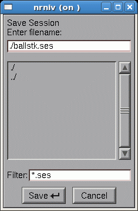

.. _cellbuilder_overview_and_hints:

CellBuilder Overview and Hints
==============================

The CellBuilder is a graphical tool for creating, editing, and managing models of nerve cells. It is probably most useful in two different settings.

1.
    Building a model from scratch that will have only a few sections. If you need more than 5 - 10 sections, it may be more convenient to write an algorithm that creates the model under program control.

2.
    Managing the biophysical properties of a model that is based on complex morphometric data, without having to write any code.

The CellBuilder breaks the process of creating and managing a model of a cell into tasks that are analogous to what you would do if you were writing a program in hoc or Python. They are

1.
    setting up the model's topology (branching pattern)

2.
    grouping sections into subsets. For example, it might make sense to group dendritic branches into subsets according to shared anatomical criteria (e.g. basilar, apical, oblique, spiny, aspiny), or biophysical criteria (passive, active).

3.
    assigning anatomical or biophysical properties to individual sections or subsets of sections

The CellBuilder can import a model that already exists during a NEURON session. It can also be used in conjunction with NEURON's Import3D tool to create new model cells based on detailed morphometric reconstructions.

.. _starting_the_cellbuilder:

Starting the CellBuilder
------------------------

Got to the working directory of your choice, start python, and enter the command

.. code::
    python

    from neuron import h, gui

The get a CellBuilder by selecting :menuselection:`NEURONMainMenu --> Build --> Cell Builder`

    **Aside:** Everything that can be done through the GUI can also be done from the command line. For example, we could have also opened a CellBuilder by:

    .. code::
        python

        h.load_file('celbild.hoc') # load the library
        h.makecellbuilder()

Either way, a new CellBuilder will appear:

.. image:: img/cellbuilderpic.gif
    :align: center

Using the CellBuilder
---------------------

Across the top of the CellBuilder there is a row of radio buttons, plus a checkbox labeled "Continuous Create". For now you should leave the checkbox empty.

Use the radio buttons to select the following pages.

**About**

Scan this information, but don't worry if everything isn't immediately obvious. You can reread it any time you want.

**Topology**

This is where you change the branching architecture of the cell.

Select "Make Section" from the list of actions, and then L click in the graph panel on a blank space to the right of the soma. Use the other actions as necessary to make your model look like the figure in this exercise.

**Subsets**

Subsets can simplify management of models that have many sections. The CellBuilder automatically creates the "all" subset, which contains every section in the model. There is no need to define subsets for the ball and stick model, so just skip this page.

**Geometry**

This is for setting the dimensions and spatial grid (nseg) of the soma and dendrite.

1.
    Make sure the Specify Strategy button is checked.

    Choose soma from the list of subsets and section names, and then select L, diam, and nseg.

    Repeat for dend.

2.
    Clear the Specify Strategy button.

    Use the list of section names to select the soma and dendrite individually, and enter the desired dimensions in the numeric fields for L and diam.

    For now leave nseg = 1.

**Biophysics**

Use this to endow the sections with biophysical properties (ionic currents, pumps, buffers etc.).

1.
    Specify Strategy. This is for inserting biophysical mechanisms into the sections of your model (Ra and cm for "all," hh for the soma, and pas for the dend section).

2.
    To examine and adjust the parameters of the mechanisms that you inserted, clear the Specify Strategy button.

**Management**

This panel is not used in the ball and stick exercise.

When you are done, the CellBuilder will contain a complete specification of your model cell. However, no sections will actually exist until you click on the CellBuilder's Continuous Create button.

**At this point you should turn Continuous Create ON** because many of NEURON's GUI tools require sections to exist before they can be used (e.g. the PointProcessManager).

Saving your work
----------------

This took a lot of effort and you don't want to have to do it again. So save the completed CellBuilder to a session file called ballstk.ses in the working directory :menuselection:`exercises --> cellbuilder`. To do this, click on
   
   :menuselection:`NEURONMainMenu --> File --> save session`

This brings up a file browser/selector panel. Click in the top field of this tool and type

ballstk.ses

as shown here

Then click on the Save button.

Checking what you saved
+++++++++++++++++++++++

Retrieve ballstk.ses by clicking on

   :menuselection:`NEURONMainMenu --> File --> load session`

and then clicking on ballstk.ses.

A new CellBuilder window called CellBuild[1] will appear. Since Continuous Create is ON, this new CellBuilder forces the creation of new sections that will replace any pre-existing sections that have the same names.

The terminal will display a message warning you that this happened:

.. code::
    python

    Previously existing soma[0] points to a section which is being deleted
    Previously existing dend[0] points to a section which is being deleted

Check Topology, Geometry, and Biophysics. When you are sure they are correct, exit NEURON.

Questions and answers about sessions and ses files
--------------------------------------------------

What's a session? What's a ses file good for? What's in a ses file? For answers to these and other questions about sessions and ses files, :ref:`read this. <saving_windows>`

.. toctree::
    :hidden:

    saving_windows.rst

