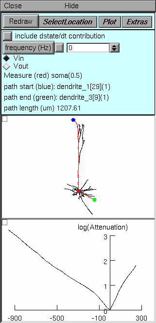
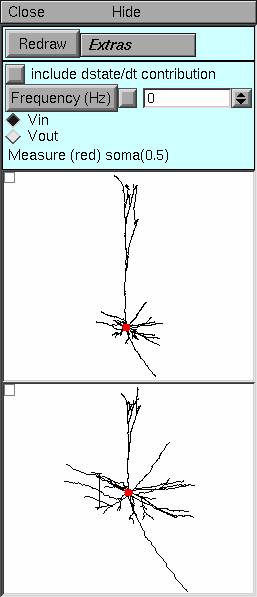

.. _electrotonic_analysis:

Electrotonic Analysis with NEURON
===============================

What's all this, then?
----------------------

NEURON has a powerful, convenient, and flexible set of tools that facilitate analysis of electrotonic architecture. These tools compute the following :

.. list-table:: 
   :header-rows: 0

   * - input impedance ZN
     - (local voltage change)/(local current injection)
   * - transfer impedance Zc
     -
        (local voltage change)/(remote current injection)

         equal to

        (remote voltage change)/(local current injection)
   * - voltage transfer ratio k
     -
       (voltage downstream)/(voltage upstream)

        Identical to current and charge transfer ratio in the opposite direction.
   * - voltage attenuation A
     -
       	(voltage upstream)/(voltage downstream)

        Identical to current and charge attenuation in the opposite direction.
   * - electrotonic distance L (see Note below)
     -
       natural log of A

These tools are based on the *electrotonic transformation* and their use led to the discovery of *passive normalization* (see :ref:`citations <citations>`).

    NOTE: The electrotonic distance computed by NEURON is defined by attenuation, but the classical definition is (anatomical distance/length constant). These two measures of electrotonic length are identical for an infinite cylindrical cable. However, the measure computed by NEURON always has a simple, direct relationship to attenuation, regardless of cellular anatomy, whereas the classical measure only has meaning in cells that meet several very specific constraints (such as the "3/2 power branching criterion"), and even then it does *not* have a simple relationship to attenuation. The new definition of electrotonic distance also preserves the direction-dependence of attenuation, which the classical definition obscures.

Exercises
---------

Start ``neurondemo`` and select the Pyramidal cell model. Examine the side view of the anatomy of the cell in the Shape plot. Rotate, zoom in, and check it out from different vantage points (if you have any questions, :ref:`here's how <working_with_shape_plots>`).

NEURON's tools for electrotonic analysis are gathered into four different "styles":

- :ref:`Frequency <frequency>`

- :ref:`Path <path>`

- :ref:`log(A) vs. X <log(A)_vs_x>`

- :ref:`Shape <electrotonic_shape_tool>`

They are accessible through :menuselection:`NEURON Main Menu --> Tools --> Impedance`. In this exercise you will start to learn how to use each of them. To save screen space, close a tool when you are done with it.

.. _frequency: 

The Frequency Tool
++++++++++++++++++

The Frequency tool can be used to study electrical coupling between any two points in a cell. Suppose an interesting signal is generated at some location in a neuron, e.g. by a synapse or by active conductances. An electrode is attached to the cell, but not necessarily where the signal is produced. The electrode may be used with a current clamp to inject current and record fluctuations in membrane potential Vm, or with a voltage clamp that records the clamp current Ic that is needed to regulate Vm.

This experimental situation brings several questions to mind, such as

1.
    How accurately does observed Vm reflect what is actually happening at the site where the signal is generated?

2.
    How does the location of a synapse or active conductance change its effect on Vm elsewhere in the cell?

3.
    If the cell is voltage clamped, what fraction of the current generated by the signal source will the clamp capture?

4.
    If current is injected through the electrode to change local Vm, how does this affect Vm at the site of the "interesting signal"?

5.
    What does frequency do to the spread of signals between two points?

Bring up the Frequency tool: :menuselection:`NEURON Main Menu --> Tools --> Impedance --> Frequency`

Top panel controls operation of the tool, and tells what is happening. Note particularly:

- Select Location enables the use of a mouse in the middle panel to change the sites of current injection and voltage measurement, or to swap these locations.

- Plot brings up a menu of items that can be plotted as functions of frequency

    - Log(Attenuation) plot natural log of voltage attenuation (shown here)
    - Zin and Ztransfer plot input or transfer impedance
    - Vmeasure/Vinject plots voltage transfer ratio, i.e. the reciprocal of voltage attenuation

Middle panel shows anatomy of the cell, indicating where current is injected (blue dot) and where Vm is measured (red dot). Zoom in or out as needed to see the whole cell.

Bottom panel in this example shows natural log of voltage attenuation from the injection site to the measurement site as a function of frequency over the range 0.1 to 1000 Hz. For most cells, attenuations at DC and 0.1 Hz are nearly identical.

Things to do:

1.
    Move the injection and measurement sites to different locations in the cell and Redraw.

2.
    What happens to attenuation when the injection and measurement sites are swapped?

3.
    How do Zin and Ztransfer vary with frequency and location in the cell?

4.
    Is Ztransfer sensitive to direction (swap the inject and measure sites to find out)? How does this differ from attenuation, and why?

.. _path:

The Path Tool
+++++++++++++

The Path tool is useful when the general location of the signal source is known, or when there are several independent signal sources at different locations. It performs the same kind of analyses that the Frequency tool does, but it allows the user to examine signaling between an electrode and a region instead of a specific location.

Bring up the Path tool: :menuselection:`NEURON Main Menu --> Tools --> Impedance --> Path`

Top panel. Note particularly

- The frequency field editor, which sets the frequency at which ln(A) is calculated.

- The Vin and Vout buttons, which specify the direction of signal flow relative to the electrode.

Middle panel. Click on the Shape Plot to set the location of the electrode (red dot), the path start (blue dot), and the path end (green dot). The direct path between the start and end is highlighted in red. Anatomical distance along this path is the independent variable against which analysis results of are plotted.

Bottom panel. For all points on the path, shows natural log(A) for voltage spreading toward (Vin) or away from (Vout) the electrode, according to the choice set in the Top panel. The path start is on the left of the horizontal axis, and the end is on the right. If the electrode is located on the path, this is the distance from the electrode in um; if the electrode is not on the path, this is the distance to the location on the path that is closest to the electrode.

Things to do:

1.
    Leave the measure location at the soma, and move the path start and end to the positions shown above.

2.
    Examine the spatial profile of voltage attenuation in the somatopetal (Vin) direction. Where does Vin attenuation increase most rapidly with distance (where is the plot steepest): along the apical path or along the basilar path?

3.
    Switch to the Vout (somatofugal) direction. What happens to the magnitude and spatial profile of attenuation? Now where does it increase most rapidly?

4.
    How does frequency affect attenuation in the Vout direction (compare 0 Hz and 30 Hz)? in the Vin direction?

5.
    What does membrane resistance do to attenuation? Bring up the "Distributed Mechanism/Manager/Homogeneous spec" window and use its MechType button to view the parameters of the passive mechanism.

    The axon of the cell, which has the hh mechanism but not the pas mechanism, should be black in the shape plot for this manager.

    Change g_pas from its default value of 0.0001 (Rm = 10000 ohm cm^2) to 0.00002 (Rm = 50000 ohm cm^2). Then press the Redraw button in the Path tool window. Does increasing Rm make attenuation more or less sensitive to frequency?

6.
    How does cytoplasmic resistivity affect attenuation? Notice the axial resistivity in the NEURON Main Panel. This should be 100 ohm cm. Try doubling or halving this value and see what happens to attenuation. Don't forget to press Redraw in the Path tool window.

.. _log(A)_vs_x:

The log(A) vs x tool
++++++++++++++++++++

This tool is the ultimate extension of the approach used by the Path tool: it shows the log of voltage attenuation for each point in the cell relative to the electrode or reference point.

Bring up the log(A) vs x tool: :menuselection:`NEURON Main Menu --> Tools --> Impedance --> log(A) vs x`

Top panel. The only significant difference from the Path tool is the button labeled Shape Select Action. This button enables two important operations in the Shape Plot (middle panel). The first is "Move electrode" which lets you move the electrode to a new location by clicking on a neurite. The second is "Show Position" which helps you discover the mapping from the Shape Plot to the log(A) vs x plot: click on a neurite to see both it and the corresponding line in the log A vs. x plot turn red. The bottom panel's graph menu has a "Show position" item that does the same thing in the opposite direction.

Middle panel. Since attenuation is computed over the entire cell, the only location the user specifies is the position of the electrode (red dot).

Bottom panel. For every section throughout the cell, this panel shows ln(A) for voltage spreading toward (Vin) or away from (Vout) the electrode. The abscissa is the distance in um along the direct path from the soma (not the electrode) to each point. To discover which neurite corresponds to a line in this graph, click on the menu box (square in upper left corner of this graph) and select the "show position" item. Then click on a line to see it and the corresponding neurite turn red.

Things to do:

Leave the electrode at the soma.

1.
    Which of the traces in the bottom panel correspond to the

    - basilar dendrites?
    - primary apical dendrite and its major branches?
    - distal apical tuft?
    - axon?

2.
    How does the plot change with frequency? g_pas? axial resistivity?

3.
    For the Vin direction, in what part of the cell does attenuation increase most rapidly with distance? What about the Vout direction?

Follow these steps to discover passive normalization for yourself!

1.
    Leave the electrode at the soma.

2.
    Switch the plot to voltage transfer (click on the Plot button and select the V(measure)/V(inject) item).

3.
    Click on the Vin radio button, then click on Redraw.

4.
    Use the bottom panel's View = plot so you can see the entire range of y values.

This graph now shows a plot of the somatic response to a 1 mV signal as a function of the distance between the soma and the location where the signal is being applied to the cell. If synapses were voltage sources, this is how the somatic PSP would vary as a function of synaptic location. Based on this result, you would expect synaptic efficacy to decline most rapidly with distance in the basilar dendrites.

But synapses aren't voltage sources. They're much more like current sources. In other words, a synapse would deliver nearly the same current to a neuron regardless of where it is attached to the cell. Therefore voltage transfer ratio in the Vin direction (from synapse to soma) does not predict the relationship between synaptic efficacy and synaptic location. Instead, the best predictor of synaptic efficacy is normalized transfer impedance. This is identical to the voltage transfer ratio in the *Vout* direction!

So just click on the *Vout* radio button and you see that a synapse attached to a basilar dendrite will produce nearly the same somatic PSP no matter how far it is from the soma! This is the phenomenon that David Jaffe and I call passive normalization : variation of somatic PSP amplitude with synaptic distance is reduced ("normalization"), and it doesn't require active currents to happen ("passive"). For more information, see our :ref:`paper <citations>`.

.. _electrotonic_shape_tool:

The Shape Tool
++++++++++++++

Perhaps the most intuitive representation of electrotonic architecture is to redraw the branched anatomy of the cell in a way that preserves the relative orientation of the branches, using line segments that are proportional to natural log(A) between adjacent points instead of the anatomical branch lengths. These *neuromorphic renderings* of the electrotonic transform warp the anatomy of the cell so that the proximity of points to each other is a direct indication of the degree of electrical coupling between them: tightly coupled points appear close to each other, and points that are electrically remote from each other are shown farther apart. The overall form of a neuromorphic figure parallels cellular anatomy, so it is easy to identify structural features of the cell, such as basilar or apical dendrites and particular dendritic segments or branch points.

Bring up the Shape tool: :menuselection:`NEURON Main Menu --> Tools --> Impedance --> Shape`

Top panel. The controls for the Shape tool are very simple. Because of the direct visual parallels between the Shape plot (middle panel) and the form of the neuromorphic rendering (bottom panel), there is no need for special functions to demonstrate the correspondence between lines in these two panels. There is no Plot button because there is no way to represent Zin or Ztransfer by changing branch lengths in the neuromorphic figure.

Middle panel. This shows the anatomy of the cell and the location of the electrode or reference point (red dot), as in the log(A) vs x style.

Bottom panel. This displays the neuromorphic rendering of one of the components of the electrotonic transform. The distance of a point from the site of the electrode is proportional to the natural logarithm of attenuation for voltage spreading toward (Vin) or away from (Vout) the electrode, according to the selection in the Top panel. The calibration bar represents one log unit of attenuation, i.e. the distance that signifies an e-fold decay of voltage.

Things to do:

Leave the electrode at the soma.

1.
    Examine the Vin and Vout transforms at 0 Hz. How does the overall electrotonic extent of the cell vary with direction of signal transfer? Which parts of the cell are responsible for most attenuation in the Vin transform (ignore the axon)? in the Vout transform?

2.
    Change the frequency to 1, 3, 10, 30, and 100 Hz. At what frequency do you first see a noticable increase of electrotonic extent? Does this frequency depend on the direction of signal transfer? Note: to ensure similar sensitivity for detecting relative changes in the Vin and Vout transforms, first apply View = plot at 0 Hz.

3.
    Move the reference point to different locations and see what happens to the Vin transform. Do the same for the Vout transform. Can you explain the effect of changing the reference point? Hint: see Fig. 2 in Carnevale et al. 1995.

.. _citations:

Carnevale, N.T., Tsai, K.Y., Claiborne, B.J., and Brown, T.H. The electrotonic transformation: a tool for relating neuronal form to function. In: Advances in Neural Information Processing Systems, vol. 7, edited by G. Tesauro, D.S. Touretzky, and T.K. Leen. Cambridge, MA: MIT Press, 1995, p. 69-76. `http://papers.nips.cc/paper/945-the-electrotonic-transformation-a-tool-for-relating-neuronal-form-to-function.pdf <https://proceedings.neurips.cc/paper/1994/file/4b6538a44a1dfdc2b83477cd76dee98e-Paper.pdf>`_

Jaffe, D.B. and Carnevale, N.T. Passive normalization of synaptic integration influenced by dendritic architecture. Journal of Neurophysiology 82:3268-3285, 1999. `doi:10.1152/jn.1999.82.6.3268 <https://journals.physiology.org/doi/full/10.1152/jn.1999.82.6.3268>`_

.. toctree::
    :hidden:

    working_with_shape_plots.rst

