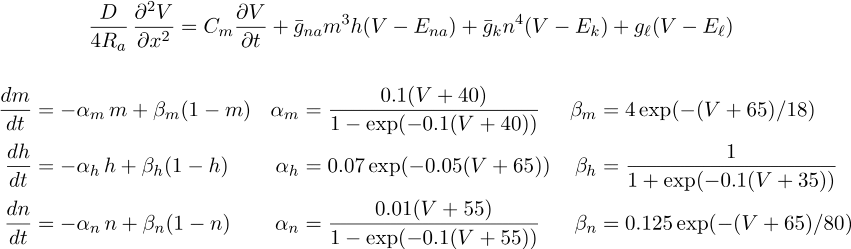

.. _interactive_modeling:

Interactive Modeling
====================

Physical System
---------------

Giant axon from the squid: Loligo pealei

Conceptual Model
----------------

Hodgkin-Huxley cable equations
++++++++++++++++++++++++++++++

Simulation
----------

Computational implementation of the conceptual model
++++++++++++++++++++++++++++++++++++++++++++++++++++

We *could* implement this model in Python:

.. code::
    python

    from neuron import h, gui

    axon = h.Section(name='axon')
    axon.L = 2e4
    axon.diam = 100
    axon.nseg = 43
    axon.insert(h.hh)

**But** for this exercise, let's instead use the CellBuilder tool to create the model:

Save the model in ``hhaxon.ses`` using :menuselection:`NEURONMainMenu --> File --> savesession`

Using the computational model
+++++++++++++++++++++++++++++

If starting from a fresh launch of python, you can load the saved ses file by loading NEURON and its GUI: ``from neuron import h. gui`` and then selecting :menuselection:`NEURONMainMenu --> File --> loadsession`

Alternatively you can use NEURON to execute ``hhaxon.ses``

1. Change to the appropriate directory in your terminal

2. Start python, and at the >>> prompt enter the commands

.. code::
    python

    from neuron import h, gui
    h.load_file('hhaxon.ses')

Exercises
---------

1. 
    Stimulate with current pulse and see a propagated action potential.

    The basic tools you'll need from the :ref:`NEURON Main Menu <NEURONMainMenu>`

    :menuselection:`Tools --> Point Processes --> Manager -->` :ref:`Point Manager <pointman>` to specify stimulation

    :menuselection:`Graph -->` :ref:`Voltage axis <voltage_axis>` and :menuselection:`Graph -->` :ref:`Shape plot <shape_plot>` to create graphs of v vs t and v vs x.

    :menuselection:`Tools -->` :ref:`RunControl <runctrl>` to run the simulation

    :menuselection:`Tools --> Movie Run` to see a smooth evolution of the space plot in time

2. 
    Change excitability by adjusting sodium channel density.

    Tool needed: :menuselection:`Tools --> Distributed Mechanisms --> Viewers -->` :ref:`Shape Name <shapename>`

3. 
    Use two current electrodes to stimulate both ends at the same time
    

4. 
    Up to this point, the model has used a very fine spatial grid calculated from the Cell Builder's d_lambda rule

    .. image:: img/geometry.gif
      :align: center

    Change nseg to 15 and see what happens
