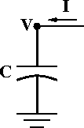

.. _intro_to_gui:

Introduction to the GUI
=======================

Physical System
---------------
An electrolyte-containing vesicle with a lipid bilayer membrane that has no ion channels.

Conceptual Model
~~~~~~~~~~~~~~~~

A capacitor

Simulation
~~~~~~~~~~

Computational implementation of the conceptual model
++++++++++++++++++++++++++++++++++++++++++++++++++++

We're going to use the CellBuilder to make a cell that has surface area = 100 um2 and no ion channels.

Alternatively, we could do this in HOC

.. code:: 
    c++

    create soma
    . . . plus more code . . .

or in Python

.. code::
    python

    from neuron import h

    soma = h.Section(name='soma')
    # . . . plus more code . . .

1. 
    **Start in whatever directory you want to use for this exercise**

    Open a terminal or console (users of Windows versions prior to Windows 10 Anniversary Edition may prefer to use the bash shell in the NEURON program group), then change to that directory via e.g.

        ``cd path_to_your_Desktop/course/intro_to_gui``

2. 
    **Launch python**

        ``python``

3. 
    **Make Python load NEURON's h and gui models by entering this command at the >>> prompt:**

.. code::
    python

    from neuron import h, gui

4. 
    **Get a CellBuilder**

        :menuselection:`Main Menu --> Build --> CellBuilder`

        .. image:: img/cellbuilder.png
            :align: center

5. **Specify surface area**

:menuselection:`CellBuilder --> geometry`

Make sure there is a check mark in the "Specify Strategy" box.

Select "area".

Click on "Specify Strategy" to clear the check mark.

Make sure that area is 100 um^2. 

6. 
    **Click on "Continuous Create" box so that a check mark appears in it.**

        .. image:: img/continuouscreate.png
            :align: center

Congratulations! You now have a model cell with a soma that has surface area = 100 um^2. 

**Save this to a "session file" so you can recreate it whenever you like.**

:menuselection:`NEURON Main Menu --> File --> save session`

Using the computational model
++++++++++++++++++++++++++++++++++++++++++++++++++++

You'll need these items:

- controls for running simulations
- a graph that shows somatic membrane potential v. time
- a current clamp to inject a current pulse into the model cell
- a graph that shows the stimulus current vs. time

*Be sure to save your work to a session file as you go along!*

**Make a RunControl panel for launching simulations.**

:menuselection:`Neuron Main Menu (NMM) --> Tools --> RunControl`

    .. image:: img/runcontrol.png
        :align: center

**Make a graph that shows somatic membrane potential vs. time**

:menuselection:`NMM --> Graph --> Voltage axis`

    .. image:: img/voltageaxis.png
        :align: center

Now run a simulation by clicking on RunControl's "Init & Run". What happened?

**Make a current clamp.**

:menuselection:`NMM --> Tools --> Point Processes --> Managers --> Point Manager`

    .. image:: img/pointmanager.png
        :align: center

Make this an IClamp.

    :menuselection:`PointProcessManager --> SelectPointProcess --> IClamp`

Show the IClamp's Parameters panel

    :menuselection:`PPM --> Show --> Parameters`

Make it deliver a 1 nA x 1 ms current pulse that starts at 1 ms.

    del (ms) = 1

    dur (ms) = 1

    amp (nA) = 1

**Make a graph that shows the stimulus current vs. time.**

:menuselection:`NMM --> Graph --> Current axis`

    .. image:: img/currentaxis.png
        :align: center

Make it show the IClamp's i

- Click on the graph's menu button (left upper corner of its canvas) and select "Plot what?"
-  :menuselection:`Plot what? --> Show --> Objects`
- Select IClamp (left panel)
- Select 0 (middle panel)
- Select i (middle panel)
- Plot what?'s edit field should now contain IClamp[0].i
- Click on Accept

Run a simulation.

Too big? Divide IClamp.amp by 10 and try again.

    .. image:: img/iclampamptryagain.png
        :align: center

Exercises
~~~~~~~~~~

1. 
    **Run a simulation.**

Double the duration and halve the amplitude of the injected current (injected charge is constant).

Notes:

- Select :menuselection:`Show --> Parameters` in the PointProcessManager window to view the field editors.
- Multiplying a field editor value by 2 can be done by typing ``*2`` <return> at the end of the value. Divide by typing ``/2`` <return>.
- The mouse cursor must be in the panel that contains the field editor.

Return the duration and amplitude to their default values (click in the checkmark box with left mouse button).

Halve the duration and double the amplitude. 

2. 
    **Insert passive conductance channels, then see ow this affects the model.**

    In the CellBuilder, click on the Biophysics radio button.

    Make sure there is a check mark in the "Specify Strategy" box.

    Click on the "pas" button so that it shows a check mark.

    .. image:: img/passiveconductancechannel.png
        :align: center

    Now repeat exercise 1.

    Notice that v tends toward -70 mV, which is the default reversal for the passive channel. This is because the initial condition v = -65 is not the steady state for this model.

    In the "RunControl" set the Init field editor to -70 and repeat the run.

    To rescale a Graph automatically, click on its menu box (square in upper left corner of its canvas) and select "View=Plot"
    
3. 
    **Change the stimulus amplitude to 1A (1e9 nA) and run. Rescale the graphs to see the result.**

    This is an example of a model that is a poor representation of the physical system.

4. 
    **Change the stimulus duration to 0.01 ms.**

    This is an example of a simulation that is a poor representation of the model.

    Change the number of Points plotted/ms to 100 and dt to 0.01 ms and run again.

5. 
    **Increase the amplitude to 1e4 nA, cut the duration to 1e-5 ms, increase Points plotted/ms to 1e5, and start a simulation...**

    After a few seconds of eternity, stop the simulation by clicking on RunControl / stop

    Bring up a Variable Time Step tool.

    :menuselection:`NMM --> Tools --> VariableStepControl`

    .. image:: img/variablestepcontrol.png
        :align: center

    Select "Use variable dt" and try again.

    When you're done, use :menuselection:`NMM --> File --> Quit` to exit NEURON

    A final word
    ++++++++++++++++++++++++++++++++++++++++++++++++++++

    :download:`bilayer.hoc <code/bilayer.hoc>` contains a properly configured CellBuilder, plus a custom interface for running simulations. The one item it doesn't have is a VariableStepControl. 

    :download:`bilayer.hoc <code/bilayer.hoc>` is actually a session file that was given the "hoc" extension so that MSWin users could launch it by double clicking on the file name. For didactic reasons we prefer that you load it from Python instead.

    1. 
        Save :download:`bilayer.hoc <code/bilayer.hoc>` to your machine, open up in a terminal, then cd to the directory that contains bilayer.hoc
    
    2.
        Launch Python from the command line.

    3.
        At the >>> prompt enter the commands

    .. code::
        python

        from neuron import h, gui

        h.load_file('bilayer.hoc')

