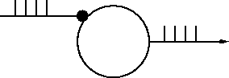

.. _intro_to_the_network_builder:

Introduction to the Network Builder
===================================

The Network Builder tools are principally of didactic value, in that the graphical creation of simple networks can generate "readable" hoc code which in turn embodies our notion of a fairly flexible programming style for construction of more complicated networks.

Model
-----

Artificial Integrate and Fire cell stimulated by a burst of action potentials. This is a "hello world" level exercise that shows how to use the Network Builder and supporting tools to create artificial cell types, use those types to create cell objects, and connect the cell objects together. A subsequent exercise discusses how to create network ready cell types from more complicated cells specified by the cell builder.

Simulation
----------

The strategy is to

1.
    Define the types of cells (and stimulators)

2.
    Create each cell in the network

3.
    Connect the cells together

4.
    Specify parameters such as delays and connection weights

5.
    Run a simulation and plot the input and output spike trains 

If you have trouble with the following instructions, :download:`this executes a working exercise <code/net1run.hoc.txt>`. 

Define artificial cell types
++++++++++++++++++++++++++++

:ref:`What is an artificial cell in NEURON? <artificial_cells_neuron>`

Start an ArtCellGUI tool by selecting the menu item: :menuselection:`NEURONMainMenu --> Build --> NetworkCell --> ArtificialCell`

Create a "C" type via a :menuselection:`New --> IntFire1` followed by a Rename. This type will be used to create our model cell.

Create an "S" type via a :menuselection:`New --> NetStim` followed by a Rename. We will use this type later on to create a stimulator. The interval and number parameters should be set to 10 and 10 respectively.

The interface should now look something like this

Cell creation
+++++++++++++

Start a NetGUI tool by selecting the menu item: :menuselection:`NEURONMainMenu --> Build --> NetworkBuilder`

The NetGUI instance should have its "Locate" radiobutton selected.

Drag an "S" into the middle of the canvas. This creates an "S0". The text in the canvas explains what is happening during dragging.

Drag a "C" into the canvas. This creates a "C1".

The NetGUI window should now look something like this

.. image::
    img/net1cre.gif
    :align: center

but won't have the explanatory text in the canvas unless you just selected the "Locate" radio button.

Note that cells are indexed according to the order of creation starting at 0. Dragging a created cell off the canvas destroys it (and reduces the indices of cells greater than that index by 1. That is, the largest index is total number of cells - 1. Dragging a new cell onto an existing cell replaces the existing cell and its index is unchanged. Currently, replacing a cell destroys all the connections to that cell -- possibly the wrong gui behavior when cells have only one possible input connection point.

At this point, what you see in the NetworkBuilder is just a specification and the cells don't yet exist. The pointprocesses aren't created (and therefore the network can't be simulated) until the "Create" button is pressed. After "Create" is pressed, no new cell type can be added to the NetGUI. Within the confines of the existing types, any number of cells can be created or destroyed along with their connections and the "real (simulatable)" network will be constantly updated to reflect the NetGUI specification.

It is a good idea to save the NetGUI tool often (or at least if substantial effort has gone into changing it since it was last saved).

Connections 
+++++++++++

In the NetGUI window, select the ":menuselection:`Src --> Tar`" radiobutton and drag a line from S0 to C1.

Use the "Weights" button to pop up a NetEdgeGUI panel. With this panel, selecting an item on the left list places the number in the field editor. Selecting an item in the right list assigns the field editor value to its connection weight. This makes it convenient to assign the same weight to a subset of connections.

Enter "2" into the field editor.

Click on the right list item labeled "S0->C1 0". The label should change to "S0->C1 2". This weight is large enough so that every input event (from S0) should elicit an output event from C1

The NetGUI and NetEdgeGUI windows should now look something like this

Simulation
++++++++++

In the NetGUI window, press the "Create" button.

Press the "SpikePlot" button to pop up a plot window.

Start a :menuselection:`NEURONMainMenu --> Tools --> RunControl` and VariableStepControl. Set TStop to 1000 and invoke "Use variable dt"

Do an Init&Run. You should see spikes in the SpikePlot graph.

The relevant windows should now look something like this

Compare the discrete event simulation run time with the fixed step method ("Use variable dt" turned off).

Other Simulation Exercises
++++++++++++++++++++++++++

Reduce the fast interspike interval of the stimulus to 2 ms. Why are spikes missing from the C1 output?

For the remaining exercises, set the fast interspike interval back to 10.

For the C cell type, set the integration time constant to 100 ms and set the input connection weight to 0.2 . Observe the output spike train and its relation to the input train.

Plot the value of the state variable ``m`` in the :class:`IntFire1` pointprocess that implements the C1 cell. Why does ``m`` remain constant between events instead of decaying exponentially (even with the fixed time step)?

Note: The "ShowCellMap" button in the NetGUI panel helps identify the actual ``C_IntFire1`` object instance that contains the "pp" public object reference to the actual :class:`IntFire1` point process object instance (which is located in the dummy section, ``acell_home_``) .

The automatically generated hoc code
++++++++++++++++++++++++++++++++++++

It's one thing to manage a few cells and connections, quite another to manage thousands. Some help in this task is provided by functions that return various kinds of :class:`NetCon` lists, e. g. all the ``NetCons`` that connect to the same postcell, post synaptic point process, precell, etc. However, at this time there are no generic gui tools to view or manage large networks and it is necessary to craft viewing, control, and management routines based on the details of the particular network being investigated.

Specifying large networks practically requires interpreter programming and this in turn requires familiarity with a programming style suitable for conceptual control of such networks. The hoc code generated by the NetGUI tool for small networks can be used as a basic pattern and a large part of it re-used for the construction of larger networks involving procedural specification of network architecture with random connections, weights, etc. Certainly the cell types are re-usable as is and without change. Those of you with an interest in networks that are beyond the scope of the current NetGUI tool should save the above NetGUI specification as a hoc file and look at it with an editor. Hoc files are constructed using the "Hoc File" button in the NetGUI window. The ideas involving cell templates, the cell creation procedure (cell_append), and the connection procedure (nc_append) have wide applicability.

Cell templates are probably essential programming practice with regard to simulation of large numbers of non-artificial cells. Each template has a position procedure to set the 3-d location of the cell and public position coordinates x, y, z. The connect2target function creates a NetCon with "this" as the source, and the first objref argument as the target.

The hoc file for the above spec looks like :download:`this <code/net1spec.ho.txt>`.

.. toctree::
    :hidden:

    artificial_cells_neuron.rst
