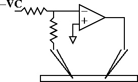
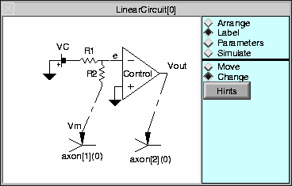
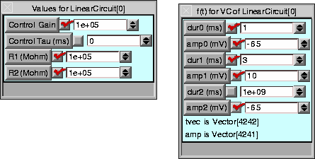
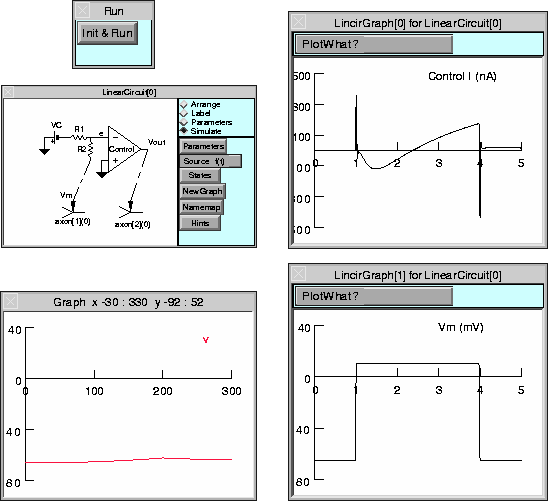

.. _introduction_to_the_linear_circuit:

Introduction to the Linear Circuit Builder
==========================================

The linear circuit builder is a graphical interface for electrical circuits consisting of idealized resistors, capacitors, and first order operational amplifiers. Circuits may have intra- and extra-cellular connections to cells at multiple locations. Batteries and current sources use a 3 step protocol similar to the IClamp.

During a simulation, the voltages at each circuit node and the currents through each battery and op amp are computed along with the voltage and state variables of each cable section. At present, simulation runs can only use the default implicit fixed time step method (don't use cvode).

Linear circuits are simulated as a specific instance of the more general :class:`LinearMechanism` class. This latter class allows NEURON to transcend its historical limitation to tree structure and allows simulation of arbitrary extracellular fields and low resistance gap junctions. Unfortunately this generality comes at a significant performance cost. In the worst case (gap junctions connecting every compartment to every compartment) the simulation time for gaussian elimination increases from order N to order N^3. A single gap junction between two cells does not increase the gaussian elimination time. But a gap junction connecting one end of a cable to the other end doubles the gaussian elimination time.

Physical System
---------------

Two electrode Voltage clamp of an HH axon.

Model
-----

Ideal voltage clamp of axon containing standard hh channels. The axon is 300 um long and 10 um in diameter. Ra=35 ohm-cm. The ideal voltage recording electrode is 100 um from the left and the ideal current injection electrode is 100 um from the right.

At least a plausible case can be made for how the voltage clamp circuit works by realizing that the input to the high gain amplifier can only be 0 volts if (assuming the resistors are equal) the membrane potential of the recording electrode is equal to VC. If it is less than VC then the input will be negative and the op amp will produce a high voltage output thus injecting current into the cell and causing the membrane potential to increase toward VC. Whether this circuit will be stable remains to be seen.

Simulation
----------

1.
    Use the cellbuilder to create the HH axon. This axon should be in three pieces each 100 um long so that regardless of the values of nseg, the electrodes can be placed precisely at 100 and 200 microns.

A working example: :download:`axon.hoc <code/axon.hoc>`

2. 
    Arrange components to define the structure of an ideal voltage clamp circuit using the Linear Circuit Builder. When arranged and labeled, the Linear Circuit Builder should look like

:ref:`Construction hints <building_and_labeling_a_two_electrode>`

Notice that the battery has its negative terminal connected to R1 so that Vm will have the same sign as VC.

3.
    Set the parameters of the circuit. R1 and R2 should have the same value and be large so that not much current goes through the recording electrode to change the membrane potential. The Control amplifier gain should be large so that e can be a good virtual ground. Set the battery pulse currents to start at rest (-65 mV), jump to 10mV at 2 ms for 3 ms and then return to rest

Simulate the circuit and plot the Control current and Vm. Also show a space plot of the entire cable.

A completed example: :download:`lincir1.hoc <code/lincir1.hoc>`

.. toctree::
    :hidden:

    building_and_labeling_a_two_electrod.rst

