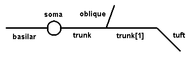

.. _managing_models_on_the_fly:

Managing Models on the Fly
==========================

If the CellBuilder's Continuous Create button is checked, changes are passed from the CellBuilder to the interpreter as they occur. This means that you can immediately explore the effects of anything you do with the CellBuilder.

To see how this works, try the following.

1.
    Start NEURON with its standard GUI in the exercises/cellbuilder directory (:ref:`remember how? <starting_the_cellbuilder>`).

2.
    Bring up the CellBuilder and construct a cell that looks like this:

Use any anatomical and biophysical properties you like; these might be interesting to start with:

.. list-table:: 
   :header-rows: 0

   * - Section
     - L (um)
     - 
        diam (um)
   * - soma
     - 30
     -
        30
    
   * - trunk
     - 400
     -
        3
    
   * - trunk [1]
     - 400
     -
        2

    * - oblique
     - 300
     -
        1.5
    
    * - tuft
     - 300
     -
        1
    
    * - basilar
     - 300
     -
        3

UNFINISHED