.. _network_ready_cells_from_the_cellbuilder:

Network ready cells from the CellBuilder
========================================

Model
-----

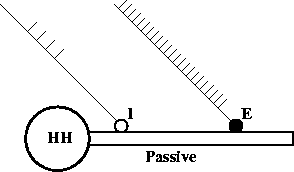

Ball-Stick model cell with distal excitation and proximal inhibition. This is another "hello world" level exercise. It shows how to use the a specification from a cell builder to create a network ready cell (spike initiation site and a set of synapses) from a NetReadyCellGUI. It shows how to use these cell types in a NetGUI to make connections between spike initiation sites and synapses.

Simulation
----------

The strategy is to

1.
    Use a CellBuilder window to create a cell type with specific morphology and membrane properties. The CellBuilder also specifies the type name and the spike initiation site.

2.
    Define synapse types with a SynTypeGUI. E.g. inhibitory and excitatory synapses from suitable PointProcesses.

3.
    Define a network ready cell type with a NetReadyCellGUI. I.e. specify where instances of the synapse types should be located on the cell. The NetReadyCellGUI references a CellBuilder to obtain the basic cell morphology and membrane properties. It references a SynTypeGUI which is used to obtain the synapse types.

4.
    Use a NetGUI to construct the network

5.
    Run a simulation and plot the input and output spike trains. If you have trouble with the following instructions, :download:`this executes a working exercise <code/net2run.hoc>` --- the NetReadyCellGUI (for the ball stick cell) and ArtCellGUI (for the stimulators) are in the "cell types" window group.

Ball-Stick cell model
+++++++++++++++++++++

Start with the ball-stick specification in :menuselection:`exercises --> continuous_simulations_of_nets --> start.ses`. This model has

.. list-table:: 
   :header-rows: 1

   * - Soma area
     - Dendrite
     - Ra
     - cm
   * - 500 um2 with hh channels (standard density)
     -
       L = 200 um, diam = 1 um with pas channel ( g_pas = .001 S/um2 and e_pas = -65 mV )
     - 100 ohm-cm
     - 
       1 uF/cm^2
   

and uses d_lambda=.1 compartmentalization policy.

From the CellBuild Management/CellType panel, the classname should be declared as "BallStick" and the output variable which is watched for spike event should be soma.v(1). At this point the windows should look something like this

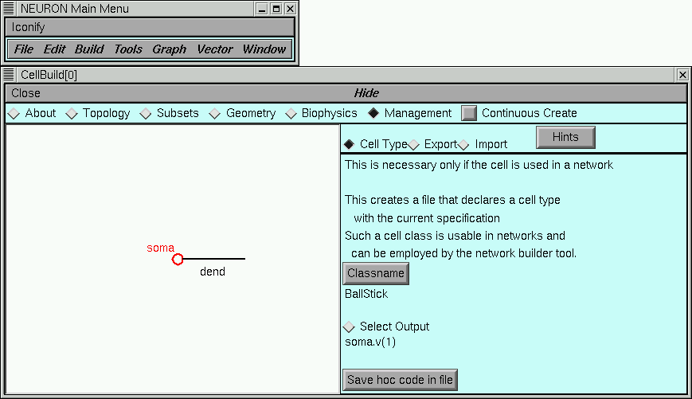

Ball-Stick cell model with synapses
+++++++++++++++++++++

The :menuselection:`NEURONMainMenu --> Build --> NetworkCell --> FromCellBuilder` menu item starts a dialog box which requests references to a "Synapse type set" (left list) and a "CellBuild type" (right list). The synapse type set list is empty now but the CellBuild type list should have a reference to the cell builder previously loaded. Select "CellBuild[0]" and press the "Use Selection" button.

This starts a NetReadyCellGUI window (nrc) and a SynTypeGUI window. (It would have also started a new CellBuild window as well if no CellBuild type had been selected in the dialog). Note that the nrc contains a drawing of the cell topology. At this time you can close the CellBuild window --- It can always be re-created with the nrc's Info menu. In fact, when saving the nrc in a session, it is best to first close both the cell builder and the SynTypeGUI to avoid saving duplicate copies in the session file. After closing the CellBuild[0] window the interface should look something like this

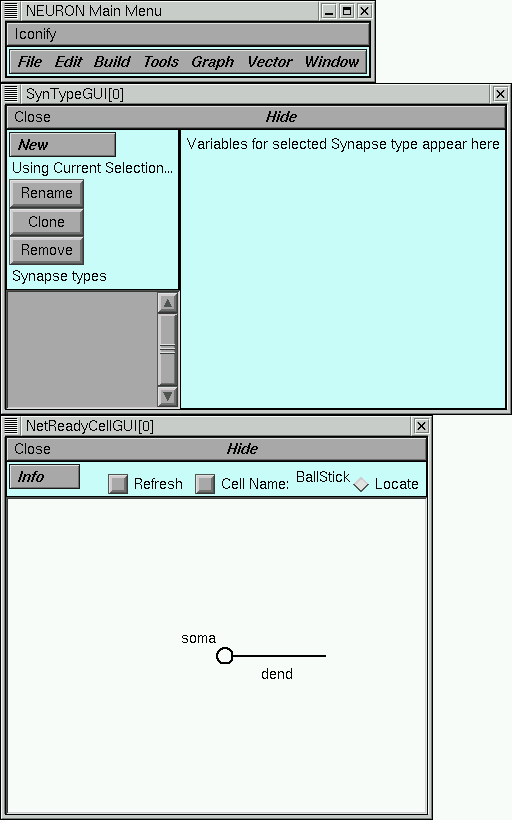

From the SynTypeGUI window, create a "E" synapse type via a :menuselection:`New --> ExpSyn` followed by a Rename. Since the reversal potential for the standard `ExpSyn <https://nrn.readthedocs.io/en/latest/hoc/modelspec/programmatic/mechanisms/mech.html?highlight=expsyn#ExpSyn>`_ is 0 mV, it is already excitatory. However, change the time constant from 0.1 to 2 ms.

In the same SynTypeGUI window create a "I" synapse type via a :menuselection:`New --> ExpSyn` followed by a Rename. Set the reversal potential "e" to -80 mV so that it will be inhibitory and set tau to 5ms.

In the NetReadyCellGUI, press the Refresh button so that the new SynTypes appear.

Change the cell name to "B" so the label won't take up so much space later on when we use it in a NetGUI tool.

In the NetReadyCellGUI, press the "Locate" radiobutton and drag an E to location 0.8 on the dendrite. Then drag an I to location 0.1 on the dendrite. The label in the canvas will show whether the synapse type is close enough to be attached or not. Each synapse on the cell is given an index which is the order of creation. Several synapses can be attached to the same location. The synapse label can be dragged up to two font sizes above or below the location to avoid label overlap. If a label is dragged too far away from the cell it will become detached and the larger synapse indices will be reduced by 1. The interface at this point should look something like this

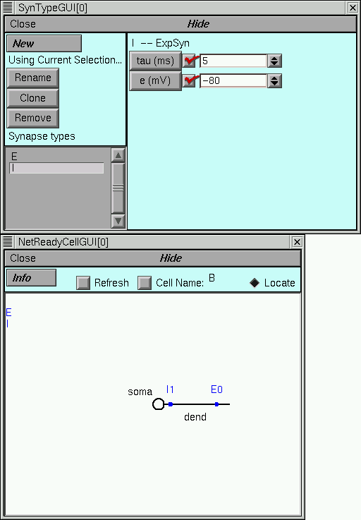

Enough work has been done up to this point so that you should save the NetReadyCellGUI in a session by itself (without the CellBuild or SynTypeGUI windows -- these may safely be closed as well).

This cell type is now ready for use in the NetGUI.

Stimulators 
+++++++++++

In analogy with the previous hands-on exercise create two stimulus types, "SE" and "SI" to provide event streams to stimulate the ball-stick model.

For SE, set interval=5 , number=50 , and start=0.

For SI, set interval=10, number=5, and start=20.

I.e. from :menuselection:`NEURONMainMenu --> Build --> NetworkCell --> ArtificialCell` get an ArtCellGUI and use NetStim to define the stimulus types. After setting it up the window will look something like this

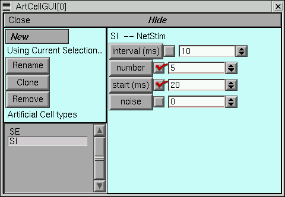

At this point I created a Window Group called "cell types," placed the ArtCellGUI and NetReadyCellGUI in it, and saved the group. In case things go wrong I can easily return to this point.

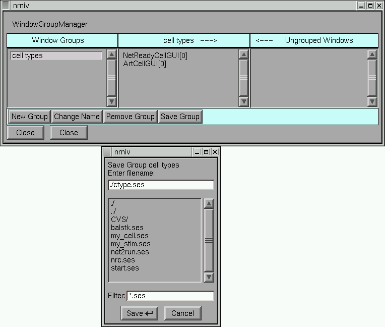

Cell creation
+++++++++++++

Start a NetGUI tool and create a "B0" ball-stick cell and "SE1" and "SI2" stimulators as shown in this picture

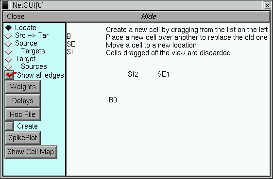

Connections 
+++++++++++

In the NetGUI window, select the "Src->Tar" radiobutton and drag a line from SE1 to B0. The string near the top of the canvas describes the operation to be performed when the mouse button is released. When the connection line gets near B0 a picture of the BallStick topology will be drawn and the mouse should be moved to the E0 synapse label. The following three figures illustrate the process.

Select the source cell
~~~~~~~~~~~

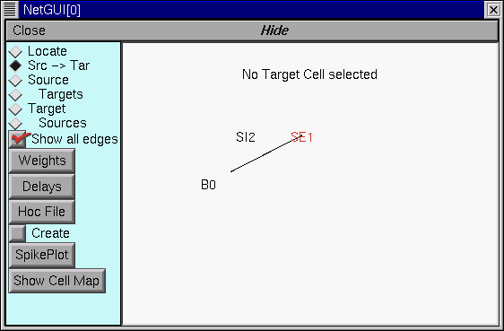

Select the target cell
~~~~~~~~~~~~

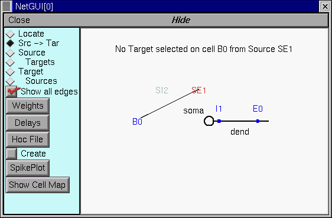

Select the synapse on the target cell
~~~~~~~~~~~~~~~

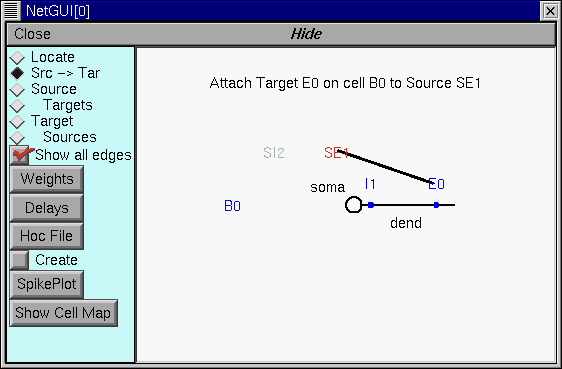

Connect SI1 to I1 of B0

The NetGUI window should now look something like this

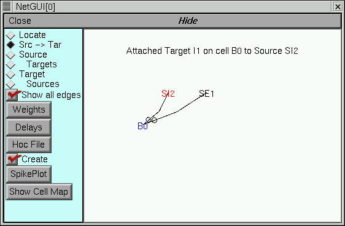

Use the "Weights" button to pop up a NetEdgeGUI panel and enter the following weights.

.. image::
    img/net2wt.gif
    :align: center

Simulation 
++++++++++

In the NetGUI window, press the "Create" button. The :hoc:func:`topology()` statement should produce

.. code::

    oc>topology()

    |-|       acell_home_(0-1)
    |-|       B_BallStick[0].soma(0-1)
    `------|       B_BallStick[0].dend(0-1)

            1 
    oc>

Press the "SpikePlot" button to pop up a plot window.

Start a :menuselection:`NEURONMainMenu --> Tools --> RunControl` and VariableStepControl. Set TStop to 500 and invoke "Use variable dt"

Get a voltage style graph window and plot the soma voltage for the ball-stick cell. The ShowCellMap button on the NetGUI is useful here. The relevant interface looks something like this

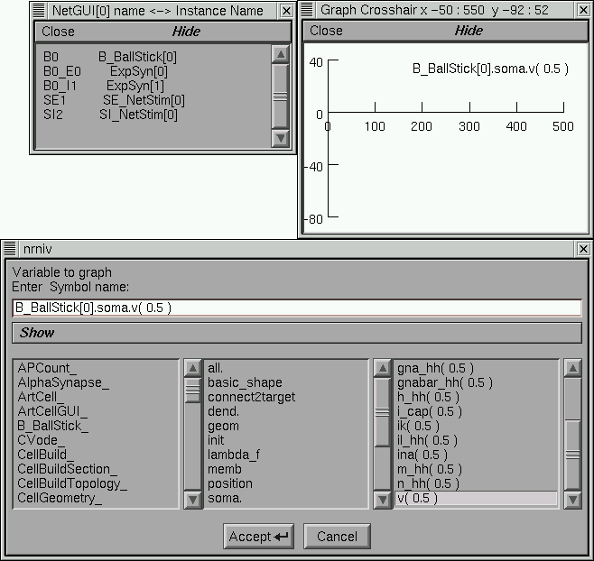

Do an Init & Run.

The relevant windows should now look something like this

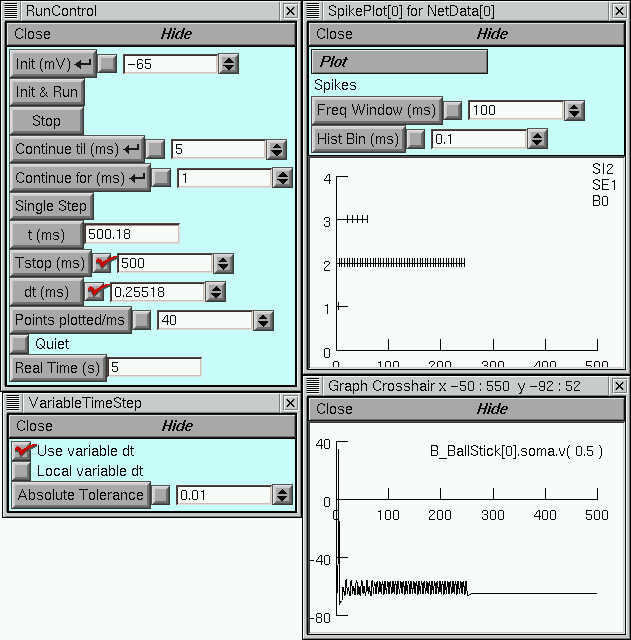

Other Simulation Exercises
++++++++++++++++++++++++

Plot the value of the conductance and current of the inhibitory synapse.

The automatically generated hoc code
+++++++++++++++++++++

The hoc file for the above spec looks like :download:`this <code/net2spec.ho.txt>`.
