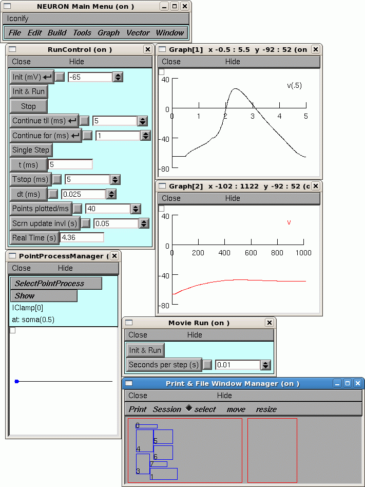

.. _saving_windows:

Saving Windows
==============

Saving the windows of an interface for later re-use is an essential operation. The position, size, and contents of all the windows you have constructed often represent a great deal of labor that you don't want to do over again. Losing a CellBuilder or Multiple Run Fitter window can be painful.

This article explains how to save windows, how to save them in groups in separate files in order to keep separate the ideas of specification, control, graphing, optimization, etc, and how to recover as much work as possible if a saved window generates an error when it is read from a file.

What is a session?
------------------

We call the set of windows, including the ones that are hidden, a "session". The simplest way to save the windows is to save them all at once with :menuselection:`NEURONMainMenu --> File --> save session`. This creates a session file, which NEURON can use to recreate the windows that were saved. Session files are discussed below.

When (and how) to save all windows to a ses file
------------------------------------------------

Near the beginning of a project it's an excellent practice to save the entire session in a temporary file whenever a crash (losing all the work since the previous save) would cause distress.

Do this with :menuselection:`NEURONMainMenu --> File --> save session`. Be sure to verify that the session file can be retrieved (:menuselection:`NEURONMainMenu --> File --> load session`) before you overwrite an earlier working session file!

It is most useful to retrieve such a session file right after launching NEURON, when no other windows are present on the screen. It is especially useful if one of the windows is a CellBuild or NetGUI ("Network Builder"), because most windows depend on the existence of information declared by them. Conflicts can arise if there are multiple CellBuild or NetGui windows that could interfere with one another, especially if they create sections with the same names.

When (and how) to save selected windows
---------------------------------------

For small modeling tasks, it is most convenient to save all windows to a single session file. The main drawback to saving all windows in a single session file is that it mixes specification, control, parameter, and graphing windows.

For more complex modeling tasks, it may be necessary to have more control over what groups of windows are created. This allows you to easily start a simulation by retrieving the desired variant of a CellBuilder window, separately retrieving one of several possible stimulus protocols and parameter sets, and lastly retrieving groups of graph windows.

.. _print_and_file_window_manager:

The Print & File Window Manager (PFWM)
++++++++++++++++++++++++++++++++++++++

The PFWM has many useful features, especially saving session files, unhiding hidden windows, printing hard copy, and generating PostScript and ASCII (plain text) output files. This discussion focusses on how to use it to save selected windows to a session file.

To bring up the PFWM, click on

   :menuselection:`NEURONMainMenu --> Window --> Print & File Window Manager`

The figure above contains several NEURON windows, with a PFWM in the lower right corner. Notice the two red boxes in the bottom panel of the PFWM. The box on the left is a virtual display of the computer monitor: each of the blue rectangles corresponds to one of NEURON's windows. The relative positions and sizes of these rectangles represent the arrangement of the windows on the monitor.

The toolbar just above the red boxes contains two menu items (Print, Session), and three radio buttons (select, move, resize) that help you use the PFWM. The radio buttons set the "mode" of the PFWM, i.e. they determine what happens when you click on the blue rectangles. When the PFWM first comes up, it is in select mode and the radio button next to the word "select" is highlighted.

How to select and deselect windows

First make sure the PFWM is in select mode. If it isn't, click on "select" in the toolbar.

Decide which of the rectangles in the virtual display correspond to the windows you want to save to a ses file. If you aren't sure which blue rectangle goes with which window, drag a window on your screen to a new location, and see which rectangle moves.

When you have decided, click inside the desired rectangle in the virtual display, and a new blue rectangle, labeled with the same number, will appear in the PFWM to the right of the virtual screen. You can select as many windows as you like. To deselect a window, just click inside the corresponding blue rectangle on the right hand side of the PFWM.

Saving the selected windows

To save the selected windows, click on

:menuselection:`Session --> Save selected`

in the PFWM, and use the file :menuselection:`browser --> selector` panel to specify the name of the ses file that is to be created.

What's in a ses file
--------------------

A session file is actually just a sequence of hoc instructions for reconstructing the windows that have been saved to it. Session files are generally given the suffix ".ses" to distinguish them from user-written hoc files.

In a session file, the instructions for each window are identified by comments. It is often easy to use a text editor to modify those instructions, e.g. change the value of a parameter, or to remove all the instructions for a window if it is preventing the ses file from being loaded.

What can go wrong, and how to fix it
------------------------------------

The most common reason for an error during retrieval of a session file is when variables used by the window have not yet been defined. Thus, retrieving a point process manager window before the prerequisite cable section has been created will result in a hoc error. Retrieving a Graph of SEClamp[0].i will not succeed if SEClamp[0] does not exist. In most cases, loading the prerequisite sessions first will fix the error. The init.hoc file is an excellent place to put a sequence of load_file statements that start a default session. Errors due to mismatched object IDs are easy to correct by editing the session file. Mismatched object IDs can occur from particular sequences of creation and destruction of windows by the user. For example, suppose you

1.
    Start a PointProcessManager and create the first instance of an IClamp. This will be IClamp[0]

2.
    Start another PointProcessManager and create a second instance of an IClamp. This will be IClamp[1]

3.
    Close the first PointProcessManager. That destroys IClamp[0].

4.
    Start a graph and plot IClamp[1].i

5.
    Save the session.

If you now exit and re-launch NEURON and retrieve the session, the old IClamp[1] will be re-created as IClamp[0], and the creation of the Graph window will fail due to the invalid variable name it is attempting to define. The fix requires editing the session file and changing the IClamp[1].i string to IClamp[0].i

