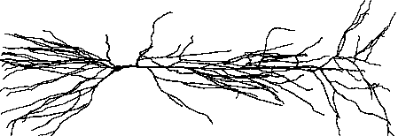

.. _the_cellbuilder:

Using the CellBuilder
=====================

Physical System
---------------

Conceptual Model
----------------

Ball-and-stick approximation to cell
++++++++++++++++++++++++++++++++++++

.. image:: img/ballstk.gif
    :align: center

Simulation
----------

Computational implementation of the conceptual model
++++++++++++++++++++++++++++++++++++++++++++++++++++

This will be constructed with the CellBuilder, a graphical tool for building and managing models of individual cells. With this and other GUI tools, you will

1.
    set up a "virtual experimental preparation" (the model cell itself).

2. 
    set up a "virtual lab rig".

    - simulation control: RunControl
    - Instrumentation:

        - Stimulator -- PointProcessManager configured as IClamp
        - Graphs -- v vs. t, v vs. distance ("space plot")

You will also learn a simple but effective strategy for modular oranization of your programs.

- separate the specification of the representation of the biological system (anatomy, biophysics, connections between cells in a network . . . ) from other items, such as the specification of instrumentation (voltage or current clamps, graphs etc.) and controls (e.g. RunControl panel).
- Use a sort program that pulls all of the pieces together.

Modular organization makes it easier to

- develop and debug models
- reuse the same model cell in many different kinds of simulation experiments
- perform the same kind of experiment on many different model cells. 

Getting started
+++++++++++++++

1.
    make and cd to a new folder for this exercise

2. 
    Start Pyhon, and at the >>> prompt enter the command

.. code::
    python

    from neuron import h, gui

Making the representation of the biological properties
++++++++++++++++++++++++++++++++++++++++++++++++++++++

Use the CellBuilder to make a simple ball and stick model that has these properties:

.. list-table:: 
   :header-rows: 1

   * - Section
     - Anatomy
     - Compartmentalization
     - Biophysics
   * - soma
     -
       length 20 microns
       
       diameter 20 microns
     - nseg = 1
     - 
       ``Ra = 160`` ohm cm, 
       
       ``Cm = 1`` µf / cm\ :sup:`2`
       
       Hodgkin-Huxley channels
   * - dend
     -
       length 1000 µm
       
       diameter 5 µm
     - nseg = 1
     - 
       ``Ra = 160`` ohm cm, 
       
       ``Cm = 1`` µf / cm\ :sup:`2`
       
       passive with Rm = 10,000 ohm cm\ :sup:`2`

**Hints:**

1.
    To start a CellBuilder, click on :menuselection:`NEURONMainMenu --> Build --> CellBuilder`

2.
     :ref:`CellBuilder overview and hints. <cellbuilder_overview_and_hints>`

3. 
    Helpful items in the :ref:`on-line Programmer's Reference <python_prog_ref>`:

       :data:`diam` • :data:`L` • :data:`Section.nseg` • :ref:`hh <mech_hh>` • :ref:`pas <mech_pas>`

Using the representation of the biological properties
+++++++++++++++++++++++++++++++++++++++++++++++++++++

At this point you should have:

1.
    entered the specification of the ball and stick model in the CellBuilder

2.
    saved the CellBuilder, with its Continuous Create button checked, to a session file called ballstk.ses and verified what you saved

3.
    exited NEURON

In the :menuselection:`course --> cellbuilder directory`, make an init.py file with the contents

.. code::
    python

    from neuron import h, gui

    #load your model specification
    h.load_file('ballstick.ses')
    #your user interface
    h.load_file("rig.ses")

Also make a rig.ses file that contains the single command

.. code::
    python

    print "ready!"

Actually you could put any innocuous statements you like into the rig.ses file, because you'll eventually overwrite this file with a custom user interface that you construct.

Start Python with the init.py argument

.. code::
    python

    python init.py

Oops! Runs and almost immediately exits!

Try again, but this time execute the command

.. code:: 
    python

    python -i init.py

The -i switch makes Python enter interactive mode instead of existing immediately after execution of init.py is complete.

Exercises
---------

1.
    Establish that the representation in the computer correspeonds to the conceptual model.
    
    Connectivity? (``h.topology()``)

    Are the properties what you expect? Try

    .. code::
        python

        from pprint import pprint #prettier printing (optional; could use print)

        pprint(h.soma.psection())
        pprint(h.dend.psection())

    Comments:

    - The CellBuilder works by executing HOC code, so the section names that you specify in a CellBuilder become the HOC names of those sections. But just like with HOC functions, simply stick the h. prefix onto the front of the name of a section created by HOC, and you have its Python name.

2.
    Use the NEURONMainMenu toolbar to construct an interface that allows you to inject a stimulus current at the soma and observe a plot of somatic Vm vs. time.

3.
    When a current stimulus is injected into the soma, does it flow into the dendrite properly? Hint: examine a space plot of membrane potential.

Saving and Retrieving the Experimental Rig
------------------------------------------

You now have a complete setup for doing simulation experiments. The CellBuilder, which specifies your "experimental preparation," is safe because you saved it to the session file ballstk.ses. However, the GUI that constitutes your nicely-configured "lab rig" (the RunControl, PointProcessManager, graph of v vs. t, and space plot windows) will be lost if you exit NEURON prematurely or if the computer crashes.

To make it easy to reconstitute the virtual lab rig, use the Print & File Window Manager (PFWM) to save these windows to a session file. :ref:`Here's how <print_and_file_window_manager>` to bring up the PFWM and use it to select the windows for everything but the CellBuilder, then save these windows to a session file called rig.ses. This will allow you to immediately begin with the current GUI.

Test rig.ses by using :menuselection:`NEURONMainMenu --> File --> load session` to retrieve it. Copies of the "lab rig" windows should overlay the originals. If so, exit NEURON and then restart it with the init.hoc argument. It should start up with the windows that you saved.

More Exercises
--------------

4.
    How does the number of segments in the dendrite affect your simulation?
    
    Turn on Keep Lines in the graph of Vm vs. t so you will be able to compare runs with different nseg.

    Then at the >>> prompt execute the command

    .. code::
        python

        h.dend.nseg *=3

    and run a new simulation. Repeat until you no longer see a significant difference between consecutive runs.

    Finally, use the command

    .. code::
        python

        print(h.dend.nseg)

    to see how many dendritic segments were required.

5.
    Is the time step (``h.dt`` in Python) short enough?

6.
    Here's something you should try on your own, perhaps after class tonight: :ref:`using the CellBuilder to manage models "on the fly." <managing_models_on_the_fly>`

Footnotes and Asides
--------------------

1.
    The CellBuilder can be used to make your own "digital stem cells." If you have a model cell that you would like to return to later, save the CellBuilder to a session file. To bring the model back, just retrieve the session file. This is a good way to create an "evolutionary sequence" of models that differ only in certain key points.

2.
    The CellBuilder can also be used to manage models based on detailed morphometric reconstructions. This is covered in a later exercise. 

.. toctree::
    :hidden:

    cellbuilder_overview_and_hints.rst
    managing_models_on_the_fly.rst