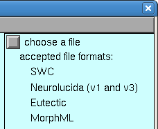
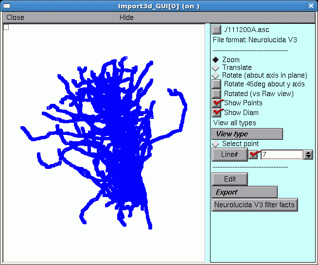
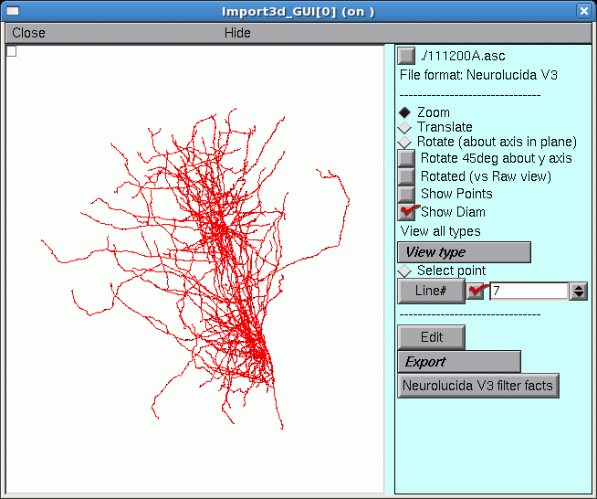
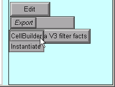
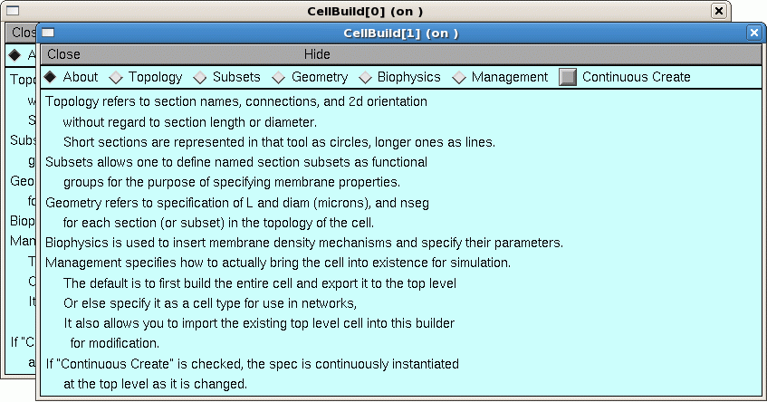
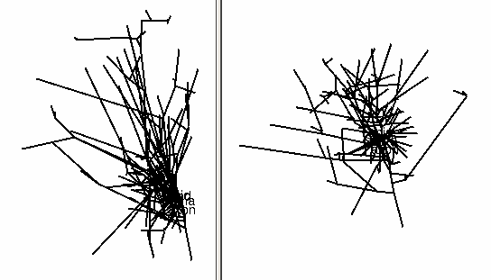
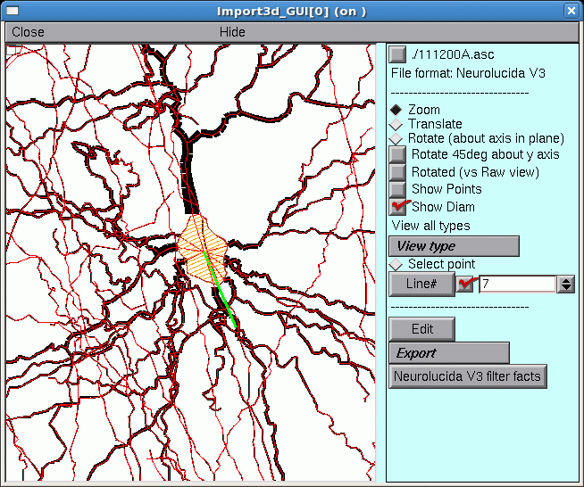
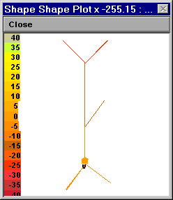

.. _using_morphometric_data:

Working with Morphometric Data
==============================

If you have detailed morphometric data, why not use it? This may be easier said than done, since quantitative morphometry typically produces hundreds or thousands of measurements for a single cell -- you wouldn't want to translate this into a model by hand. Several programs have been written to generate NEURON code from morphometric data files, but NEURON's own :ref:`Import3D tool <import_3d.rst>` is probably the most powerful and up-to-date. Currently Import3D can read Eutectic, Neurolucida (v1 and v3 text files), swc, and MorphML files. It can also detect and localize errors in these files, and repair many of the more common errors automatically or with user guidance.

Exercises
---------

To import morphometric data into NEURON, bring up an Import3D tool, and specify the file that is to be read. Look at what you get, then export the data as a NEURON model.

A. Get an Import3D tool.
~~~~~~~~~~~~~~~~~~~~~~~~

Start NEURON and go to :menuselection:`exercises --> using_morphometric_data`, if you're not alredy there.

Open an Import3D tool by clicking on :menuselection:`Tools --> Miscellaneous --> Import3D` in the NEURON Main Menu.

B. Choose a file to read.
~~~~~~~~~~~~~~~~~~~~~~~~~

In the Import3D window, click on the "choose a file" checkbox.

This brings up a file browser. Navigate to the directory containing your data, and then click the file browser's Read button. For this exercise, we'll use :download:`111200A.asc <code/111200A.asc>` (so save that on your machine somewhere, navigate there in Import3D, then read the file).

NEURON's terminal window prints a running tally of how many lines have been read from the data file.

.. code::
    python

      >>>
        21549 lines read

After a delay that depends on the size of the file and the speed of the computer, a figure will appear on the Import3D tool's canvas. Each point at which a measurement was made is marked by a blue square.

If the Import3D tool finds errors in the data file, a message may be printed in the xterm, and/or a message box may appear on the screen. For this particular example there were no errors--that's always a good sign!

The top of the right panel of the Import3D tool will show the name and data format of the file that was read. The other widgets in this panel, which are described elsewhere, can be used to examine and edit the morphometric data, and export them to the CellBuilder or the hoc interpreter.

C. Let's see what it looks like.
~~~~~~~~~~~~~~~~~~~~~~~~~~~~~~~~

It's always a good idea to look at the results of any anatomical data conversion--but those blue squares are in the way!

To get rid of the blue squares that are hiding the branched architecture, click on the Show Points button in the right panel of the Import3D tool. The check mark disappears, and so do the blue squares.

That's a very dense and complex branching pattern.

D. Exporting the model.
~~~~~~~~~~~~~~~~~~~~~~~

The Import3D tool allows us to export the topology (branched architecture) and geometry (anatomical dimensions) of these data to a CellBuilder, or straight to the hoc interpreter. It's generally best to send the data to :ref:`the CellBuilder <cellbuilder.rst>`, which we can then save to a session file for future re-use. The CellBuilder, which has its own tutorial, is a very convenient tool for managing the biophysical properties and spatial discretization of anatomically complex cell models.

So click on the Export button and select the CellBuilder option.

But this example contains a surprise: instead of one CellBuilder, there are two! Under MSWin, they are offset diagonally as shown here, but under UNIX/Linux they may lie right on top of each other so you'll have to drag the top one aside.

Does getting two CellBuilders mean that the morphometric data file contained measurements from two cells? Maybe that's why the branching pattern was so dense and complex.

But there is an unpleasant alternative: maybe all this data really is from one cell. If there was a mistake in data entry, so that the proximal end of one branch wasn't connected to its parent. one CellBuilder would contain the orphan branch and its children, and the other CellBuilder would contain the rest of the cell.

How can you decide which of these two possibilities is correct?

Examining the Topology pages of these CellBuilders shows that CellBuild[0] got most of the branches in the bottom half of the Import3D's canvas, and CellBuild[1] got most of the branches in the top half. The morphologies are ugly enough to be two individual cells; at least, neither of them is obviously an orphan dendritic or axonal tree.

Until you know for sure, it is safest to use the Print & File Window Manager (PFWM) to save each CellBuilder to its own session file. I optimistically called them bottomcell.ses and topcell.ses, respectively.

At this point, you should really use the Import3D tool to closely examine these data, and try to decide how many cells are present.

E. Take a new look at the shape in the Import3D tool.
~~~~~~~~~~~~~~~~~~~~~~~~~~~~~~~~~~~~~~~~~~~~~~~~~~~~~

Those two little green lines in the dense clusters are new. They appeared *after* exporting to the CellBuilder. And is there a little orange blob at one end of each green line?

To find out what this is all about, it is necessary to discover what lies at the center of these dense clusters.

F. Zooming in
~~~~~~~~~~~~~

To zoom in for a closer look, first make sure that the Import3D tool's Zoom button is on (if it isn't, just click on it).
Then click on the canvas, just to the right of the area of interest, and hold the mouse button down while dragging the cursor to the right. If it becomes necessary to re-center the image, click on the Translate button, then click on the canvas and drag the image into postion. To start zooming again, click on the Zoom button.

Repeat as needed until you get what you want.

The irregular shape at the center, with the transverse orange lines, is the soma of a neuron. The green line is its principal axis, as identified by the Import3D tool. At least 9 neurites converge on it, and a fine red line connects the proximal end of each branch to the center of the soma.

If you zoom in on the other green line and orange blob, you'll find another soma there.

So by zooming in, it is possible to discover that this particular morphometric data file contained measurements from at least two different cells.

To zoom out, make sure the Zoom button is on,
then click near the right edge of the canvas and drag toward the left. To fit the image to the window, just use the graph's "View = plot" menu item

A "litmus test" for models with complex architecture
----------------------------------------------------

Some morphometric reconstructions contain orphan branches, or measurement points with diameters that are (incorrectly) excessively small or even zero. Here's a test that can quickly detect such problems:

1.
    Use the data to create a model cell.

2.
    Insert the ``pas`` mechanism into all sections.

    If you're dealing with a very extensive cell (especially if the axon is included), you might want to cut Ra to 10 ohm cm and reduce g_pas to 1e-5 mho/cm^2.

3.
    Turn on Continuous Export (if you haven't already).

4.
    Bring up a Shape Plot.

5.
    Turn this into a Shape Plot of Vm (R click in the Shape Plot and scroll down the menu to "Shape Plot". Release the mouse button and a color scale calibrated in mV should appear).

6.
    Examine the response of the cell to a 3 nA current step lasting 5 ms applied at the soma.

    For very extensive cells, especially if you have reduced g_pas, you may want to increase both Tstop and the duration of the injected current to 1000 ms and use variable dt.

Here's an example that used a toy cell:

|left| |right|

Left: Vm at t = 0 ms. Right: Vm at 5 ms.

Quantitative tests of anatomy
~~~~~~~~~~~~~~~~~~~~~~~~~~~~~

This Python code checks for pt3d diameters smaller than 0.1 μm, and reports where they are found:

.. code::
    python

    for sec in h.allsec():
        for i in range(sec.n3d()):
            if sec.diam3d(i) < 0.1:
                print(f'{sec} {i} {sec.diam3d(i)}')

If you're reusing someone's HOC files, you could use the equivalent HOC statement

.. code::
    c++

    forall for i=0, n3d()-1 if (diam3d(i) < 0.1) print secname(), i, diam3d(i)

There are many other potential strategies for checking anatomical data, such as

- creating a space plot of diam. Bring up a Shape Plot and use its Plot what? menu item to select diam. Then select its Space plot menu item, click and drag over the path of interest, and voila!

- making a histogram of diameter measurements, which can reveal outliers and systematic errors such as "favorite values" and quantization artifacts (what is the smallest diameter that was measured? how fine is the smallest increment of diameter?). This requires some coding, which is left as an exercise to the reader.

Detailed morphometric data: sources, caveats, and importing into NEURON
-----------------------------------------------------------------------

Currently the largest collection of detailed morphometric data we know of is `NeuroMorpho.org <https://neuromorpho.org/>`_. There are many potential pitfalls in the collection and use of such data. Before using any data you find at NeuroMorpho.org or anywhere else, be sure to carefully read any papers that were written about those data by the anatomists who obtained them.

Some of the artifacts that can afflict morphometric data are discussed in these two papers, which are well worth reading:

Kaspirzhny AV, Gogan P, Horcholle-Bossavit G, Tyc-Dumont S. 2002. Neuronal morphology data bases: morphological noise and assesment of data quality. Network: Computation in Neural Systems 13:357-380. `doi:10.1088/0954-898X_13_3_307 <https://www.tandfonline.com/doi/abs/10.1088/0954-898X_13_3_307>`_

Scorcioni, R., Lazarewicz, M.T., and Ascoli, G.A. Quantitative morphometry of hippocampal pyramidal cells: differences between anatomical classes and reconstructing laboratories. Journal of Comparative Neurology 473:177-193, 2004. `doi:10.1002/cne.20067 <https://onlinelibrary.wiley.com/doi/10.1002/cne.20067>`_

:ref:`Quality issues with Morphometric Data <quality_issues_with_morphometric_data>`

.. toctree::
    :hidden:

    quality_issues_with_morphometric.rst

