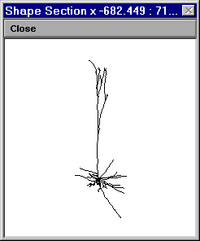

.. _working_with_shape_plots:

Working with Shape Plots
========================

This is the Shape plot for the Pyramidal cell model in ``neurondemo`` as it first appears on the screen. Its X axis is horizontal, the Y axis is vertical, and the Z axis is perpendicular to the page. Shape plots can be rotated, magnified or reduced, and translated.

Rotation
--------

1.
    R click in the graph window and select 3D Rotate.

2.
    Lift the mouse carefully off the pad, so that its cursor remains in the graph window.

3.
    Press the L mouse button and hold it down.

4.
    Use the A, X, and Z keys to examine the cell from three orthogonal directions.

    Atop view down the Y axis
    
    Xside viewdown the X axis, i.e. from the right

    Zside viewdown the Z axis (standard view seen above)

5.
    Place the mouse back down on the pad, press the L mouse button, and run the mouse around on the pad to see the cell rotate wildly.

6.
    Restore the standard view by pressing Z while holding the L mouse button down.

7.
    Use ^X, ^Y, or ^Z (^ = Ctrl key) to rotate the cell in 10° increments around the X, Y, or Z axis.

Other operations
----------------

Use the secondary menu of the Shape plot window to

- zoom in or out by 10% increments

- click and drag to open a NewView that focuses on a particular area

- zoom in or out continuously (Zoom in/out) by clicking and dragging to R or L

- click and drag the image around the window (Translate).

Note: you can also move the image by holding down the shift key and then doing click and drag

When you're done
----------------

be sure to set :menuselection:`View --> Section` so you don't inadvertently cause other changes to the image.

