# HOC Interpreter
- [HOC Interpreter](#hoc-interpreter)
  - [**Background**](#background)
  - [**Source Code**](#source-code)
  - [**HOC Grammar**](#hoc-grammar)
  - [**HOC Initialization**](#hoc-initialization)
  - [****HOC Interpreter - executing the machine****](#hoc-interpreter---executing-the-machine)
  - [****HOC Interpreter example - printf****](#hoc-interpreter-example---printf)

  
---

## **Background**

Quote from Wikipedia

> **"HOC**, an acronym for **High Order Calculator**, is an [interpreted](https://en.wikipedia.org/wiki/Interpreter_(computing) "Interpreter (computing)") [programming language](https://en.wikipedia.org/wiki/Programming_language "Programming language") that was used in the 1984 book [The Unix Programming Environment](https://en.wikipedia.org/wiki/The_Unix_Programming_Environment "The Unix Programming Environment") to demonstrate how to build interpreters using [Yacc](https://en.wikipedia.org/wiki/Yacc "Yacc")."

Source: [https://en.wikipedia.org/wiki/Hoc\_(programming\_language)](https://en.wikipedia.org/wiki/Hoc_(programming_language))

This books stands as ground base for the implementation of HOC Interpreter in NEURON. Points of interest are:

*   chapter 8 → details about HOC design and development, done in 6 stages. It goes incrementally from a simple calculator to base HOC language.
*   appendix 2 → HOC manual
*   appendix 3 → code listing of the last stage (hoc6)

## **Source Code**

We can distinguish several folders under **'src':**

*   **'src/oc' →** Source code for the base HOC interpreter 
*   **'src/ivoc' →** GUI-related code but also general purpose data structures like Vector, List or File (developed in C++)
*   **'src/nrnoc' →** NEURON-related HOC code
*   **'src/nrniv' →** modern NEURON, as it is used today; contains several C++ neuron-related additions.  

  

**Entry point**

Main entry point called **'ivocmain'** is found in **'ivocmain.cpp'** located under **'src/ivoc'**. 

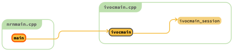

This will call '**ivocmain\_session()**' with parameter **'start\_session'** set to 1 that will effectively be dropping into the HOC Interpreter via **'hoc\_main1()'**: 

```cpp    
    int ivocmain (int argc, const char** argv, const char** env) {
      return ivocmain_session(argc, argv, env, 1);
    }
    
    
    int ivocmain_session (int argc, const char** argv, const char** env, int start_session) {
    .........
    	hoc_main1(our_argc, our_argv, env);
    .........
    }
```    

  

## **HOC Grammar**

With respect to the HOC grammar we have:

*   **'src/oc/parse.ypp' →** HOC language is defined thanks to **bison/yacc;** this file holds actual HOC grammar 
    
    The grammar consists of token definitions, left-right precedence setup,  grammar rules (i.e. expressions like assignments) and actions; these actions represent code blocks triggered when rules have been recognised.
    
    HOC also provides functions and procedures. Grammar wise, the difference is that functions are treated as expressions whereas procedures are statements. Technically, a function will return a value and a procedure will not.
    
    Given different depth of rules, parsing makes use of a stack  where we normally push operands and operators. These are basically symbols(**Symbol**) or machine instructions tied to grammar actions(**Inst**). 
    
    HOC uses an interpreter data stack, an instruction machine and a separate function/procedure (nested) call stack (combined together as a stack machine).
    
    Therefore grammar parsing type is defined as:
    
        
        %union {             /* stack type */
           Symbol *sym;        /* symbol table pointer */
           Inst   *inst;       /* machine instruction */
           int    narg;        /* number of arguments */
           void*  ptr;
        }
        
    
    which will generate 
        
        typedef union YYSTYPE
    
    Parsing relies on a lexer function that performs input tokenisation,  called **'yylex()'** (implemented in **'src/oc/hoc.cpp'**)**.** 
    
    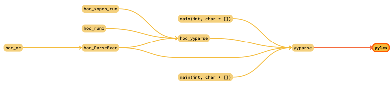
    
    It "communicates" with the parser (**yyparse()**) via a variable of the same type as the stack:  **'YYSTYPE yylval'**.
    
    As mentioned earlier, tokens are defined in the grammar.  Each of them have a type that corresponds to what we have in **YYSTYPE**, for example:
    
        
        %token <sym>  LOCALOBJ AUTOOBJ
        %token <narg> ARG NUMZERO ARGREF
        %token <ptr>  INTERNALSECTIONNAME PYSEC PYSECNAME PYSECOBJ
        %type  <inst> expr stmt asgn prlist delsym stmtlist strnasgn
        
    
    means _**LOCALOBJ**_ is of type \`_**Symbol** **\*sym; /\* symbol table pointer \*/\`.**_ Grammar rules can also be mapped to a type, for example **_strnasgn_** is of type \`**_Inst \*inst; /\* machine instruction \*/\`._**
    
*   **'src/oc/hoc.h' →** includes two headers
    *   **'redef.h' →**  some HOC redefinitions
    *   **'hocdec.h' →** here we find global data structures. 
        
        HOC is context aware, so to that end we have a symbol table where we put new variables but also keywords, builtins and other constructs (see _**HOC Initialisation**_). We find the **_Symbol_** struct here:
        
        ```cpp    
          typedef struct Symbol {	/* symbol table entry */
            char	*name;
            short	type;
            short	subtype;	/* Flag for user integers */
            short	public;		/* flag set public variable */
            short	defined_on_the_fly;/* moved here because otherwize gcc and borland do not align the same way */
            union {
              int	oboff;	/* offset into object data pointer space */
              double	*pval;		/* User defined doubles - also for alias to scalar */
              HocStruct Object* object_;	/* alias to an object */
              char	*cstr;		/* constant string */
              double	*pnum;		/* Numbers */
              int	*pvalint;	/* User defined integers */
              float	*pvalfloat;	/* User defined floats */
              int	u_auto;		/* stack offset # for AUTO variable */
              double	(*ptr)();	/* if BLTIN */
              Proc	*u_proc;
              struct {
                short type;	/* Membrane type to find Prop */
                int index;	/* prop->param[index] */
              }rng;
              HocStruct Symbol **ppsym;	/* Pointer to symbol pointer array */
              HocStruct Template *template;
              HocStruct Symbol* sym;	/* for external */
            } u;
            unsigned   s_varn;	/* dependent variable number - 0 means indep */
            Arrayinfo *arayinfo;	/* ARRAY information if null then scalar */
            HocSymExtension* extra; /* additions to symbol allow compatibility
                    with old nmodl dll's */
            HocStruct Symbol	*next;	/* to link to another */
          } Symbol;
        ```    
        
        Union _**u**_ is used to hold actual value of the symbol given its type.   
          
        We also have _**Inst,**_ which represents the data type of a machine instruction and is tied to function pointers of different types that correspond to different functions or grammar actions:
        
        ```cpp    
          typedef int	(*Pfri)(void);
          typedef void	(*Pfrv)(void);
          typedef double	(*Pfrd)(void);
          typedef struct Object** (*Pfro)(void);
          typedef const char** (*Pfrs)(void);
          
          
          typedef int	(*Pfri_vp)(void*);
          typedef void	(*Pfrv_vp)(void*);
          typedef double	(*Pfrd_vp)(void*);
          typedef struct Object** (*Pfro_vp)(void*);
          typedef const char** (*Pfrs_vp)(void*);
          
          
          typedef union Inst { /* machine instruction list type */
            Pfrv	pf;
            Pfrd	pfd;
            Pfro	pfo;
            Pfrs	pfs;
            Pfrv_vp	pfv_vp;
            Pfrd_vp	pfd_vp;
            Pfro_vp	pfo_vp;
            Pfrs_vp	pfs_vp;
            HocUnion Inst	*in;
            HocStruct Symbol	*sym;
            void*	ptr;
            int	i;
          } Inst;
        ```   
        
        The interpreter data stack has the following type **_StackDatum_**:
        ```cpp
          using StackDatum = std::variant<double,          // old Datum::val
                                          Symbol*,         // old Datum::sym
                                          int,             // old Datum::i
                                          Object**,        // old Datum::pobj
                                          Object*,         // old Datum::obj
                                          char**,          // old Datum::pstr
                                          double*,         // old Datum::pval
                                          std::nullptr_t>; // old STKOBJ_UNREF
        ```


*   **'src/oc/code.cpp' →** here we find the stack machine definitions and
    routines that manipulate it, and as well as functions tied to different
    functionalities or grammar actions (HOC routines), like for example
    _**call()**_ that will perform a function call.
    
      ```cpp  
        static std::vector<StackDatum> stack{}; // the data stack
        
        #define    NPROG  50000
        Inst   *prog; /* the machine */
        Inst   *progp;       /* next free spot for code generation */
        Inst   *pc;      /* program counter during execution */
        Inst   *progbase; /* start of current subprogram */
        Inst   *prog_parse_recover; /* start after parse error */
        int    hoc_returning; /* 1 if return stmt seen, 2 if break, 3 if continue */
                 /* 4 if stop */
        namespace nrn::oc {
        struct frame {             /* proc/func call stack frame */
            Symbol* sp;            /* symbol table entry */
            Inst* retpc;           /* where to resume after return */
            StackDatum* argn;      /* n-th argument on stack */
            int nargs;             /* number of arguments */
            Inst* iter_stmt_begin; /* Iterator statement starts here */
            Object* iter_stmt_ob;  /* context of Iterator statement */
            Object* ob;            /* for stack frame debug message */
        };
        }  // namespace nrn::oc
        using Frame = nrn::oc::frame;
        #define NFRAME 512 /* default size */
        static Frame *frame, *fp, *framelast; /* first, frame pointer, last */
      ```
    
    The important thing to note here is the _**Frame**_ structure, used for functions and procedures. They are installed in a symbol table and have a make us of a machine instruction **_retpc_** used to know where to return after execution.
    
    Arguments come in variably like **$1, $2** and so on, and the way we
    incorporate them is by pointing to the last one on the stack (_**StackDatum
    \*argn**_) and passing **_int nargs._**
    
*   **'src/oc/symbol.cpp' →** defines several symbol tables and utility functions to install and lookup symbols (see _**HOC Initialisation**_)

  ```cpp  
    typedef struct Symlist {
    	HocStruct Symbol *first;
    	HocStruct Symbol *last;
    }Symlist;
    
    
    Symlist	*hoc_built_in_symlist = (Symlist *)0; /* keywords, built-in functions,	all name linked into hoc. Look in this list last */
    Symlist	*hoc_top_level_symlist = (Symlist *)0; /* all user names seen at top-level	(non-public names inside templates do not appear here) */
    					
    Symlist	*symlist = (Symlist *)0;	/* the current user symbol table: linked list */
    Symlist	*p_symlist = (Symlist *)0; 	/* current proc, func, or temp table */
    									/* containing constants, strings, and auto */
    									/* variables. Discarding these lists at */
    									/* appropriate times prevents storage leakage. */
  ```  

*   **'src/oc/hoc\_oop.cpp' →** holds HOC functions providing support for OOP

## **HOC Initialization**

*   Argument parsing

Before HOC interpreter initialisation, **'ivocmain\_session()'** takes into account different options passed down from command line arguments and sets variables accordingly.

HOC-interpreter importance wise, we have: 

*   *   **'NSTACK'→** HOC interpreter stack space
    *   **'NFRAME' →** number of frames available.

    ```
      options:\n\
      .......
        -NSTACK integer  size of stack (default 1000)\n\
        -NFRAME integer  depth of function call nesting (default 200)\n\
      ........
    ```

 Default values are used if user does not supply them → in **'src/oc/code.cpp'.** We often need to specify a higher **NFRAME** (i.e. 1000 when we do morphology loading as that tends towards deeper function call nesting when parsing).

 These values are checked systematically when we use the stack or frames for
 procedures and functions (everything is in **'src/oc/code.cpp',**); the actual
 space allocation for HOC stack and frames is done in **'hoc\_init\_space()'.**

  

*   Interpreter initialisation  
    **'hoc\_main1\_init()'** is in charge of the HOC interpreter initialisation. In the following image we can see **'hoc\_main1()'** is also a caller; this is the hoc interpreter part taking input line by line and executing it, discussed in next section.  
    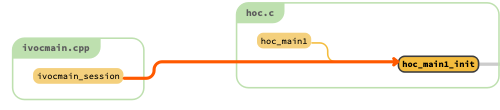  
    Most of the initialisation is actually handled through **'hoc\_init()'**  
        
    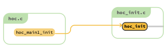 
    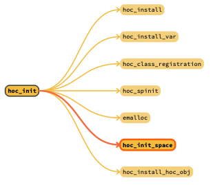
    
      
    **'hoc\_init()'** will perform the following
    
    1.  call **'hoc\_init\_space()'** to allocate space for HOC interpreter stack and frames
    2.  install symbols with the help of **'hoc\_install'** (alias of **'install()'** function implemented in **'src/oc/symbol.cpp'**):
        1.  keywords like : **if, else, proc, localobj** and so on
        2.  constants like: **PI, GAMMA, FARADAY** and so on
        3.  builtin HOC functions like: **sin(), cos(), sqrt(), xopen(), sscanf(), execute(), load\_file(), nrnversion()** and so forth  
            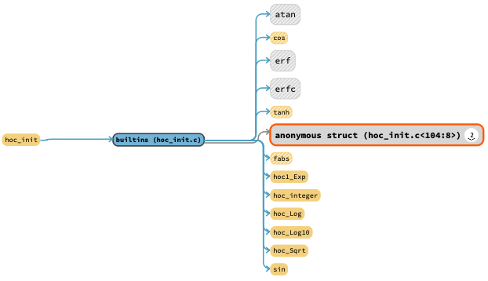  
            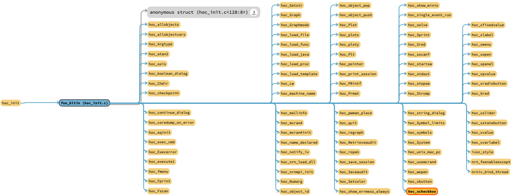
    3.  install some variable symbols using **'hoc\_install\_var()'** defined in **'src/oc/symbol.cpp'**
    4.  call **'hoc\_spinit()'** implemented in **'src/oc/hocusr.cpp',** which will
        1.  **hoc\_install()** user variables ( like **float/double/integer, scalars, arrays, vectors**) 
        2.  **hoc\_install()** user functions (like **pt3dadd(), finitialize(), psection()** and so on)
        3.  call **'hoc\_last\_init()'** to finalise setup, including:
            1.  create **NrnThreads** 
            2.  **hoc\_install()** neuron related variables ( **t, dt, v, i\_membrane\_)** and user properties ( **nseg, L, rallbranch, Ra)**
            3.  finish memory allocations for different neuron variables
            4.  call **modl\_reg()** and **mswin\_load\_dll()** to load external mechanisms from **mech** library
    5.  call **'hoc\_class\_registration()'** implemented in **'src/ivoc/classreg.cpp'** which will register classes found in different parts of the source tree, like: 
        1.  **List, Vector, Matrix** and so on, classes from **'src/ivoc/'**
        2.  **Shape, BBSaveState** and so on, classes from **'src/nrniv'**  
            **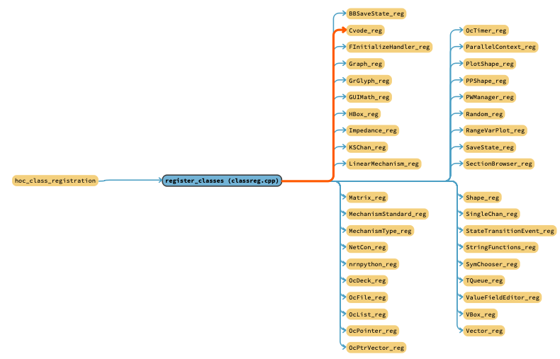**

## ****HOC Interpreter - executing the machine**** 

As pointed out in previous section, ****'hoc\_main1()'**** launches the interpreter and executes different hoc commands either line by line from input file or from prompt. 

This is handled by the next routine:

**HOC interpreter main routine**

   ```cpp 
    	while (moreinput())
    		hoc_run1();
    	return 0;
   ``` 

Whereas **'hoc\_run1()'** will perform parsing (ultimately via bison generated **'yyparse()'**), which will then point to the start machine instruction **Inst**  that is passed on to execution via _**execute (hoc\_execute()** redef)_:

  ```cpp
    for (initcode(); hoc_yyparse(); initcode())
    {
    		execute(progbase)
    }
  ```  

  

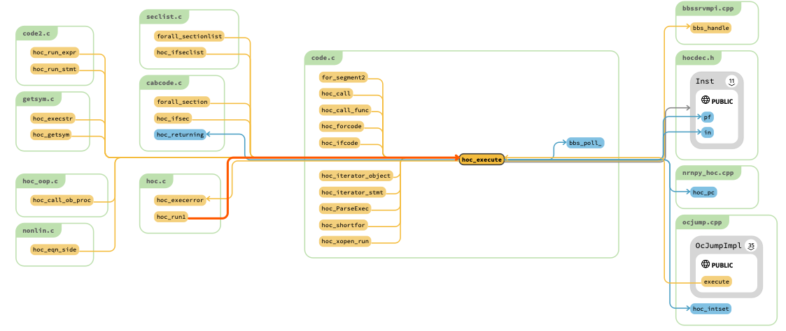

## ****HOC Interpreter example - printf****

When a function (or even a procedure) is called we have:

*   arguments parsed (and eventually computed) pushed to the interpreter data stack
*   the interpreter machine will have
    *   _**call**_ opcode → this is linked to the _**call()**_ function implemented in _**'src/oc/code.cpp'**_
    *   _**sym**_ holding the symbol table pointer for the function
    *   _**nargs**_ holding the number of arguments passed to the function 
*   a new Frame is pushed onto the frame stack, containing
    *   **_argn_ →** pointer to interpreter stack of the last argument
    *   **_nargs_ →** number of arguments
    *   **_retpc_ →** where to return after the function call
    *   **_sp_ →** symbol table pointer of the printf

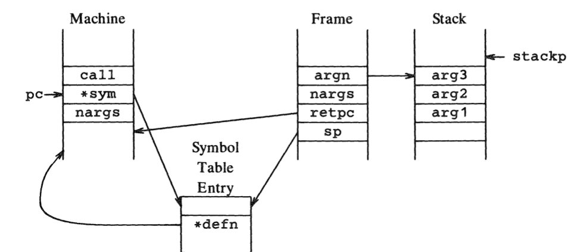

How does this map to _**parse.ypp**_ grammar? Corresponding part is : 

    
    expr:  
    .......
       | function begin '(' arglist ')'
          { $$ = $2; code(call); codesym($1); codei($4); PN;}
    

Here we notice _**call**_ opcode that was pushed to the interpreter machine, together with the _**sym**_ of called function and the number of args via _**codei**_ call. 

  

So given the following HOC call: 

    
    oc>printf("%s equals %d", "one plus two", 1+2)
    

the parsing will parse the arguments and the interpreter will perform **_call()_.** At this point, program counter _**pc**_  points to the **_printf_** symbol table entry and just after we have the number of arguments _**nargs.**_ We now push and setup a new _**Frame**_:

  ```cpp  
  // call a function
  void hoc_call() {
      int i, isec;
      Symbol* sp = pc[0].sym; /* symbol table entry for printf */
      if (++fp >= framelast) {
          --fp;
          execerror(sp->name, "call nested too deeply, increase with -NFRAME framesize option");
      }
      fp->sp = sp;
      fp->nargs = pc[1].i;
      fp->retpc = pc + 2; // This is where we return to after the printf call
      ...
      fp->argn = &stack.back(); // pointer to the last argument
  ```  

By inspecting the frame we notice:

  ```cpp    
  (lldb) p *fp
  (Frame) $1 = {
    sp = 0x00006000017092c0
    retpc = 0x000000010038c060
    argn =  Active Type = double
    nargs = 3
    iter_stmt_begin = nullptr
    iter_stmt_ob = nullptr
    ob = nullptr
  }

  (lldb) p *fp->sp
  (Symbol) $2 = {
    name = 0x0000600000014480 "printf"
    type = 280 // this is the type of the symbol, which corresponds to a builtin function: FUN_BLTIN = 280
    subtype = 0
    cpublic = 0
    defined_on_the_fly = 0
    u = {
      oboff = 2163136
      pval = 0x00006000002101c0
      object_ = 0x00006000002101c0
      cstr = 0x00006000002101c0 "\U00000010\U0000001a\xea"
      pnum = 0x00006000002101c0
      pvalint = 0x00006000002101c0
      pvalfloat = 0x00006000002101c0
      u_auto = 2163136
      ptr = 0x00006000002101c0
      u_proc = 0x00006000002101c0 // this is the active member
      rng = (type = 448, index = 24576)
      ppsym = 0x00006000002101c0
      ctemplate = 0x00006000002101c0
      sym = 0x00006000002101c0
    }
    s_varn = 0
    arayinfo = nullptr
    extra = nullptr
    next = 0x0000600001709300
  }
    
  (lldb) p *fp->argn
  (StackDatum) $3 =  Active Type = double  {
    Value = 3 // value of the last argument (1+2) has already been computed
  }
  ```  

_**call()**_ will continue on to check the symbol, which  tells us we are calling a builtin function (_**FUN\_BLTIN = 280**_, see _**fp**_ above), and call its function pointer mapped to **_hoc\_PRintf_**: 

  ```cpp
  if (sp->type == FUN_BLTIN || sp->type == OBJECTFUNC || sp->type == STRINGFUNC) {
      // Push slots for auto
      for (auto i = 0; i < sp->u.u_proc->nauto; ++i) {
          push_value(0.0);
      }
      (*(sp->u.u_proc->defn.pf))(); /* this is where we call the printf function */
      if (hoc_errno_check()) {
          hoc_warning("errno set during call of", sp->name);
      }
  }
  ```

  ```
  oc>printf("%s equals %d", "one plus two", 1+2)
  Process 15255 stopped
  * thread #1, queue = 'com.apple.main-thread', stop reason = breakpoint 1.1
      frame #0: 0x0000000100e7cba0 libnrniv.dylib`hoc_call() at code.cpp:1403:10
     1400	        for (auto i = 0; i < sp->u.u_proc->nauto; ++i) {
     1401	            push_value(0.0);
     1402	        }
  -> 1403	        (sp->u.u_proc->defn.pf)();
     1404	        if (hoc_errno_check()) {
     1405	            hoc_warning("errno set during call of", sp->name);
     1406	        }
  Target 0: (nrniv) stopped.
  (lldb) s
  Process 15255 stopped
  * thread #1, queue = 'com.apple.main-thread', stop reason = step in
      frame #0: 0x0000000100ea1a18 libnrniv.dylib`hoc_PRintf() at fileio.cpp:316:5
     313 	    char* buf;
     314 	    double d;
     315
  -> 316 	    hoc_sprint1(&buf, 1);
     317 	    d = (int) strlen(buf);
     318 	    plprint(buf);
     319 	    fflush(stdout);
  Target 0: (nrniv) stopped.
  ```

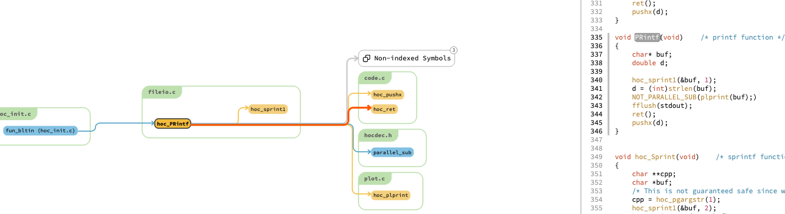

_**hoc\_sprint1()**_ will be in charge of formatting the output using the parsed arguments. Once printing is done via _**plprint()**_, a call to _**ret()**_ will perform Frame clean-up, pop arguments from interpreter data stack and set program counter _**pc**_ to returning point _**retpc**_:

  ```cpp
  /* common return from func, proc, or iterator */
  void hoc_ret() {
      // unref all the auto object pointers
      for (int i = fp->sp->u.u_proc->nobjauto - 1; i >= 0; --i) {
          // this is going from the deepest automatic object in the stack to the shallowest
          hoc_obj_unref(hoc_look_inside_stack<Object*>(i));
      }
      // Pop off the autos
      for (auto i = 0; i < fp->sp->u.u_proc->nauto; ++i) {
          pop_value();
      }
      frameobj_clean(fp);
      for (int i = 0; i < fp->nargs; i++) {
          // pop arguments
          hoc_nopop();
      }
      hoc_pc = fp->retpc;
      --fp;
      hoc_returning = 1;
  }
  ```

Length of outputted string (21 here) is pushed onto the interpreter data stack.  Notice **_hoc\_returning_** that is set to 1 to let the stack machine know execution is done; this is how we can signal nested calls if needed (out of scope for this example).

At the end of **hoc\_execute()** we get:

    
    one plus two equals 3	21
