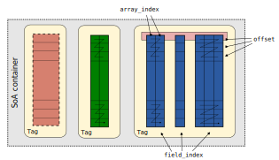

.. include:: ../rst_substitutions.txt

Data structures
###############
This section provides higher-level documentation of the data structures used in NEURON,
complementing the lower-level Doxygen documentation of the
`neuron::container:: <../doxygen/namespaceneuron_1_1container.html>`_ namespace.

|neuron_with_soa_data| contains substantial changes to the organisation of model data, of which the
most notable is a transposition from an array-of-structs (AoS) layout to a struct-of-arrays (SoA)
layout, following the model of CoreNEURON.
These changes were introduced in GitHub pull request
`#2027 <https://github.com/neuronsimulator/nrn/pull/2027>`_.

As well as adopting an SoA layout, this work also introduces new "**data handle**" types that
enable persistent references to elements in the data structures, which automatically remain valid
even when the underlying storage arrays are re-allocated, or their elements are reordered
(permuted).

The basic idea is to allow us to refer to logical elements of a NEURON model (*e.g.* "the Node at
the centre of this Section") via struct-like "handle" objects that abstract away both the size of
the underlying arrays containing the Node data, and the current index of a given (logical) Node in
those arrays.

Performance-sensitive code code, such as the Node matrix solver algorithm and "current" and "state"
functions that are generated from MOD files, can operate directly on the underlying array storage,
taking advantage of improved cache efficiency and (in some cases) vectorisation, without paying for
the relatively slow indirection inherent to the "**data handle**" and "**Node handle**" types
introduced above.

Overview
--------
|neuron_with_soa_data|'s SoA data structures are based on the
`neuron::container::soa <../doxygen/structneuron_1_1container_1_1soa.html>`_  variadic template
class.
Here is an example of its use:

.. image:: soa-architecture.svg

This defines an SoA data structure (``ab_store``) with two **data** arrays for variables
imaginatively named ``A`` (red) and ``B`` (blue).
There is an implicit extra "index" array (purple) that is needed for the implementation of the
"handle" types introduced above; no matter how many variables are added to the structure, there is
still just one index array.

Let's unpick this example a little more, starting with the definition of our ``ab_store`` type:

.. code-block:: c++

    struct ab_store: soa<ab_store, field::A, field::B>

The ``neuron::container::soa<...>`` template uses
`CRTP <https://en.wikipedia.org/wiki/Curiously_recurring_template_pattern>`_, which is why the
first template argument to ``soa<...>`` is the derived class name ``ab_store``; the reasons for
this are not important for a high-level overview and it can be ignored for the moment.

All the remaining template arguments, ``field::A, field::B`` in this case, are **tag types** that
define the **fields** of our data structure.
A minimal definition of these would be something like:

.. code-block:: c++

    namespace field {

    struct A {
      using type = double;
    };

    struct B {
      using type = int;
    };

    }  // namespace field

Which would specify that the ``A`` values shown above (red ``a0``, ``a1``, *etc.*) are of type
``double``, while the ``B`` values (blue ``b0``, ``b1``, *etc.*) are of type ``int``.
Certain additional functions and variables can be added to the tag types to control, for example,
pretty-printing of data handles, non-zero default values, and non-scalar fields.

In essence, our struct ``ab_store``, if we wrote it out manually, would look something like:

.. code-block:: c++

    struct ab_store_manual {
      std::vector<double> a_values;
      std::vector<int> b_values;
      std::vector</* unspecified */> indices;
    };

As with any other ``std::vector``-based type, the currently allocated capacity and the current size
are different to one another; in the illustration above there are five elements (the size), but
there are two unused elements (``...``) in each array, so the capacity is seven.

The index column has so far been glossed over, but you may have noticed that, for example,
0\ :sup:`th` entry is shown as "→ 0" in the figure above.
In essence, the index column type is "pointer to integer", and the pointed-to integers are kept up
to date so they always hold the **current** index into the storage array of a given logical entry.
Expressed as code, this means that:

.. code-block:: c++

    for (auto i = 0; i < indices.size(); ++i) {
      assert(i == *indices[i]);
    }

should never trigger an error.

.. note::

    While a large part of the motivation for allowing the underlying arrays to be reordered is that
    it allows explicit permutation of the data for performance reasons, it also permits other
    optimisations. For example, deletion from NEURON's data structures is :math:`\mathcal{O}(1)`,
    whereas erasing from a regular ``std::vector`` is :math:`\mathcal{O}(N)`. This is because the
    index mechanism allows deletion to be implemented by swapping the last element of the array
    into the deleted position and reducing the size by one.

The data handle type described above essentially hold a pair of pointers: one that can be
dereferenced to get the address of the 0\ :sup:`th` entry in the data array, and one
pointer-to-integer taken from the index column:

.. code-block:: c++

    struct data_handle_double_manual {
      double* const* ptr_to_array_base;
      unsigned long* ptr_to_current_row;
      double& get_value() {
        return (*ptr_to_array_base)[*ptr_to_current_row];
      }
    };

This is enough indirection that neither re-ordering nor re-allocating the actual data storage
invalidates any instances of ``data_handle_double_manual``.
The real type used in the NEURON code-base is the
`neuron::container::data_handle <../doxygen/structneuron_1_1container_1_1data__handle.html>`_
template, *i.e.* we use ``data_handle<double>`` in place of ``data_handle_double_manual``.

.. note::

    You may wonder what happens when an entry is deleted from the data structures. In this case the
    storage for the **data** of the deleted element (*i.e.* its ``a`` and ``b`` values) is released
    and made available for re-use, but its entry in the index vector is not freed and the
    pointed-to integer is updated with a sentinel value. This means that data handles that referred
    to now-deleted entries (``a`` and ``b`` values) can detect that they are no longer valid and
    will not return invalid values.

Of course, this indirection also means that these data handles are not especially performant, but
in general they are intended to solve otherwise-tedious bookkeeping problems, and
performance-critical code is expected to operate directly on the underlying vectors.
In other cases, such as ``POINTER`` variables in MOD files, data handles are used while the model
is being built in memory, but they are "flattened" into plain ``double*`` for use during the actual
simulation, where performance **is** important **and** it is known that no re-allocation or
re-ordering will occur that could invalidate those raw pointers.

The "data handle" type just discussed is the right tool for the job if we want to refer to a single
value of a type that is known at compile time, but there are a few other types of "handle" that are
also supported:

* `neuron::container::generic_data_handle <../doxygen/structneuron_1_1container_1_1generic__data__handle.html>`_
  is a type-erased version of ``neuron::container::data_handle``, similar to
  `std::any <https://en.cppreference.com/w/cpp/utility/any>`_.
* Handles to higher-level objects. For example, if the entity that has an "a" [side] and a "b"
  [side] is a vinyl, we can also have "vinyl handles", which provide accessors ``a()`` and ``b()``.
  These handles come in two flavours:

  * non-owning: like the "data handle" types above, these refer to an entry in the ``ab_store``
    container and provide access to both "a" and "b" [these are currently not used outside tests]
  * owning: like non-owning handles, these refer to an entry in the ``ab_store`` container and
    provide access to both "a" and "b" values. The key difference is that owning handles have
    owning semantics: creating an owning handle appends a new entry to the underlying data arrays
    and destroying an owning handle deletes that (owned) entry from the arrays.

The following code snippet illustrates the use of owning handles:

.. code-block:: c++

    ab_store my_data{};
    data_handle<double> dh{};
    assert(!dh); // not pointing to a valid value
    {
      // my_data.size() == 0
      owning_vinyl_handle heroes{my_data}; 
      // now my_data.size() == 1
      heroes.a() = 19.817; // runtime in minutes
      heroes.b() = 5;      // track count
      // higher-level handles-to-entities can produce lower-level handles-to-values
      dh = heroes.b_handle();
      assert(dh); // now pointing to a valid value
      assert(*dh == 5);
      *dh = 6; // bonus track
      assert(heroes.b() == 6); // `dh` and `heroes.b()` refer to the same value
    } // `heroes` is destroyed when it goes out of scope at this closing brace
    // my_data.size() == 0 again 
    assert(!dh); // pointed-to value is no longer valid

</laboured_vinyl_analogies>

Advanced field features
-------------------------
You should now be familiar with the key components of the new NEURON data structures, however there
are -- of course -- some additional features that were not included in the overview above.

In the example above, we used a simple tag type:

.. code-block:: c++

    struct A {
      using type = double;
    };

to define a scalar field.
There are several additional features in ``neuron::container::soa<...>`` that are not enabled in
the example above.
Additional features are generally enabled by using tag types that have
additional member functions and variables. There are three advanced tag types:
optional fields; array-valued fields, i.e. fields for which each row has
multiple values; and tags which contain multiple, possibly array-valued,
fields. All three are shown schematically in the figure below; and described in
detail in the following subsections. In the figure fields with the same color
must have the same scalar type. The zigzag line represents the memory layout
for array-valued fields.

Runtime-variable field counts
^^^^^^^^^^^^^^^^^^^^^^^^^^^^^
In the introductory example, the ``ab_store`` example has precisely two data fields: ``A`` and
``B``.
This can only be changed at compile time, by adding or removing tag types from the definition of
``ab_store``.
Sometimes, more flexibility is required: in this case, a member function named ``num_variables()``
can be added to the relevant tag type, for example:

.. code-block:: c++

    namespace field {

    struct C {
      C(std::size_t count) : m_count{count} {}
      using type = float;
      [[nodiscard]] int num_variables() const { return m_count; }
    private:
      int m_count;
    };

    }  // namespace field

    struct some_cs: soa<some_cs, field::C> {
      using base_type = soa<some_cs, field::C>;
      some_cs(std::size_t count) : base_type{field::C{count}} {}
    };

In this case, the ``some_cs`` struct will be similar to:

.. code-block:: c++

    struct some_cs_manual {
      some_cs_manual(std::size_t count) {
        c_data.resize(count);
      }
      std::vector<std::vector<double>> c_data;
      std::vector</* unspecified */> indices;
    };

and the "inner" vectors will all be the same size as each other, *i.e.*
``c_data[i].size() == indices.size()`` for ``i`` in ``0 .. count-1``.

This involves slightly more indirection and runtime checking than the original example with
everything fixed at compile time.

The canonical example of usage of this is the storage for ``RANGE`` variables in MOD files, where a
single tag type (``neuron::container::Mechanism::field::FloatingPoint``) with a ``num_variables()``
method is used to generate one ``std::vector<double>`` per ``RANGE`` variable.

Note that this also demonstrates how non-empty tag types can be used to hold extra information, the
``neuron::container::soa<derived, Tags...>`` template has a constructor taking ``Tags...``, and it
stores an instance of each tag type internally that can be accessed via the ``get_tag<Tag>()``
member function.

.. note::

    If you use this mechanism, note that you must provide the ``soa<...>`` constructor with
    instances of tag types in the same order as they appear in the declaration. Also, repeated tag
    types are not allowed.

Optional fields
^^^^^^^^^^^^^^^
If it is known that the number of fields will be zero or one, *i.e.* the field is optional, then a
simplified tag type can be used:

.. code-block:: c++

    struct OptionalA {
      static constexpr bool optional = true;
      using type = double;
    };

This defines a simple field like ``A`` above, with ``std::vector<double>`` backing storage, but it
can be toggled on and off at runtime using the ``set_field_status`` method, and its status can be
queried using the ``field_active`` method.

The real-world use of this is the data for the fast membrane current calculation, which is only
filled if it has been enabled at runtime using :meth:`CVode.use_fast_imem`.

Explicit default values
^^^^^^^^^^^^^^^^^^^^^^^
If you do not explicitly specify otherwise, new values in the storage arrays -- produced by, as
shown above, creating owning handles -- will be zero-initialised.
If the relevant tag type has a member function called ``default_value()``, new values will be
initialised with the value returned by that function.

.. code-block:: c++

    struct D {
      using type = double;
      [[nodiscard]] constexpr type default_value() const { return 4.2; }
    };

Real-world examples of this include Node voltages (which default to -65) and Node areas (which
default to 100).

Array variables
^^^^^^^^^^^^^^^
In the examples shown so far, the fields have all had scalar types such as ``double`` and ``int``.
Sometimes, it is necessary to use represent vector data with multiple contiguous values for each
instance of an entity.
If the vector size was known at compile time, this could in principle be done with a tag type along
the lines of:

.. code-block:: c++

    #include <array>

    struct E {
      using type = std::array<float, 42>;
    };

However, if the vector size is only known at runtime this would not work; a workaround along the
lines of:

.. code-block:: c++

    #include <vector>

    struct F {
      using type = std::vector<float>;
    };

would be ill-advised, as it would force a number of independent allocations that scales linearly in
the container size.

Instead, we can signal to the ``neuron::container::soa`` helper that each time we add an instance
to the container we would like multiple values to be allocated:

.. code-block:: c++

    struct G {
      using type = float;
      [[nodiscard]] int array_dimension() const {
        return 42;
      }

gives essentially the same memory layout as the example usin ``std::array<float, 42>``, but it has
the major advantage that ``42`` can be replaced with a value that is only known at runtime.

The memory layout when ``array_dimension()`` returns two is shown below.
In the figure, the container ``size()`` is three.

.. image:: soa-array-var-layout.svg

To use ``array_dimension()`` in conjunction with ``num_variables()``, the signature has to be
modified slightly:

.. code-block:: c++

    struct H {
      using type = float;
      [[nodiscard]] int num_variables() { return /* unspecified */; }
      [[nodiscard]] int array_dimension(int i) { return i + 1; }
    };

where the integer argument ``i`` lies in ``0 .. num_variables()-1`` and the function should, as you
might expect, return the desired array dimension for the ``i``\ :sup:`th` copy of the field
represented by this tag type.

Real-world usage of this feature is, again, ``RANGE`` variables in MOD files, as each individual
``RANGE`` variable can have an array dimension.
The array dimension must be global to all instances of the mechanism (entity); there is no support
for arrays of per-instance-variable size.

Pretty printing
^^^^^^^^^^^^^^^
The ``data_handle<T>`` and ``generic_data_handle`` handle-to-value types support pretty-printing to
``std::ostream&`` via ``operator<<`` overloading, yielding results like:

.. code-block::

    data_handle<double>{Node::field::Voltage row=0/1 val=42}

By default, the printed names are derived from the names of the tag types, however when
``num_variables()`` is used then the best that this method can yield are names like
``Entity::field::FloatingPoint#7``.
Once again, an extra method defined in the tag type allows more human-friendly names to be given:

.. code-block:: c++

    struct I {
      using type = short;
      [[nodiscard]] int num_variables() { return /* unspecified */; }
      [[nodiscard]] const char* name(int i) const {
        assert(i >= 0 && i < num_variables());
        return name_table[i];
      }
      // ... name_table definition ...
    };

Once again, the real-world usage of this comes from ``RANGE`` variables in MOD files; the NMODL
variable names are passed in to the relevant tag type and returned from the ``name`` method.

.. _advanced-soa-container-features:

Advanced container features
---------------------------
You should now have a reasonable idea of what kinds of data can be represented, and how to express
the desired fields using tag types.
In this section we will explore some more advanced runtime features of containers implemented using
``neuron::container::soa<...>``.

Let's take a simplified three-stage view of how NEURON is used:

1. We construct our model, this basically means creating Node and Mechanism instances, although it
   may also involve deleting them. It is driven by the user and consists of a very large number of
   independent calls from Python (or HOC) user code into the NEURON library.
2. We prepare the model data for simulation. This is done by NEURON internally and implicitly, the
   user just asks for the simulation to run.
3. We run the simulation.

During step 1, the ordering of the underlying data arrays is essentially unknown; the data are
"unsorted".
Step 3 is generally where the majority of the computational time is spent, so we want the relevant
algorithms there to operate directly on the underlying data arrays, and to be able to make
assumptions about the ordering of thoese data.

.. note::

    In general terms, this is important because some of these algorithms reduce to loops with data
    dependencies that inhibit more **generic** optimisations such as autovectorisation.

.. note::

    In principle then most dynamic memory [re-]allocation in step 1 can be avoided if an **good**
    estimate of the final model size is available.
    There is currently no way of providing this estimate, but it would be a relatively simple
    change to NEURON to expose a `std::vector::reserve
    <https://en.cppreference.com/w/cpp/container/vector/reserve>`_-like method (pay attention to
    the "Notes" section of that page).
    Note that calling this *repeatedly* is likely to be a bad idea, as it can inhibit the standard
    exponential growth of the allocated storage size, but a single call to ``reserve`` before
    constructing the model with an estimate of the complete model size may be worthwhile.

Step 2 is thus responsible for sorting the unordered data of step 1 into sorted data suitable for
step 3.
How the ordering scheme is defined will be described in :ref:`soa-data-integration-in-neuron`
below, for now let's just note that ``neuron::container::soa`` provides a method named
``apply_reverse_permutation`` that takes a [reverse] permutation vector, that is a range of
integers such that ``perm_vector[old_position]`` is the destination index for the value that
initially sits at index ``old_position``.

.. warning::

    The algorithm used to apply the permutation uses the given vector as temporary storage, so
    **this method modifies its argument**. NB: the "reverse" terminology is consistent with Boost;
    a "forward" permutation would move ``perm_vector[new_position]`` to ``new_position``.

It should be apparent from the discussion so far that immediately after step 2, the data are
"sorted", but that this is a fragile state: creating or destroying a single Node or Mechanism
instance would leave the data "unsorted" once more.

The ``soa<...>`` utility provides some additional functionality to manage this fragility in an
efficient and straightforward to reason about way, which is the topic of this section.

First, the containers maintain a "sorted" flag: if you flag a container as "sorted" then it will
remain flagged "sorted" until one of the following happens:

* You explicitly flag it as "unsorted".
* You add or erase an element from it.
* You apply a permutation to it.

This allows step 2 to be short-circuited.

Second, it is possible to forbid (at runtime) operations that would cause the container to become
"unsorted" by marking it "frozen".
This is done using a token type:

.. code-block:: c++

    void whatever(my_soa_container& data) { // assume `data` was not already "frozen"
        owning_handle foo{data}; // adding an element is OK
        auto token = data.issue_frozen_token(); // mark container "frozen"
        owning_handle disappointing_foo{data};  // this will throw
    } // `token`` is destroyed here; `data` ceases to be "frozen"

The container maintains a count of how many tokens are controlling it and is "frozen" whenever that
count is nonzero.

.. warning::

    An unfortunate edge case of the current implementation is that trying to delete an owning
    handle that refers to a "frozen" container will cause the program to terminate.
    This is because trying to erase from a "frozen" container is forbidden, and will throw an
    exception, leaving the destructor of the owning handle no better option than to immediately
    terminate. See also: `E.16: Destructors, deallocation, swap, and exception type copy/move
    construction must never fail
    <https://isocpp.github.io/CppCoreGuidelines/CppCoreGuidelines#Re-never-fail>`_ from the C++
    Core Guidelines.

    So far this does not appear to be a problem.
    One, so far theoretical, issue is that any code which takes a callback from the user that is
    executed during the simulation cannot realistically prevent that user callback from attempting
    to delete part of the model data.
    It is also imaginable that the current or future GUI implementation could fall foul of this,
    but it has not been seen in practice.

Finally, it is possible to register a callback using the ``set_unsorted_callback`` method, which
is executed whenever the container transitions from "sorted" to "unsorted".
This is used in NEURON to invalidate temporary data that is derived from, and whose validity is
linked to, the "sorted" data generated in step 2 above.

.. _porting-mechanisms-to-new-data-structures:

Compatibility with older MOD files
----------------------------------
Given the substantial changes behind the scenes, migrating to using the data structures described
on this page is not 100% backwards compatible.
In the vast majority of cases, issues stem from the use of ``VERBATIM`` blocks in MOD files,
although it can also occur that references to model data based on the new data handles are
"stickier" than the old explicit-pointer-update based techniques and manage to continue, for
example, recording data to a vector where older versions failed to.
This latter case is unlikely to cause a major problem, so ``VERBATIM`` blocks are most likely all
that you need to worry about.

.. note::
  If you have a model that stopped compiling when you upgraded to or beyond
  |neuron_with_soa_data|, the first thing that you should check is
  whether the relevant MOD files have already been updated in ModelDB or in the
  GitHub repository of that model. You can check the repository name with the
  model accession number under `<https://github.com/ModelDBRepository>`_.
  An updated version may already be available!

  The following section also contains links to the models that were updated in preparation for the
  new data structures, which may serve as useful references.

.. note::
    Moving from NEURON 8 or earlier to |neuron_with_soa_data| also switches MOD files from being
    translated into C to being translated into C++ code, which is also not 100% backwards
    compatible.
    If you are migrating between these versions and encounter issues, you should also check:
    :ref:`porting-mechanisms-to-cpp`.

This section aims to summarise a few of the anti-patterns that cropped up repeatedly in the ModelDB
models listed above.

Storing addresses of RANGE variables
^^^^^^^^^^^^^^^^^^^^^^^^^^^^^^^^^^^^
``VERBATIM`` code along the lines of

.. code-block:: c++

    some_double_pointer_saved_for_later = &some_range_variable;

where ``some_double_pointer_saved_for_later`` has a lifetime longer than one
method in your MOD file is not a good idea.
If the model data is re-allocated (*e.g.* because a new instance of the mechanism is created) or
re-ordered (*e.g.* because you request processing with a different number of threads) then the
saved pointer will either become invalid, or point to unrelated data.

It is best to completely avoid logic like this.
Mechanisms that refer to data in other parts of the model can use constructs such as ``POINTER``.

Examples in ModelDB: `7399 <https://github.com/ModelDBRepository/7399/pull/3>`_,
`12631 <https://github.com/ModelDBRepository/12631/pull/4>`_ and
`52034 <https://github.com/ModelDBRepository/52034/pull/2>`_.

.. _assuming-neuron-data-types-are-visible-in-generated-cpp-code:

Assuming NEURON data types have visible definitions
^^^^^^^^^^^^^^^^^^^^^^^^^^^^^^^^^^^^^^^^^^^^^^^^^^^
``VERBATIM`` code along the lines of

.. code-block:: c++

    Section* sec = chk_access(); // OK-ish, declared in nrn_ansi.h
    Section* child = sec->child; // now an error, Section is a forward-declaration

will no longer compile, because the ``Section`` struct is only visible to the C++ code generated
from MOD files as a forward declaration (``struct Section;``), so member access (``sec->child``)
will fail.

The example used here is ``Section``, but the same applies to ``Prop`` and ``Node``.

Insofar as these patterns are really necessary, free-standing accessor functions should be used.

Examples in ModelDB: `83344 <https://github.com/ModelDBRepository/83344/pull/2>`_,
`97917 <https://github.com/ModelDBRepository/97917/pull/4>`_,
`106891 <https://github.com/ModelDBRepository/106891/pull/4>`_,
`116838 <https://github.com/ModelDBRepository/116838/pull/2>`_,
`136095 <https://github.com/ModelDBRepository/136095/pull/3>`_,
`138379 <https://github.com/ModelDBRepository/138379/pull/2>`_,
`140881 <https://github.com/ModelDBRepository/140881/pull/2>`_,
`141505 <https://github.com/ModelDBRepository/141505/pull/2>`_,
`144538 <https://github.com/ModelDBRepository/144538/pull/2>`_,
`146949 <https://github.com/ModelDBRepository/146949/pull/2>`_,
`150245 <https://github.com/ModelDBRepository/150245/pull/2>`_,
`244262 <https://github.com/ModelDBRepository/244262/pull/2>`_,
`267067 <https://github.com/ModelDBRepository/267067/pull/4>`_ and
`267384 <https://github.com/ModelDBRepository/267384/pull/2>`_.

.. _assuming-aos-layout-in-generated-cpp-code:

Assuming array-of-structs data layout
^^^^^^^^^^^^^^^^^^^^^^^^^^^^^^^^^^^^^
``VERBATIM`` code along the lines of

.. code-block:: c++

    Prop* prop = /* unspecified */;
    double* mech_data = prop->param; // member access doesn't compile anymore, and...
    double third_range_var = mech_data[3]; // assumes struct-of-arrays layout

is guilty both of :ref:`assuming-neuron-data-types-are-visible-in-generated-cpp-code` **and**
of assuming array-of-structs layout.

In AoS layout, the value of the 2\ :sup:`nd` ``RANGE`` variable for a particular mechanism instance
is immediately after the value of the 1\ :sup:`st` ``RANGE`` variable for that instance.
In SoA layout, those two values are in general nowhere near each other, and the offset is certainly
not a compile time constant that one can write down.

Insofar as this pattern is really necessary, accessor functions provided by NEURON should be used
so that the NEURON library code can correctly find the n\ :sup:`th` ``RANGE`` variable for a
particular mechanism instance.

Example in ModelDB: `106891 <https://github.com/ModelDBRepository/106891/pull/4>`_,

Out-of-bounds access
^^^^^^^^^^^^^^^^^^^^
If you declare ``RANGE x[3], y`` then do not access ``x[3]``, ``x[4]`` and so on.
This was always a bad idea and always generally led to incorrect results, but the transposition to
SoA layout will in general lead to differently-wrong results.
In AoS layout, ``x[3]`` was probably the same as ``y``, with SoA it is probably ``x[0]`` of a
different instance of the mechanism.

Do not do this.

Example in ModelDB: `113446 <https://github.com/ModelDBRepository/113446/pull/1>`_,

Assuming you know how the code generation works
^^^^^^^^^^^^^^^^^^^^^^^^^^^^^^^^^^^^^^^^^^^^^^^
``VERBATIM`` code along the lines of

.. code-block:: c++

    // restore pointers each time
    Prop* prop = /* unspecified */;
    _p = prop->param;
    _ppvar = prop->dparam;
    some_function(range_var /* a RANGE variable name */);

is guilty both of :ref:`assuming-neuron-data-types-are-visible-in-generated-cpp-code` **and**
of assuming things about how the C++ code generation from MOD files works.

In the ``nocmodl`` translator, ``range_var`` is a preprocessor macro whose definition used to use
a variable ``double* _p``.
We have already seen in :ref:`assuming-aos-layout-in-generated-cpp-code` that this no longer makes
sense.

Do not assume that you know how the code generation works and how to "reset" which mechanism
instance ``range_var`` refers to.

Examples in ModelDB: `116838 <https://github.com/ModelDBRepository/116838/pull/2>`_,
`136095 <https://github.com/ModelDBRepository/136095/pull/3>`_,
`138379 <https://github.com/ModelDBRepository/138379/pull/2>`_,
`140881 <https://github.com/ModelDBRepository/140881/pull/2>`_,
`141505 <https://github.com/ModelDBRepository/141505/pull/2>`_,
`144538 <https://github.com/ModelDBRepository/144538/pull/2>`_,
`146949 <https://github.com/ModelDBRepository/146949/pull/2>`_ and
`150245 <https://github.com/ModelDBRepository/150245/pull/2>`_.

.. _soa-data-integration-in-neuron:

Integration in NEURON
---------------------
This section aims to give some more high-level details about how the data structures described
above are actually integrated into NEURON.

Summary of migrated data structures
^^^^^^^^^^^^^^^^^^^^^^^^^^^^^^^^^^^
In brief, Node data -- excluding that for the fast membrane current calculation (``fast_imem``) --
uses the data structures described above.
Mechanisms, whether defined via MOD files or at runtime using components like KSChan, manage their
floating-point (``double``) data using the new data structures: essentially data for ``RANGE``
variables.
Other mechanism data, such as that stored in ``pdata`` for ``POINTER`` variables, has not been
modified.
However, the data type for ``pdata``, which used to be a union type named ``Datum``, is now the
``generic_data_handle`` type introduced above.

In both cases, the struct that represented a Node (``Node``) or Mechanism instances (``Prop``) in
older versions of NEURON has been augmented to have a member variable that is an owning handle to
a row of the relevant new-style data structure.

Integration of data handles
^^^^^^^^^^^^^^^^^^^^^^^^^^^
There have been far-reaching efforts to replace raw pointers (``double*``) that may refer to model
data with data handles (``data_handle<double>``) that are stable with respect to permutations of
the underlying data structures.
The data handle type is aware of the global Node and Mechanism data structures and is able to scan
them to promote a raw pointer that **does** point into the model data into a data handle that will
stably refer to that value.

.. note::

    This scan is not especially fast and is mainly intended to allow incremental migration towards
    using data handles directly everywhere.

The data handle type also supports a fall-back mode where it simply wraps a raw pointer that does
not point into the model data structures described on this page.
Thanks to this fall-back mode, ``double*`` can safely be replaced with ``data_handle<double>``
without loss of generality, and this substitution has been made in the HOC stack machine.

.. _soa-data-integration-in-neuron-sorting-algorithms:

Sorting algorithms
^^^^^^^^^^^^^^^^^^
To date no novel sort orders for the model data have been introduced and when the data are prepared
for simulation they simply follow the old ordering scheme.
One difference is that previously some data arrays were allocated separately for each ``NrnThread``
object, while now there is a single array shared by all ``NrnThread`` objects, each of which is
assigned a (disjoint) contiguous range to process.

.. note::

    This means that changing the number of ``NrnThread`` objects in use, via
    :meth:`ParallelContext.nthread`, does not trigger significant re-allocation and simply modifies
    the sort order.

For Node data, this is handled by the ``nrn_sort_node_data`` internal function which simply takes
the order saved to ``NrnThread::_v_node`` by the old implementation.

For Mechanism data, this is handled by the ``nrn_sort_mech_data`` internal function, which follows
a similar order to ``nrn_sort_node_data``.

.. warning::

    When using CVODE in some configurations the current implementation is not sophisticated enough
    to ensure that the Mechanism instances that CVODE will want to execute in one batch are
    contiguous in memory.
    To keep the implementation reasonably simple, in this case the Mechanism instances will be
    executed in N batches of 1 instead of, as we would prefer for performance reasons, 1 batch of
    N instances.
    This can, presumably, be addressed with a more sophisticated sort order in this case.
    The relevant code can be identified by searching for cases where the ``CvMembList::ml`` vector
    has a size greater than one.
    ModelDB entries 156120 and 267666 are some fairly arbitrary examples that follow this codepath.

Transient cache
^^^^^^^^^^^^^^^
It can be useful, when preparing the model data for simulation, to save some extra outputs from the
sort algorithm that are made available to the algorithms that execute the simulation.
For example:

* For each ``NrnThread``, what is the offset in the global Node data at which its Nodes start?
* For a Mechanism with ``POINTER`` variable, what is the raw pointer value into the [frozen] data?

These are data that can be computed when calculating how to sort the data, and which only remain
valid for as long as the data remain sorted.

The cache structures that hold these data are defined in the
`neuron::cache:: <../doxygen/namespaceneuron_1_1cache.html>`_ namespace.
Normally the entry point to the cache and data sorting algorithms from within the NEURON codebase
is a single function: ``nrn_ensure_model_data_are_sorted()``.
This coordinates sorting and populating the caches for both Node and Mechanism data, returning a
token of type ``neuron::model_sorted_token`` that uses the tokens described in
:ref:`advanced-soa-container-features` to guarantee that the model data remain sorted, and also
provides access to the cache.

.. code-block:: c++

    // triggers model data sorting if it's not already sorted
    auto const token = nrn_ensure_model_data_are_sorted();
    // creating a new Node would now fail; data structures are frozen
    NrnThread& nt = /* ... */;
    auto const offset = token.thread_cache(nt.id).node_data_offset;
    // nt's nodes start at `offset` in the global Node data structure

The ``set_unsorted_callback`` feature described above ensures that the cache does not outlive its
validity.

Future work
-----------
This section contains a brief summary of future work that would be beneficial on these topics.

Elimination of "legacy indices"
^^^^^^^^^^^^^^^^^^^^^^^^^^^^^^^
As explained above, in the presence of array ``RANGE`` variables, *e.g.* ``RANGE x[2]``, a
"struct of arrays of structs" (SoAoS) layout is used, with ``x[0]`` and ``x[1]`` contiguous in
memory for a given mechanism instance.

.. note::

    If this isn't what you want for a particular mechanism, you can replace ``RANGE x[2]`` with
    ``RANGE x0, x1``...

A consequence of this is that indices into the ``RANGE`` variables of a mechanism and indices into
array ``RANGE`` variables are in different directions/dimensions.
Consider a MOD file with

.. code-block::

    RANGE x, y[2], z

Then we have the following indices. *e.g.* ``y[1]`` has :math:`i=1` because `y` is the second
``RANGE`` variable and :math:`j=1` because of the subscript ``[1]``; it has legacy index
:math:`k=2` because there are two values "before" it (``x`` and ``y[0]``).

+----------+--------------------------+-----------------------+------------------------+
| Data     | Variable index :math:`i` | Array index :math:`j` | Legacy index :math:`k` |
+==========+==========================+=======================+========================+
| ``x``    | 0                        | 0                     | 0                      |
+----------+--------------------------+-----------------------+------------------------+
| ``y[0]`` | 1                        | 0                     | 1                      |
+----------+--------------------------+-----------------------+------------------------+
| ``y[1]`` | 1                        | 1                     | 2                      |
+----------+--------------------------+-----------------------+------------------------+
| ``z``    | 2                        | 0                     | 3                      |
+----------+--------------------------+-----------------------+------------------------+

The legacy index is the position in the old ``Prop::param`` vector.
When using the new SoAoS layout, one needs :math:`i` and :math:`j` separately.
Note that, in general, :math:`i + j \ne k`.

This task is to eliminate usage of the legacy index.
Searching for ``legacy_index`` in the codebase is an excellent starting point.

Completing migration of ``Node`` and ``Prop``
^^^^^^^^^^^^^^^^^^^^^^^^^^^^^^^^^^^^^^^^^^^^^
As explained above in :ref:`soa-data-integration-in-neuron`, the ``Node`` and ``Prop`` structs are
still explicit structs that old owning handles to Node / Mechanism data as member variables.

This should be viewed as a transition measure, which is quite verbose because it requires accessor
functions like ``rhs()`` to be implemented twice: once in
``neuron::container::Node::handle_interface`` and a forwarding version in ``Node`` itself.

The intent is that once the migration is complete, the ``Node`` and ``Prop`` structs will no longer
be needed, and they can simply become aliases for, respectively, ``Node::owning_handle`` and
``Mechanism::owning_handle``.

Eliminate the need for ``CvMembList::ml`` to be a vector
^^^^^^^^^^^^^^^^^^^^^^^^^^^^^^^^^^^^^^^^^^^^^^^^^^^^^^^^
See the description above under :ref:`soa-data-integration-in-neuron-sorting-algorithms`.

Eliminate the need for ``literal_value``
^^^^^^^^^^^^^^^^^^^^^^^^^^^^^^^^^^^^^^^^
As introduced above in :ref:`soa-data-integration-in-neuron`, the old ``Datum`` union has been
replaced by the new type-erased data handle ``neuron::container::generic_data_handle``.

To match the flexibility of the old ``Datum``, this had to be augmented to allow small literal
values (``int``, ``double``, ``void*``, ...) to be stored inside it and accessed via either
``get<T>()`` (if only the value is required) or ``literal_value<T>()`` if, even worse, the address
of the wrapped value needs to be taken.

This should be viewed as a hacky transition measure that can be removed, and which should provide
a performance benefit: storing an ``int`` as a literal value inside a ``generic_data_handle`` is
less space efficient, and involves more indirection, than simply storing an array of ``int`` values
via a tag type with ``using type = int``.

.. note::

    While detailed benchmarks have not been performed...it has been noted that storing the ``int``
    ``iontype`` variable as a literal value inside ``generic_data_handle`` is visible in profiles.

In principle all usage of the old ``pdata``, and of ``Datum`` AKA ``generic_data_handle`` should be
removed using the same prescription, i.e. new fields with the relevant tag types.
The current implementation allows an unnecessary amount of freedom, namely that the n\ :sup:`th`
``pdata`` field could refer to a different-typed value for each instance of the mechanism.

.. note::

    If, for example, ``POINTER`` variables were managed using a new field with a tag type

    .. code-block:: c++

        struct PointerVariables {
          using type = data_handle<double>;
          // ...
        };

    that ultimately generates ``std::vector<data_handle<double>>`` then note that this structure
    could be benchmarked + optimised using the knowledge that all the data handles will(?) be
    pointing into the same container.

See also: `#2312 <https://github.com/neuronsimulator/nrn/issues/2312>`_.

Eliminating ``pdata`` in a less invasive way
^^^^^^^^^^^^^^^^^^^^^^^^^^^^^^^^^^^^^^^^^^^^
The previous sub-section is the "ideal" way of removing the old ``pdata`` structure, which is
desirable because at present it takes some care to ensure that it is permuted in the same way as
the other Mechanism data.

An alternative stepping stone would be to retain ``generic_data_handle`` for the moment, but to
transpose ``pdata`` from AoS to SoA.

Reduce indirection when MOD files use ``diam``
~~~~~~~~~~~~~~~~~~~~~~~~~~~~~~~~~~~~~~~~~~~~~~
MOD files can access the section diameter using the special ``diam`` variable name.
Examples of this include ``share/examples/nrniv/nmodl/nadifl.mod`` and ModelDB entry 184054.
This is handled explicitly in the codebase, and the underlying storage for ``diam`` values is
managed via a special pseudomechanism called ``MORPHOLOGY``.
When ``diam`` is used in the generated code, the values are indirectly looked up using
``data_handle<double>`` during the simulation, which is rather slow and indirect.
There are (at least?) two possibilities for how the situation can be improved:

* Adopt the same caching technique that is used for ion variables, *i.e.* don't change the data
  layout but do reduce the indirection down to loading a pointer and dereferencing it.
  To pursue this, look at ``neuron::cache::indices_to_cache`` and modify the code generation to use
  the cached pointer.
* Revisit whether the ``MORPHOLOGY`` pseudomechanism is still needed, or whether the diameter could
  be stored directly as a ``Node`` data field? See `#2312
  <https://github.com/neuronsimulator/nrn/issues/2312>`_ for more information.

Similarly, usage of ``area`` in generated code may be able to be simplified.
Most likely, the best approach is to uniformly handle ``area`` and ``diam`` in the same way as Node
voltages, both in terms of the underlying data structure and how they are accessed in the generated
code.

Analyze the bookkeeping overhead
~~~~~~~~~~~~~~~~~~~~~~~~~~~~~~~~
There a crude printf-based tool to access memory usage of the datastructures
``print_local_memory_usage`` and ``print_memory_stats``.
This provides some kind of breakdown between the actual data, the "active" bookkeeping costs
(the currently-used index columns, as explained above), and also the "wasted" overhead of values
that have their deletion deferred in order to avoid leaving any data handles "in the wild" from
accidentally dereferencing freed pointers.

The need to "leak" the stable identifiers could be avoided by replacing the
"raw pointer to integer" idea with a reference counted integer, with bitpacking
and all.

Alternatively, this "wasted" storage could, be recovered after a full traversal of all data
structures that hold ``data_handle<T>`` or ``generic_data_handle`` that collapses handles that are
in previously-valid-but-not-any-more (once valid?) state into "null" (never valid?) state.

Reporting and monitoring the scale of this "waste" is much easier than recovering it, which should
only be done **if** this is **shown** to be a real problem.

Measurements at BBP have shown that under certain conditions the amount of
"leaked" stable identifiers adds up.
