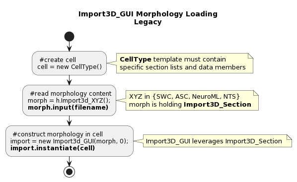
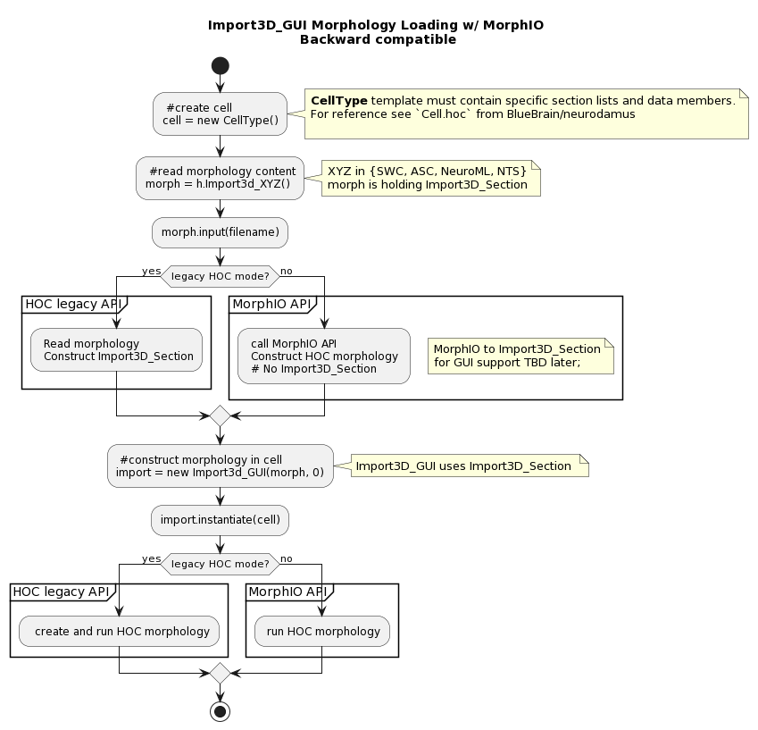

.. _morphology_loading:

Morphology loading in NEURON
============================

Traditionally reading morphologies with NEURON has been coupled to the ``Import3D GUI`` tool. 
The ``Import3D GUI`` tool is a graphical tool that allows the user to load a morphology and then interactively modify it.
:ref:`import3d_tutorial` provides a tutorial on how to use the ``Import3D GUI`` tool.

The underlying implementation is mostly HOC and the GUI constructs can in principle be disregarded, since loading numerous morphologies for simulation does not make any use of them.
Note it is possible possible to load HOC-bound morphologies, but also Python-bound morphologies (refer to :ref:`bio_faq`).

HOC Morphology Loading - Legacy Import3D_GUI
--------------------------------------------

A HOC ``CellType`` needs to be instantiated and the Import3D stack will be used to load the morphology. 

Please refer to `Cell.hoc from BlueBrain/neurodamus <https://github.com/BlueBrain/neurodamus/blob/8263f1d70995d5815c30691d2b14ef4a840ff356/core/hoc/Cell.hoc>`_ for an example of HOC ``CellType``.

The ``instantiate`` method of Import3D stack will create a list of HOC commands that will be executed to load the morphology.

Given a simple single point soma simple Neurolucida morphology ::

    ; This is the same morphology as simple.swc
    ;
    ;           (0, 5)
    ; (-5, 5)----- ------ (6, 5)
    ;             |
    ;             |
    ;             |
    ;             | Type = 3
    ;             |
    ;             o origin
    ;             |
    ;             | Type = 2
    ;             |
    ;             |
    ;(-5, -4)----- ------ (6, -4)
    ;           (0, -4)

    ("CellBody"
    (Color Red)
    (CellBody)
    (0 0 0 2)
    )

    ((Dendrite)
    (0 0 0 2)
    (0 5 0 2)
    (
    (-5 5 0 3)
    |
    (6 5 0 3)
    )
    )

    ((Axon)
    (0 0 0 2)
    (0 -4 0 2)
    (
    (6 -4 0 4)
    |
    (-5 -4 0 4)
    )
    )

``instantiate`` will parse the file and create the following HOC commands
that will be executed in the HOC interpreter, thus loading the morphology: ::

    create soma[1]
    forsec "soma" somatic.append
    create axon[3]
    forsec "axon" axonal.append
    create dend[3]
    forsec "dend" basal.append
    forall all.append
    soma { pt3dadd(1, 1.7484555e-07, 0, 1) }
    soma { pt3dadd(0.94581723, -0.32469952, 0, 1) }
    soma { pt3dadd(0.78914064, -0.61421257, 0, 1) }
    soma { pt3dadd(0.54694813, -0.83716649, 0, 1) }
    soma { pt3dadd(0.24548566, -0.96940023, 0, 1) }
    soma { pt3dadd(-0.082579389, -0.99658448, 0, 1) }
    soma { pt3dadd(-0.40169525, -0.91577339, 0, 1) }
    soma { pt3dadd(-0.67728162, -0.73572391, 0, 1) }
    soma { pt3dadd(-0.87947375, -0.47594735, 0, 1) }
    soma { pt3dadd(-0.98636132, -0.16459456, 0, 1) }
    soma { pt3dadd(-0.98636132, 0.16459462, 0, 1) }
    soma { pt3dadd(-0.87947375, 0.47594741, 0, 1) }
    soma { pt3dadd(-0.67728156, 0.73572391, 0, 1) }
    soma { pt3dadd(-0.4016954, 0.91577333, 0, 1) }
    soma { pt3dadd(-0.08257933, 0.99658448, 0, 1) }
    soma { pt3dadd(0.2454855, 0.96940029, 0, 1) }
    soma { pt3dadd(0.54694819, 0.83716649, 0, 1) }
    soma { pt3dadd(0.78914052, 0.61421269, 0, 1) }
    soma { pt3dadd(0.94581723, 0.32469946, 0, 1) }
    soma { pt3dadd(1, 0, 0, 1) }
    soma connect axon[0](0), 0.5
    axon[0] { pt3dadd(0, 0, 0, 2) }
    axon[0] { pt3dadd(0, -4, 0, 2) }
    axon[0] connect axon[1](0), 1
    axon[1] { pt3dadd(0, -4, 0, 2) }
    axon[1] { pt3dadd(6, -4, 0, 4) }
    axon[0] connect axon[2](0), 1
    axon[2] { pt3dadd(0, -4, 0, 2) }
    axon[2] { pt3dadd(-5, -4, 0, 4) }
    soma connect dend[0](0), 0.5
    dend[0] { pt3dadd(0, 0, 0, 2) }
    dend[0] { pt3dadd(0, 5, 0, 2) }
    dend[0] connect dend[1](0), 1
    dend[1] { pt3dadd(0, 5, 0, 2) }
    dend[1] { pt3dadd(-5, 5, 0, 3) }
    dend[0] connect dend[2](0), 1
    dend[2] { pt3dadd(0, 5, 0, 2) }
    dend[2] { pt3dadd(6, 5, 0, 3) 

HOC Morphology Loading with MorphIO
-----------------------------------

Given that legacy morphology loading is implemented in HOC, it does incur a performance penalty.
To that end, we are implementing a new mechanism for loading morphologies in NEURON, using the `MorphIO <https://github.com/BlueBrain/MorphIO>`_ library.

The goal is to provide an API that will be backward compatible with the legacy mechanism, but will be implemented in C++ and will be more performant.
Ultimately, it would even be possible to remove the legacy mechanism, but that is not straightforward, as we need to couple it to the Import3D GUI/CellBuilder(see:ref:`cell_builder`).

