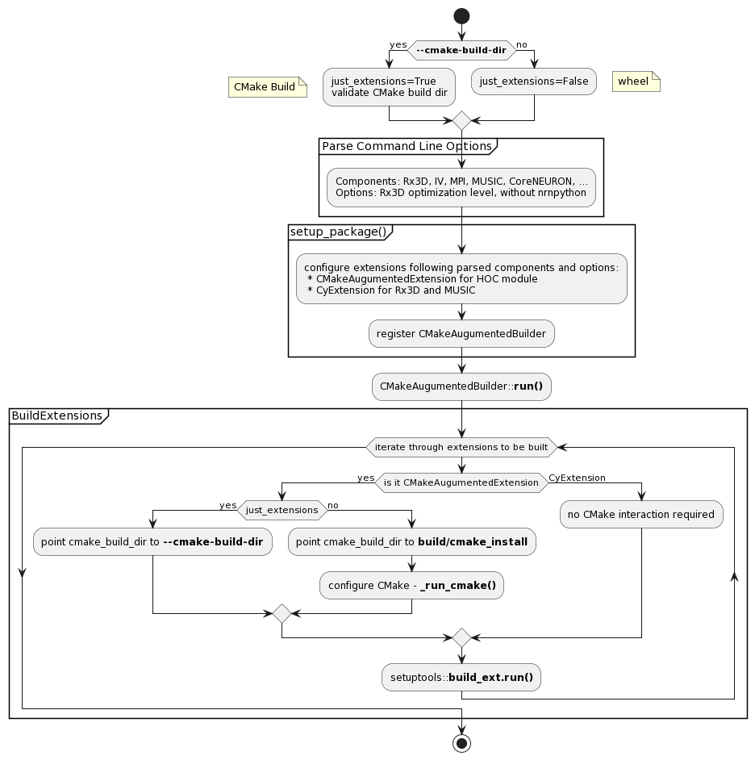

# setuptools

## **setup.py**

Traditionally **distutils** has been used, and **setuptools** ended up having its own internal copy. A lot of effort has been put into coping with the deprecation of **distutils** and accomodating **setuptools**. Furthermore, **setup.py** will also be discontinued and we will probably have to move on to **setuptools.build_meta** or find another way to package wheels and perform CMake builds.

 NEURON has several Python extensions
* HOC module (setuptools Extension with our CMake sauce on top)
* three Rx3D extensions (Cython extensions)
* MUSIC (Cython extension)

## **Operational Modes**

We use [setup.py](../../../setup.py) in two operational modes
:

1) **wheel building**
    It boils down to

        setup.py build_ext bdist_wheel

    We configure the HOC extension along with a CMake configure, build all extensios and collect them for the wheel. This is called via [build_wheels.bash](../../../packaging/python/build_wheels.bash).

2) **CMake build**
    It boils down to

        setup.py build_ext build

    We provide the cmake build folder, in this mode we do not run CMake configure, we build all extensions and make sure they are integrated into the CMake build and install. This is called via CMake in [src/nrnpython/CMakeLists.txt](../../../src/nrnpython/CMakeLists.txt) by passing **--cmake-build-dir** (the folder where we configured NEURON with CMake), along with other CMake options.


## **Activity Diagram**




## Creating a Development Python Package

`setup.py` can be lanched manually as well to create a dev build package, which can be tested
immediately. It supports several arguments to that the build can be tuned:

```
 --disable-rx3d       Disables Rx3d. Implies CMake -DNRN_ENABLE_RX3D=OFF
 --disable-iv         Disables IV. Implies CMake -DNRN_ENABLE_INTERVIEWS=OFF
 --disable-mpi        Disables MPI. Implies -DNRN_ENABLE_MPI=OFF and disabling of neuronmusic
 --enable-music       Enables neuronmusic
 --enable-coreneuron  Enables experimental CorenNeuron support
 --rx3d-opt-level     Sets the rx3d optimization level. Default: 0 (-O0)
 --cmake-build-dir    Declares one wants to use a specic NEURON build (with CMake), instead
                      of creating one behind the scenes. Only builds extensions and package.
```

A quick build for testing a change to a core component could therefore be:
```
python setup.py build --disable-rx3d --disable-iv --disable-mpi
```

---
**Mac Note**

Since the introduction of Mac with Apple silicon, with an Official Python distribution, extension are simultaneously built for arm64 and x86_64. Besides not required for a dev build, it may fail
on older SDKs with `Unsupported architecture` errors.

To skip that you may set the ARCHFLAGS environment var. Set it to "" (empty) for default architecture: `ARCHFLAGS='' python setup.py ...`

---

### Testing

Once built, the package may be imported and used normally. You might, however, need to set up
PYTHONPATH accordingly for the import to work:

```
export PYTHONPATH="<NRNDIR>/build/lib.macosx-10.9-x86_64-3.9/:$PYTHONPATH"

# Run Neuron base tests
python -c "import neuron; neuron.test()"
```
