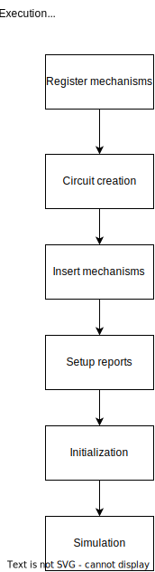

Workflow Code Paths
###################

The intention of the following section is to give an overview of important functions and code paths executed to perform certain actions.

NEURON simulations
------------------

A summary of the workflow of a typical ``NEURON`` simulation can be given with the following graph:

The parts of the simulation can be described as:

Register Mechanisms
^^^^^^^^^^^^^^^^^^^

Mechanisms in ``NEURON`` are defined in ``.mod`` files. Apart from some built in mechanisms if the user wants to use any additional mechanisms those need to be compiled using the `nrnivmodl` executable.

The ``nrnivmodl`` executable translates the ``MOD`` files from the ``NMODL`` language to ``C++``. Those ``C++`` files apart from the computation kernels also include a function named ``<mechanism_name>_reg_(void)`` that is essential for registering the mechanism functions in ``NEURON`` so that later the user can ``insert`` the mechanism in the needed compartments.

.. raw:: html
    :file: mechanism_registration.svg

Circuit creation
^^^^^^^^^^^^^^^^

During this part of the simulation the segments, sections and their connections are created. All these are created based on the circuit which is defined by the users in Python or HOC scripts with the respective API.

See: :ref:`topology` and :ref:`hoc_topology`.

During this part all the ``Node`` s are created as well as the ``Section`` s.

See C++ documentation: `Node <https://neuronsimulator.github.io/nrn/doxygen/struct_node.html>`_, `Section <https://neuronsimulator.github.io/nrn/doxygen/struct_section.html>`_ and `SectionPool <https://neuronsimulator.github.io/nrn/doxygen/cxprop_8cpp.html#af7ff12d644d3eb29873e7fd2c7b9a18b>`_.

The call graph of this part can be found below:

.. raw:: html
    :file: circuit_creation.svg

Insert Mechanisms
^^^^^^^^^^^^^^^^^

After registering the mechanisms the user can insert them in the needed compartments. To do so they need to call the ``insert`` function on the proper section. 

.. raw:: html
    :file: insert_mechanism.svg

Memory allocation of field data
^^^^^^^^^^^^^^^^^^^^^^^^^^^^^^^

During the mechanism insertion the needed data structures to hold their data are also allocated. This is done by appending to the SoA data structures of the data a new element for the newly inserted mechanism.

.. raw:: html
    :file: memory_allocation.svg

Initialization
^^^^^^^^^^^^^^

After all the simulation ``Section`` have been created, along with the data structures assigned to them and their mechanisms, all the underlying data structures are ordered and initialized. At this stage, the ``INITIAL`` blocks of the inserted ``MOD`` files are also executed.

.. raw:: html
    :file: initialization.svg
