.. _cellbuilder1:

Creating a stylized ("stick-figure") model cell
===============================================

Our goal is to build an extremely simplified model of a pyramidal cell.

This model will have a soma, an apical dendritic tree with a primary trunk and two distal branches, a basilar tree that is lumped into a single equivalent cylinder, and an axon (see table for dimensions). The soma and axon will have HH spike currents at normal density. The apical dendrites will also have spike currents, but only at 10% of the density in the soma and axon. The basilar dendrites are to be passive.

.. list-table::
   :header-rows: 1

   * - Section
     - Geometry L (µm)
     - diam (µm)
     - Biophysics
   * - soma
     - 20
     - 20
     - hh
   * - ap[0]
     - 400
     - 2
     - reduced hh :superscript:`†`
   * - ap[1]
     - 300
     - 1
     - reduced hh :superscript:`†`
   * - ap[2]
     - 500
     - 1
     - reduced hh :superscript:`†`
   * - bas
     - 200
     - 3
     - pas
   * - axon
     - 800
     - 1
     - hh

† In the apical dendrites, ``gnabar_hh`` and ``gkbar_hh`` are reduced to 10% of normal,
and el_hh (equilibrium potential of the hh leak current) is changed to -64 mV.
In the basilar dendrite, e_pas is -65 mV. With these values, resting potential is
approximately -65 mV throughout the cell.
Other parameters: cm = 1 µf/cm2, Ra = 160 ohm cm.

Step 1. Bring up a CellBuilder
------------------------------

Bring up a CellBuilder by clicking on :menuselection:`Build --> Cell Builder`.

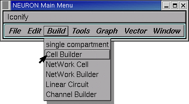

Release the mouse button and a CellBuilder appears.
This one is called ``CellBuild[0]``.

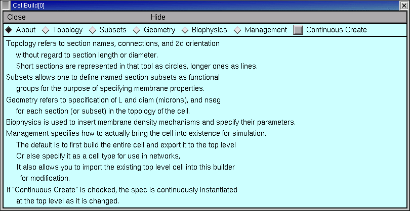

Across the top of the CellBuilder is an array of radio buttons labeled Topology, Subsets, Geometry, Biophysics, and Management. Each button brings up a different page of the CellBuilder. There is also a checkbox labeled Continuous Create. We're going to see how to use these controls to build a model cell.

Next we will set up the branched architecture of our model cell.

Step 2. Specify topology
------------------------

Clicking on the Topology button brings up the Topology page of the CellBuilder. This is where we set up the model's branching pattern by making sections and connecting them to each other.

*A word about the Hints button. There's a Hints button on almost every page of the CellBuilder (the sole exception is the "About" page). Each page's Hints button brings up a window full of useful tips for that particular page. Many of these go beyond what we can cover in this tutorial, so you're going to want to check them out for yourself.*

The large white area is the CellBuilder's "canvas," which shows the sections in our model cell. When a CellBuilder is first created, it comes up with a section called soma.

The radio buttons just to the right of the canvas control what happens when we click on the canvas. Notice that the CellBuilder starts up in "Make Section" mode.

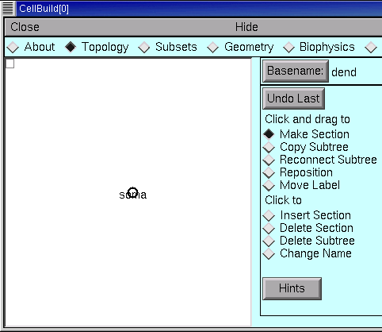

In "Make Section" mode, clicking on the canvas spawns a new section. If we just started clicking away, these new sections would be called dend[0], dend[1],  . . . because the Basename is "dend" (look to the right of the Basename button, next to the canvas's right upper corner).

Let's do this right. We want to set up the apical dendrites, and we want them to be called ap[0], ap[1], and ap[2], so we need to change the Basename to ap.

To do this, click on the Basename button.

This brings up a window with an editable field.
Click inside this field.

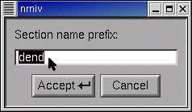

Type the new Basename, then click on Accept.

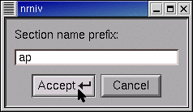

Now the Basename is ap (see for yourself!) and we can start to build the apical tree.

To make a new section, position the cursor just to the right of the soma  . . .

. . . press the left mouse button  . . .

. . . and hold it down while dragging the section to the desired length.

Then release the button.

Comments:

    1. The soma isn't really a circle or a sphere--it's a cylinder, like every other section. By default, the CellBuilder draws short sections as a circle so they're easier to see. :superscript:`‡` The 0 and 1 ends of the soma are on the left and right sides of the circle.

        ‡ You can toggle this behavior on and off by going to the Management / Import page and clicking on the box "Don't draw short sections as circles".

    2. Notice that a new section springs into existence as a "rubber band" that connects the tip of the cursor to the nearest end of an existing section.

To make the distal apical branches, start by placing the cursor just to the right of the distal end of ap, then click and drag to arrange the new sections as shown in the Outline of this tutorial.

Next create the basilar branch and the axon in the same way. Use the other buttons as necessary (Basename, Undo Last, Delete Section, Change Name etc.). Finally, move the labels so they are next to the sections, not on top of them (hint: use Move Label).

Time to :ref:`save everything to a session file <saveses>`! Let's call it ``cell.ses``

Next we specify the subsets.

Step 3. Specify subsets
-----------------------

The Subsets page is for grouping sections with similar features into subsets. This will make our job much easier when it comes time to assign biophysical properties.
*This page is also for specifying rules, if any, that govern spatially inhomogeneous parameters that vary systematically with location. We'll use this feature in the second CellBuilder tutorial.*

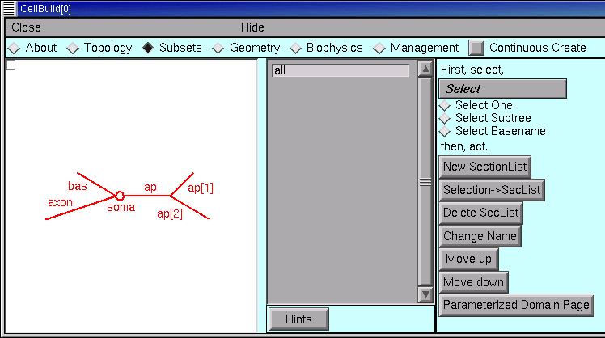

The gray panel in the middle of the Subsets page lists the names of all sets of sections. At first, the only set is "all", which contains every section in the model. We'll need this, so let's leave it alone.

Each of the apicals has identical active currents, so let's make a subset called apicals.

Click the Select Subtree radio button.

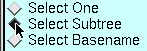

Then click on the root section of the apical tree (i.e. the section called ap).
Notice that the entire apical tree is red, and the unselected sections are black.

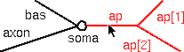

Also notice this message in the list of sets :

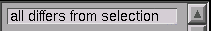

Now click on the New SectionList button (that's right, programmers--these "sets" are implemented with :class:`SectionList`).

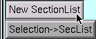

Click in the edit field of the window that pops up.

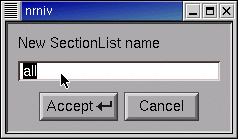

Type the name of the new SectionList, and then click on Accept.

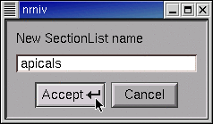

Notice the new item in the list of sets.

.. image:: fig/subset2.gif

Quick, before we lose anything, save this CellBuilder to a session file!

Now think--do we need to create any more sets? The answer is no.

Also ask if we need to change the order of subsets. Sequence is important if a section appears in more than one set, because sequence determines the order in which Geometry and Biophysical properties are assigned. If a section appears in more than one set, earlier assignments may be overwritten by later assignments. So the order of sets should to go from general to specific.

The sequence we have here is fine.
We're ready to move on to geometry.

Step 4. Specify geometry
------------------------

The Geometry page lets us specify the physical dimensions of the sections in our model, and how NEURON will compartmentalize the model (nseg).

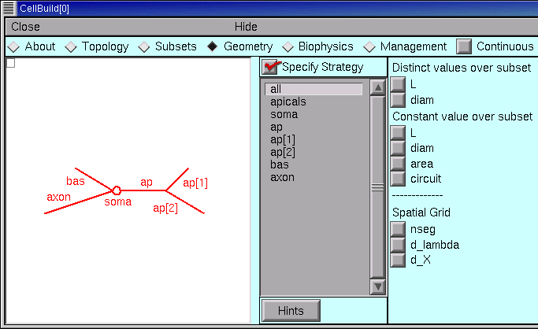

Set up a strategy
~~~~~~~~~~~~~~~~~

The first thing we need to do is to set up an efficient strategy for assigning L, diam, and nseg. The aim is to figure out how to specify these parameters in a way that requires the least effort. So we start with the Specify Strategy checkbox ON (checked). After we have built our strategy, we will toggle the Specify Strategy checkbox OFF, and then we can enter numeric values for these parameters.

    An important aside: when planning a strategy, keep the sequence of subsets and sections in mind. If the order isn't right, or if you need more subsets, then go back to the Subsets page and make the necessary changes.

We begin by dealing with the spatial grid (i.e. discretization or compartmentalization). This is really just a computational issue, not a biological one--we should be focussing on anatomically- and physiologically-relevant subdivisions of the cell, not "how small should the pieces be to get numerical accuracy and stability."

The CellBuilder offers three different ways to make this as painless as possible.

1. The "nseg" button lets us set nseg manually.
2. The "d_X" button lets us specify a maximum physical length, in microns, for each segment.
3. The "d_lambda" button is probably the best all-round choice. This lets us specify a maximum length for each segment, expressed as a fraction ("d_lambda") of the AC length constant at 100 Hz for a cylindrical cable with the same diameter, Ra, and cm. We'll return to this topic later.

If we choose d_X or d_lambda, the CellBuilder will always set nseg to an odd number. This ensures that each section will have a node exactly halfway down its length, which makes a lot of sense (see "Why should I use an odd value for nseg?" in the FAQ list). If we enter nseg manually, we can specify an even or odd number as we like.

Let's apply the d_lambda strategy to every section in the model. Click on the "all" subset to make sure it is selected, and glance at the shape plot just to check--every section should be red. Then click on the d_lambda checkbox.

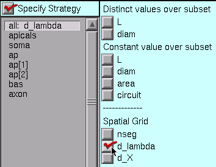

Each section of our model is a different size, so we need to specify L and diam individually for every one of them. With versions of NEURON prior to 5.7, this would have required us to select each section individually, and click on its L and diam buttons. That's a lot of clicks.

However, starting with NEURON 5.7 we can save a few clicks by using the "Distinct values over subset" buttons. These tell the CellBuilder that each member of a subset has its own value of L (and/or diam).

So let's stick with the "all" set, and click on the "Distinct values over subset" L and diam buttons.

    And if we had a set whose members should have identical lengths, we'd click on the "Constant value over subset" L button, etc..

This is what the strategy should look like now.

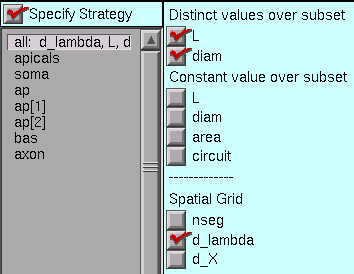

Having set up the strategy, we're ready to implement it. But first, save a session file!

Execute the strategy
~~~~~~~~~~~~~~~~~~~~

Click on the Specify Strategy box to turn it OFF.

The right panel of the Geometry page now contains a set of buttons with numeric fields and spinners which we can use to enter the values of d_lambda, L, and diam. The sequence of these controls parallels their sequence in the middle panel of the CellBuilder.

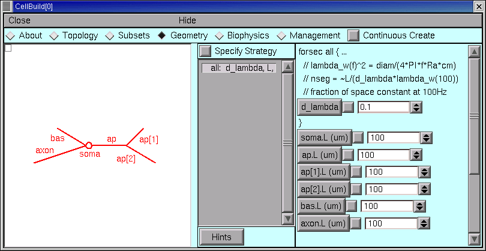

The first parameter is d_lambda, which controls the spatial grid. Its default value is 0.1, i.e. one tenth of a length constant at 100 Hz, This is short enough for most models, so we can leave it alone. We can always come back later and try a different value if we like.

All of the lengths need to be changed.

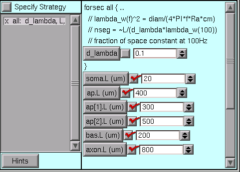

But where are the diameters?

The drag bar at the right edge is our clue--we only have to pull it down . . .

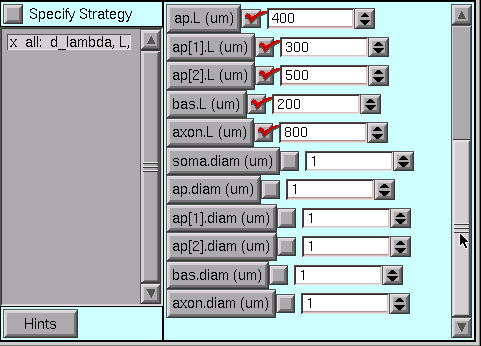

. . . to see that some diameters also need changing.

Here they are with the desired values.

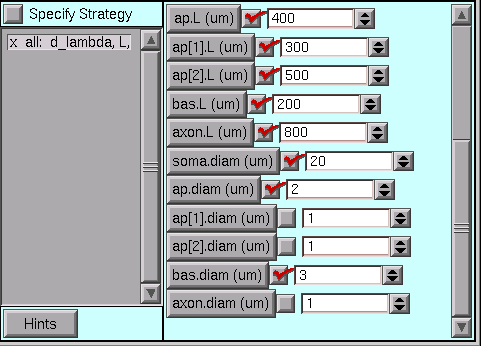

Time once again to save a session file!

Step 5. Specify biophysics
--------------------------

The Biophysics page is where we specify the biophysical attributes (e.g. Ra, cm, ion channels, buffers, pumps) of subsets and individual sections. Just like we did in the Geometry page, we first set up a strategy, and then review and adjust parameter values. So be sure to start with Specify Strategy ON.

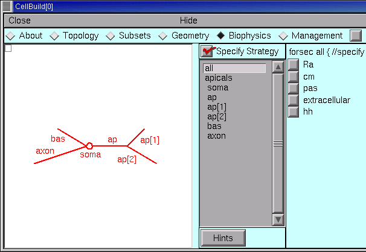

Once again, remember that the specification will be executed in the same order as is shown in the list of subsets and sections. If the order isn't right, or if you need more subsets, go back to the Subsets page and make the necessary changes--and then check the Geometry and Biophysics pages to make sure that your changes didn't break anything.

Set up a strategy
~~~~~~~~~~~~~~~~~

Ra and cm are uniform in this particular model, so we select the "all" subset and then click on the Ra and cm checkboxes.

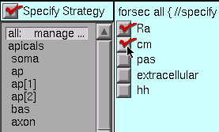

Notice that when you select a subset or section in the middle panel, the string above the column of checkboxes changes accordingly, i.e. in this case it reads "forsec all {". Also notice that the corresponding part of the shape plot turns red
(you are working along with this tutorial, aren't you?). These visual reminders can help you verify that

    1. the subsets have been properly constructed
       and
    2. you're assigning properties to the right section or subset.

The apicals have the hh mechanism, so we click on apicals and then on hh.

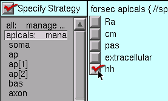

The soma and axon also have hh, while the basilars have pas

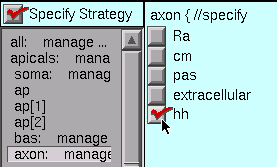

Now we are ready to click on the Specify Strategy box to turn it OFF,

Execute the strategy
~~~~~~~~~~~~~~~~~~~~

The middle panel of the Geometry page lists all of the sets and sections that we selected when we set up our strategy. Beneath each set or section name we also see, indented slightly, the names of the mechanisms that we are inserting. We proceed by clicking on each mechanism, and review and adjust its parameters according to the design we layed out for this model.

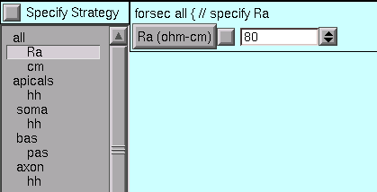

Right off the bat, we see that the value of Ra is not right for the "all" subset.

So we change it to the desired value.

.. image:: fig/allravalue1.gif

The default value of cm is OK (1 µf/cm :superscript:`2` -- you did check it, right?), so we leave it alone.

For the apicals subset, we must change gnabar_hh, gkbar_hh, and el_hh from their defaults . . .

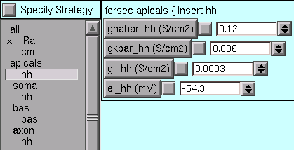

. . . to what we need.

.. image:: fig/apicalshhvalues1.gif

*Notice that an x marks each mechanism with one or more parameters that have been changed from their defaults.*

The soma and axon sections use the default hh values.

For the bas section, we change e_pas from its default (-70 mV) to the desired value (-65mV).

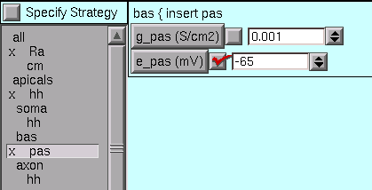

We're almost done -- but first, save this to a session file!

Next we consider how to use the model specification, and what can be done with the Management page.

Step 6. Use the model specification
-----------------------------------

Now that the CellBuilder contains a complete specifcation of our model, how do we use it? We have three alternatives :

* use "Continuous Create"
* save this model cell to a hoc file ("export" hoc code)
* save this model cell to a hoc file as a class definition (save it as a "cell type")

Let's consider each of these.

Using "Continuous Create"
~~~~~~~~~~~~~~~~~~~~~~~~~

It may come as a surprise, but if you followed the instructions up to this point, no sections will actually exist. You can test this for yourself by executing a couple of simple Python (or HOC) commands.

At the Python interpreter's ``>>>`` prompt, (assuming you already did a ``from neuron import h``) enter

.. code:: python

    h.topology()

(If you instead have an ``oc>`` prompt, you're using HOC as your interpreter, and should simply type ``topology()`` instead.)

If sections exist, you will see a crude but informative on-screen printout that shows how they are interconnected.

Now see what happens when you type the Python command

.. code:: python

    for sec in h.allsec():
        h.psection(sec=sec)

(For HOC, enter ``forall psection()`` instead.)

This prints a brief text summary of the properties of each existing section. (For a machine-readable version in Python, use the ``sec.psection()`` method which returns a dictionary instead.)

But there aren't any sections yet, so these commands print out nothing.

It might help to think of the CellBuilder as being roughly analogous to one of those on-line airline ticket sellers. You can tinker with origin and destination, dates of departure and return, connecting flights, etc., as much as you like, but you don't get a ticket until you click on the "Submit order" button.
The most convenient way to work with the CellBuilder, at least during model development, is to use the Continuous Create checkbox.

Turning Continuous Create ON . . .

. . . makes the CellBuilder send hoc straight to NEURON's interpreter without bothering to write a script (Python or HOC) file.

Presto! Suddenly, your model cell exists (test this as above).

Any changes made to the model while Continuous Create is ON will automatically be echoed to NEURON's interpreter. This lets you immediately test the model you just created or revised.

Automatic updates may bog things down if you are dealing with a large model on a slow machine. If this happens, just turn Continuous Create OFF.

Then make whatever changes you want, and when you're done just toggle Continuous Create ON and then OFF again.

A very practical way to work with a configured CellBuilder, at least for single cell modeling, is to save it to a session file with Continuous Create ON. Then reading this file will automatically recreate the model cell.

Here's a concrete example of how to do this.

1. Turn Continuous Create ON and save the CellBuilder we just built to a session file called :file:`mycell.ses`
2. Create a Python file called :file:`init.py`, and put these statements in it:

   .. code:: python

      from neuron import h, gui
      h.load_file("mycell.ses")

3. Start NEURON and have it read :file:`init.py` by typing ``python -i init.py`` on a terminal.
4. Use the NEURON Main Menu toolbar to construct a custom graphical user interface that has the following items:
   
   * A RunControl panel
   * An IClamp that applies a 0.6 nA x 1.0 ms current pulse to the soma starting at t = 5 ms.
   * A graph of somatic membrane potential vs. time. Since the CellBuilder automatically makes the soma be the default section, all you have to do is click on
     Graph / Voltage axis in the NEURON Main Menu.

5. Run a test simulation with Tstop = 20 ms to make sure that things work.
6. Use the Print & File Window Manager to save the RunControl, IClamp, and voltage graph to a session file called iclamprig.ses (after all, this is a "virtual experimental rig").
7. Exit NEURON and edit :file:`init.py` so that it reads

   .. code:: python

      from neuron import h, gui
      h.load_file("mycell.ses")
      h.load_file("iclamprig.ses")
  
Now when you run ``python -i init.py``, up comes your CellBuilder, which recreates your model cell, and you also get your custom experimental rig, all ready for you to run some current clamp simulations, as shown here :

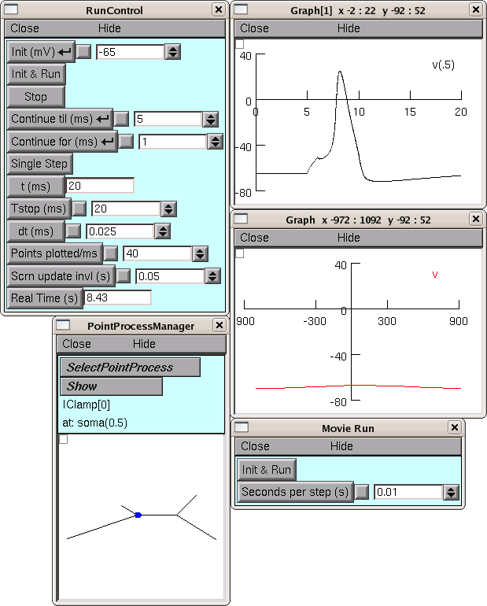

*The CellBuilder was hidden for this illustration, in order to save screen space.*

Modular programming and reusable code
-------------------------------------

You might think of :file:`mycell.ses` as being roughly analogous to the wet lab experimentalist's neuron in a brain slice or tissue culture. It's a "virtual experimental preparation," and it's reusable--you can construct many different kinds of "custom experimental rigs" to do "virtual experiments" on it.

For instance, you could set up an interface that uses an SEClamp to do voltage clamp experiments, and save it to a file called something imaginative like :file:`vclamprig.ses`. In that case, it would make sense to have two init files with different contents and descriptive names, like this:

  initiclamp.py

    .. code:: python

       from neuron import h, gui
       h.load_file("mycell.ses")
       h.load_file("iclamprig.ses")

  initvclamp.py

    .. code:: python

       from neuron import h, gui
       h.load_file("mycell.ses")
       h.load_file("vclamprig.ses")

Also note that :file:`iclamprig.ses` and :file:`vclamprig.ses` are reusable with any model that happens to have a default section called soma.

This is an example of the benefits of "modular programming" (i.e. keeping the model specification (CellBuilder) separate from the specification of the instrumentation (RunControl + IClamp + graph)) and "reusable code."

Exporting hoc code vs. saving a cell type
-----------------------------------------

The Management page contains the CellBuilder's controls for exporting hoc code and saving a model as a cell type. This page also can be used to import models, which we will consider in the second tutorial.

The Export button is for saving a hoc file that contains the basic specification of the model cell. This is OK if you intend to work on a single cell model.

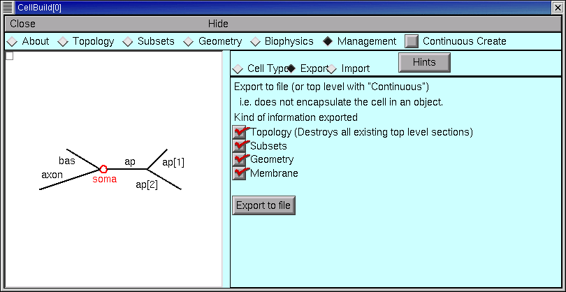

If your aim is to define a new cell class for use in a network model, you'll want to click on the Cell Type radio button.

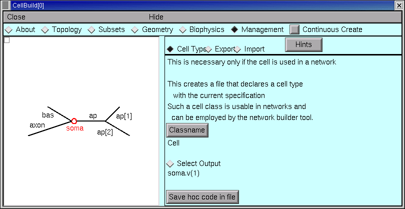

Always save your configured CellBuilder to a session file
---------------------------------------------------------

Experience shows that, sooner or later, most models need to be revised. This is especially true of models that seem at first to be perfect in all regards. Saving a configured CellBuilder to a session file usually simplifies future revisions, because it's easier to use the CellBuilder than to decipher idiosyncratic old code. Especially somebody else's idiosyncratic old code. You should save your configured CellBuilder to a session file even if you have already written a hoc file with the Management page's Export or Cell Type functions.

"But wait," someone asks, "can't the CellBuilder import a model cell?"

Not entirely. At present the CellBuilder can import topology and pt3d information, which is very useful, as we will see in the next tutorial. However, it can't import subsets, geometry (L, diam, and nseg), or biophysical properties. So throwing away a CellBuilder is "breaking the mold" -- you lose all the time and effort you invested setting it up.

