Managing a model cell with complex anatomy
==========================================

The CellBuilder can be very helpful for specifying the spatial grid and biophysical properties of cell models that are based on detailed morphometric reconstructions. In this tutorial, we will construct a model cell that borrows the anatomy of the pyramidal neuron that is included with NEURON's demonstration program.

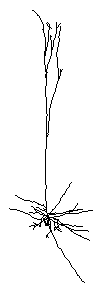

We'll use the CellBuilder to assign these biophysical properties to our model:

.. list-table::
   :header-rows: 1

   * - Section
     - Biophysics
     - Notes
   * - soma
     - hh
     - 
   * - axon
     - hh
     -
   * - basilar dendrites
     - pas
     - e_pas = -65 mV; g_pas = 3.333e-5 S / cm2 (Rm = 30,000 ohm cm2)
   * - apcial dendrites
     - pas

       hh
     - e_pas and g_pas as in basilar
     
       gnabar_hh and gkbar_hh reduced to 10%; gl_hh = 0 (already has g_pas)

Throughout the cell, cm = 1 µf/cm :superscript:`2`, Ra = 160 ohm cm.

Step 1: Get the cell's anatomy into a CellBuilder
-------------------------------------------------

1. Run NEURON's demo program by double clicking on the neurondemo icon (MSWin, macOS) or typing neurondemo at the system prompt (UNIX/Linux).
2. In the NEURON Demonstrations window, click on the "Pyramidal" radio button.
3. Bring up the CellBuilder. This is a new CellBuilder, so it should only show a soma.
4. Select the Management page, then select the "Import" radio button.
5. Near the bottom of the CellBuilder is a button labeled "Import". Click on that button.

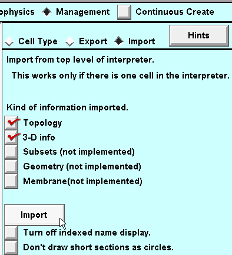

You will be warned that Import will discard whatever information is already in the CellBuilder, replacing it with a copy of information about the model cell that exists in the interpreter.

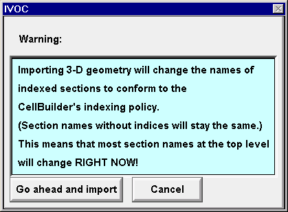

Click on "Go ahead and import".

Now the CellBuilder contains the pyramidal cell's topology and geometry.

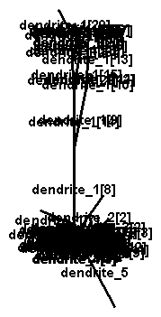

Looks pretty messy.

Turning "indexed name display" off will clean things up a bit.

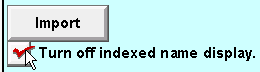

This is much clearer.

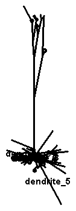

The CellBuilder now has all of the topology (branched architecture) and geometry (length and diameter) data of the detailed anatomical pyramidal cell model. We don't have to bother creating any sections ourselves, or specifying L or diam for any of them.

Save the CellBuilder to a :ref:`session file <saveses>` (call it :file:`rawpyr.ses`) and exit the demo program.

Then restart NEURON and retrieve :file:`rawpyr.ses`. This reduces the chance of running into "variable name conflicts".

Next we will create subsets that will be helpful when it comes time to specify biophysical properties.

Step 2. Create subsets
----------------------

While subsets can be helpful in the management of stylized models, they are absolutely essential for dealing with anatomically detailed models.

The CellBuilder gives us an "all" subset automatically.

What other subsets do we need? Let's look back at the table of desired biophysical properties, and think about our biophysics strategy for a moment.

* We'll need an "apicals" subset.
* For the sake of clarity we will also want to have an "axon" subset, because the anatomical axon ended up with the name "dendrite_5" when it was imported into the CellBuilder. Making a subset called "axon" that contains dendrite_5 will allow us to use an anatomically meaningful name when we need to refer to the axon.

And that's it. We only need to set up an "apicals" subset and an "axon" subset.

"Creating these subsets is left as an exercise for the reader."

Here's what the Subsets page looks like to start. Have at it.

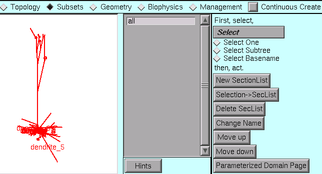

Hints:

1. Select Subtree.
2. If necessary use "shift click" or "click and drag" to select several sections, one at a time.
3. It may be helpful to zoom in.

We're ready to deal with the spatial grid.

Step 3. Specify the spatial grid
--------------------------------

In the :ref:`tutorial on creating a stylized model <cellbuilder1>` with the CellBuilder, we learned how to use the CellBuilder to specify the spatial grid. Generally, the best method for specifying the spatial grid of an anatomically detailed model is to apply the d_lambda rule to all sections.

1. Go to the Geometry page and make sure that Specify Strategy is checked.
2. Select the all subset, then make sure that d_lambda is checked.

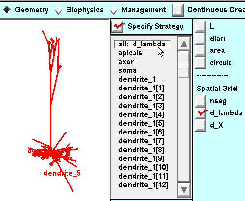

3. Then toggle Specify Strategy OFF and verify that d_lambda is to our liking.

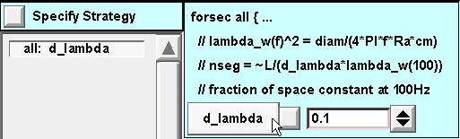

Time to save a session file!

Step 4. Specify biophysics
--------------------------

A. Set up a strategy
~~~~~~~~~~~~~~~~~~~~

Make sure that Specify Strategy is ON.

For the **all** subset: click on Ra, cm, and pas

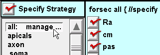

For the **apicals** subset: click on hh

Note: the apicals already have pas because the all subset specification will be executed first.

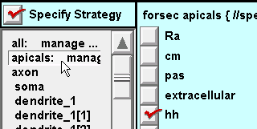

For the **axon** subset and soma section: click on hh.

Also insert pas because we will need to set g_pas = 0 in the axon and soma (remember that the all subset inserted pas with a nonzero g_pas). This crude hack achieves expedience at the cost of clarity--a poor trade at best. It would have been preferable to define subsets that would make this unnecessary, i.e. instead of inserting pas into all sections, do this with a subset called "haspas" that contains all sections except the axon and soma.

"This is left as an exercise for the reader."

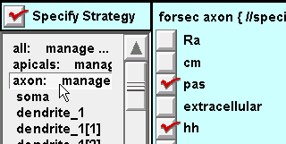

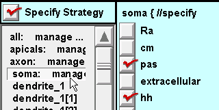

Toggle Specify Strategy OFF, and we are ready to enter the desired parameter values.

B. Execute the strategy
~~~~~~~~~~~~~~~~~~~~~~~

For the **all** subset: assign values to g_pas, e_pas, and Ra

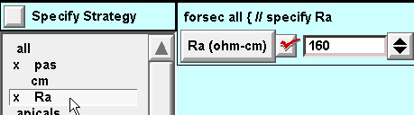

For the **apicals** subset: set desired hh parameters.

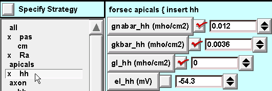

For the **axon** subset: default hh is fine.

Execution of the **all** subset specification inserted pas, so we must set g_pas = 0 for the **axon** subset.

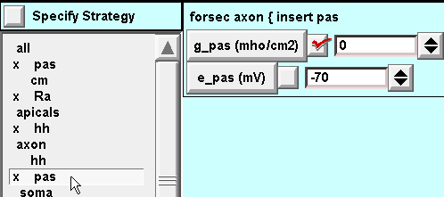

For the **soma** section: same as for the axon subset.

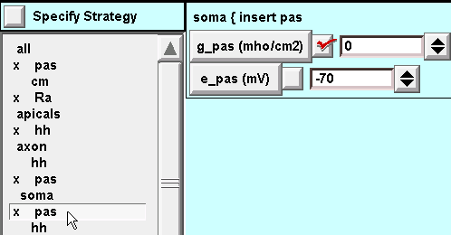

The model specification is complete. Let's save it to a new session file called pyrfin.ses .

We're ready to test the model cell.

Step 5. Use the model specification
-----------------------------------

To use the model cell, just toggle Continuous Create ON and OFF so there will be a representation of the model at the top level of the interpreter.

Here is the response of this model to a 2.0 nA x 1.0 ms current pulse applied to the soma.

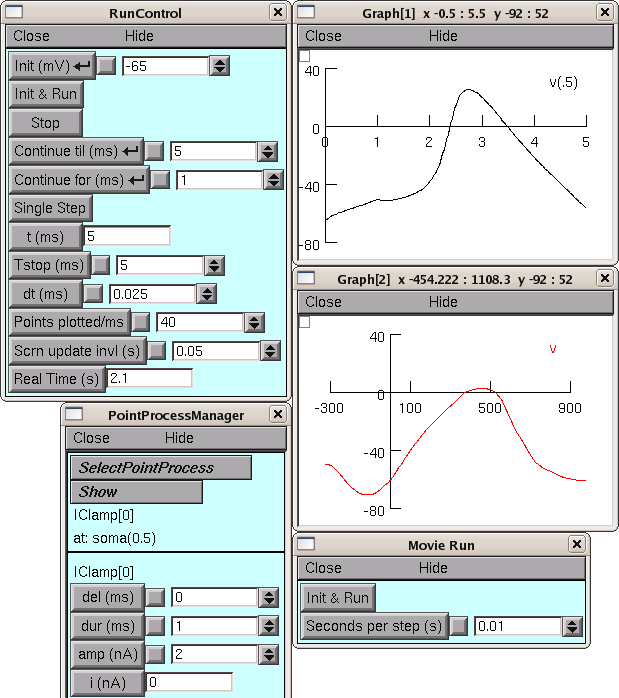

*The CellBuilder was hidden for this illustration, in order to save screen space.*
