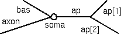
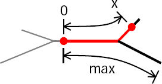

.. _specifying_parameterized_variation_of_biophysical_properties:

Specifying parameterized variation of biophysical properties
============================================================

A large body of experimental data indicates that neuronal membrane properties can be nonuniform. For example, in some cell classes there is evidence that channel densities vary with location in a systematic manner. With the CellBuilder it is possible to specify that channel densities and other biophysical properties are functions of position.

For this tutorial, we return to our stylized model

but now we want ``gnabar_hh``, ``gkbar_hh``, and ``gl_hh`` in the apical dendrites to decrease linearly with distance from the origin of the apical tree.

**Geometry**

.. list-table:: 
   :header-rows: 1

   * - **Section**
     - **L (um)**
     - **diam (um)**
     - **Biophysics**
   * - soma
     -
       20
     - 20
     - 
       hh
   * - ap[0]
     -
       400
     - 2
     - 
       hh*
   * - ap[1]
     -
       300
     - 1
     - 
       hh*
   * - ap[2]
     -
       500
     - 1
     - 
       hh*
   * - bas
     -
       200
     - 3
     - 
       pas
   * - axon
     -
       800
     - 1
     - 
       hh

* ``gnabar_hh``, ``gkbar_hh``, and ``gl_hh`` vary with distance from the origin of the apical tree

1.
    All have "full" density at origin of apical tree.

2.
    Density falls to 0% at the most distant termination.

To ensure that resting potential is -5 mV throughout the cell, e_pas in the basilar dendrite is -65 mV.

Other parameters: cm = 1 uf/cm^2, Ra = 160 ohm cm.

Before we start, let's restate the problem in mathematical terms.

Consider sodium conductance. For every point in the apical tree, we want the sodium conductance density at that point to depend on the fractional, or normalized, distance from the origin of the apical tree to that point. So we want gnabar_hh to vary with p, the normalized distance into the apical tree, according to this formula

gnabar_hh = 0.12 * (1-p) where p = L0x / Lmax

We also want gkbar_hh and gl_hh to be governed by similar formulas.

This is a special case of a more general task: the problem of how to specify that a parameter *param* is some function f of p

param = f(p)

where *p* is one of the following distance metrics:

- path length (along the centroid of sections) from a reference point
- radial distance in space from a reference point
- distance from a plane, e.g. depth from the cortical surface, or distance above or below a cortical layer

If we were trying to do this by writing our own hoc code, we might come up with something like this:

.. code::
    c++

    forsec subset for (x,0) { rangevar_suffix(x) = f(p(x)) }

where p is a function that returns one of the three distance metrics mentioned above

The CellBuilder's uses something called the SubsetDomainIterator class. to help us achieve the same effect very easily, and usually without having to write any code.

Let's see how this works.

:ref:`set_up_a_subsetdomainiterator`

by specifying the subset over which it will iterate, and the distance metric it will use

:ref:`specify_the_model_parameters_to_be_varied`

:ref:`specify_and_verify_the_functions_that_govern_the_parameters`

:ref:`use_the_model_specification`

.. toctree::
    :hidden:

    set_up_a_subsetdomainiterator.rst
    specify_the_model_parameters_varied.rst
    specify_and_verify_the_functions.rst
    use_the_model_specification.rst

