.. _compiling_new_mechanisms_under_mswindows:

Compiling new mechanisms under MSWindows
==================

How to compile mechanisms depends on whether you are using NEURON 5.1 or later or an earlier version (5.0.1 or before).

**Whichever it is, be sure to check units before you compile!** Even the simplest mechanisms can involve parameters and variables that have strange and confusing combinations of units. Unless you're very careful or very lucky, it is all too easy to write code that looks OK but produces results that are wrong by orders of magnitude because of a missing or incorrect conversion factor.

The **modlunit** utility is provided to help detect and correct such errors.

Compiling mechanisms in version 5.1 and later
--------------------

Start by checking units!
+++++++++++++

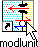

When you're ready to check mod files for consistency of units, go to :menuselection:`Start --> Programs --> NEURON` and select the item 

    modlunit

(I put shortcuts to all of NEURON's icons on my desktop, so they're always just a double-click away).

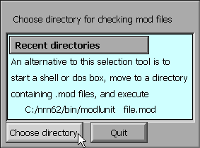

This brings up a window that asks whether your mod files are in a previously used directory, or if you prefer to choose a new directory. For this example, click on the "Choose directory" button.

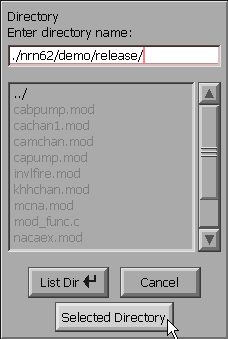

This makes NEURON's directory browser appear. By clicking on directory names and/or direct entry of text into the edit field at the top of this tool, navigate your way to the directory that contains the mod files of interest. Note the UNIX-style path separator, i.e. / instead of DOS's \ .

When you get to your destination (which is probably different from what is shown in this figure), click on the "Selected Directory" button.

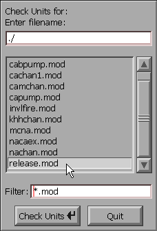

The directory browser changes to a file chooser that allows you to test individual mod files, one at a time. Double click on the mod file that you want to check (or you could single click on the mod file, and then click on the "Check Units" button). An xterm will flash up on the screen, and if everything is OK it will disappear after a second or so. Watch closely, because this can be very quick on a fast PC. After the xterm goes away, the file chooser remains so you can test additional mod files. When you're done with it, click on its Quit button.

For this particular example, I have chosen a mod file that illustrates what happens if modlunit detects a possible units inconsistency.

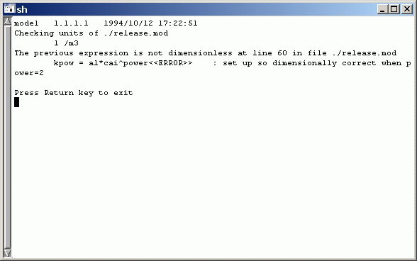

Feeding ``c:\nrn\demo\release\release.mod`` to modlunit generates this message. The DOS box stays on your monitor until you press the Return key.

FYI this particular mod file is really OK despite the rather intimidating message that is printed.

For instructions about how to fix units errors and how to define new units, read this.

Compiling mod files in NEURON 5.1 and later
+++++++++++++++

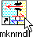

After you're sure that units are consistent, go to :menuselection:`Start --> Programs --> NEURON (or the desktop)` and select the item 

    mknrndll

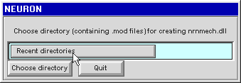

This brings up a window that asks whether your mod files are in a previously used directory, or if you prefer to choose a new directory. For this example, click on the "Recent directory" button.

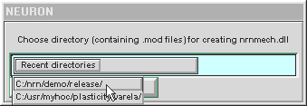

While holding down the mouse button, scroll down the list of recently used directories, and choose the one of interest. Release the mouse button . . .

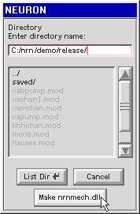

. . . and the directory appears.

Check the names of the mod files to be sure this is the right directory. Also look for any files with the extension o . If an o file is present, mknrndll will know that the corresponding mod file has already been compiled once, and it will not recompile that mod file. To force compilation of all mod files, you must delete all o files.

This is one reason why you need to set Windows Explorer (the file manager) so that it shows all files, and all file extensions.

When you're happy with what you see, click on the "Make nrnmech.dll" button.

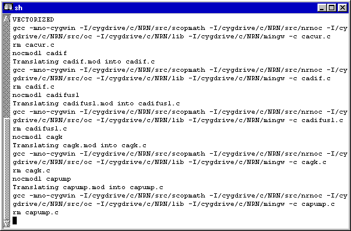

A console window will appear, displaying a slew of messages that scroll by. If all goes well (and it will, for this particular set of mod files), eventually the last message will appear, and the console window will go away on its own.

But I just had to include an example of an error.

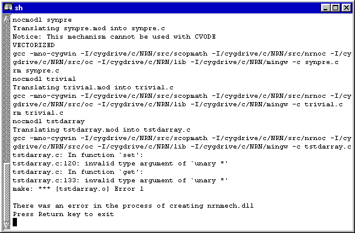

When an error occurs, the window will stop scrolling, and an error message appears. Now you can drag the scroll bar (see left edge of the window) up and down to examine prior messages for possible clues.

Compiling mechanisms in NEURON 5.0.1 and earlier
--------------------

When you're ready to compile mod files, go to :menuselection:`Start --> Programs --> NEURON` and select the item

    mknrndll DOS box

(I put a shortcut to this on my desktop, so it's always just a double-click away).

This brings up a DOS box with the following message:

    Welcome to the mknrndll DOS box!
    Navigate to the directory that contains your mod files,
    then type
        modlunit filename.mod
    to check the units in filename.mod
    or type
        mknrndll
    to create a new nrnmech.dll

Use cd to change to the directory where your mod files are, and you're ready to use modlunit and mknrndll.

Before typing the command

    mknrndll

you should look in the directory for any files with the extension o. If an o file is present, mknrndll will know that the corresponding mod file has already been compiled once, and it will not recompile that mod file. To force compilation of all mod files, you must delete all o files.

When you're finished, just type

    exit

on the command line of the DOS box, and it will go away.

Troubleshooting mknrndll in NEURON 5.0.1 and earlier
+++++++++++++

**Q :** After I enter the mknrndll command, the error message "Out of environment space" appears in the DOS box and no ``nrnmech.dll`` is produced.

**A :** Set the environment space of the mknrndll DOS box to 4096. Details of how to do this depend on the version of MSWindows you're using, but typically it involves right-clicking on the mknrndll DOS box icon on your desktop, selecting the Properties item from the popup window, and then changing the appropriate numeric field. If you didn't put a shortcut to this icon on your desktop, you're probably bringing up the mknrndll DOS box from the MSWindows Start menu, in which case you'll have to use Windows Explorer to go to :menuselection:`Start Menu --> Programs --> NEURON`, then right click on the mknrndll DOS ``box.pif`` file and set the environment to 4096.

