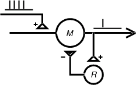

.. _example_hybrid_network:

Example of a Hybrid Network
==========

Conceptual Model
--------

This is the classical recurrent inhibition micronet. Principal neuron *M* (for "motoneuron") receives excitatory input onto its dendrites from some source. *M* in turn excites inhibitory interneuron *R* (for "Renshaw cell"), which projects back onto the soma of *M*.

Computational Model
--------

To implement the computational model we must :

1.
    define the types of cells. We'll use a pair of biophysical models for *M* and *R*, and a NetStim artificial neuron will provide the excitatory drive to *M*.

2.
    create each cell in the network

3.
    connect the cells (this includes specifying parameters such as delays and weights)

Then we will run a simulation and plot the input and output spike trains.

Disclaimer: the anatomical and biophysical attributes assumed in this example were chosen strictly for the sake of convenience and illustration. This model network and its constituent parts are only the palest imitations of biological networks and neurons.

