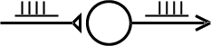

.. _example_of_simple_network:

Example of a Simple Network
=========

Conceptual Model 
--------

Artificial Integrate and Fire cell with a synapse that is driven by an afferent burst of spikes.

Computational Model
---------

To implement the computational model we must:

1.
    define the types of cells (and stimulators)

2.
    create each cell in the network

3.
    connect the cells (this includes specifying parameters such as delays and weights)

Then we will run a simulation and plot the input and output spike trains. 