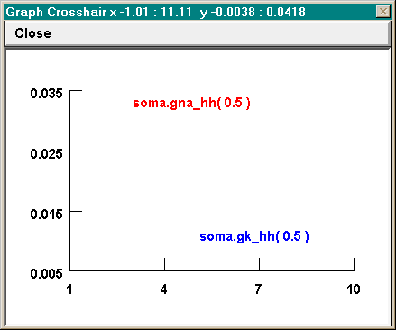

.. _fixing_funny_axes:

Fixing funny axes
=================

Sometimes the algorithm that chooses the X and Y axis ranges and tick intervals for View = plot needs a little help. The algorithm seems to attempt to maximize the size of the plots at all costs, and can quite easily produce graphs with axes like these

even though a better choice from the user's standpoint might be for X to run from 0 to 10 by 2s, and for Y to run from 0 to 0.04 by intervals of 0.01.

Set View can be used to achieve rational axes, but often you have to be a bit clever. Try specifying 0 10 for X size and 0 0.04 for Y size. You will see that this fixes the X axis problem, but the Y axis still won't be right--Y still runs from 0.005 to 0.035. So try Set View again, but this time try a slightly wider range than you really need for the Y axis, e.g. -0.001 0.041.

Generally, View = plot seems to try to divide each axis into 3 - 5 intervals. A useful strategy is to let it do what it wants the first time so you can see the data. Then if the intervals aren't satisfactory, use Set View to pick a range that is "slightly" wider. How big is "slightly" ? Usually something a bit less than half of the tick interval will do the job, but not too small or it won't have any effect.

So in this example, where View = plot had settled on a Y axis range of 0.005 to 0.035 with tick intervals of 0.005, and the desired Y range was 0 to 0.04, reasonable choices to try for the Y range with Set View would be ~ -0.002 or -0.001 at the low end and 0.041 or 0.042 at the high end.