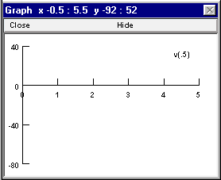
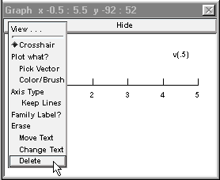
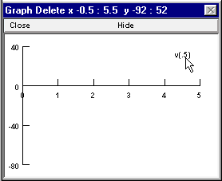
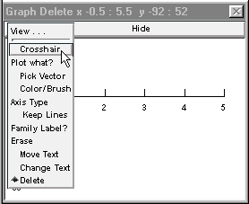

.. _heres_how_delete_v5:

How to delete v(.5) from the graph
=========

If you use :menuselection:`NEURON Main Menu --> Graph --> Voltage axis` to bring up a new graph, the label v(.5) appears automatically in the graph window.

This refers to the membrane potential at the middle of the default currently accessed section (see the on-line help files' alphabetical index for more information about the hoc keyword

    access

and the topic

    CurrentlyAccessedSection

(with no spaces in between)).

Artificial neurons are implemented in NEURON as PointProcesses, but PointProcesses must be associated with a section. If a Network Builder includes one or more classes of artificial neuron, NEURON automatically creates a section called acell_home that exists solely for the purpose of giving the artificial neurons a section to be associated with.

Thus ``acell_home`` does nothing worth plotting and you will want to eliminate its v(.5) from voltage axis graphs.

To do this, bring up the graph's primary menu (right click in the graph) and hold the mouse button down while scrolling the cursor down to Delete.

Release the mouse button, then place the cursor on top of the label v(.5).

Left click and the label disappears. You have deleted acell_home.v(.5) from this graph's plotlist.

.. image::
    fig/del20.gif
    :align: center

To avoid unintended deletes, return the cursor action to Crosshair mode by selecting Crosshair from the graph's primary menu.

