.. _heres_how_page:

Here's a couple of graphs that may suggest why enabling inhibition in this model prevented all spikes after the first one. In these graphs M_Cell[0].soma.v(0.5) and R_Cell[0].soma.v(0.5) are Vm at the soma of M1 and R2, respectively. First the response when inhibiton was OFF

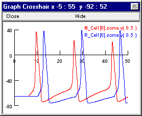

and then the response when inhibition was ON.

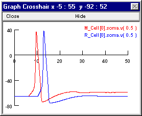

The following notes tell how to set up these plots, and at the very end is an explanation of why this network responds this way.

How to plot variables that belong to biophysical cell models in a network
==========

Suppose you want to see the detailed time course of some variable that belongs to the biophysical cell models in this recurrent inhibition network.
Bring up a new graph (:menuselection:`NEURON Main Menu --> Graph --> Voltage axis`). Delete the v(.5), which isn't useful because the default section is acell_home, a dummy section that hosts the artificial neuron S0 (the NetStim). To avoid unintended deletes, return the cursor action to Crosshair mode. :ref:`Here's how. <heres_how_delete_v5>`

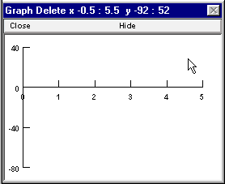

Now select Plot what? from the graph's primary menu.

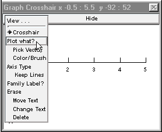

This brings up the Plot what? window. Click in its edit field (the area beneath the prompt "Enter Symbol name:"), type the name of the variable you want to plot, and presto!

But wait -- what *is* the name of the variable? The network has more than one biophysical cell model, each of which has a section named soma, so how do you specify which soma.v(0.5) you want?

This is easy if you know the name of the cell. And you can find the name of the cell out by clicking on the Network Builder's "Show Cell Map" button. This pops up a window that shows the association between the name of the cell in the NetGUI (left column) and the real name that has been instantiated (right column) The real name is made up of 3 parts : the name of the NetReadyCell (which you deliberately chose to be short, in order to reduce clutter in the layout area of the NetGUI), the name of the Cellbuilder Classname, and the index of the instance. The synapses on each cell also appear in this list, e.g. M1_E0 is the first synapse of type E on cell M1.

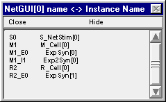

So cell M1 is really M_Cell[0], and if you want to plot Vm at the middle of its soma you will need to enter the string M_Cell[0].soma.v(0.5) into the edit field of the Plot what? window.

What if you'd rather not type all that stuff, or you want to see some variable whose exact name you don't quite recall but which you'd recognize instantly if you saw it? You do have an alternative  : use Plot what? to browse through names until you find what you want. Here's a step-by-step illustration of how to use this approach to show somatic Vm of both M1 and R2 in the same graph. This may seem complicated, but it is really very easy.

Using Plot what? to find names
---------------

The Plot what? window is actually a browser for names of things. When this tool first appears, it shows the names of the sections that do not belong to objects.

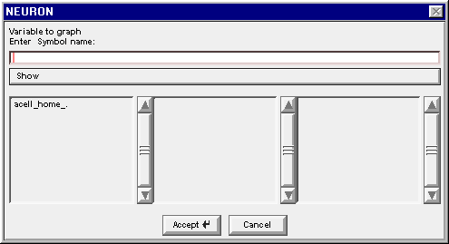

In a network model, the only section that doesn't belong to an object is the dummy section ``acell_home_``.

To find the name of a variable that belongs to a section in a cell model, use Plot what? to navigate to

1. 
    the proper cell class

2. 
    the proper instance of that class

3. 
    the proper section

4. 
    the proper variable

1. Find the proper cell class
++++++++++++++++

Left click on Show and scroll down to Objects.

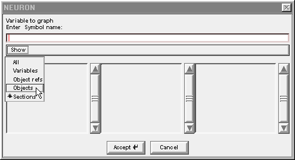

Release the mouse button and a list of object classes appears.

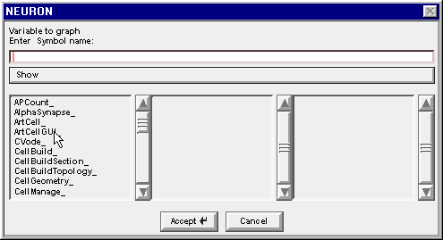

The Network Builder's Cell Map told us that we are looking for an M_Cell and an R_Cell. Drag the left column's scroll bar down to find M_Cell_

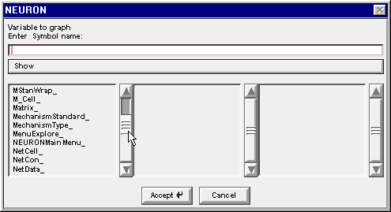

Double click on M_Cell_  .  .  .

.. image::
    fig/pw5.gif
    :align: center

and the string M_Cell_ appears in the edit field. Also the middle column changes to show the index of each instance of a cell in the M_Cell class that our model network contains.

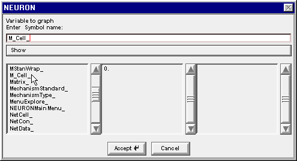

2. Find the proper instance of that class
+++++++++++++

Double clicking on the 0 in the middle column changes the string to M_Cell[0]. , and the middle column changes again to reveal the public variables and methods that belong to M_Cell[0]

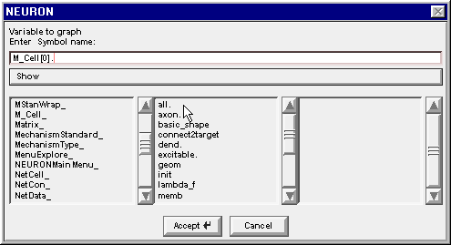

3. Find the proper section
++++++++++

Drag the middle column's scroll bar down to find soma.

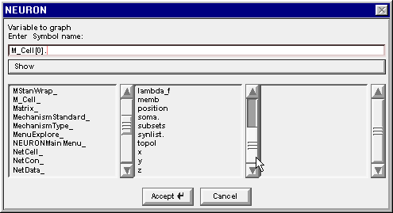

Double clicking on soma changes the edit field to M_Cell[0].soma. and the right column now contains a list of the properties of the soma section in M_Cell[0]

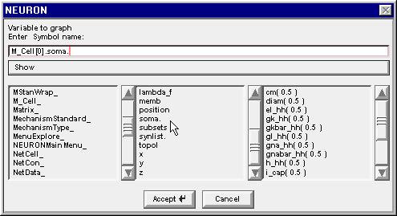

4. Find the proper variable
++++++++++++++

Scroll down this list to find the item v( 0.5 )

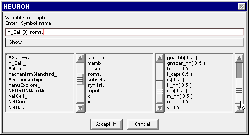

Double click on v(0.5) and the string in the edit field is completed, becoming M_Cell[0].soma.v( 0.5 )

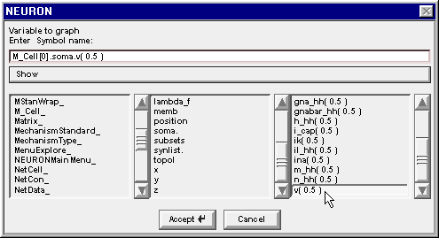

Click on the Accept button.

The Plot what? window goes away and the graph now shows a new label which is partly obscured, but will turn out to be M_Cell[0].soma.v(0.5)

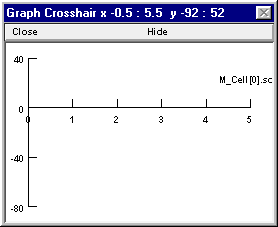

Repeat these steps to make the graph also display R_Cell[0].soma.v(0.5) (or just bring the Plot what? window back up, click in its edit field and change the M to an R, then click on the Accept button). When you're done, the graph will look like this.

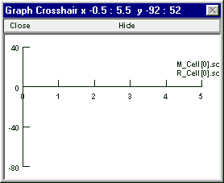

For instructions on how to move the labels and change the colors of the plots :ref:`read this <how_to_move_labels>`.

What's going on
----------

The excitatory synapse onto M1 is rather weak, so multiple EPSPs must summate to push this cell to firing threshold. When the weight of the R2 -> M1.I1 inhibitory synapse is 0, M1 receives an unopposed high frequency barrage of EPSPs that forces repetitive spiking. However, the interspike trajectory of Vm is relatively depolarized, so after the first spike gNa never quite recovers from inactivation and gK stays partially activated (the reduced peak spike amplitude attests to this). This is quite unlike the situation in R2, which is driven above threshold by each of the individual EPSPs from M1, which are much larger and occur at a much longer interval.

The precarious excitability of M1 after its first spike accounts for the ability of a single IPSP from the R2 -> M1.I1 projection to prevent later spikes of M1, even though M1 continues to receive undiminished high frequency excitation. The shunting inhibition generated by R2 when the R2 -> M1.I1 weight is 0.01 blocks the second spike of M1, while allowing Vm to remain sufficiently depolarized that continued summation of the small EPSPs causes persistent gNa inactivation that prevents later spikes as well. You can confirm this by bringing up another graph and using it to plot h_hh and n_hh at the soma of M1.

Here's a couple more questions.

1.
    Would excitation be equally precarious if the EPSPs occurred at a lower rate but were of larger amplitude so that the firing rate of M1 in the absence of inhibition were the same?

2.
    How might the outcome differ if inhibition were hyperpolarizing?

3.
    The HH mechanism isn't very good at repetitive spiking. If mammalian gNa & gK kinetics were used, would the same phenomenon occur but at a higher EPSP frequency?

.. toctree::
    :hidden:

    heres_how_delete_v5.rst
    how_to_move_labels.rst

