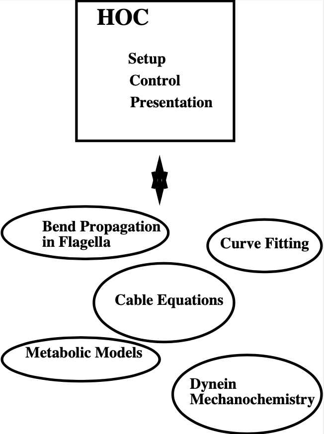

.. _hoc_chapter_11_old_reference:

Hoc 
===

Introduction
---------

Hoc (I pronounce it "hoak") is based on the floating point calculator developed in 'The Unix Programming Environment' by Kernighan & Pike (Prentice-Hall Software Series, 1984). Appendix 2 of that book contains a Hoc manual for their limited version and Chapter 8 describes Hoc's development and design philosophy. Hoc has a C like syntax and is very similar to the 'bc' calculator. Considerable extensions have been made to the basic version of hoc, both in added functions and additions to the syntax. Also, the user can build his :download:`own <data/ocfig1.ps>` hoc interpreter, incorporating special functions and variables which can be called and accessed interactively.

Hoc has an object oriented syntax addition which can be used to implement abstract data types, encapsulation of data, and polymorphism (but no inheritance). Most programs written using version 2 of NEURON will work correctly in version 3. The neuron3 version of the interpreter is called OC (pronounced oak) but we will only use that name when describing things that are different or a superset of what is available in Hoc. See `$NEURONHOME/lib/help/oc.help` for a brief synopsis of each command and function. See ivoc.help for information about graphical interface objects and functions. nrnoc.help and nrniv.help respectively contain information about neuron specific syntax/functions and neuron specific graphical interface objects. Other help files in `$NEURONHOME/lib/help` are devoted to miscellaneous objects (eg a vector class and random number class).

The interpreter in $NEURONHOME/bin/$CPU
-----------

The HOC interpreter has served as the general I/O module in many kinds of applications and as such is directly executed under many different names. The below figure illustrates some non-neural examples of hoc's use in different domains. The simplest interface between HOC and domain specific problems consist of a set of functions and variables that are callable from hoc. This was the level of implementation of the the original CABLE program (NEURON version 1). NEURON version 2 departed from this uniform interface style by introducing neuron specific syntax into the interpreter itself. This was meant to allow the user to specify neuron properties at a level of discourse more appropriate to neurons and help relieve the confusion and reduce the mental energy required to constantly shift between high level neural concepts and their low level representation on the computer. NEURON version 3, by introducing object syntax allows much better structuring of the conceptual pieces that are assembled to build a simulation.

When NEURON is installed, four programs are constructed from the combinations of whether or not the C++ graphical interface is included with the interpreter; and whether or not neuron specific syntax is included.

**oc**

    The bare interpreter. No gui, no neuron specific functions. The source code for the interpreter is found in ``$NEURONHOME/oc/SRC``.

**nrnoc**

    Analogous to version 2 of neuron but the interpreter is oc. Neuron specific c code is located in :file:`nrnoc/SRC`.

**ivoc**

    OC with C++ classes and graphical interface (which is written in C++). This is the best starting place for building non-neural applications. These C++ classes are implemented in :file:`ivoc/SRC`. The files here are of general use apart from the neuron simulation domain and generally implement the graphical interface, eg. :hoc:class:`Graph`, :hoc:func:`xpanel`, :hoc:class:`VBox`, etc. However the :hoc:class:`File`, :hoc:class:`List`, :hoc:class:`Vector`, and :hoc:class:`Random` class are very useful even if no window manager is present.

**nrniv**

    Version 3 of NEURON. Contains additional C++ classes for a neuron specific interface, eg Shape, and other built-in classes which are more conveniently written in C++ than C, eg. Impedance which makes use of the gnu library's Complex class. The C++ source is located in ``nrniv/SRC/``. This is the usual starting point for building special versions with user defined mechanisms via the model description language.

**neuron**

    Really a special version of nrniv but something ought to be called "neuron" and it has to be in a place where it does not conflict with version 2's main executable, also called neuron. It is the demonstration version which contains extra membrane mechanisms defined in ``$NEURONHOME/demo/release``. The neuron executable for version 3 is located in the demo directory and is run by the "neurondemo" script.

**neuron.exe (mswindows version)**

    Same as the unix version of nrniv but is capable of dynamically loading model descriptions compiled with the gcc compiler. (see mknrndll below)

Constructing programs that contain the interepreter
----------------------

There are various shell scripts for unix workstations in ``$NEURONHOME/bin`` that ease the task of incorporating the interpreter into user applications.

**nrnivmodl**

    The workhorse for creating special versions of neuron with user defined membrane properties.

    .. code::
        bash

        nrnivmodl file1 file2 ...

    adds the model descriptions defined in :file:`file1.mod`, :file:`file2.mod`, etc. to ``nrniv``. The resulting executable is called special. If no file arguments are present then nrnivmodl adds all the files in the current working directory that have the suffix .mod to the program called special. In order to construct an executable, the model descriptions first have to be translated into c with the nocmodl translator. Such models must contain a NEURON block which specifies the type of model (density mechanism or point process), the names of ions it uses, and which variables are to be treated as range variables in the interface to OC.

**mknrndll**

    The mswindows version of nrnivmodl. Instead of creating a new executable it compiles and links the models into a dynamically loadable library called ``nrnmech.dll``. Neuron.exe automatically looks in the current working directory for a ``nrnmech.dll`` file and if it exists, loads it into memory and makes the mechanisms available to the interpreter. More than one dll file can be loaded by listing them after the -dll argument to neuron.exe when it is run.

**ivmodl**

    .. code::
        bash

        ivmodl file

    adds the model description defined in ``file.mod`` to ivoc. The resulting executable is called "file". Since the model is not in a neuron context it must be self-contained. All variables and functions defined in the model are available to the interpreter. The model description translator used is ocmodl. These kinds of models don't necessarily have anything to do with neurons.

**makeiv**

    .. code::
        bash

        makeiv name file1.o file2.o ...

    creates a version of ivoc called "name". ``name.h`` is an include file which declares in regular C syntax the variables and functions that are to be accessible from OC. C files for the corresponding objects contain the definitions of these functions and variables. The script compiles the files, translates name.h into a interface specification file that makes sense to the interpreter and links the proper libraries to make the executable. I very rarely use this style anymore since it is usually easier to use the model description language and nrniv even for non-neural problems and there is a growing set of general use interpreter classes which depend only incidentally on the existence of a section. Almost anything can be treated as a point process and then handled by the interpreter as an object.

**nrnocmodl, ocmodl, makeoc**

    Same as their counterparts above but the C++ libraries are not included in the resulting executable program.

The stand-alone interpreter
-------------

The rest of this chapter describes the general aspects of the interpreter which are common to all applications that contain it. Although for concreteness we use nrniv or neuron.exe, all the examples and fragments can be typed to any program, eg. oc, that contains the interpreter.

Starting the interpreter
---------------

Hoc is started by typing the program name in a terminal window.

.. code::
    bash

    nrniv
	nrniv [filenames] [-]

When there are no filename arguments, Hoc takes its commands from the standard input and prints its results on the standard output. With filename arguments, the files are read in turn and the commands executed. After the last file is executed, hoc exits. A '-' as a filename, signals that commands are to be taken from the standard input until an EOF (^D in UNIX, '^Z return' in DOS ). One can also exit by executing the "quit()" expression.

When starting hoc with arguments it is easy to forget the final '-' and be surprised when the program quickly exits, perhaps after putting graphs on the screen. Generally the '-' is left off only when running the interpreter in batch mode under control of a shell script.

The mswindows version, ``neuron.exe``, does not exit if the trailing '-' is left out. This makes it more convenient to attach ``neuron.exe`` to ``.hoc`` files so one can merely click on the file name in a file manager. Also, ``neuron.exe`` starts a terminal window (derived from winio from "Undocumented Windows" by Andrew Schulman) to which one can type hoc commands. ``Neuron.exe`` does not support exiting by ^D or ^Z. Instead one can exit by typing quit(), choose "Close" from the title bar, or choose "Exit" from the winio File menu.

On startup, neuron prints a banner showing the current version and last change date.

.. code::
    bash 

    % nrniv
    NEURON --  Version 3.0   $Date: 2003/03/31 16:42:53 $
    by John W. Moore, Duke University Medical Center
    and Michael Hines, Yale University -- Copyright 1994
    We would appreciate reprints of publications which make use of this program.
    oc>

The "oc>" prompt at the beginning of a line means the interpreter is waiting for you to type a command.

Error handling
-----------

This is one of many areas where oc falls short. Oc is a good I/O facility but a bad general purpose language. Debugging large programs in OC is difficult and it is best to keep things short.

Oc is implemented as a stack machine and this means that commands are first parsed into a more efficient stack machine representation and subsequently the stack machine is interpreted.

Errors during compilation are called parse errors and range from invalid syntax:

.. code::
    c++

    oc>1++1
    parse error
    nrniv: parse error near line 3
    1++1
        ^
    oc>

to the use of undefined names:

.. code::
    c++

    oc>print x[5], "hello"
    nrniv: x not an array variable near line 9
    print x[5], "hello"
            ^

These kinds of errors are usually easy to fix since they stop the parser immediately and the error message, which always refers to a symptom, generally points to the cause. Error messages specify the current line number of the file being interpreted and print the line along with a carat pointing to the location where the parser failed (usually one or two tokens from the mistake).

Errors during interpretation of the stack machine are called run-time errors:

.. code::
    c++

    oc>sqrt(-1)
    sqrt: DOMAIN error
    nrniv: sqrt argument out of domain near line 5
    sqrt(-1)
            ^

These errors usually occur within a function and the error message prints the call chain:

.. code::
    c++

    oc>proc p() {execute("sqrt(-1)")}
    oc>p()
    sqrt: DOMAIN error
    nrniv: sqrt argument out of domain near line 8
    {sqrt(-1)}
            ^
            execute("sqrt(-1)")
        p()
    nrniv: execute error: sqrt(-1) near line 8
    ^
    oc>

Unfortunately there is no trace facility to help debug run-time errors and the line number refers to the latest command instead of the location of the offending statement.

Interpretation of a hoc program may be interrupted with one or two ^C's typed at the terminal. Generally, one ^C is preferred because while the interpreter is busy it will wait til it reaches a safe place (won't be in the middle of updating an internal data structure) before it halts and waits for further input. Two situations may necessitate the second ^C. If the program is waiting inside a system call, eg. waiting for console input. If the program is executing a compiled function that is taking so long that program control doesn't reach a known safe place in a reasonable time. If the interpreter is in an infinite loop, as in:

.. code::
    c++

    oc>while(1) {}

a single ^C will stop it

.. code::
    c++

    ^Cnrniv: interrupted near line 2
    while(1) {}

    oc>

Long expressions may be continued on succeeding lines by using a backslash character `\' as the last character in the line. Quoted strings continued in this way have a limit of 256 characters and the newlines appear in the string as though `\n' was used.

Syntax
======

Names
-----

A name is a string of less than 100 alphanumeric characters or '_' starting with an alpha character. Names must not conflict with Keywords or built-in functions. Names are global except when the 'local' declaration is used to create a local scalar within a procedure or function. Or unless the name is declared within a template (class). A user created name can be associated with a

.. code::
    c++

    global scalar	(available to all procedures/functions)
	local scalar	(created/destroyed on procedure entry/exit)
	array
	string
	template (class or type)
	object reference

The following lists the keywords, built-in constants, and built in functions of the oc interpreter. The last group of keywords are reserved for NEURON syntax. The authoritative list is in ``$NEURONHOME/oc/SRC/hoc_init.c``. Following these are lists of function and variable names introduced by nrnoc. The authoritative list here is in ``$NEURONHOME/nrnoc/SRC/neuron.h`` but note that mechanism types and variables do not appear here or any other single place (see ``$NEURONHOME/nrnoc/SRC/(*.mod capac.c extcell.c)`` Last listed are the built-in classes (templates) of ivoc and nrniv. Even if this document becomes out of date one can find all these names in ``$NEURONNHOME/(ivoc/SRC/oc_classes.h nrniv/SRC/nrn_classes.h)``

Keywords
++++++++

**Control**

.. code::
    c++

    return
    break
    continue
    stop
    if
    else 
    while
    for 
    iterator_statement

**General Declaration**

.. code::
    c++

    proc
    func
	iterator
    double
    depvar
    eqn
    local
    strdef

**Miscellaneous**

.. code::
    c++
    
    print
    delete
    read
    debug
    em
    parallel
    help

**Object Oriented**

.. code::
    c++
    
    begintemplate
    endtemplate
    objectvar objref (synonyms)
    public
    external
    new

**Neuron Specific**

.. code::
    c++

    create        connect        setpointer     access        insert
    uninsert      forall         ifsec          forsec

**Built-In Constants**

.. code::
    c++

	PI	E	GAMMA	DEG	PHI	FARADAY	R

**Built-In Functions**

.. code::
    c++

    sin	cos	atan	log	log10	exp	sqrt	int	abs	erf
	erfc	system	prmat	solve	wqinit	plt	axis	plot	plotx	ploty
	regraph	symbols	printf	xred	sred	ropen	wopen	xopen	fprint	fscan
	graph	graphmode	lw	getstr	strcmp	setcolor startsw
	stopsw	object_id	allobjectvars	allobjexts	xpanel	xbutton
	xcheckbox	xstatebutton	xlabel	xmenu	xvalue	xpvalue	xradiobutton
	xfixedvalue	xvarlabel	xslider	boolean_dialog	continue_dialog
	string_dialog	doEvents	doNotify	numarg	hoc_pointer_
	execute	execute1	load_proc	load_func	load_template
	machine_name	saveaudit	retrieveaudit	coredump_on_error
	checkpoint	quit	object_push	object_pop	pwman_place
	show_errmess_always	numprocs	myproc	psync	settext
    secname 

**Variables**

.. code::
    c++

    float_epsilon
	hoc_ac_

Names introduced by nrnoc
++++++++++

**Variables**

.. code::
    c++

    t	dt	clamp_resist	celsius	secondorder
	diam_changed

**Functions**

.. code::
    c++

    node_data	disconnect	batch_run	batch_save
	pt3dclear	pt3dadd	n3d	x3d	y3d	z3d	diam3d	arc3d
	define_shape	p3dconst	spine3d	setSpineArea	getSpineArea
	area	ri	initnrn	topology	fadvance	distance
	finitialize	fstim	fstimi	ion_style	nernst	ghk

**Mechanisms with Range variables**

.. code::
    c++

    hh	pas

**Classes**

.. code::
    c++

    SectionRef	SectionList
	VClamp	SVClamp	IClamp	AlphaSynapse
	APCount

Missing from the above list are the built-in object classes such as :hoc:class:`List`, :hoc:class:`Graph`, :hoc:class:`HBox`, :hoc:class:`File`, :hoc:class:`Deck`, :hoc:class:`Random`, :hoc:class:`Vector` and some new functions such as :hoc:class:`fit\_praxis`, :hoc:class:`xmenu`, :hoc:class:`xbutton`, etc, as well as neuron specific classes such as :hoc:class:`Shape`, :hoc:class:`SectionList`, etc. The help files in :hoc:class:`NEURONHOME/lib/help` are kept up to date but this file tends to lag behind the current version.

Variables
---------

Double precision variables are defined when a name is assigned a value in an assignment expression. For example,

.. code::
    c++

    var = 2 

Such scalars are available to all interpreted procedures and functions. There are several built-in variables which should be treated as constants:

.. code::
    c++

    FARADAY		coulombs/mole
	R		molar gas constant, joules/mole/deg-K
	DEG		180 / PI	degrees per radian
	E+		base of natural logarithms
	GAMMA		Euler constant
	PHI		golden ratio
	PI		circular transcendental number
	float_epsilon	resolution for logical comparisons and int()

Arbitrarily dimensioned arrays are declared with the 'double' keyword. For example,

.. code::
    c++

    double vector[10], array[5][6], cube[first][second][third] 

Array elements are initialized to 0.0. Array indices, of course, are truncated to integers and run from 0 to the declared value minus 1. When an array name is used without its indices, indices of 0 are assumed.

Arrays can be dynamically re-dimensioned within procedures.

String variables are declared with the 'strdef' keyword. For example,

.. code::
    c++

    strdef st1, st2 

Assignments are made to string variables as in,

.. code::
    c++

    st1 = "this is a string" 

String variables may be used in any context which requires a string, but no operations, such as addition of strings, are available (but see sprint function).

After a name is defined as a string or array, it cannot be changed to another type. The double and strdef keywords can appear within a compound statement and are useful for throwing away previous data and reallocating space. However the names must be originally declared at the top level before re-defining in a procedure.

Expressions
----------

The arithmetic result of an expression is immediately typed on the standard output unless the expression is embedded in a statement or is an assignment expression. Thus,

.. code::
    c++

    2*5 

typed at the keyboard, prints

.. code::
    c++

    10

and,

.. code::
    c++

    sqrt(4)

yields

.. code::
    c++

    2

The operators used in expressions are, in order of precedence from high to low,

.. code::
    c++

    ()
	^	exponentiation  (right to left precedence)
	- !	unaryminus, not
	* / %	multiplication, division, ``remainder``
	+ -	plus, minus
	> >= < <= != ==	  logical operators
	&&	logical AND
	||	logical OR
	=	assignment (right to left precedence)

Logical expressions have value 1.0 (TRUE) and 0.0 (FALSE). The remainder, a%b, is in the range, 0 <= a%b < b, and can be thought of as the value that results from repeatedly subtracting or adding b until result is in the range. This differs from the C syntax in which (-1)%5 = -1. For us, (-1)%5 = 4.

Logical comparisons of real values are inherently ambiguous due to roundoff error. Roundoff can also be a problem when computing integers from reals and indices for vectors. For this reason the built-in global variable ``float_epsilon`` is used for logical comparisons and computing vector indices. In what follows, the constant e denotes ``float_epsilon``. The default value is 1e-11 but can be set by the user.

.. code::
    c++

    hoc		math or c equivalent\\
	x == y		-e <= x - y <= e
	x < y		x < y - e
	x <= y		x <= y + e
	x != y		x < y - e or x > y + e
	x > y		x > y + e
	x >= y		x >= y - e
	int(x)		(int)(x + e)
	a[x]		a[(int)(x = e)]

Statements
=========

A statement terminated with a newline is immediately executed. A group of statements separated with newlines or white space and enclosed in {} form a compound statement which is not executed till the closing

.. code::
    c++

    }

is typed. Statements typed interactively do not produce a value. An assignment is parsed by default as a statement rather than an expression, so assignments typed interactively do not print their value. Note, though, the expression,

.. code::
    c++

    (a = 4) 

would print the value,

.. code::
    c++

    4

An expression is treated as a statement when it is within a compound statement.

Control Flow
===========

In the syntax below, stmt stands for either a simple statement or a compound statement.

.. code::
    c++

    if (expr) stmt
	if (expr) stmt1 else stmt2
	while (expr) stmt
	for (expr1; expr2; expr3) stmt
	for var = expr1, expr2   stmt
	for iterator_name(...) stmt

In the ``if`` statement, stmt is executed only if expr evaluates to a non-zero value. The ``else`` form of the if statement executes stmt1 when expr evaluates to a non-zero (TRUE) value and stmt2 otherwise.

The ``while`` statement is a looping construct which repeatedly executes stmt as long as expr is TRUE. The expr is evaluated prior to each execution of stmt so if the expr starts as 0, the stmt will not be executed even once.

The general form of the >tt>for statement is executed as follows: The first expr is evaluated. As long as the second expr is true the stmt is executed. After each execution of the stmt, the third expr is evaluated.

The short form of the for statement is similar to the do loop of fortran and is often more convenient to type. It is, however, very restrictive in that the increment can only be unity. If expr2 is less than expr1 the stmt will not be executed even once. Also the expressions are evaluated once at the beginning of the for loop and not reevaluated.

The iterator form of the for statement is an object oriented iterative construct which separates the idea of iteration over a set of items from the idea of what work is to be performed on each item. As such it is most useful when dealing with objects which are collections of other objects. It doesn't add any power to the language (neither does the for i=1,10 form) but it is useful whenever the iteration over a set of items has a nontrivial mapping to a sequence of numbers and is used many times. As a concrete example consider the definition of an iterator called "case"

.. code::
    c++

    iterator case() {local i
		for i = $2, numarg()-1 {
			$&1 = $i
			iterator_statement
		}
	}

Now it is easy to use this iterator to loop over small sets of unrelated integers as in (suppose x has already been used as a scalar variable)

.. code::
    c++

    for case(&x, 1, -1, 3, 25, -3) print x

The alternative would be the relatively tedious:

.. code::
    c++

    double num[5]
	num[0] = 1
	num[1] = -1
	num[2] = 3
	num[3] = 25
	num[4] = -3
	for i = 0, 4 {
		x = num[i]
		print x
	}

The following statements are used to modify the normal flow of control.

.. code::
    c++

    break		Exit from the enclosing while or for loop.
    continue	Jump to end of stmt of the enclosing while or for.
    return		Exit from the enclosing procedure.
    return expr	Exit from the enclosing function.
    stop		Exit to the top level of the interpreter.
    quit()		Exit from the interpreter.

Functions and Procedures
============

The definition syntax is

.. code::
    c++

	proc name() {stmt}

Procedures do not return a value.

.. code::
    c++

	func name() {stmt} 

Functions must return via a

.. code::
    c++

	return expr 

statement.

Arguments are denoted, $1, $2, etc. within the body of a function or procedure. Scalars, strings, and objects can be passed to functions and procedures. A string argument is denoted $s1, An object argument is denoted $o1. The variable, 'i', may be used in place of the positional constant to denote which argument is to be retrieved. eg. $i
Formally, an argument starts with the letter '$' followed by an optional '&' to refer to a scalar pointer, followed by an optional 's' or 'o' to refer to string or object reference, followed by an integer or the variable 'i'.

As a trivial example of a function definition, consider:

.. code::
    c++

    func f(){
        return $1 * $1 
    } 

This defines the function :hoc:class:`f(arg1)` which returns the square of its argument. User defined functions can be used in any expression.

Functions can be called recursively. For example, the factorial function, can be defined as

.. code::
    c++

    func fac(){
        if ($1 == 0) {
            return 1
        } else {
            return fac($1-1)*$1
        } 
    } 

and the call 

.. code::
    c++
    
    fac(3)

would produce

.. code::
    c++
    
    6

It would be a user error to call this function with a negative argument or non-integer argument. Besides the fact that the algorithm is numerical nonsense for those values, the function would never return since the recursive argument would never be 0. Actually after some time the stack frame list would overflow and an error message would be printed as in:

.. code::
    c++
    
    oc>fac(-1)
	nrnoc: fac call nested too deeply near line 10
	fac(-1)	
	        ^
	        fac(-99)
	      fac(-98)
	    fac(-97)
	  fac(-96)
	and others
	oc>

Notice the recommended placement of {} in the above function. The opening '{' must appear on the same line as the statement to which it is a part. The closing ''}' is free form but clarity is best served if it is placed directly under the beginning of the statement it closes and interior statements are indented. Local variables maintained on a stack can be defined with the "local" statement. The "local" statement must be the first statement in the function and on the same line as the "proc" statement. For example,

.. code::
    c++
    
    proc squares(){	local i, j, k /* print squares up to arg */
     for (i=1; i <= $1; i=i+1) print i*i 
} 

This insures that any previously defined global variables with the names, i, j, or k are not affected by the procedure. Notice text between /star and star/ is treated as a comment. Also, comments to the end of the line may be started by the double slash as in

.. code::
    c++

    print PI	// this is a comment

Input and Output
========

The following describes simple text based input and output. User interaction is better performed using the graphical interface and if dealing with multiple files one must use the File class.;

Standard hoc supplied a read and print statement, whose use can best be seen from the example,

.. code::
    c++

    while (read(x)) {
        print "value is ", x
    } 

The return value of ``read()`` is 1 if a value was read, and 0 if there was an error or end of file. The print statement takes a comma separated list of arguments which may be strings or variables. A newline is printed at the end. "read" and "print" use the standard input and output respectively.

For greater flexibility the following builtin functions are available:

.. code::
    c++

    printf("format string", arg1, arg2, ...)

Printf is compatible with the standard C library function, allowing f, g, d, o, and x formats for scalar arguments, and the s format for strings. All the % specifications for field width apply.

.. code::
    c++

    fprint("format string", arg1, arg2, ...)

Fprintf is the same as the printf function except that the output goes to the file opened with the wopen("filename") function. Files opened with the wopen function are closed with ``wopen()`` with no arguments or wopen(""). When no write file is open, fprintf defaults to the standard output. Wopen returns a 0 on failure of the attempted open.

.. code::
    c++

    sprint(strdef, "format string", arg1, ...)

This function is very useful in building filenames out of other variables. For example, if data files are names dthis.1, dthis.2, dthat.1, dthat.2, etc., then the names can be generated with variables in the following fashion.

.. code::
    c++

    strdef file, prefix
    prefix = "this"
    num = 1
    sprint(file, "d%s.%d", prefix, num)

After execution of these statements the string variable, file, contains ``dthis.1``

.. code::
    c++

    fscan()

Fscan returns the value read sequentially from the file opened by ropen(``"filename"``). The file is closed with ``ropen()`` or by a call to ropen with another filename. "ropen" returns a 0 if the file could not be opened. If no read file is open, ``scanf`` takes its input from the standard input.

Read files must consist of whitespace or newline separated numbers in any meaningful format. An EOF will interrupt the program with an error message. The user can avoid this with a sentinel value as the last number in the file or by knowing how many times to call scanf.

.. code::
    c++

    getstr(strvar)

Getstr reads the next line from the file opened with ropen and assigns it to the string variable argument. The trailing newline is part of the string.

.. code::
    c++

    xred("prompt", default, min, max)

Xred is a useful function which places a prompt on the standard error device along with the default value and waits for input on the standard input. If a newline is typed "xred" returns the default value. If a number is typed, it is checked to see if it is in the range defined by min and max. If so, the input value is returned. If the value to be returned is not in the range, the user is prompted again for a number within the proper range.

.. code::
    c++

    xopen("filename")

The file is read in and executed by hoc. This is useful for loading previously written procedures and functions that were left out of the command line during hoc invocation. \end{description}

Editing
=======

The '``em``' command invokes a public domain emacs editor (not to be confused with the EMACS with Lisp like syntax). I still like it but it is definitely showing its age in this day of mouse editors. Many people are already very comfortable with their own editor and find it more convenient to create a file and transfer it into hoc with the xopen command.

The 'em' editor is normally in the insert mode and control keys are used as commands to the editor. Invocation is instantaneous with the cursor located where emacs was last exited. The relevant commands involving the interaction between emacs and hoc are:

**^C**

Return to hoc. The current edit buffer is read into hoc and executed. A syntax error will return to emacs with the cursor at the line where the parser failed. Final exit from hoc (\V+^D+) will prompt for each unsaved buffer.

**^X^F**

Prompts for a filename to read into a new buffer with the name of the filename. The editor moves to the new buffer.

**^XB**

Prompts for a buffer name or number. The editor moves to that buffer.

**^X^B**

Lists the buffers. Use \V+^X1+ to clear the buffer list window.

**^X^R**

Prompts for a filename and replaces the contents of the current buffer with the contents of the file.

**^X^S**

Updates the current filename with the contents of the current buffer.

**^X^W**

Prompts for a filename and writes the current buffer to that name.

Note that ^C only executes a buffer. It does not save any unsaved buffer. On exit from hoc you will be prompted for each unsaved buffer whether or not to save it.

HINT: Break large programs into many files and edit them in separate buffers. Buffers larger than 100 lines take a noticeable time to interpret. Use an ``init.hoc`` file consisting of xopen("filename") commands to setup the environment and run with "hoc init.hoc -". Then edit only the files you need to change in that run.

See Also
========

.. code::
    c++

    This manual			- hoc.man
	Solving simultaneous equations	- hoceqn.man
	Plotting			- hoc functions
	User extensions			- hocusr.man
	Editing commands		- emacs.hlp

