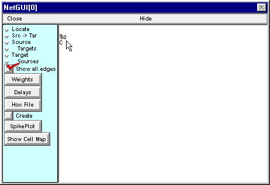
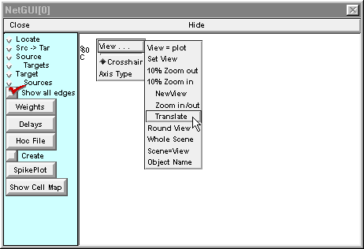
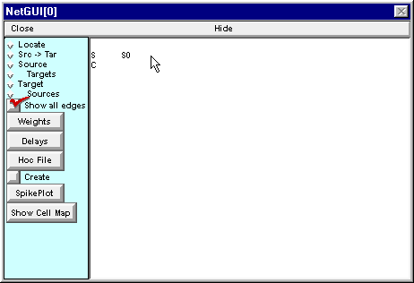

.. _how_to_translate_view:

How to translate the view
========

The cell item S0 is too close to the layout item S.

Right click in the graph and keep pressing the button while scrolling the cursor into the secondary graph menu and down to the "Translate" item.

Release the mouse button, then left click in the graph...

and drag the view to the right. The cell item S0 moves with the view, but the layout items S and C stay put.

To exit Translate mode, click on one of the radio buttons (Locate, Src -> Tar, etc.).

