.. _import3d_tutorial:

Using the Import3D GUI
======================

This tutorial introduces interactive use of NEURON's Import3D tool, which can translate common varieties of cellular morphometric data into a CellBuilder that specifies the anatomical properties of a model neuron. It can also be used programmatically via Python or HOC.

You might also be interested in our video on :ref:`Scripting and Morphologies <scripting_and_morphologies_20210706>` from the 2021 NEURON course webinar.

.. todo: add links to programmatic examples

Overview of the Import3D tool
-----------------------------
Before launching into procedural details, it will be helpful to set up a conceptual framework by asking ourselves what features we'd expect in a tool that translates morphometric data into a model specification. Broadly speaking, these fall into two categories:

- data input and model output
- analysis and repair

Data input and model output are pretty straightforward. We'd expect there to be a file browser for choosing the morphometric data file to be read. We'd also expect a button that lets us send the tool's output to a CellBuilder (which we can then save to a session file for future use), or straight to the hoc interpreter (immediately creating sections that have the proper dimensions and connectivity).

But what about analysis and repair?

It would be nice for the tool to automatically handle common trivial errors. It might also offer to fix somewhat more complex problems at the click of a button, and notify us of serious problems that may require the exercise of judgment.

One of the goals of analysis is to gather the information that such judgment might require. But the primary reason to analyze morphometric data is simply to understand the structure of the cell, which has important functional consequences.

We'll definitely want to see a graphical rendering of the shape of the cell or cells whose measurements are in the file. It would be very helpful if this figure is "browsable," so that we can click on any point to display its measured x,y,z coordinates and diameter, as well as the corresponding line in the data file. It should also be possible to use a mouse click to highlight items such as a single neurite (section) or subtree. We would also like to be able to see the root of the data (the section that has no parent), and those sections whose data points are flagged as belonging to special subsets or "types" (these generally correspond to significant anatomical subdivisions of a cell, e.g. soma, axon, or a particular dendritic field).

The Import3D tool can do all these things and more--as you will see below.

Reading a morphometric data file and converting it to a NEURON model
--------------------------------------------------------------------

First we bring up an Import3d tool, then specify the file that we want to read, take a quick look at what we got, and finally export the data as a NEURON model.

 

We need an Import3D tool.
~~~~~~~~~~~~~~~~~~~~~~~~~

Open an Import3D tool by clicking on :menuselection:`Tools --> Miscellaneous --> Import3D` in the NEURON Main Menu.

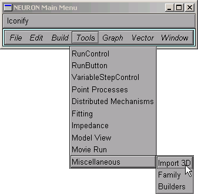

We need to choose a file to read.
~~~~~~~~~~~~~~~~~~~~~~~~~~~~~~~~~

In the Import3D window, click on the "choose a file" checkbox.

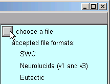

 

This brings up a file browser. Use the file browser to go to the directory that contains the morphometric data file.
Click on the file's name . . .

 . . . and then click Read.

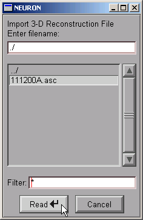

NEURON's terminal window prints a running tally of how many lines have been read from the data file.

  oc>
  21549 lines read
After a delay that depends on the size of the file and the speed of the computer, a figure will appear on the Import3D tool's canvas. Each point at which a measurement was made is marked by a blue square.

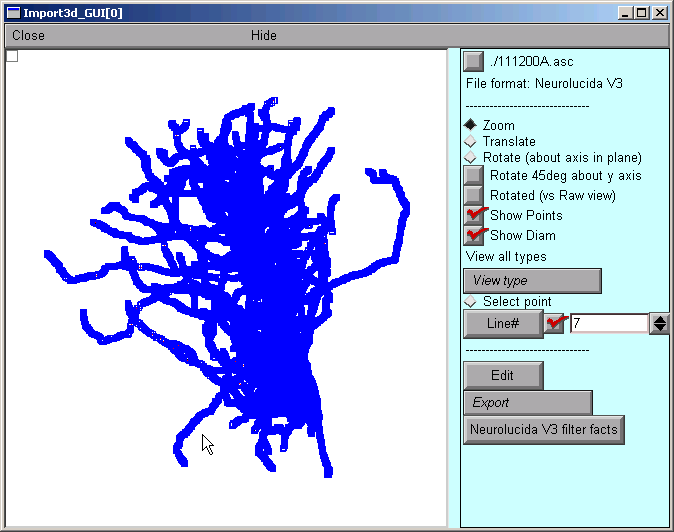

If the Import3D tool finds errors in the data file, a message may be printed in the xterm, and/or a message box may appear on the screen. For this particular example there were no errors--that's always a good sign!

The top of the right panel of the Import3D tool will show the name and data format of the file that was read. The other widgets in this panel, which are described elsewhere, can be used to examine and edit the morphometric data, and export them to the CellBuilder or the hoc interpreter.

 

Let's see what it looks like.
~~~~~~~~~~~~~~~~~~~~~~~~~~~~~

It's always a good idea to look at the results of any anatomical data conversion--but those blue squares are in the way!

To get rid of the blue squares that are hiding the branched architecture, click on the Show Points button in the right panel of the Import3D tool. The check mark disappears, and so do the blue squares.

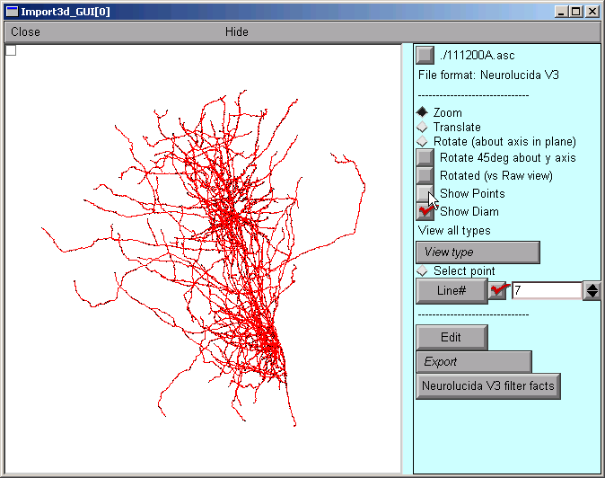

That's a very dense and complex branching pattern.

 

Exporting the model.
~~~~~~~~~~~~~~~~~~~~

The Import3D tool allows us to export the topology (branched architecture) and geometry (anatomical dimensions) of these data to a CellBuilder, or straight to the hoc interpreter. It's generally best to send the data to the CellBuilder, which we can then save to a session file for future re-use. The CellBuilder, which has its own tutorial, is a very convenient tool for managing the biophysical properties and spatial discretization of anatomically complex cell models.

So click on the Export button and select the CellBuilder option.

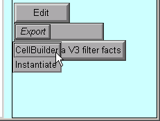

But this example has a surprise for us: instead of one CellBuilder, we get two! Under MSWin, they are offset diagonally as shown here, but under UNIX/Linux they may lie right on top of each other so you'll have to drag the top one aside.

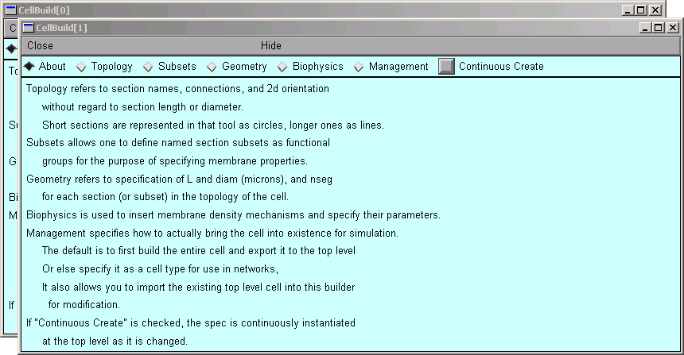

Does getting two CellBuilders mean that the morphometric data file contained measurements from two cells? Maybe that's why the branching pattern was so dense and complex.

But there is an unpleasant alternative: maybe all this data really is from one cell. If there was a mistake in data entry, so that the proximal end of one branch wasn't connected to its parent. one CellBuilder would contain the orphan branch and its children, and the other CellBuilder would contain the rest of the cell.

How can we decide which of these two possibilities is correct?

Examining the Topology pages of these CellBuilders shows us that CellBuild[0] got most of the branches in the bottom half of the Import3D's canvas, and CellBuild[1] got most of the branches in the top half. The morphologies are ugly enough to be two individual cells; at least, neither of them is obviously an orphan dendritic or axonal tree.

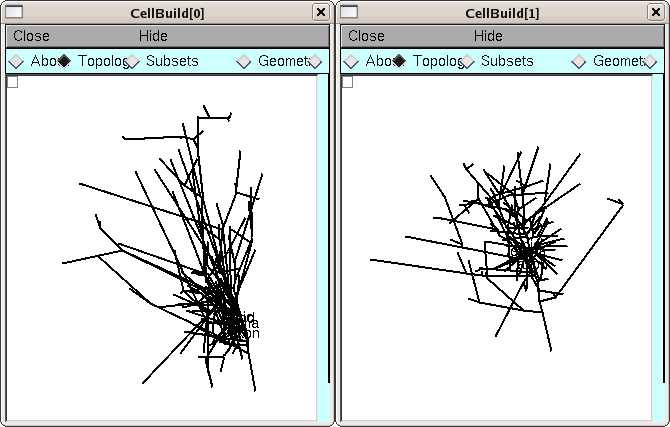

Until we know for sure, it is safest to use the Print & File Window Manager (PFWM) to save each CellBuilder to its own session file. I optimistically called them bottomcell.ses and topcell.ses, respectively.

At this point, we should really use the Import3D tool to closely examine these data, and try to decide how many cells are present. To learn how, work through "Zooming in and out" (one of the "Exploring morphometric data and fixing problems" lessons).

Exploring morphometric data and fixing problems
-----------------------------------------------

Some morphometric data files contain errors or require special attention for one reason or another.

Zooming in and out
~~~~~~~~~~~~~~~~~~

Before we start, take a new look at the shape in the Import3D tool.

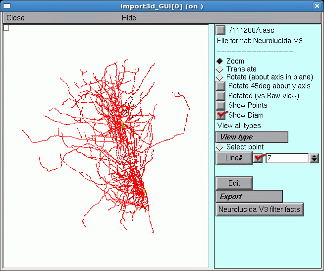

Those two little green lines in the dense clusters are new. They appeared after exporting to the CellBuilder. And is there a little orange blob at one end of each green line?

To answer these questions, let's zoom in for a closer look.

 

A. Zooming in

First make sure that the Import3D tool's Zoom button is on (if it isn't, just click on it).

Then click on the canvas, just to the right of the area of interest, and hold the mouse button down while dragging the cursor to the right. If it becomes necessary to re-center the image, click on the Translate button, then click on the canvas and drag the image into postion. To start zooming again, click on the Zoom button. Repeat as needed until you get what you want.

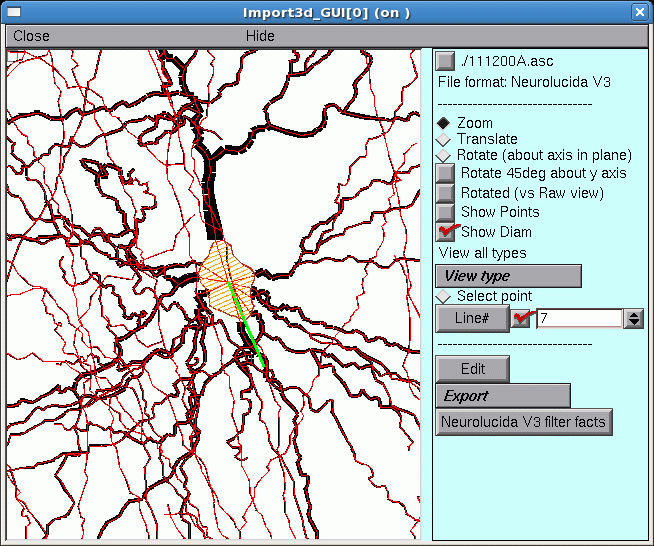

Here's a closeup of the upper blob, which is now revealed to be an irregular shape bounded by a thin red line that defines its perimeter. This is the soma of a neuron. At least 9 neurites converge on it, and a fine red line connects the proximal end of each of them to the center of the soma.

The green line is the principal axis of the soma, as identified by the Import3D tool. The thin red lines perpendicular to the principal axis define the points on the perimeter that Import3D uses to calculate the effective surface area and volume of the soma.

If you zoom in on the other green line and orange blob, you'll find another soma there.

So zooming reveals that this particular morphometric data file contained measurements from at least two different cells.

To zoom out, make sure the Zoom button is on, then click near the right edge of the canvas and drag toward the left.

To quickly fit the whole image to the window, just use the graph's "View = plot" menu item. First, bring up the graph's primary menu by clicking on the menu box in the left upper corner (or right click anywhere in the window), and hold the mouse button down.

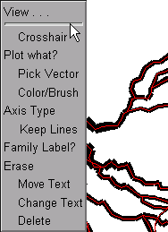

While holding the mouse button down, move the cursor up just a little bit, and the graph's secondary menu will appear.

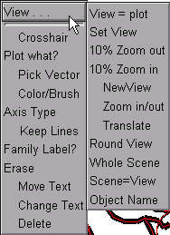

Still holding the mouse button down, move the cursor over to select the "View = plot" item in the secondary menu.

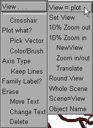

Release the button, and the image will be rescaled so that it fits inside the window.

Taking a close look at the shape of things.