.. _modelview_compact_display:

ModelView: Compact display of parameters for NEURON models
=============

**Michael Hines, Sushil Kambampati, Thomas M. Morse**

**Yale University School of Medicine, Neurobiology Department and Computer Science Department, New Haven, Connecticut.**

**(www version of a poster presented at the Human Brain Project Annual Conference April 26-27, 2004)**

Introduction
------------

The availability of a large number of models in `ModelDB <https://senselab.med.yale.edu/ModelDB/>`_ (Migliore et al 2003), helps investigators test their intuition of model behavior and provides building blocks for future modeling applications to the interpretation of experimental findings. However the NEURON (Hines and Carnevale 2001) model legacy code entered by publication authors was generally not developed with presentation as a high priority. The original code can be difficult to analyze and it sometimes happens that variables are reset so that the values at run time are different than the first values indicated in the top of the code. ModelView overcomes these problems by providing a (run-time state) preview of the properties of a model (anatomy and biophysical attributes). Having this information available for viewing in ModelDB lets investigators quickly develop a conceptual picture of the model structure and compare parameter differences between runs. It makes it possible to ask detailed questions about the model that would have been time-consuming to answer without ModelView.

ModelView in action 
---------

Example: CA1 pyramidal neuron: as a 2-layer NN and subthreshold synaptic summation by Poirazi et al. 2003
+++++++++++++++

This example demonstrates how ModelView can explore a NEURON model. We look at the report generated after starting the tool.

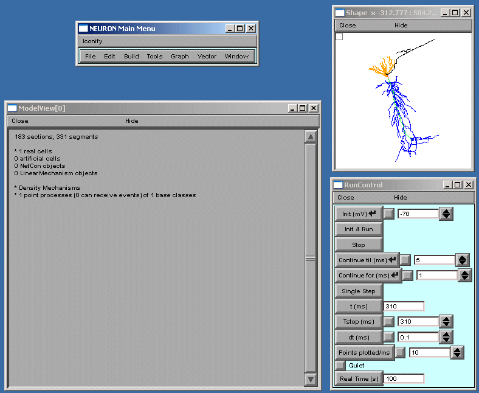

ModelView opens its hierarchical browser with a top-level summary of the model. In NEURON a cell is divided into sections which are further divided into computational nodes called segments. The first item in the summary is the total number of sections and the total number of segments, for all the cells in the model. The second and final summaries report the numbers of real and artificial cells and density mechanisms and point processes, the later two include ion-channels, receptors, and electrodes. The Poirazi example contains 1 real cell and density mechanisms and a point process. We explore the model by clicking on the asterisk lines to expand the text tree (or contract if already expanded). Clicking on "* 1 real cells", and then clicking on the newly appeared "* root soma[0]" displays an analysis of the occurrence of the duplicate and the unique sets of parameters distributed throughout the cell (figure below).

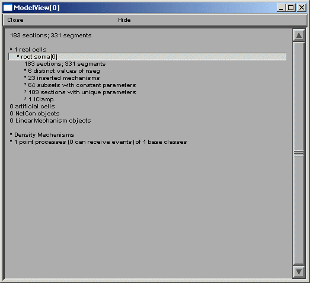

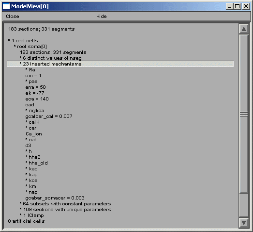

After the total number of sections and segments in this particular cell and the related nseg parameter distribution, the number of inserted mechanisms is reported. Expanding the number of inserted mechanisms (23 here) lets the investigator know which ion-channels are used in the model (figure above). Expanding the "* pas" line (figure below) shows how ModelView truncates text display when there are too many values to display with a message "... or more distinct values".

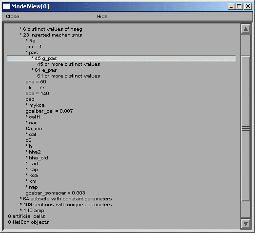

If one of these too-lengthy-to-display items is clicked upon, a graph of the values of the parameters along an axis indicating distance from the soma and a 3D shape image with values expressed as color intensities are displayed (figures below). The first image on the shows the range graph when ``g_pas`` selected (second when ``e_pas`` selected).

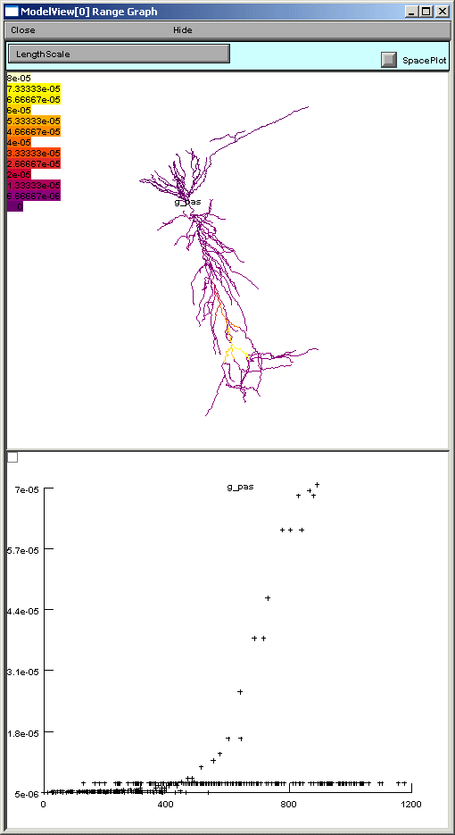

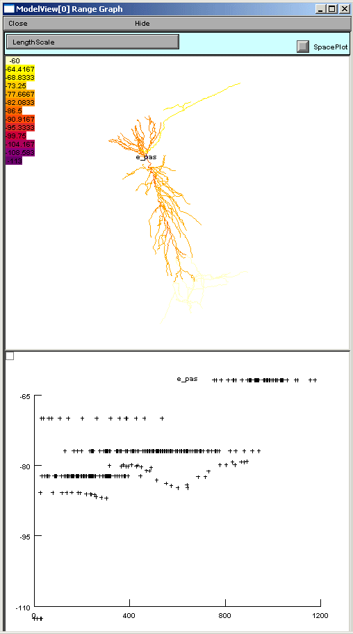

ModelView analyzes the sections to find the sets of sections that share a parameter (or a set of parameters) set to the same value(s). There are 64 sets of subsets of constant parameters in this model. The number of sections that have unique values of a parameter are also calculated and displayed (109 here). These large numbers of sets are indicative that there are heterogeneous values for some parameters. For a simpler model, these numbers help identify the combinations of values that are used, and also their spatial distribution, while for a more complex model, such as this one, the line items are links to graphs as described above. When a parameter from these lists is selected (first figure below), for example eca = 140, the part of the tree that contains that value of that parameter is highlighted in a shape plot (second figure below).

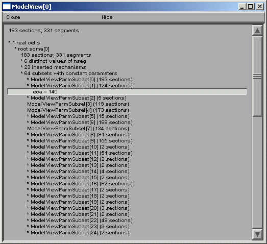

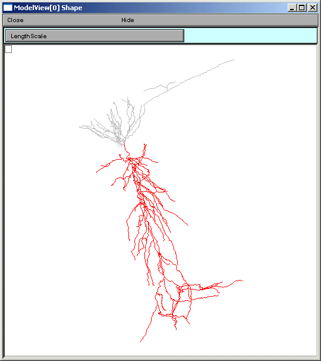

The final group of top-level items, density mechanisms and point processes will expand into text trees that summarize and create graphs that display the distribution of these items. The Homogeneous Parameters item lists the parameters that occur with just a single value, unlike Heterogenous Parameters, which contain lists of parameters which take multiple values. When a homogeneous parameter is selected, e.g. ``el_hha2``, then a graph of the distribution of that parameter is displayed (figures below).

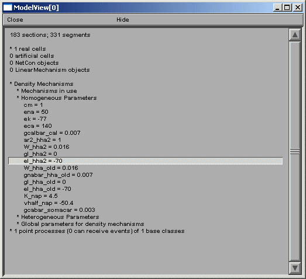

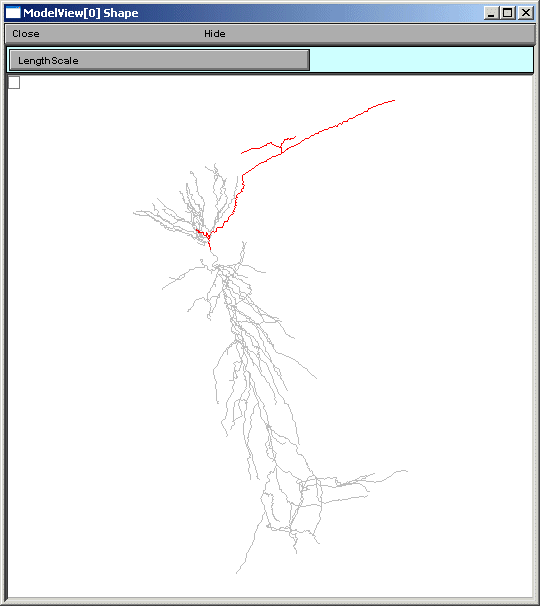

If a heterogeneous parameter is selected, e.g. ``ar2_hha_old``, a term used in a Na channel activation function, the range plot shows the overall complexity, while the text provides a place to explore the details of the distribution (figures below).

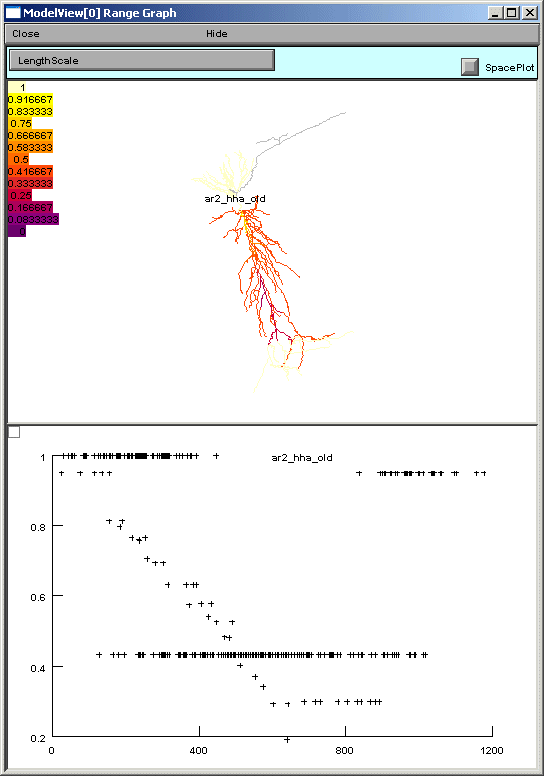

.. image::
    gif/fig7R.gif
    :align: center

Finally, in this example model, there is one point process, a current clamp, which when selected in the ModelView browser, will graph that it is positioned at the soma (standard IClamp show shape graph not shown).

ModelView and ModelDB
-----------

We plan on incorporating a ModelView window as an alternative window to the model file browsing window in ModelDB. Investigators will be able to browse the morphology and biophysical specification for the NEURON models stored in ModelDB. This browser is under development, but preliminary views (figures below) illustrates its similarity to the NEURON version.

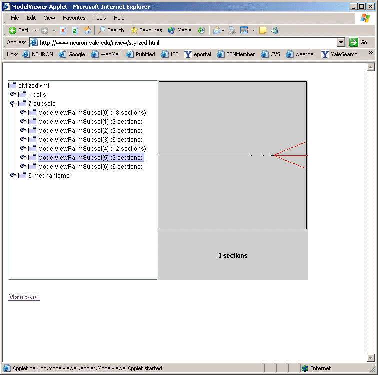

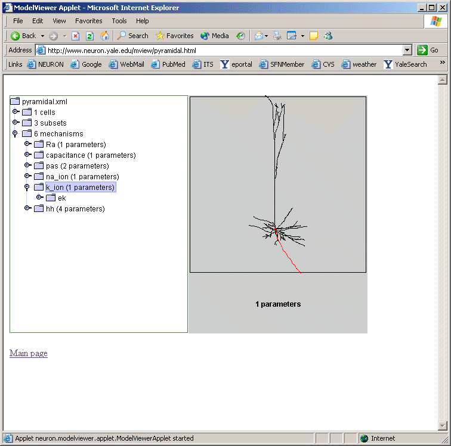

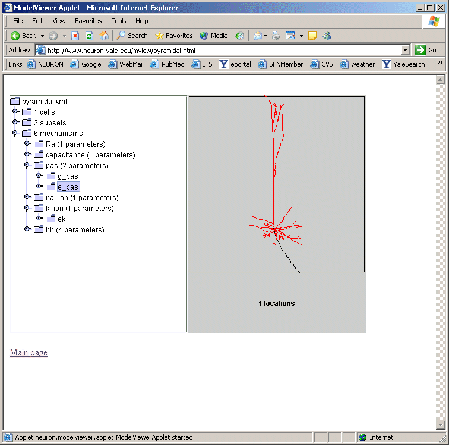

ModelView and Interoperability Future Goals
-----------------

ModelView can output an XML description of the model's morphology and biophysical specification. ModelView uses MorphML to describe the morphology of the cell. We are collaborating with the MorphML group (see reference) to evolve the MorphML specification for interoperability. The biophysical XML specification is under development and we have plans to provide translation tools to previous and developing standards. We will continue to refine the XML output to make it suitable for communication with neuroinformatics tools as well as other modeling software such as Catacomb and GENESIS. We will adopt, develop through informal collaboration and communication, and promote NeuroML (see reference) (whose goal is to establish standard descriptions of computational models that are simulator independent), BrainML (see reference) (whose goal is to develop standards in the general description of neuroscience data). We will also attempt to implement the tools required to import and export models with a third specification, CellML (see reference) (whose purpose is to store and exchange computer-based biological models.)

Summary 
++++++

ModelView is a powerful model exploration tool that summarizes and displays information about NEURON models that can be hard to find if one has only the model code to search through. The provided summary information and analysis can lead an investigator to ask questions about the model that would have been time-consuming to answer without ModelView. In addition XML interoperability tools are under development that will aid investigators in understanding models and in translating models to simulator platforms different than the one in which they were originally written.

Acknowledgement
---------

We are grateful for the support of NIH's Human Brain Project Grant number 5P01DC004732-04.

References
---------

BrainML: `http://neurobot.bio.auth.gr/2006/brainml-a-standard-xml-metaformat-for-exchanging-neuroscience-data/ <http://neurobot.bio.auth.gr/2006/brainml-a-standard-xml-metaformat-for-exchanging-neuroscience-data/>`_

CellML: `http://www.cellml.org/ <http://www.cellml.org/>`_

Hines, M.L. and Carnevale, N.T. NEURON: a tool for neuroscientists. The Neuroscientist 7:123-135, 2001. Migliore M, Morse TM, Davison, AP, Marenco L, Shepherd GM, Hines ML. ModelDB Making models publicly accessible to support computational neuroscience. Neuroinformatics 2003 1:131-134

MorphML: `https://www.ncbi.nlm.nih.gov/pmc/articles/PMC6130779/ <https://www.ncbi.nlm.nih.gov/pmc/articles/PMC6130779/>`_

NeuroML: `http://www.neuroml.org/ <http://www.neuroml.org/>`_