.. _optimization1:

Tutorial 1 : Fitting a function to data
=======================================

Suppose we have measured the time course of a synaptic conductance.

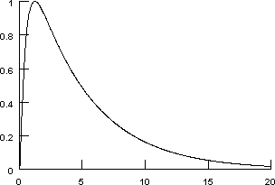

    Horizontal axis is in milliseconds.

.. toctree::
    :hidden:

    optimization1a

This particular data trace was produced by a simulation.
The implementational details of the model that was used
are not strictly relevant to this tutorial, but some of you 
will have to know, so :ref:`here they are <optimization1a>`.

Our goal is to approximate this conductance transient with a function of the form

.. math::

    A (e^{- k_1 t} - e^{- k_2 t} )

Step 0. Download the data
-------------------------

In this tutorial, we'll fit against the data in :download:`gsyn.dat <data/gsyn.dat>`. Download this file and save it to the folder where you are running NEURON from.

Step 1. Bring up a Multiple Run Fitter
--------------------------------------

First we create a new Multiple Run Fitter, and then we use it to create a Function Fitness Generator.

We need the GUI tool for optimization problems.
~~~~~~~~~~~~~~~~~~~~~~~~~~~~~~~~~~~~~~~~~~~~~~~

Create a Multiple Run Fitter by clicking on :menuselection:`Tools --> Fitting --> Multiple Run Fitter`
in the NEURON Main Menu toolbar.

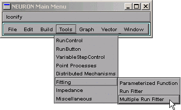

Release the mouse button and a Multiple Run Fitter appears.
This one is called ``MulRunFitter[0]``; we'll just call it "MRF".

We need a tool for optimizing a function.
~~~~~~~~~~~~~~~~~~~~~~~~~~~~~~~~~~~~~~~~~
Create a Function Fitness Generator by clicking on 
:menuselection:`Generators --> Add Fitness Generator --> Add Function Fitness`

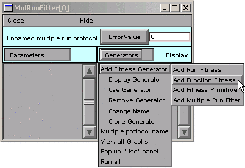

Release the mouse button, and the right panel of the MRF shows the item "Unnamed Function Fitness".

Give the Function Fitness Generator a descriptive name.
~~~~~~~~~~~~~~~~~~~~~~~~~~~~~~~~~~~~~~~~~~~~~~~~~~~~~~~

Ultimately we're going to use this Function Fitness Generator to calculate the difference between our experimental data and our function. But first we're going to change its name from "Unnamed Function Fitness" to "Synaptic conductance". This isn't absolutely mandatory for such a simple problem, but descriptive names are useful for keeping track of things in more complex optimizations.

To rename it, switch the MRF to "change name" mode by clicking on Generators and selecting Change Name.

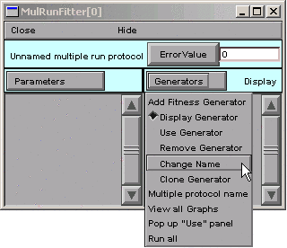

Note that "Change" appears to right of the Generators button.

Now double click on "Unnamed Function Fitness"

This brings up a dialog box that asks for a new name.

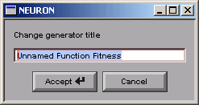

Click in the edit field and change the string to "Synaptic g".

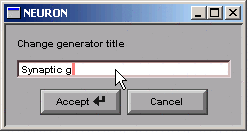

Then click on the Accept button.

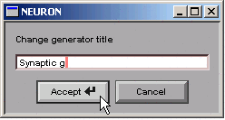

The right panel of the MRF shows the new name.

.. image:: fig/changename5.gif
    :alt: MulRunFitter[0] with new name

We need to see this Function Fitness Generator.
~~~~~~~~~~~~~~~~~~~~~~~~~~~~~~~~~~~~~~~~~~~~~~~

Now we have a Function Fitness Generator called "Synaptic g" that we will use to compare a function with experimental data. We need to get our experimental data into this Generator, but in order to do that, we have to see the Generator.

Put the MRF in "display" mode by clicking on :menuselection:`Generators --> Display`

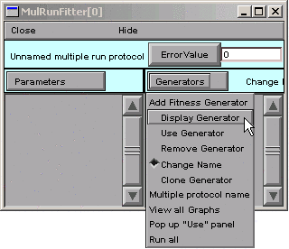

Now "Display" appears to the right of the Generators button.

Double click on "Synaptic g"

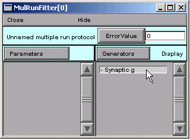

and up pops a window with the title "MulRunFitter[0] Generators".

.. image:: fig/display2.gif
    :alt: generator window

This is the Function Fitness Generator that we are calling "Synaptic g". If you click on its Close button, you can always get it back by making sure the MRF is in "Display" mode, and then clicking on "Synaptic g" in the right panel.

But if you close the MRF, you'll lose everything--unless you saved it to a session file.

That is: before we go any further, save everything to a session file!

This is a "data-driven" problem, so it makes sense at this point to load our experimental data into the Multiple Run Fitter.

Step 2. Load the Experimental Data into the Multiple Run Fitter
---------------------------------------------------------------

Actually, we'll be loading the data into the Multiple Run Fitter's Function Fitness Generator.

We need to load our data into the Function Fitness Generator.
~~~~~~~~~~~~~~~~~~~~~~~~~~~~~~~~~~~~~~~~~~~~~~~~~~~~~~~~~~~~~

The easiest way to load data into a Function Fitness Generator is to read the data into NEURON's clipboard, and then paste it into the Generator.

:menuselection:`NEURON Main Menu --> Vector --> Retrieve from File` brings up a tool that we can use to navigate the directory tree and choose the file that contains the data.

The data must be plain ASCII, with the following contents:
1.  Optional line with the format
    .. code::
        none
    
        label:anystring

2.  Optional "count" line with a number that specifies how many ``x`` ``y`` data pairs follow.
3.  The actual data, consisting of one tab-separated ``x`` ``y`` data pair per line.

Retrieval of long files is much more efficient if the "count" is present.

If the "count" is absent, there must be no empty lines at the end of the file and the last character must be a newline. 

Example:

.. code::
    none

    label:soma.v(.5)
    201
    0       -70
    0.025   -65.8269
    ...etc. for 199 more lines

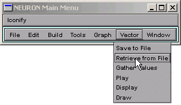

Double click on ``gsyn.dat``, the file that contains the data. (If you haven't already downloaded the data for this tutorial, it is available :download:`here <data/gsyn.dat>`.)

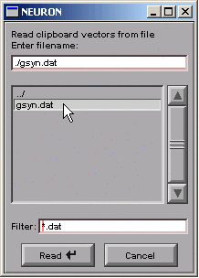

In the Generator, click on :menuselection:`Regions --> Data from Clipboard`

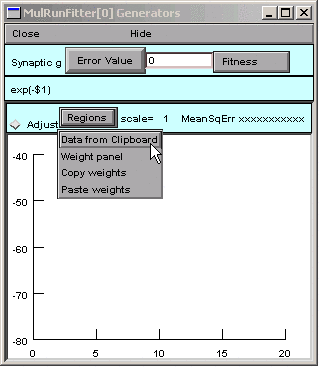

Our data appear as the red trace.

The vertical blue lines are cursors that can be used to select regions to which different weights will be applied when fitting a function to the red trace. For this example we will leave these alone.

    In reality this data was generated by an ampakin mechanism and saved to gsyn.dat manually by Pick Vector followed by :menuselection:`Vector --> Save to File`.

Time to save everything to a session file again.

Step 3. Specify the function we want to optimize
------------------------------------------------

Now the Function Fitness Generator contains the data we're trying to fit, and we're ready to specify the function that we'll use to fit it.

Selecting and Editing a Functional Form
~~~~~~~~~~~~~~~~~~~~~~~~~~~~~~~~~~~~~~~

We could enter our function completely from scratch, but let's see if the Generator has something that comes close to what we need.

:menuselection:`Fitness --> Common Functional Forms --> Double Exponential` looks promising.

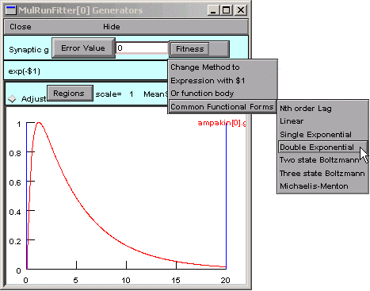

A dialog box appears, and the string in its edit field is almost right.

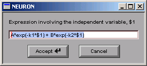

Almost.

We need to change the string from

.. code::
    none

    A*exp(-k1*$1) + B*exp(-k2*$1)

to

.. code::
    none
    
    A*(exp(-k1*$1) - exp(-k2*$1))

So we click in the edit field and change it,
making sure to get the parentheses right, 
and remembering to change the ``+`` to a ``-``.

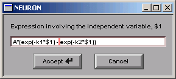

Then we click on the Accept button, which closes the dialog box.
Now our Generator looks like this:

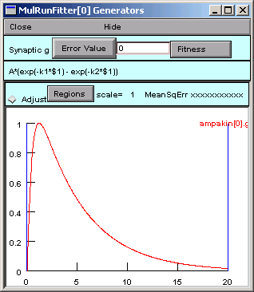

If we need to edit the function later, we can just click on 
:menuselection:`Fitness --> Common Functional Forms --> Expression` with ``$1``
and a dialog box will appear that has the function string in its edit field.

We have the correct functional form, so we're almost ready to specify the parameters.

But first we should save our work to a session file.

Step 4. Specify the parameters that will be adjusted
----------------------------------------------------

We don't just specify the parameters--we also test the Generator, and constrain the parameters.

Parameter specification
~~~~~~~~~~~~~~~~~~~~~~~

The function is

.. code::
    none

    A*(exp(-k1*$1) - exp(-k2*$1))

and its parameters are ``A``, ``k1``, and ``k2``. We want the optimizer to be able to adjust all of these in order to fit the function to the data.

In the MRF, clicking on :menuselection:`Parameters --> Add Parameter`

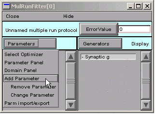

brings up a tool for specifying the name of a parameter.
We click in edit field, type ``A``, and then click on the Accept button.

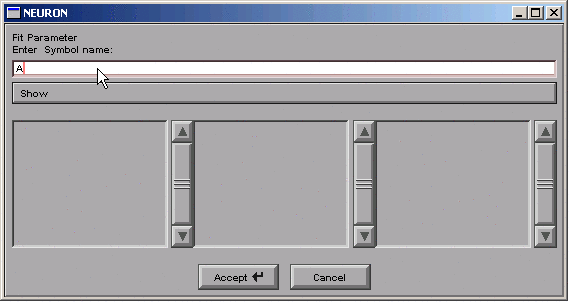

The left panel of the MRF now contains "A".

We repeat the same sequence for ``k1`` and ``k2``.
The MRF finally looks like this, with ``A``, ``k1``, and ``k2`` appearing in its left panel.

Save to a session file!

Testing the Generator
~~~~~~~~~~~~~~~~~~~~~

Let's see if things are working properly.

In the Generator, we click on the Error Value button.
This makes the Generator evaluate and plot the function. The Generator also computes the sum of squared error between the function and the experimental data for every value of the independent variable in the interval bracketed by the blue lines.

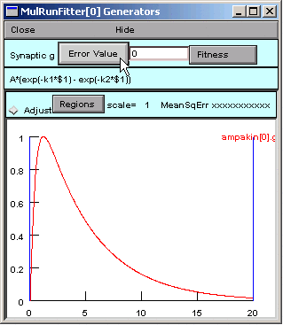

The Error Value field shows a nonzero value, suggesting that the Generator is working OK.

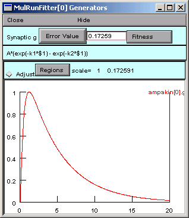

But where is the black trace that shows the trajectory of the parameterized function?

Ah, we completely forgot about the *values* of the parameters.

Viewing (and changing) parameter values
~~~~~~~~~~~~~~~~~~~~~~~~~~~~~~~~~~~~~~~

In the MRF, we click on :menuselection:`Parameters --> Parameter Panel`

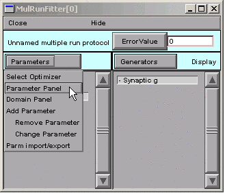

``A = 1`` (good), but ``k1 = k2 = 1``, so our function is 1 times the difference between two identical exponentials, i.e. 0.

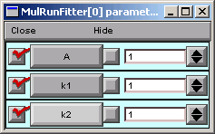

In the Generator you can click on the the x axis and confirm that a trace is there (crosshairs will appear, and you can run the crosshairs along the length of the x axis).

Let's change a parameter so we can see this trace.
In the Parameter panel, we change ``k2`` to ``10``.

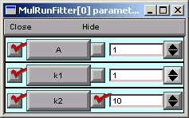

Now we go back to the Generator and click on Error Value again.

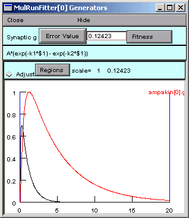

A small black curve appears--we're on the right track.

You don't absolutely have to save a session file now, but what harm could it do?

Constraining parameters
~~~~~~~~~~~~~~~~~~~~~~~

Now it's time to consider the topic of constraining parameters, first from the perspective of this particular problem, and then in more general terms.

In the MRF, we click on :menuselection:`Parameters --> Domain Panel`

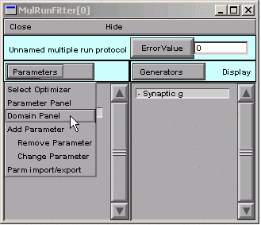

This brings up the MulRunFitter Domain panel, which shows that all parameters are unbounded, i.e. they are free to vary from :math:`-10^9` to :math:`10^9`.
Given the apperance of the data and the form of our function

.. math::

    A (e^{-k_1 t} - e^{-k_2 t})

we can tell that the objective function will have two minima:
one with A > 0 and k1 > k2 > 0, and the other with A < 0 and k2 > k1 > 0. Let's say we want to find the one with A > 0.

So in the MulRunFitter Domain panel we click on 
:menuselection:`group attributes --> positive definite limits`

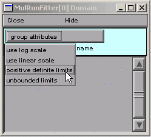

Now the parameters are constrained to lie between 1e-9 and 1e9.

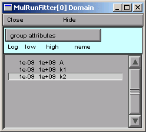

It's OK to close the MulRunFitter Domain panel; we can always bring it up again if we need it.

Restricting parameter space
###########################

For some optimization methods, e.g. random search algorithms, convergence can be improved by "fencing off" parts of parameter space that we aren't interested in. However, the PRAXIS optimizer used by NEURON requires a continuous objective function, so restricting parameter space can actually interfere with it. Nevertheless, it is always a good idea to at least restrict the parameter space to those regions where the objective function does not crash, since you never know what path an optimizer will take to reach its goal. For example, negative capacitance or conductance will generally make a simulation unstable, and 0 or negative concentrations will give a math error when the Nernst equation is calculated.

Log scaling
###########

PRAXIS often benefits from logarithmic scaling of parameters. Our experience suggests that this is most helpful when two or more parameters are very different in size, e.g. when they differ by orders of magnitude. To take advantage of log scaling, make sure that the problem is stated in a way that allows you to set a group attribute of "positive definite limits", and then set the "use log scale" group attribute. The performance improvement over linear scaling can be quite striking.

We have already stipulated that the parameters be positive definite, so we might as well **go ahead and use log scaling**. Later on we'll try linear scaling and compare the results.

Range constraints and log vs. linear scaling can also be set for individual parameters. This is discussed in the help files (look in the alphabetical listing for MulRunFitter).

Save to a session file before proceeding any further!

Step 5. Specify the criteria we want the function to satisfy
------------------------------------------------------------

This is where we select and customize the objective function that the optimizer will minimize. Choosing a good objective function for any given task is itself a complex and unresolved research problem, and making a satisfactory choice in any specific circumstance typically requires jugdement, experience, and empirical tests.

By default, a Generator computes an error value as "the square norm between the data and dependent variable treated as continuous curves," i.e. the sum of squared errors between the data and the function. Other methods are available, as discussed in the help files under the keyword MulRunFitter, but let's try the default method first. We will also leave the vertical blue lines, which mark the range of the independent variable over which the error is computed, in their default locations (spanning the entire range of the independent variable).

That's all we have to do about the objective function, at least for this example.

Step 6. Perform the optimization
--------------------------------

Compared to everything that came before, this part is easy.

Test the MRF
~~~~~~~~~~~~

We click on the MRF's Error Value button and . . . nothing happens.
The value displayed in the adjacent field is still 0.

Ah--we haven't told the MRF to use our Synaptic g generator.
See the little - (minus) sign in front of the generator's name?

So we click on :menuselection:`Generators --> Use Generator`

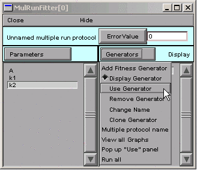

Notice the "Toggle" next to the Generators button.

Double clicking on "Synaptic g" in the MRF's right panel turns this generator on. If we double click on it again, it will turn back off--no big deal, because we can always turn it back on again.

The + signifies that the Synaptic g generator is on. This means that, when we click on the Error Value button in the MRF, the Synaptic g generator will be used and will contribute to the total error value that appears in the adjacent numeric field.

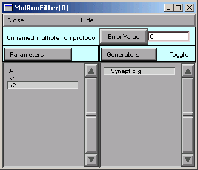

So we click on the MRF's Error Value button, and we see a nonzero value in the Error Value field. This confirms that we're using the Synaptic g generator.

Is this is a good time to save to a session file, or what?

Choose and use an optimization algorithm
~~~~~~~~~~~~~~~~~~~~~~~~~~~~~~~~~~~~~~~~

At last, we're ready to choose an optimization algorithm and use it. The only one currently available is Praxis.
:menuselection:`Parameters --> Select Optimizers --> Praxis`

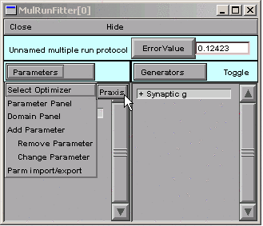

Selecting the Praxis optimizer brings up a MulRunFitter Optimize window (we'll just call this the "Optimize window").

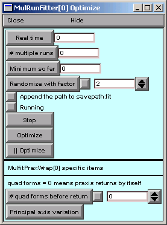

Now we click on the Optimize button in the Optimize window.

Several iterations flash by in the Generator, and we soon see the result of optimization.

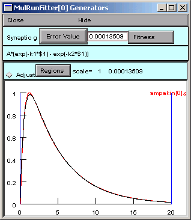

To examine the parameter values the optimizer settled on, we need to look at a Parameter panel.
Hint : in the MRF, click on :menuselection:`Parameters --> Parameter Panel`

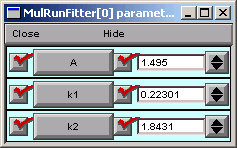

The fit looks nice, but the peak isn't quite perfect. Closer examination (New view in Generator) shows that the double exponential function starts to rise immediately, unlike the experimental data, which show an initial lag in the rise of synaptic condctance (sigmoidal onset).

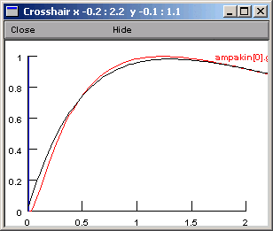

Whether this discrepancy matters or not depends entirely on what we intend to do with the optimized function.

    If you really have to know why there is an initial delay in the rising phase of g, the answer is that, although transmitter release is "instantaneous," :ref:`channel opening requires two reactions with finite rates <optimization1a>` (binding of transmitter A to the closed Rc, and conversion of the closed ARc to the open ARo).

"Extra credit" problem
~~~~~~~~~~~~~~~~~~~~~~

1. Note the final parameter values and the Error Value.
2. Restore the parameters to their initial values (A = 1, k1 = 1, k2 = 10), specify linear scaling, and try another optimization. Was optimization any faster? What difference did this make in the optimized parameters and Error Value?

    It turns out that log scaling is not critical for the present example, because the optimum parameter values span only one order of magnitude.

    Now see what happens when the parameters have very different magnitudes.

3. Read the data file into NEURON's clipboard, and then type ``h.hoc_obj_[0].mul(1e-5)`` at the >>> Python prompt or ``hoc_obj_[0].mul(1e-5)`` at HOC's oc> prompt. This makes the data values 5 orders of magnitude smaller.
4. Transfer these scaled data into the Generator (Regions / Data from Clipboard).
5. In the Parameter Panel, set k1 = 1, k2 = 10, and A = 1e-5.
6. In the Domain Panel, go back to linear scaling.
7. Click on the Error Value button (either in the Generator or in the MRF). Notice that the black and red traces have exactly the same shapes as when we used the unscaled data.
8. Now click on the Optimize button. Watch what happens as the optimizer tries to fit the data. Are things going as smoothly as with the unscaled data? Optimize again, and again, if you have to. What do you think about the speed of convergence and the quality of the fit?
9. Restore the parameters to k1 = 1, k2 = 10, and A = 1e-5, specify log scaling, and try another optimization.

    Did log scaling help when the optimum parameter values had very different magnitudes?

Hints
~~~~~

Local minima
    Poor fits may result if the optimizer falls into a local minimum of the objective function. To check for this possibility, bounce it out of there by clicking on the "Randomize with factor" button, and then start another optimization. You may want to increase the randomization factor from its default value of 2.

Adjustable parameters
    In the Parameter Panel (MRF / Parameters / Parameter Panel) you may have noticed the checkboxes to the left of the labeled parameter buttons. You can toggle these off or on to control which parameters will be varied during optimization.

"I clicked on Optimize, but only one run happened!"
    Check the Parameter Panel to make sure that the optimizer can adjust parameters.

Optimization is very slow, or returns nonphysiological values
    Use the Domain Panel to constrain parameters to reasonable ranges, and try log scaling if possible. In fact, it's not a bad idea to use log scaling whenever possible.
