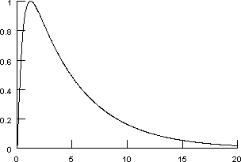

.. _optimization1a:

Implementational Details of the Synaptic Mechanism
==================================================

You don't have to know this to complete the optimization tutorial. Just pretend that we managed to get extremely clean data that allowed us to determine the time course of synaptic conductance with razor-sharp precision, and go back to the :ref:`main thread of the tutorial <optimization1>`.

But if you absolutely must know how we cooked up these data . . .

The conceptual model
--------------------

The conceptual model of synaptic transmission is based on a model of a non-NMDA excitatory synapse described by (Holmes and Levy 1990).

A presynaptic spike causes release of agonist A which binds rapidly (but not instantaneously) to the closed form of the channel Rc. The ARc complex can either dissociate, which destroys the agonist and leaves the channel closed, or it can undergo a conformational change to ARo, in which the channel is open.

The reaction scheme
-------------------

All concentrations are assumed to be dimensionless.

Binding of A to R
~~~~~~~~~~~~~~~~~

.. math::

    A + Rc \overset{k1}{\rightarrow} ARc

where each synaptic activation adds the same amount of A to the system, and k1 is much faster than the other rate constants.

Dissociation of ARc
~~~~~~~~~~~~~~~~~~~

.. math::

    ARc \overset{k2}{\rightarrow} Rc

Channel gating
~~~~~~~~~~~~~~

.. math::

    ARC \overset{alp}{\underset{bet}{\longleftrightarrow}} ARo.

.. math::

    g = (gmax)(ARo)(scalefactor)

where ``scalefactor`` has a value such that a sudden increase of A from 0 to 1 produces a peak conductance of ``gmax``.

Conservation
~~~~~~~~~~~~

.. math::

    R + ARc + ARo = 1

This means the conductance saturates.

With k1 = 100/ms, k2 = 1/ms, alp = 1/ms, bet = 0.5/ms, and scalefactor ~ 2.92651, a single synaptic activation with a weight of 1 (i.e. activation makes A jump from 0 to 1) produces the conductance transient shown here.

    Horizontal axis is in milliseconds.

Reference
---------

Holmes, W.R., and Levy, W.B. Insights into associative long-term potentiation from computational models of NMDA receptor mediated calcium influx and intracellular calcium concentration changes. J. Neurophysiol. 63: 1148-1168, 1990.
`doi:10.1152/jn.1990.63.5.1148 <https://doi.org/10.1152/jn.1990.63.5.1148>`_