.. _optimization2:

Tutorial 2 : Fitting a model to data
====================================

Note : this tutorial assumes that you have already worked through the :ref:`first tutorial on the Multiple Run Fitter <optimization1>`.

The problem
-----------
Given:

* input resistance RN and a charging transient recorded with a patch electrode attached to the soma of a neuron (appropriate channel blockers were employed, and tests verified a linear I-V relationship)
* detailed morphometric data obtained from the same cell

The challenge : use these data to create an anatomically detailed, passive model with uniform biophysical properties that matches the experimentally observed charging transients.

This example employs current clamp data, with no loss of generality. Using voltage clamp data would, for the most part, involve similar steps and raise analogous considerations; the few exceptions will be noted as they arise.

The cell and the electrical measurements
----------------------------------------

This is a side view of the cell from which the anatomical and biophysical data were obtained. You may recognize it as the pyramidal cell that is included with NEURON's demonstration program.

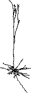

The input resistance RN of this cell was ~153 megohms. The charging transient was elicited by applying a 1 nA current pulse that started at 1 ms and lasted 0.5 ms (below left); the entire recording was 200 ms long (below right). The (t,v) data are contained in :download:`iclamp.dat <data/iclamp.dat>`

Note that the recording of somatic Vm shows absolutely no electrode artifact--compensation for electrode capacitance and series resistance was perfect.

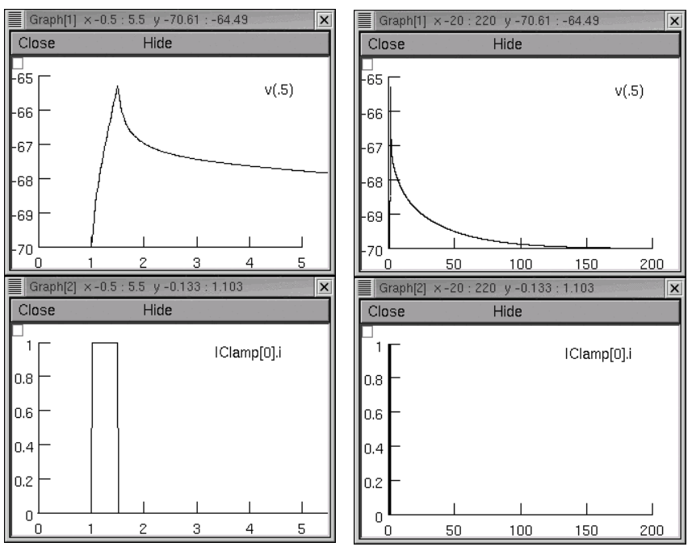

* Using a brief current pulse emphasizes high frequency terms in the voltage response, which are necessary in order to estimate cytoplasmic resistivity. High frequency terms are also present in the current response to a step command under voltage clamp.
* In reality RN and the charging transient were generated with a model. I saved the charging transient from a simulation manually by Pick Vector followed by :menuselection:`Vector --> Save to File`.
* An important note about methods : The following simulations were performed with fixed time step integration (dt = 0.025 ms), and the spatial grid of the model was specified using d_lambda = 0.1. Using adaptive integration with an absolute tolerance of 0.0001 and reducing d_lambda to 0.01 caused no significant change in the voltage trajectory under current clamp.

Step 1. Create an "unoptimized" model
-------------------------------------

If this were a "real" problem, we'd have to convert our morphometric data to a form that NEURON can use (e.g. using NEURON's Import3D tool to import it into a CellBuilder). Then we'd use the CellBuilder to specify the discretization strategy and insert Ra, cm, and the pas mechanism (see the CellBuilder tutorial).

For your convenience, I have already

* imported the data into a CellBuilder
* specified the d_lambda strategy for the "all" subset (with d_lambda = 0.1 lambda :sub:`100`)
* inserted Ra, cm, and pas into the "all" subset, leaving their default parameter values unchanged (80 ohm cm, 1 uf/cm2, g_pas = 0.001 siemens/cm2). e_pas was set to -70 mV, the "experimentally observed" resting potential.
* turned Continuous Create ON

and saved the results to :download:`rawmodel.ses <data/rawmodel.ses>` 

`This link will get you neuron-optimization-tutorial2-*.zip, which contains rawmodel.ses plus other files that are used in this exercise. <https://github.com/simtooldb/neuron-optimization-tutorial2/archive/8e2c5f1c3688e84ebd3fdc5e5e6bb722db204196.zip>`_

Step 2. Set up a current clamp experiment on this model
-------------------------------------------------------

Remember that the charging transient was elicited by applying a 1 nA current pulse that started at 1 ms and lasted 0.5 ms, and the entire recording was 200 ms long. We need to construct a "virtual experimental rig" that applies the same current to the soma of our model.

So we start NEURON with a graphical interface in any of the usual ways, and use the NEURON Main Menu toolbar to load :file:`rawmodel.ses`

Then we create

* a RunControl panel. Change Tstop to 200 ms and set v_init to -70 mV (numeric field next to the Init button).
* a PointProcessManager. Configure this to be an IClamp. Leave it attached to soma(0.5), but set del = 1 ms, dur = 0.5 ms, and amp = 1 nA.
* a Voltage axis graph
* a Current axis graph. Use this graph's "Plot what?" to add ``IClamp[0].i`` to its plotlist.

Now we run a simulation and find that somatic Vm is a far cry from the original experimental data.

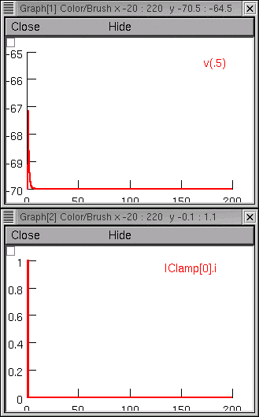

Project management time!
~~~~~~~~~~~~~~~~~~~~~~~~

Before going any further, we should use the Print & File Window Manager to save a session file that contains the "virtual experimental rig" (the RunControl panel, PointProcessManager, and graphs, but *not* the CellBuilder). This can be called anything we like (I called it :file:`iclamp_rig.ses`).

To make it easy for us to recreate our current clamp experiment, we next create a file called :file:`init_iclamprawmodel.hoc` that contains these statements :

.. code::
    hoc

    load_file("nrngui.hoc")
    load_file("rawmodel.ses")
    load_file("iclamp_rig.ses")

Using NEURON to execute :file:`init_iclamprawmodel.hoc` loads our unoptimized model, and brings up our current clamp rig, ready to go.

What about input resistance?
~~~~~~~~~~~~~~~~~~~~~~~~~~~~

Oops. Almost forgot this. We have to verify that RN of our model cell matches the experimentally measured value.
Let's take advantage of NEURON's Impedance class, which has an input() method that computes the input impedance at a specified location. Here's a bit of code that does the job :

.. code::
  hoc

  objref zz
  zz = new Impedance()

  func rn() { local rn
    init()  // make sure all changes to g, c, ri etc. have taken effect
    soma zz.loc(0.5)  // sets origin for impedance calculations to middle of soma
    zz.compute(0)  // DC input R
    soma { rn = zz.input(0.5) }  // rn is input R at middle of the soma
    return rn
  }
Just cut and paste this into a file called :file:`rn.hoc`

Finally, let's add these lines to the end of :file:`init_iclamprawmodel.hoc`:

.. code::
  hoc

  load_file("rn.hoc")

  print "DC input resistance of cell is ", rn(), "megohms"
  run()

Now when we use NEURON to execute :file:`init_iclamprawmodel.hoc`, it automatically uses ``rn()`` to report RN of our model and then runs a simulation that shows the transient response.

Here's what the revised init_iclamprawmodel.hoc tells us:

.. code::
  none

  DC input resistance of cell is 5.6534218 megohms

Nowhere near the experimentally measured 153 megohms.

Notes:

    * `neuron-optimization-tutorial2-*.zip <https://github.com/simtooldb/neuron-optimization-tutorial2/archive/8e2c5f1c3688e84ebd3fdc5e5e6bb722db204196.zip>`_ contains our :file:`iclamp_rig.ses` and :file:`init_iclamprawmodel.hoc`
    * The principal difference between :file:`init_makedata.hoc` and :file:`init_iclamprawmodel.hoc` is which model's ``ses`` file is loaded. The former loads the model that has the "actual" biophysical properties of the cell (which we're supposed to use the optimizer to discover). The latter loads the model that has our wildly inaccurate initial guess at these properties. Modular programming!!

Step 3. Configure a MultipleRunFitter to do a "run fitness" optimization
------------------------------------------------------------------------

Here we create a new Multiple Run Fitter, and use it to create a Run Fitness Generator. This is very similar to what we did in the tutorial on optimizing a function.

Might as well start fresh--quit NEURON, then use NEURON to execute :file:`init_iclamprawmodel.hoc`

Create a Multiple Run Fitter.
~~~~~~~~~~~~~~~~~~~~~~~~~~~~~

We saw how to do this in the first tutorial. In the NEURON Main Menu toolbar, click on 
:menuselection:`Tools --> Fitting --> Multiple Run Fitter`

Release the mouse button and a Multiple Run Fitter appears.
We'll call it "MRF".

We need a tool to perform a "run fitness" optimization.
~~~~~~~~~~~~~~~~~~~~~~~~~~~~~~~~~~~~~~~~~~~~~~~~~~~~~~~

Create a Run Fitness Generator by clicking on the MRF's
:menuselection:`Generators --> Add Fitness Generator --> Add Run Fitness`

Release the mouse button, and the right panel of the MRF shows an item called "Unnamed single run protocol".

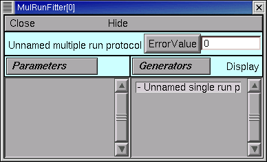

Give the Run Fitness Generator a descriptive name.
~~~~~~~~~~~~~~~~~~~~~~~~~~~~~~~~~~~~~~~~~~~~~~~~~~

We're going to use this Run Fitness Generator to calculate the difference between our experimental data and simulated current clamp experiments that use the model we created. To remind ourselves of its purpose, we change its name from "Unnamed single run protocol" to "iclamp".

We saw how to do this in the first tutorial.

1. Switch the MRF to "change name" mode by clicking on :menuselection:`Generators --> Change Name`. "Change" should appear to right of the Generators button.
2. In the MRF's right panel, double click on "Unnamed single run protocol"
3. Enter the string "iclamp" into the dialog box's edit field, then click its Accept button.

The right panel of the MRF shows the new name.

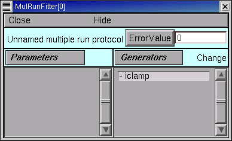

We need to see this Run Fitness Generator.
~~~~~~~~~~~~~~~~~~~~~~~~~~~~~~~~~~~~~~~~~~

We need to get our experimental data into our "iclamp" Run Fitness Generator. To do that, we have to see the Generator.

1. Click on the MRF's Generators / Display to put it in "display" mode. Now "Display" appears to the right of the Generators button.

2. 
    Double click on "iclamp", and up pops up a tiny window titled "MulRunFitter[0] Generators".

    .. image:: fig/tinyiclamp.gif

    From now on we'll call this the iclamp Run Fitness Generator.

3.

    We have to tell our iclamp Run Fitness Generator which variable in our model it needs to test. Click on this thing's Fitness button, and select the item "Variable to fit" from the popup menu.

    .. image:: fig/vartofit.gif

    This brings up a "variable name browser"

    .. image:: fig/variablenamebrowser.gif

    An aside: this looks and works just like the tool we have used elsewhere to add variables to a Graph's plot list (remember "Plot what?").

4.
    Click inside the edit field of the variable name browser tool and type

    .. code::
        none

        soma.v(0.5)

    as shown here

    .. image:: fig/variablenamesomavx.gif
    
    Then click on its Accept button.

The variable name browser will go away, but our iclamp Run Fitness Generator looks unchanged. We need to make the MRF redraw it.

But first, save the MRF to a session file! Call it :file:`iclampfit.ses`

Redrawing the iclamp Run Fitness Generator
##########################################

Click on the iclamp Run Fitness Generator's "Close" button. We get it back by making sure the MRF is in "Display" mode, and then clicking on "iclamp" in its right panel.

    *If you made a mistake and clicked on the MRF's Close button, both the MRF and the iclamp Run Fitness Generator went away. But since you saved the MRF to a session file, it's easy to restore.*

Here's what the redrawn Run Fitness Generator looks like.

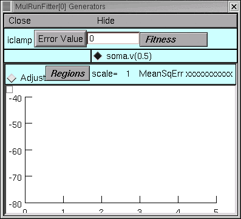

Step 4. Load the Experimental Data into the iclamp Run Fitness Generator
------------------------------------------------------------------------

This actually involves two steps : loading data into the iclamp Run Fitness Generator, and testing the generator.

Loading data into the Run Fitness Generator
~~~~~~~~~~~~~~~~~~~~~~~~~~~~~~~~~~~~~~~~~~~

We'll do the same as in the first tutorial : read the data into NEURON's clipboard, and then paste it into the Generator.

1. :menuselection:`NEURON Main Menu --> Vector --> Retrieve from File`
2. Navigate the directory tree and choose iclamp.dat, which contains the data.
3. In the iclamp Run Fitness Generator, click on :menuselection:`Regions --> Data from Clipboard`

We recall from the first tutorial that the red trace is our data, and the vertical blue lines are the cursors for setting the "optimization regions."

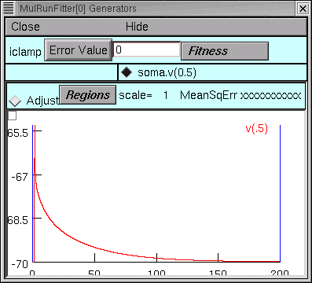

Testing the Run Fitness Generator
~~~~~~~~~~~~~~~~~~~~~~~~~~~~~~~~~

Now we should be able to do a little test of our iclamp Run Fitness Generator :

clicking on its Error Value button should launch a simulation, producing a trace that shows the trajectory of ``soma.v(0.5)`` and reporting an error value as shown here.

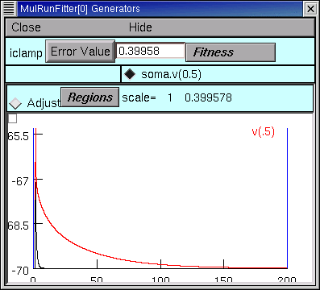

Project management time again!
##############################

After doing all that work on the MRF, let's save it to a session file. The same file name as before will be fine, i.e. :file:`iclampfit.ses`

Make sure you save the MRF itself, not the iclamp Run Fitness Generator.

Also, we should probably make a new init...hoc file that we can use to automatically load the model and the MRF (instead of having to start :file:`init_iclamprawmodel.hoc`, wait for it to complete a simulation, and then manually use the Main Menu's :menuselection:`File --> load session` to retrieve :file:`iclampfit.ses`).

So let's copy :file:`init_iclamprawmodel.hoc` to :file:`init_iclampopt.hoc`, 
and then change :file:`init_iclampopt.hoc` so that it reads like this :

.. code::
  hoc

  load_file("nrngui.hoc")
  load_file("rawmodel.ses")
  load_file("iclamp_rig.ses")
  load_file("rn.hoc")
  load_file("iclampfit.ses")

Step 5. Specify the parameters that will be adjusted
----------------------------------------------------

This involves two steps : specifying the model parameters that are to be adjusted, and constraining them.

Parameter specification
~~~~~~~~~~~~~~~~~~~~~~~

Proxy parameters
################

When we set up the MRF to optimize a function, we simply used its :menuselection:`Parameters --> Add Parameter` button to add the function's parameters, one by one, to the list of parameters that it was to adjust. But now we're dealing with a model that has many sections, each with its own Ra, cm, and g_pas, and the MRF has to adjust them all. It also has to keep them equal over all sections.

One strategy for dealing with this problem is to create "proxies" for Ra, cm, and g_pas. We'd add these proxies to the MRF's parameter list. Then we would take advantage of the fact that NEURON's standard run system can be customized--we'd use a custom initialization that applies the same values to all sections.

Here's how :

First, we declare

.. code::
  hoc

  // proxies for NEURON's Ra, cm, g_pas
  Ri = 80    // ohm cm
  Cm = 1     // uf/cm2
  Rm = 1000  // ohm cm2

Then we write our own custom ``init()`` procedure that uses a forall loop to give all sections the same values of Ra, cm, and g_pas.

.. code::
  hoc

  proc init() {
    // optimizer adjusts Ri, Cm, Rm, but NEURON uses Ra, cm, g_pas
    forall {
      Ra = Ri
      cm = Cm
      g_pas = 1/Rm
    }
    finitialize(v_init)
    if (cvode.active()) {
      cvode.re_init()
    } else {
      fcurrent()
    }
    frecord_init()
  }

To simplify future code maintenance, we probably should put both of these code fragments into a single file called :file:`params.hoc`.

To make use of :file:`params.hoc`, we have to add a new :hoc:func:`load_file` statement to :file:`init_iclampopt.hoc`. The proxy variables have to exist before the MRF can use them, so :file:`params.hoc` must be loaded before :file:`iclampfit.ses`. Here's the new :file:`init_iclampopt.hoc` :

.. code::
  hoc

  load_file("nrngui.hoc")
  load_file("rawmodel.ses")
  load_file("iclamp_rig.ses")
  load_file("rn.hoc")
  load_file("params.hoc")
  load_file("iclampfit.ses")

Before we can use the proxy variables with our MRF, we have to exit NEURON and restart with our new :file:`init_iclampopt.hoc`

Testing the proxy parameters
############################

Let's make sure the proxy parameters are doing what we think they should do. At the oc> prompt type

.. code::
  hoc

  rn()

This should return a numeric value of ``5.6534218``, i.e. the input resistance of our unoptimized model.
Now type

.. code::
  hoc

  forall print secname(), " ", g_pas

In each section, ``g_pas`` should be 0.001.
Next type

.. code::
  hoc

  Rm *= 2

Initializing the model will reduce ``g_pas`` in each section by a factor of 2, and increase the RN of the cell. Recalling that our ``rn()`` function does in fact initialize the model, we now type
  
.. code::
  hoc

  rn()

and get a returned value of 9.9076814 (the fact that RN didn't double tells us that the cell has significant electrotonic extent). And typing

.. code::
  hoc

  forall print secname(), " ", g_pas

confirms that ``g_pas`` is now 0.0005 everywhere.

Using the proxy parameters
##########################

Now we're ready to add ``Ri``, ``Cm``, and ``Rm`` to the MRF's parameter list. This is exactly the same as in the first tutorial.

1. Click on the MRF's :menuselection:`Parameters --> Add Parameter`. This brings up a variable name browser (where have we seen that before?).
2. Click in the edit field of the variable name browser, type ``Ri``, and then click on the Accept button.
3. Do the same for ``Cm`` and ``Rm``

The MRF now looks like this, with ``Ri``, ``Cm``, and ``Rm`` in its left panel.

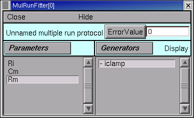

Save the MRF to a session file!

Viewing (and changing) parameter values
~~~~~~~~~~~~~~~~~~~~~~~~~~~~~~~~~~~~~~~

This too is the same as in the first tutorial : click on the MRF's :menuselection:`Parameters --> Parameter Panel`

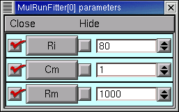

Let's change ``Rm`` and see what happens.

In the Parameter panel, we increase Rm to 10000

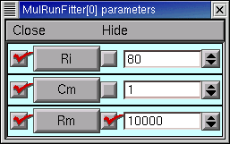

and then go back to the iclamp Run Fitness Generator and click on Error Value. This launches a new simulation

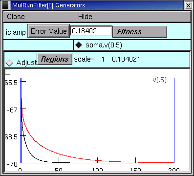

and we see that the new voltage trajectory (black trace) is closer to the experimental data (red trace), and the Error Value is smaller.

**Before going any further, return Rm to 1000 to ensure that you're "in sync" with the remainder of this tutorial.**

Constraining parameters
~~~~~~~~~~~~~~~~~~~~~~~

In the first tutorial, you will find a general discussion on the topic of constraining parameters. For this particular problem, we will take advantage of the fact that all three model parameters (Ri, Cm, and Rm) are positive definite and can be log scaled. We do this in exactly the same way as in the first tutoral.

1. Bring up the MRF's Domain panel by clicking on its :menuselection:`Parameters --> Domain Panel`
2. In the MulRunFitter Domain panel click on :menuselection:`group attributes --> positive definite limits`
3. In the MulRunFitter Domain panel click on :menuselection:`group attributes --> use log scale`

Close the MulRunFitter Domain panel if you like; we can always bring it up again if we need it.

Save the MRF to a session file before proceeding any further!

Step 6. Perform the optimization
--------------------------------

We're in the home stretch.

Test the MRF
~~~~~~~~~~~~

We click on the MRF's Error Value button and . . . nothing happens.

The value displayed in the adjacent field is still 0. But we remember from the first tutorial that we need to tell the MRF to use our generator--
and the iclamp Run Fitness Generator still has a little - (minus) sign in front of its name.

Once again, the steps are the same as in the first tutorial.

1. 
    In the MRF, we click on :menuselection:`Generators --> Use Generator`
    and note the appearance of "Toggle" next to the Generators button.

2.
    Now we can turn on the iclamp Run Fitness Generator by double clicking on "iclamp" in the right panel of the MRF

Now a + (plus sign) appears next to "iclamp" in the MRF's right panel. This tells us that the iclamp Run Fitness generator is on, so when we click on the MRF's Error Value button, the iclamp Run Fitness Generator will contribute to the total error value that appears in MRF's error value field.

So we click on the MRF's Error Value button, and a nonzero value does appear in the Error Value field. This confirms that we're using the iclamp generator.

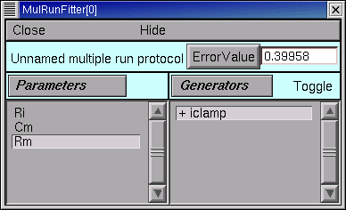

This is another good time to save the MRF to a session file.

    In `optimization2-code-*.zip <https://github.com/simtooldb/neuron-optimization-tutorial2/archive/8e2c5f1c3688e84ebd3fdc5e5e6bb722db204196.zip>` you will find :file:`init_iclampopt.hoc` and all of the hoc and ses files that it needs to recreate the unoptimized model, current clamp "virtual experimental rig," and Multiple Run Fitter, exactly as they should be at this point of the tutorial. Just use NEURON to execute :file:`init_iclampopt.hoc`

Choose and use an optimization algorithm
~~~~~~~~~~~~~~~~~~~~~~~~~~~~~~~~~~~~~~~~

This is very similar to the first tutorial.

1. In the MRF click on :menuselection:`Parameters --> Select Optimizers --> Praxis`. This brings up a MulRunFitter Optimize panel, which we'll call the "Optimize panel".
2. Change the "# quad forms before return" (numeric field near the bottom of the Optimize panel) from 0 to 1.

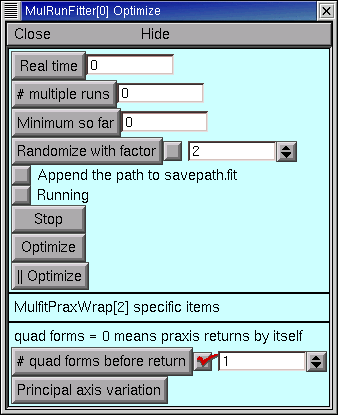

Now we're ready to click on the Optimize button in the Optimize panel.

Problems and pitfalls
~~~~~~~~~~~~~~~~~~~~~

Before the first optimization, we click on the MRF's Error Value button and note that the initial parameter values (Ri = 80, Cm = 1, Rm = 1000) give an error of 0.39958. Then we click on the Optimize button, and several iterations flash by in the Generator. For a while there doesn't seem to be much improvement, but eventually the optimizer stops. Although the error value has decreased somewhat, there still seems to be quite a way to go.

Dauntless, we press ahead, clicking again on Optimize. Another series runs flash by, leaving the voltage trace looking much better. One more click on Optimize and it seems we're stuck in a local minimum, with the black trace in the iclamp Run Fitness Generator hardly changing from run to run.

But what of our results? Rm looks acceptable (if a bit low) at 14481 ohm cm2, and when we type ``rn()`` at the oc> prompt, we get 157.9155, which is close to the experimentally measured 153 megohms. Also, the overall time course of the model's Vm trajectory looks like a close match to the experimental data.

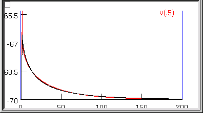

However, Ri and Cm are unbelievable--13613 ohm cm and 3.9156 uf/cm2 ! What went wrong?

Examining the first 5 ms of the model's ``soma.vm(0.5)`` trajectory, we see that it doesn't really capture the early time course of the experimental data.

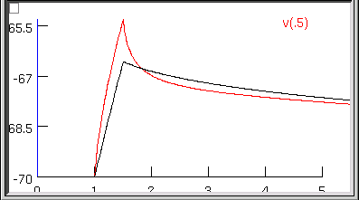

This really shouldn't be much of a surprise. Basically we performed a blind curve fitting operation on data that stretches over 200 ms. When you think about it that way, the black trace is really a pretty good fit to the original data. We may know that the first few milliseconds of the charging curve contains most of the information that is useful for determining Ri and Cm, but the optimizer algorithm is ignorant of that fact, and gives the error at each data point equal consideration. Therefore the early part of the charging transient is treated like an inconsequential blip, and the fit is dominated by the long, slow decay phase.

So much for blind reliance on an algorithm. Time to use what we know, or can reasonably surmise.

A minimal principled strategy
#############################

Let's try something very simple. For example, the initial values of Ri (80 ohm cm) and Cm (1 uf/cm2) are in the right ballpark, but Rm (1000 ohm cm2) is probably far too small. So why don't we follow the minimal strategy described by this pseudocode?

.. code::
  none

  REPEAT
    optimize Rm only
    optimize Ri and Cm only
  UNTIL done

With a little effort we could be a lot more clever--e.g. we might apply a greater weight to errors computed during the early part of the charging curve, as described in the Hints at the bottom of this page--but first let's see how far this minimal strategy takes us.

To keep track of how well we're doing, we'll monitor the MRF's error value and the values of Rm, Ri, Cm, and rn(), making sure that they converge.

The checkboxes to the left of the parameter buttons in the Parameter Panel allow us to specify which parameters will be adjusted by the optimizer, and which will remain constant. When the Parameter panel is first brought up, all of these checkboxes are checked, which means that adjustment of all parameters is enabled.

.. image:: fig/parampanel0-2.gif

Clicking on one of these checkboxes toggles adjustment of the corresponding parameter between ON (check present) and OFF (no check). Here's how the Parameter Panel should look before we start the first optimization on Rm :

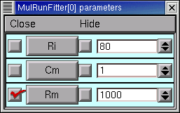

After the 9th quad form with Ri and Cm constant, the error seems to have settled at 0.013147, with Rm = 44123 ohm cm2, RN = 150.07105, and the MRF looks like this

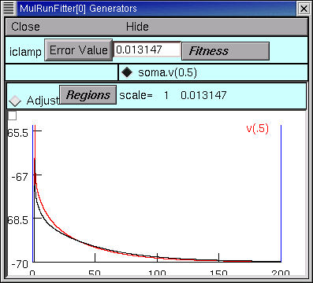

This seems a propitious moment to disable adjustment of Rm and enable adjustment of Ri and Cm

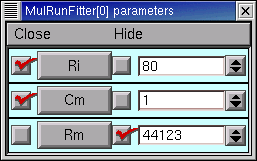

and try optimizing the latter parameters.

Over the next two quad forms the error plummets rapidly, and by the 12th quad form it seems to come to rest at 7.1536e-5, with Ri = 137.96, Cm = 0.83841, Rm = 44123, and RN = 153.35106. The simulated transient is also visibly much closer to the experimental data (see for yourself).

At this point, what say we bet the farm--enable adjustment of all parameters--Ri, Cm, and Rm--and see if we can squeeze out a bit more error reduction? No triskaidekaphobia here!

The 13th quad form returns with the simulated transient visually indistinguishable from the experimental data (the red trace is hidden behind the black trace).

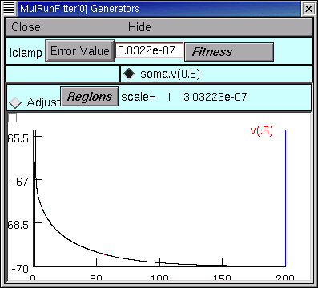

even when we zoom in on the first few milliseconds.

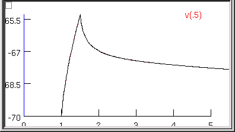

The error fell to 3.0322e-7--by more than two orders of magnitude--and the model's parameters are now Ri = 155.76 ohm cm, Cm = 0.85852 uf/cm2, and Rm = 43060 ohm cm2, and the model's input resistance is 153.38781.

Now clicking on the Optimize button causes the error, parameters, and RN to merely bounce around in their last few decimal places. This might matter if it made sense to aim at three place accuracy or better, but we know that two place accuracy is about as good as you can get from charging curves. We are compelled by our natural modesty and discretion to conclude that Ri ~ 156 ohm cm, Cm ~ 0.86 uf/cm2, and Rm ~ 43000 ohm cm2.

What about dirty data?
######################

Charging curves are subject to several kinds of problems, the most serious being contamination of the early time course by electrode and amplifier artifacts (under- and overcompensation of electrode capacitance and series resistance). This can interfere with the accuracy of Ri estimates. Disappearance of the late decay phase into baseline noise may also happen.

Want to try dealing with these problems?

Contamination of the early response
>>>>>>>>>>>>>>>>>>>>>>>>>>>>>>>>>>>

This forces us to abandon the data collected during current injection and for a (hopefully) brief time afterwards.

For example, suppose we know that electrode artifact persists for 0.5 ms after the end of current injection. Then we want to restrict the range of time over which the optimizer computes its error, in order to avoid the contaminated data.

We can use the Weight panel to do this.

1. 
    In the iclamp Run Fitness Generator, click on :menuselection:`Regions --> Weight panel`
2.
    In the data weights panel, change the "interval 1 startpoint" from 0 to 2. The field will automatically change to 2.0125, which is OK. For the particular data we're using, this means that we're going to ignore everything from 0 to 2 ms, which includes all data collected during current injection and for the first 0.5 ms thereafter.

    .. image:: fig/startafter2.gif

The MRF's graph provides visual confirmation that the left edge of interval 1 now starts at 2 ms (vertical blue line). Clicking on the Error Value button makes the error calculation, and plot of simulation results, begin at the new starting point (black trace).

Here's the challenge :

Restore the original values of Ri, Cm, and Rm (80, 1, 1000), and try to optimize the model while ignoring the contaminated data. It's a safe bet that, the later the "interval 1 startpoint" becomes, the poorer the fit will be, especially the value of Ri--but how late does the startpoint have to be, before fitting becomes a guessing game?

Contamination of the late response
>>>>>>>>>>>>>>>>>>>>>>>>>>>>>>>>>>

Try reducing "interval 1 endpoint" and see how this affects the fit. Intuition suggests that, for this model, the fit should be fairly good unless the endpoint is < 100 ms.

Hints
~~~~~

Randomizing parameters
    Remember to try "Randomize with factor" as a way to see whether the optimizer is falling into a local minimum of the objective function.

Adjusting regions
    Use the MRF generator's "adjust regions" feature to reposition region boundaries (the vertical blue lines on the MRF Generator's canvas, create new regions, or merge adjacent regions.

    *
        **Activating the "adjust regions feature"**

        Merely click on the "Adjust" radio button.

        .. image:: fig/optimization-adj1.gif

    *
        **Repositioning region boundaries**

        Click on one of the region boundaries and drag it to a new location. This is equivalent to specifying the interval startpoints and endpoints in the Weight panel.

        .. image:: fig/optimization-adj2.gif
    
    *
        **Creating new regions**

        Click on the canvas, and a new region boundary will appear at that location.

        .. image:: fig/optimization-addregion1.gif

        Reposition it as you like by dragging, or by using the Weight panel.

        .. image:: fig/optimization-addregion2.gif
    
    *
        **Merging adjacent regions**
        
        To merge adjacent regions, click on the region boundary that separates them, and drag it to the right or left until it collides with one of the other region boundaries. That's all there is to it.

Notes
#####

1. When there is more than one region, the Weight panel can be used to emphazise or de-emphasize contributions from different regions to the total error computed by the MRF Generator. You might want to see how well it works as a way to prevent our example's fit from being dominated by the slow decay phase of the charging curve.
2. After creating or merging regions, you'll want to close and reopen the Weight panel so that it shows the current number of regions, along with their startpoints and endpoints.
