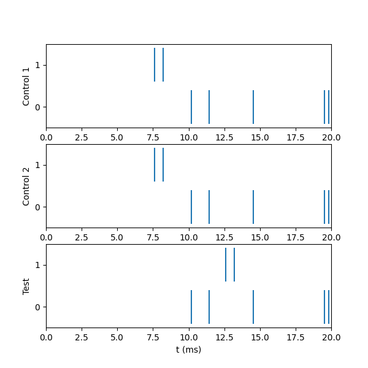

Randomness in NEURON models
===========================
There are many potential applications of randomness in modeling. These fall into two broad categories:

Randomization of the model specification
    Purpose: to emulate natural biological variation of parameters such as number of cells, connectivity between cells, anatomical and/or biophysical properties of cells and their connections.

Randomization of simulation execution
    Purpose: to emulate stochastic phenomena such as single channel gating, transmitter release, afferent spike trains, variation of natural stimuli, extrinsic noise sources.

Recurring issues in the specification of models of cells and networks that involve randomness include the following:

* How to create model specification code that employs randomization in a way that (1) avoids undesired correlations between parameters, and (2) produces a model cell or network that has the same architecture and biophysical properties, and generates the same simulation results regardless of whether it is run on serial or parallel hardware, the number of processors that it uses, and how the elements of the model are distributed over the processors.
* How to generate spike streams or other signals that fluctuate in ways that are statistically independent of each other.

These papers present models implemented with NEURON that provide some examples of randomization in model specification code:

* 
    The network with random connectivity in

        Carnevale NT, Hines ML. (2008). Translating network models to parallel hardware in NEURON. *Journal of neuroscience methods*, 169(2), 425. `doi:10.1016/j.jneumeth.2007.09.010 <https://doi.org/10.1016/j.jneumeth.2007.09.010>`_

        Preprint available from http://www.neuron.yale.edu/neuron/nrnpubs/, source code available via accession number 96444 from ModelDB http://modeldb.yale.edu/96444

*
    The network models in

        Brette, R., Rudolph, M., Carnevale, T., Hines, M., Beeman, D., Bower, J. M., ...  Destexhe, A. (2007). Simulation of networks of spiking neurons: a review of tools and strategies. *Journal of computational neuroscience*, 23(3), 349-398. `doi:10.1007/s10827-007-0038-6 <https://doi.org/10.1007/s10827-007-0038-6>`_

        Preprint available from http://www.neuron.yale.edu/neuron/nrnpubs/, source code available via accession number 83319 from ModelDB http://modeldb.yale.edu/83319

Interested users are encouraged to read these papers, and download and analyze the related source code, in order to better understand how to apply randomization in the construction and simulation of models.

How to generate independent random spike streams
------------------------------------------------

There are several ways to generate random spike streams. One is to use a :class:`NetStim` with its random parameter set to a value in the range 0 < random <= 1 (be sure to read the programmer's reference documentation of the :class:`NetStim` class to find out what this does).

But what if you need more than one spike stream? Can you just add another NetStim and grind out spike times?

Not if you want your NetStims' streams to be independent of each other. Read on to find out why, and what to do about it.

The problem
~~~~~~~~~~~

Consider this example: a 20 ms simulation of two NetStims, each of which has the following parameters

    .. table:: 
        :widths: auto

        ========  =====
        interval  10 ms
        number    10
        start     1 ms
        noise     1
        ========  =====

produces events at these times

    .. table::
        :widths: auto

        ======       ====
        time         cell
        ======       ====
        1.347         1
        6.015         0
        10.123         0
        12.628         1
        13.663         1
        14.913         0
        ======       ====

But if cell 1's start time is 6 ms, the results are

    .. table::
        :widths: auto

        ======       ====
        time         cell
        ======       ====
        6.015         0
        6.347         1
        10.456         1
        15.245         1
        16.281         1
        17.295         0
        ======       ====

which demonstrates that the two event streams are not independent of each other.

This is because the two NetStims are drawing values from the same random number generator. Change any parameter that affects one--interval, start time, number, or noise--and you'll also affect the other, whether you want to or not.

And usually you don't want to, because at the very least such side effects introduce confounds that can interfere with interpretation of experimental manipulations. Suppose you have a model cell that receives multiple afferent input streams, and you want to see what happens if you delay the onset of one of the afferent spike trains, or if the mean firing frequency of an inhibitory afferent changes. Well, you're out of luck, because any perturbation to one afferent train is going to perturb all afferent trains.

But if you don't change the NetStims' parameters, everything will be OK, right?

Right, until you decide to parallelize your model by using MPI to distribute it over multiple processors. At that point you're going to discover that randomization of model setup and randomization of simulation execution will make model parameters and/or simulation results depend on the number of processors and how your model's cells are distributed over the processors. This is most undesirable, because **an essential test of the parallel implementation of a model is the demonstration that it produces the same results as the serial implementation**. If the parallel and serial implementations produce different results, then something is broken, and the parallel implementation cannot be a reliable surrogate for the serial implementation.

Fortunately, a particular strength of NEURON is that it enables you to parallelize models in such a way that the parallel code produces the same results as the serial code does, regardless of whether the parallel code is being executed on serial or parallel hardware, or the number of processors that are available on the parallel machine, or how the model is distributed over the parallel machine's processors.

So what's the solution to our current problem? How can we keep our NetStims from using a shared random number generator? Read on to discover the answer.

Source code that demonstrates the problem
#########################################

Save the following to a file called :file:`initn.py`, then use python to execute it. Note the organization of the program, in particular the extensive use of procedures, and how it performs the following tasks in sequence:

* load NEURON library objects we need
* declares important constants (model parameters and simulation parameters)
* creates the model itself (just a collection of cells that spike at random times)
* specifies instrumentation (in this case, recording of spike times)
* specifies simulation control
* executes one or more simulations with various model parameters

.. code:: 
    python

    '''
    initn.py
    demonstrates that multiple NetStims draw from a shared distribution
    '''

    #
    # load libraries
    #

    from neuron import h
    from neuron.units import ms, mV
    h.load_file("stdrun.hoc")

    #
    # constants/simulation parameters
    #

    NSNUM = 2        # how many NetStims to create

    ISI = 10 * ms    # default NetStim parameters
    NUM = 10
    START = 1 * ms
    NOISE = True     # equivalent to passing 1; fractional values
                     # are also supported

    TSTOP = 20 * ms  # length of simulation

    #
    # model setup 
    #

    # create netstims
    ns_list = [h.NetStim() for _ in range(NSNUM)]

    # set netstim parameters
    for ns in ns_list:
        ns.interval = ISI
        ns.number = NUM
        ns.start = START
        ns.noise = NOISE

    #
    # instrumentation (record NetStim behavior)
    #

    stim_t = h.Vector()
    stim_id = h.Vector()
    for ns in ns_list:
        nc = h.NetCon(ns, None)
        nc.record(stim_t, stim_id)

    #
    # simulation control
    #

    def my_run():
        # set random seed
        for ns in ns_list:
            ns.seed(1)
        h.finitialize(-65 * mV)
        h.continuerun(TSTOP)
        print(" time         cell")
        for t, id_ in zip(stim_t, stim_id):
            print(f"{t:7.3f} \t{id_}")

    print("""
    ===============================================================
    Control:  both have interval 10, number 10, start 1, noise True
    ===============================================================
    """)
    my_run()

    print("""
    ===============================================================
    Control part 2: Showing we get the same results each time
    ===============================================================
    """)
    my_run()

    print("""
    ===============================================================
    Test:  NetStim 1 starts at 6 ms
    ===============================================================
    """)
    ns_list[1].start = 6 * ms
    my_run()

The solution
~~~~~~~~~~~~

The solution to these problems is to give each NetStim its own random number stream.

"How?" you might very well ask.

By using :meth:`NetStim.noiseFromRandom123` to specify a unique random stream for each NetStim; each stream is independent and selected as a combination of three integer values. 

Here's a quick example.

Outline of the solution:
########################

In essence the solution is this simple:

.. code:: 
    none

    Repeat
        create a new NetStim instance
        set the NetStim to use a unique random stream
    Until enough NetStims have been created
    Run a simulation and show results

But of course the actual implementation is somewhat more complex, because there are many details to attend to. These include

* Specifying the basic properties of the :class:`NetStim` (interval, number, start, noise).
* Specifying a distinct random stream for each NetStim via :meth:`NetStim.noiseFromRandom123`. (For analogous reasons, you will likely want to use :meth:`Random.Random123` with distinct streams for each cell -- independent of any NetStim or other streams -- when choosing cell properties randomly.)
* Instrumentation and simulation control. As in the previous example, instrumentation will consist of using the NetCon class's ``record()`` method to capture spike times and cell ids to a pair of Vectors. Also as before, simulation control will use a custom ``my_run()`` function that pulls together the standard run system's :func:`continuerun` with a bit more code that prints out the spike times and cell ids, but this time there will also be a graph that shows a raster plot of the spikes generated by the NetStims. 

The ``Random123`` generator is an implementation of a (pseudo)random number generator described in:

    Salmon JK, Moraes MA, Dror RO, Shaw DE (2011). Parallel random numbers: as easy as 1, 2, 3. In *Proceedings of 2011 international conference for high performance computing, networking, storage and analysis* (pp. 1-12). `doi:10.1145/2063384.2063405 <https://doi.org/10.1145/2063384.2063405>`_
	

Source code that demonstrates the solution:
###########################################

This file shows how to take advantage of :meth:`NetStim.noiseFromRandom123` in your own programs, so that your :class:`NetStim` objects can generate independent random streams produced by the ``Random123`` generator. For the most part, this file is quite similar to :file:`initn.py`, which demonstrated one of the problems that may occur when NetStims share a common random number generator. 

.. code:: 
    python

    '''
    independent_netstims.py
    demonstrates writing NetStims to use independent random streams
    '''

    #
    # load libraries
    #

    from neuron import h
    from neuron.units import ms, mV
    import matplotlib.pyplot as plt
    h.load_file("stdrun.hoc")

    #
    # constants/simulation parameters
    #

    NSNUM = 2        # how many NetStims to create

    ISI = 10 * ms    # default NetStim parameters
    NUM = 10
    START = 1 * ms
    NOISE = True     # equivalent to passing 1; fractional values
                     # are also supported

    TSTOP = 20 * ms  # length of simulation

    #
    # model setup 
    #

    # create netstims
    ns_list = [h.NetStim() for _ in range(NSNUM)]

    all_random_streams = []

    # set netstim parameters
    for i, ns in enumerate(ns_list):
        ns.interval = ISI
        ns.number = NUM
        ns.start = START
        ns.noise = NOISE
        # specify the (i, 0, 0)th random stream
        ns.noiseFromRandom123(i, 0, 0)

    #
    # instrumentation (record NetStim behavior)
    #

    stim_t = h.Vector()
    stim_id = h.Vector()
    for ns in ns_list:
        nc = h.NetCon(ns, None)
        nc.record(stim_t, stim_id)

    #
    # simulation control
    #

    def my_run():
        # set random seed
        for ns in ns_list:
            ns.seed(1)
        h.finitialize(-65 * mV)
        h.continuerun(TSTOP)

        print(" time       cell")
        for t, id_ in zip(stim_t, stim_id):
            print(f"{t:7.3f} \t{id_}")

        # show raster
        for i in range(len(ns_list)):
            plt.vlines([t for t, id_ in zip(stim_t, stim_id) if id_ == i],
                    i - 0.4, i + 0.4)
        plt.yticks(range(len(ns_list)))
        plt.xlim(0, TSTOP)

    plt.figure(figsize=(6, 6))
    print("""
    ===============================================================
    Control:  both have interval 10, number 10, start 1, noise True
    ===============================================================
    """)
    plt.subplot(3, 1, 1)
    my_run()
    plt.ylabel("Control 1")

    print("""
    ===============================================================
    Control part 2: Showing we get the same results each time
    ===============================================================
    """)
    plt.subplot(3, 1, 2)
    my_run()
    plt.ylabel("Control 2")

    print("""
    ===============================================================
    Test:  NetStim 1 starts at 6 ms
    ===============================================================
    """)
    ns_list[1].start = 6 * ms
    plt.subplot(3, 1, 3)
    my_run()
    plt.ylabel("Test")
    plt.xlabel("t (ms)")
    plt.show()

Running the above code displays:

.. code:: 
    none

    ===============================================================
    Control:  both have interval 10, number 10, start 1, noise True
    ===============================================================

    time       cell
    7.603 	1.0
    8.226 	1.0
    10.187 	0.0
    11.459 	0.0
    14.528 	0.0
    19.546 	0.0
    19.827 	0.0

    ===============================================================
    Control part 2: Showing we get the same results each time
    ===============================================================

    time       cell
    7.603 	1.0
    8.226 	1.0
    10.187 	0.0
    11.459 	0.0
    14.528 	0.0
    19.546 	0.0
    19.827 	0.0

    ===============================================================
    Test:  NetStim 1 starts at 6 ms
    ===============================================================

    time       cell
    10.187 	0.0
    11.459 	0.0
    12.603 	1.0
    13.226 	1.0
    14.528 	0.0
    19.546 	0.0
    19.827 	0.0

In  particular, we note that cell 0 fires at exactly the same times in all cases, and cell 1s spike times are shifted forward in the test case.