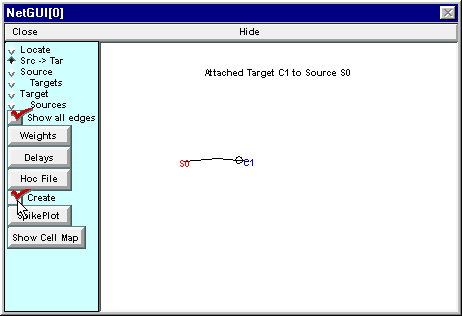
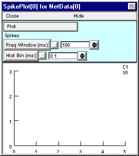
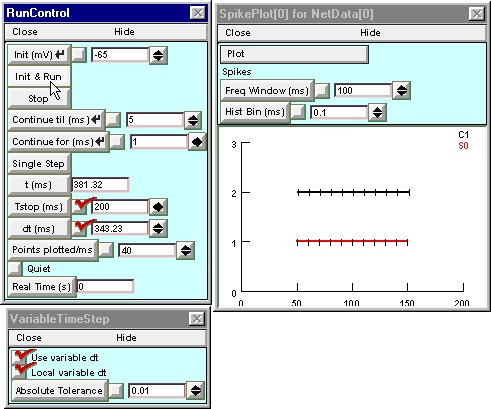

.. _run_simulation_plot_input_output:

Run a simulation and plot the input and output spike trains
========

At this point, the Network Builder contains a complete specification of our model network. However, it doesn't actually create the network until you switch the Create button ON.

Switching Create ON makes the representation of the network available for NEURON's computational engine to use in a simulation.

Now click on the Network Builder's SpikePlot button to bring up a graph that will show the input and output spike trains.

Next bring up a RunControl and set Tstop to 200 ms. Click on Init & Run and see what happens.

Then bring up a VariableTimeStep control, turn on Local variable dt, and run another simulation.

This figure shows the results after Color/Brush was used to specify thick red and black lines for S0 and C1, respectively.

The speedup with Local variable dt ON reflects the difference between continuous time and discrete event simulations.

