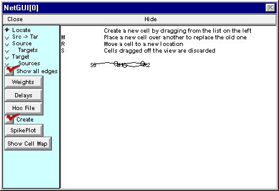

.. _run_simulation_plot_input_output2:

Run a simulation and plot the input and output spike trains
=========

Before you try to exercise the network model, be sure that the Network Builder's "Create" button is ON.

Click on SpikePlot to bring up a plot of the input and output spike trains.

Then bring up a RunControl and set Tstop to 50 ms. Click on Init & Run and observe the result.

Now change the weight of the R2 -> M1.I1 synapse from 0.0 to 0.01 and run a new simulation.

What happens now?

Why do you suppose this occurred?

To answer this question, at the very least you'll need to see the detailed time course of somatic Vm in M1 and R2. :ref:`Here's how <heres_how_page>`.

.. toctree::
    :hidden:

    heres_how_page.rst