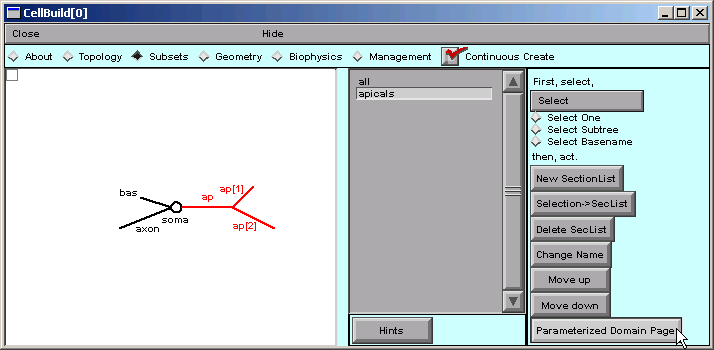
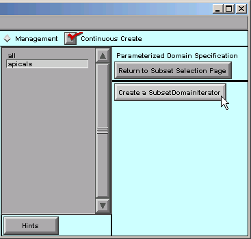
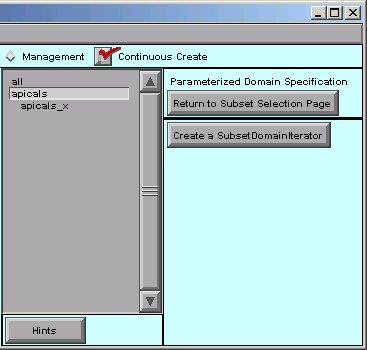
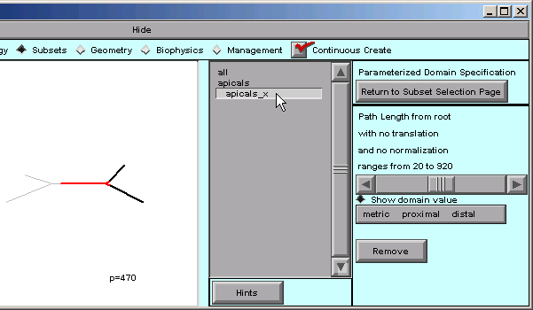
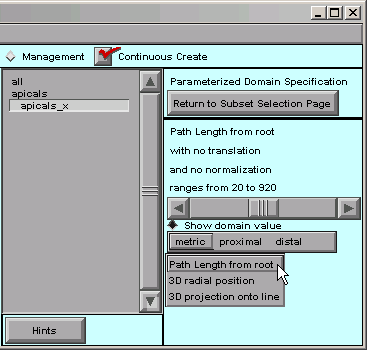
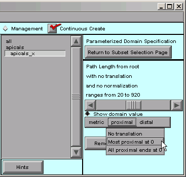
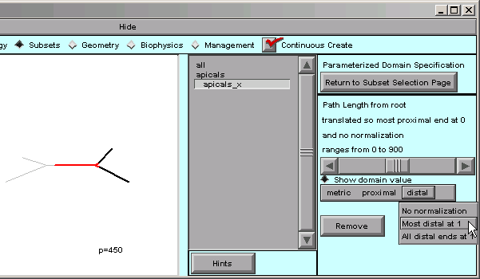
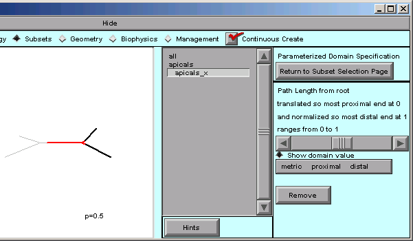

.. _set_up_a_subsetdomainiterator:

Step 1. Set up a SubsetDomainIterator
=====================================

A. Specify the subset
---------------------

First we return to the Subsets page, select the apicals subset, and then click on "Parameterized Domain Page".

With apicals still selected, we click on "Create a SubsetDomainIterator".

The right hand side of the CellBuilder now looks like this:

Notice the new apicals_x item just below the apicals subset.

SubsetDomainIterators appear in the middle panel of the Subsets page, just beneath the subset to which they apply. They're slightly indented so you can tell them apart from names of Subsets and sections.

Click on the apicals_x iterator . . .

. . . and the right panel of the CellBuilder now shows controls for evaluating and specifying the distance metric p.

The message in the right panel of the CB tells us that the path length from the "root" ranges from 20 to 920.

We can see what this means by dragging the horizontal slider from left to right, and seeing what happens in the shape plot. As the slider moves back and forth, the "p=nnn" near the bottom of the canvas will change; this is a direct readout of the distance metric p.

The red highlighted area in the apical tree also changes in a way that is reminiscent of a thermometer. However, instead of temperature, the leading edge of the red area marks the location(s) that correspond to the value of p.

p starts at 20 because, by default, all measurements are relative to the root of the model cell--in this case, the 0 location on the soma section. But we want the origin of the distance metric to be the root of the apical tree, i.e. the proximal end of the apicals subset. Also, we want the maximum value of p to be 1, not 920.

To make these changes, we will use the controls in the "metric proximal distal" bar (just below the horizontal slider).

B. Specify the distance metric
------------------------------

Let's click on "metric" first.

That shows us the options mentioned above--the distance metric can be path length from a reference point, radial distance from a reference point, or distance from a plane.

We don't need to make any changes here.

Distance from a plane is called "3D projection onto line" because, instead of trying to draw a plane on the canvas, you would specify the orientation of a line that is orthogonal to the plane.

Next we click on "proximal" and see what happens.

Let's choose "Most proximal at 0". That shifts the origin of our distance metric to the proximal end of the apical tree. We can verify this by dragging the slider back and forth, and noticing that the minimum value of p is now 0.

What about the "distal" item in the toolbar? Let's click on it.

"Most distal at 1" is just what we need. By choosing that, we have finished normalizing the distance metric.

The message in the right panel of the CellBuilder now tells us that the distance metric is 0 at the most proximal point in the tree, and 1 at the most distal point--

We can verify this by dragging the slider back and forth, and seeing that p varies from 0 at the proximal end of the tree, to 1 at the most distal end.

Time to save the CellBuilder to a session file! Let's call this one tapercell.ses .

Having set up a SubsetDomainIterator, we're ready to use it to specify how parameters vary in space--in this case, how the hh mechanism's conductance densities vary with normalized distance out into the apical tree.

