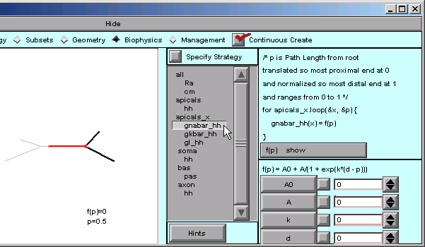
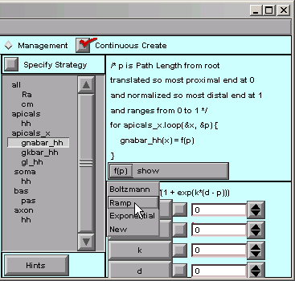
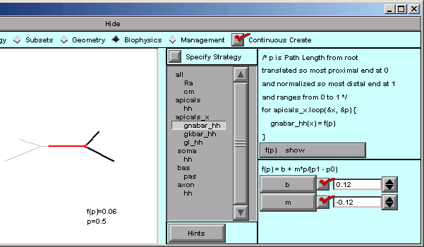
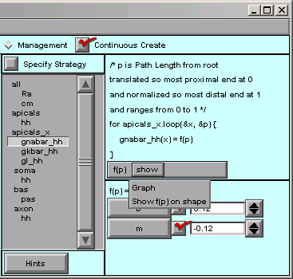
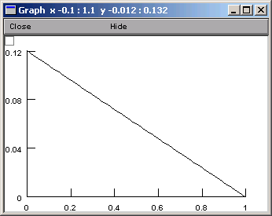
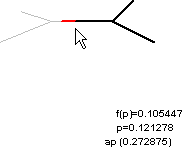
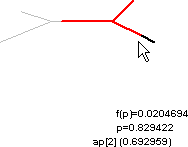

.. _specify_and_verify_the_functions_that_govern_the_parameters:

Step 3. Specify and verify the functions that govern the parameters
===================================================================

First we make sure that Specify Strategy is off.

Then, for each parameter that is supposed to vary with location, we must specify the function that governs it, and verify that we have achieved the desired spatial variation. It's easiest to do this by focussing on one parameter at a time, so the following instructions show how to proceed for ``gnabar_hh``. Finishing up the job for ``gkbar_hh`` and ``gl_hh`` "is left as an exercise for the reader."

A. Specifying a function
------------------------

Under apicals_x, we select gnabar_hh

. . . and the right lower corner of the CellBuilder shows us that the default function is a Boltzmann function.

Our model isn't smart enough for a Boltzmann function. We just want a plain, dumb, linear ramp.

That's easy enough--we click on f(p) in the right panel and scroll down to Ramp . . .

. . . and the function changes to

    f(p) = b + m*p / (p1 - p0)

where b and m are the y axis intercept and slope of the ramp. Both are 0 by default, so we have to change them.

These are what we need for gnabar_hh: b = 0.12, m = -0.12

Notice that the value of f(p) has changed from 0.5 to 0.06. We're still midway into the apical tree, but now the function f(p) is telling us what the sodium conductance density will be. When p == 0, f(p) is 0.12, and when p == 1, f(p) is 0.

B. Verifying a function
-----------------------

What's a quick way to verify that the spatial variation of gnabar_hh is what we want? The CellBuilder offers two ways to do this, and to see what they are, we just click on the "show" button.

"show / Graph" brings up a graph that plots our parameter as a function of the distance metric.

The alternative is "Show f(p) on shape". This lets us click and drag within the shape plot. As we move the mouse cursor back and forth, our movements are tracked by the red highlight on the shape, and by the values of p and f(p),

    from small p 

    to large p

The name of the nearest section is also displayed, along with the arc length along that section.

    It is also a good idea to use the Model View tool

    :menuselect:`NEURON Main Menu --> Tools --> Model View`

    to see the actual parameter values that have been assigned after discretization. However, present implementations of ModelView only plot value vs. path distance from soma.

**How about saving a session now?**

Repeat until done 
-----------------

To complete the model specification, we need to repeat these steps for gkbar_hh and gl_hh, specifying that f(p) is a ramp and changing b and m to the appropriate values (0.036 and -0.036 for gkbar_hh, 0.0003 and -0.0003 for gl_hh).

Be sure to save the completely configured CellBuilder to a session file.

Next we use the model in a simulation.

