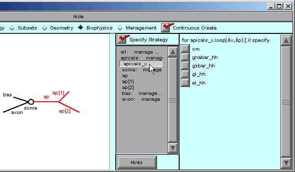
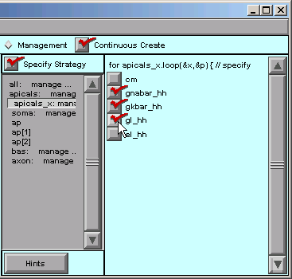

.. _specify_the_model_parameters_to_be_varied:

Step 2. Specify the model parameter(s) to be varied
===================================================

To specify the model parameters that are to be varied, we go to the Biophysics page and make sure that "Specify Strategy" is on.

On the Biophysics strategy page, we click on apicals_x,

and the right panel of the CellBuilder presents us with a list of all the biophysical parameters that belong to the apicals subset. These checkboxes are for choosing the parameters that we want to control with the apicals_x domain iterator.

So we click on gnabar_hh, gkbar_hh, and gl_hh.

Save another a session file?

Next we will specify the functions that govern the selected parameters.

