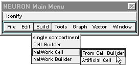
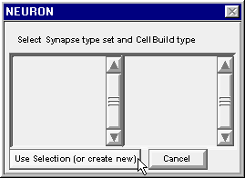
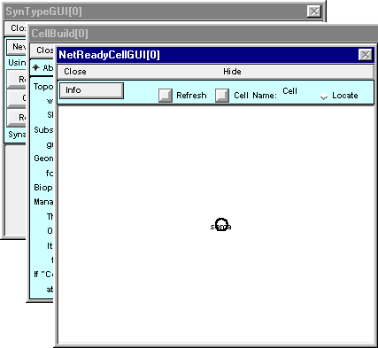
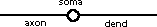
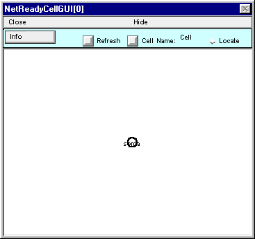
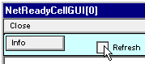
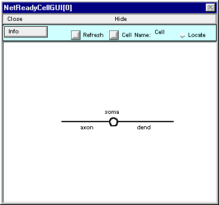
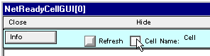
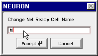

.. _step_1_define_type_of_cell:

Step 1. Define the types of cells
=========

First we make a stimulator class to be the source of afferent spikes, then a pair of biophysical model neuron classes that are vastly simplified abstractions of the biological categories known to anatomists as motoneurons and Renshaw cells.

A. We need a class of cells that can supply afferent spikes.
---------------

This will be a class of artificial neuron.

Use NetStim with interval 2 ms, number 10^4, start 5 ms, noise 0.

Rename this as S.

Here's a couple of tips:

1.
    This would be a good time to save the ArtCellGUI tool tool to a session file.

2.
    You may hide the ArtCellGUI tool, but don't close it. The Network Builder will need it to exist.

B. We need a "motoneuron" or "M cell" class.
-----------

Making a "network ready" biophysical cell class involves three tasks.

1.
    Specifying its anatomical and biophysical properties.

2.
    Specifying what kinds of synapses can be attached to it.

3.
    Placing synapses on the cell.

To do this through the GUI, bring up a NetReadyCellGUI tool by clicking on :menuselection:`Build --> NetWork Cell --> From Cell Builder` in the NEURON Main Menu.

This pops up a window that asks you to "Select Synapse type set and CellBuild type"

Click on the button labeled "Use Selection (or create new)" and three new windows will appear  : NetReadyCellGUI[0], CellBuild[0], SynTypeGUI[0].

The CellBuild and SynTypeGUI windows both "belong" to the NetReadyCellGUI. You can close them, but their information will be preserved in the NetReadyCellGUI tool, and you can bring them back by clicking on the Info button in the NetReadyCellGUI window and selecting Synapse Types or Cell Builder. In fact, before you save a session file you *should* close them; otherwise irrelevant copies will be created when you load the sesion file.

    You've seen this kind of thing before with the NetGUI tool -- remember its Weights, Delays, SpikePlot, and Cell Map windows?

1. Specifying the anatomical and biophysical properties of the M cell class
-----------

The first task is to use the NetReadyCellGUI's CellBuilder to make a model with a single dendritic cylinder and an unbranched axon attached to opposite ends of the soma, like this  :

Model specifications :
For all sections d_lambda = 0.1, Ra = 160 ohm cm, cm = 1 µf/cm^2.

.. code::
    python

    Section   L    diam   mechanism
    soma     30um  30um   hh
    dend     1000   2     pas with e_pas = -65 mV, g_pas = 1/15000 ohm cm^2
    axon     1000   1     hh

**Important note** : leave Continuous Create OFF (unchecked).

    The function of a CellBuilder that belongs to a NetReadyCellGUI tool is only to define a cell specification. This is then completed by the NetReadyCellGUI tool, which combines a Cell Builder type with the synapse types that you have defined in the SynTypeGUI tool. That is, a complete "network ready cell type" includes not only anatomical and biophysical properties, but also synapse connection locations. The Network Builder tool uses these network ready cell types, and any artificial cell types you have defined, to construct the network specification, and finally, to instantiate the network so that it actually exists as a simulatable model.

When you're finished, save a session and then close the CellBuilder.

Note that NetReadyCellGUI[0] still shows just a circle instead of the graceful olive on a toothpick that you built.

Fix this by clicking on the NetReadyCellGUI's Refresh button

and the shape plot will update to show the correct architecture.

This is a good time to assign this class a short mnemonic name. Click on the Cell Name button

Enter M into the field editor and then click on the Accept button.

Cell Name now shows M, instead of the nondescript default "Cell."

Save session!

The anatomical and biophysical attributes of the M cell class are now configured. The second task is to specify what kinds of synapses can be attached to an M cell.

