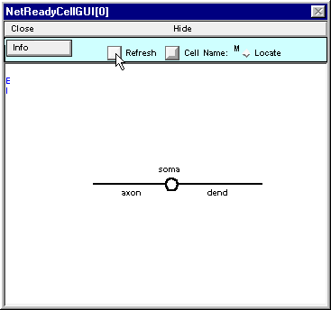

.. _step_1_define_type_of_cell2:

Still working on the M class  .  .  .

2. Specifying what kinds of synapses can be attached to an M cell
-----------------

We need two types of synapses : fast excitatory and slow shunting inhibitory.

The fast excitatory will be based on ExpSyn. When an ExpSyn receives a net event, its conductance rises instantaneously by an amount equal to the weight of the synaptic connection, and then decays exponentially with a single time constant (see the on-line help files for documentation of this and other PointProcesses).

The slow shunting inhibitory will be based on Exp2Syn. The kinetics of an Exp2Syn are described by a two state kinetic scheme with rise time constant tau1 and decay time constant tau2 (tau2 must be greater than tau1). The peak conductance is equal to the weight of the synaptic connection.

Use the NetReadyCellGUI's SynTypeGUI to specify these synaptic types.

First make the fast excitatory type. Click on SynTypeGUI's New button and drag the cursor down to ExpSyn.

Release the cursor and a new item named ExpSyn appears in the list of synapse types.

Rename this as E

Now set the parameters for E.

Leave e = 0 mV, which is fine for a fast AMPA-like synapse.

However, the 0.1 ms decay time constant is too fast -- change tau to 3 ms.

Next make the slow shunting inhibitory type.

Use an Exp2Syn, and rename it as I.

Set tau1 = 3, tau2 = 10 ms, and e = -67 mV (so we see just a little hyperpolarization if the inhibitory synapse is activated while the cell is at rest).

Here's how it should look when you're done

Now save a session file, and close SynTypeGUI[0].

Examine NetReadyCellGUI[0] -- don't see any sign of the synaptic types?

.. image::
    fig/refresh_nrca.gif
    :align: center

Click on the Refresh button of NetReadyCellGUI, and the E and I synapse types will appear along the left edge of the window.

Now that we have defined a palette of synaptic types, we can complete the definition of the M cell class.

