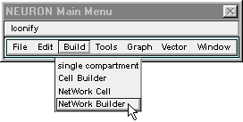
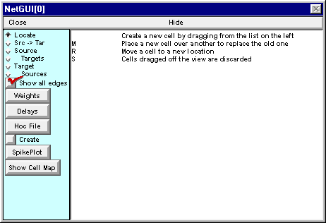
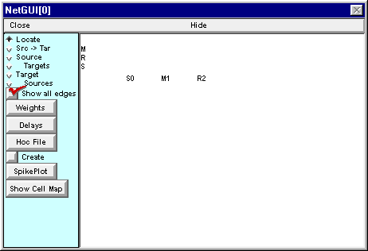

.. _step_2_create_each_cell:

Step 2. Create each cell in the network
========

Having used the ArtCellGUI and NetReadyCellGUI tools to specify the classes of cells that will be used in the network, we are ready to work with the Network Builder, which will help us create each cell in the network and connect them to each other.

A. We need a Network Builder
--------

Just like you did to make a net of artificial cells.

Note the following:

- the Network Builder comes up with Locate ON 

- the list of cell types

- the instructions

B. We need an instance of each of our three cell types.
--------

Click on the S and hold the mouse button down while dragging the new S-type cell to a convenient location in the network layout field. Release the mouse button and you will see a new cell labeled S0.

Do the same for the M and R type cells.

The Network Builder should look like this when you're done. For reasons that will soon be obvious, it's a good idea to place cells away from the dead center of the network layout field.

Next task: set up the network's architecture.

