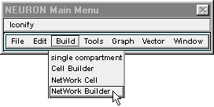
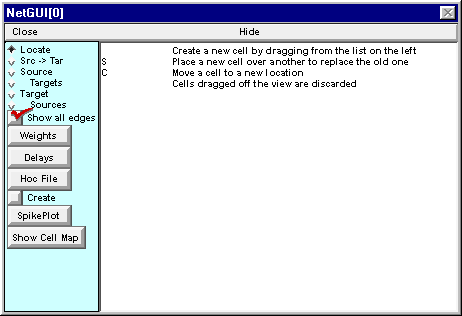
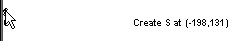
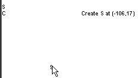
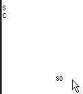
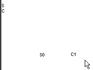

.. _step_2_create_network_cell:

Step 2. Create each cell in the network
==============

Having used the ArtCellGUI tool to specify the classes of cells that will be used in the network, we are ready to work with the Network Builder, which will help us create each cell in the network and connect them to each other.

A. We need a Network Builder. 
+++++++++

Get one by clicking on :menuselection:`Build --> NetWork Builder` in the NEURON Main Menu.

The Network Builder comes up with its Locate radio button selected (top item in left panel).

The **right** panel of the Network Builder is a graphical field for laying out the network. Along the left edge of this panel you will see a list of the cell types you created with the ArtCellGUI tool. Read the instructions in this panel before proceeding further.

B. We need a cell to generate the afferent spike train.
+++++++++

Click on the S and hold the mouse button down . . .

while dragging the new S-type cell to a convenient location in the network layout field.

Release the mouse button and you will see a new cell labeled S0.

If you released the mouse button while the cursor was still close to a layout item then the new cell item will be difficult to select since layout item selection takes precedence over selection of a cell item. If this occurs, just select the graph's "Translate" tool, or use the middle mouse button, and translate the view so the cell item no longer overlaps the layout items (layout items never move from their position along the left edge of the canvas). Then click on one of the radio buttons (Locate, Src -> Tar, etc.) and continue to use the Network Builder. Here's an :ref:`example <how_to_translate_view>`.

C. We need an integrate and fire cell.
+++++++++++

Click on the C and hold the mouse button down while you drag the new C-type cell to a position just to the right of S0. Release the mouse button and you will see a new cell labeled C1.

Next task: set up the architecture

.. toctree::
    :hidden:

    how_to_translate_view.rst